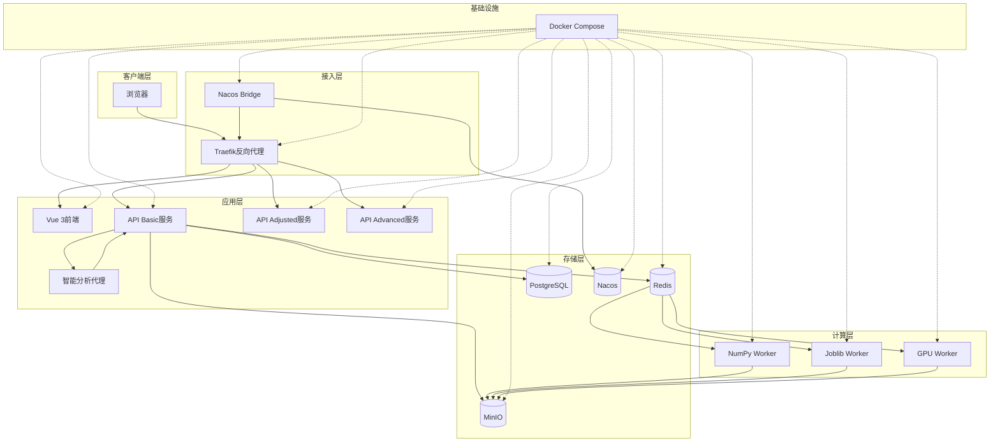

本页面为"植被指数智能分析平台"提供整体性介绍，面向首次接触项目的开发者。通过阅读本文，您将了解平台的核心价值、技术架构、功能特性以及快速上手路径。本文将帮助您建立对项目的整体认知，为后续深入学习各模块奠定基础。

## 项目定位与价值主张

**植被指数智能分析平台**是一个面向遥感植被分析的实习项目，旨在将专业的遥感指数计算封装为易用的Web服务。平台解决了传统遥感分析中**技术门槛高、部署复杂、缺乏智能推荐**等痛点，通过现代化的前后端分离架构，为用户提供从影像上传、指数计算、结果可视化到智能分析的完整工作流。

平台的核心价值在于：**将35种植被指数的计算封装为标准化服务**，支持多引擎并行计算，提供OGC兼容的API接口，并集成智能分析代理实现指数自动推荐。这种设计使得遥感分析能力可以被更广泛地集成到其他GIS系统中，同时降低普通用户的使用门槛。

Sources: [README.md](README.md#L1-L113)

## 核心能力概览

平台提供六大核心能力，覆盖从数据输入到结果输出的完整链路：

**1. 统一公式注册与多引擎执行**：平台采用"一份公式注册表驱动多引擎"的架构设计，通过抽象计算后端接口，使得同一份指数定义可以由NumPy、Joblib和PyTorch CUDA三种引擎执行。这种设计实现了计算逻辑与执行环境的解耦，便于维护和扩展。

**2. 内存安全的分块计算**：针对大型遥感影像（常达数GB），平台采用Rasterio分块读写策略，避免将整幅影像载入内存或显存。每个计算块独立处理，显著降低内存峰值，确保在有限资源下也能处理超大影像。

**3. 智能引擎选择与自动回退**：平台内置执行规划器，根据影像尺寸、波段数量和可用硬件自动选择最优引擎。当CUDA不可用或显存不足时，系统会自动回退到CPU引擎，保证计算任务始终能完成。

**4. 异步任务与优先级队列**：通过Celery实现异步任务处理，支持五级优先队列（urgent、high、normal、low、batch），满足不同场景下的任务调度需求。用户可提交任务后继续其他操作，系统后台执行并实时反馈进度。

**5. 智能分析代理**：集成基于规则和LLM的分析代理，能够理解用户意图、检查波段兼容性、推荐指数组合并生成结构化分析方案。代理在用户确认后才提交计算，确保分析过程可控可靠。

**6. 可视化工作台**：前端提供基于MapLibre的地图工作区，支持GeoTIFF动态瓦片叠加、多指数结果切换、统计图表展示和任务管理。工作台支持日间/夜间双主题，具备响应式布局和流畅的交互体验。

Sources: [README.md](README.md#L4-L30), [backend/app/core/indices.py](backend/app/core/indices.py#L1-L35), [backend/app/engines/base.py](backend/app/engines/base.py#L1-L35), [backend/app/services/planner.py](backend/app/services/planner.py#L1-L62), [backend/app/celery_app.py](backend/app/celery_app.py#L1-L30), [backend/app/services/agent.py](backend/app/services/agent.py#L1-L50)

## 技术栈总览

平台采用前后端分离架构，技术栈如下：

| 层级 | 技术 | 版本 | 主要职责 |
|------|------|------|----------|
| **前端** | Vue 3 + TypeScript | 3.5.17 | 用户界面、状态管理、交互逻辑 |
| **前端构建** | Vite | 7.0.0 | 开发热重载、生产构建优化 |
| **前端地图** | MapLibre GL | 5.6.1 | 地图渲染、瓦片加载、图层控制 |
| **前端图表** | ECharts | 5.6.0 | 统计图表、数据可视化 |
| **后端框架** | FastAPI | 0.115+ | REST API、数据验证、自动文档 |
| **后端语言** | Python | 3.11+ | 业务逻辑、算法实现、数据处理 |
| **异步任务** | Celery + Redis | 5.4+ / 7.4 | 分布式任务队列、优先级调度 |
| **计算引擎** | NumPy / Joblib / PyTorch | 2.0+ / 1.4+ / 2.6+ | 多引擎数值计算、GPU加速 |
| **遥感处理** | Rasterio | 1.4+ | GeoTIFF读写、坐标转换、分块处理 |
| **对象存储** | MinIO | RELEASE.2025-04-22 | 影像文件存储、预签名URL |
| **数据库** | PostgreSQL | 15+ | 自定义指数、会话历史持久化 |
| **容器编排** | Docker Compose | 2.24+ | 多服务部署、依赖管理 |
| **反向代理** | Traefik | 3.4 | 路由、负载均衡、服务发现 |
| **服务发现** | Nacos | 2.4.3 | 服务注册、配置管理 |
| **监控** | Prometheus | 0.21+ | 指标收集、性能监控 |

Sources: [frontend/package.json](frontend/package.json#L1-L28), [backend/pyproject.toml](backend/pyproject.toml#L1-L52), [compose.yml](compose.yml#L1-L192), [backend/app/settings.py](backend/app/settings.py#L1-L37)

## 系统架构图

平台采用微服务架构，通过容器化部署实现高可用和可扩展性。以下架构图展示了核心组件及其交互关系：



**架构关键特性**：
1. **多API服务实例**：平台运行三个API服务实例（basic、adjusted、advanced），通过Traefik实现负载均衡，提高系统吞吐量和可用性。
2. **专用计算Worker**：根据计算引擎类型部署专用Worker，NumPy Worker处理普通任务，Joblib Worker处理CPU密集型任务，GPU Worker处理CUDA加速任务。
3. **异步任务流**：API服务将计算任务提交到Redis队列，Worker从队列消费任务并执行，完成后将结果存储到MinIO并更新Redis状态。
4. **服务发现与配置**：Nacos Bridge监控服务注册状态，自动生成Traefik的File Provider配置，实现动态服务发现。
5. **统一存储**：所有Worker共享同一个数据卷，确保影像文件的一致性和可访问性。

Sources: [compose.yml](compose.yml#L1-L192), [backend/app/nacos_bridge.py](backend/app/nacos_bridge.py#L1-L50)

## 项目结构概览

平台采用清晰的模块化目录结构，便于开发和维护：

```
植被指数智能分析平台/
├── frontend/                    # 前端Vue 3应用
│   ├── src/                    # 源代码
│   │   ├── components/         # Vue组件（地图、任务面板等）
│   │   ├── composables/        # 组合式API（主题、平台API等）
│   │   ├── stores/             # Pinia状态管理
│   │   └── types/              # TypeScript类型定义
│   ├── package.json            # 前端依赖配置
│   └── vite.config.js          # Vite构建配置
├── backend/                     # 后端Python应用
│   ├── app/                    # 应用核心代码
│   │   ├── api/                # API路由和数据模型
│   │   ├── core/               # 核心算法和指数定义
│   │   ├── engines/            # 计算引擎实现
│   │   ├── services/           # 业务逻辑服务
│   │   ├── main.py             # FastAPI入口
│   │   ├── celery_app.py       # Celery配置
│   │   └── settings.py         # 应用配置
│   ├── tests/                  # 测试代码
│   └── pyproject.toml          # Python依赖配置
├── infra/                       # 基础设施配置
│   ├── pygeoapi/               # OGC API配置
│   └── traefik/                # Traefik路由配置
├── compose.yml                 # Docker Compose编排
├── skills/                     # 智能体技能定义
├── docs/                       # 文档资源
└── docx/                       # 项目文档
```

**目录设计原则**：
1. **前后端分离**：frontend和backend目录完全独立，可独立开发、测试和部署。
2. **模块化设计**：backend/app下按功能划分模块，api处理接口，core实现算法，engines封装计算，services提供业务逻辑。
3. **配置集中管理**：infra目录存放所有基础设施配置，compose.yml统一编排所有服务。
4. **可扩展性**：skills目录用于存放智能体技能定义，便于扩展分析能力。

Sources: [get_dir_structure](.), [frontend/package.json](frontend/package.json#L1-L28), [backend/pyproject.toml](backend/pyproject.toml#L1-L52)

## 功能特性对比

平台在不同维度上提供了丰富的功能特性，以下表格对比了核心功能的技术实现：

| 功能类别 | 特性 | 技术实现 | 优势 |
|----------|------|----------|------|
| **指数计算** | 35种植被指数 | 统一公式注册表 | 一次定义，多引擎执行 |
| **计算引擎** | NumPy / Joblib / PyTorch | 引擎抽象协议 | 自动选择最优引擎 |
| **内存管理** | Rasterio分块读写 | 滑动窗口处理 | 支持超大影像处理 |
| **任务调度** | 五级优先队列 | Celery + Redis | 灵活的任务优先级 |
| **智能分析** | 规则 + LLM混合代理 | 意图识别 + 方案生成 | 可解释、需确认 |
| **前端交互** | 地图工作台 | MapLibre + Vue 3 | 响应式、多主题 |
| **API标准** | OGC API - Processes | FastAPI + pygeoapi | 国际标准兼容 |
| **服务部署** | 容器化微服务 | Docker Compose | 一键部署、易扩展 |
| **服务发现** | 动态路由 | Nacos + Traefik | 自动服务注册 |
| **存储方案** | 对象存储 + 数据库 | MinIO + PostgreSQL | 分离存储与计算 |
| **监控告警** | 指标收集 | Prometheus + FastAPI | 实时性能监控 |

Sources: [backend/app/core/indices.py](backend/app/core/indices.py#L1-L547), [backend/app/engines/base.py](backend/app/engines/base.py#L1-L35), [backend/app/services/planner.py](backend/app/services/planner.py#L1-L62), [backend/app/celery_app.py](backend/app/celery_app.py#L1-L30), [backend/app/services/agent.py](backend/app/services/agent.py#L1-L50), [frontend/src/components/MapWorkspace.vue](frontend/src/components/MapWorkspace.vue#L1-L1310), [backend/app/api/routes.py](backend/app/api/routes.py#L1-L725), [compose.yml](compose.yml#L1-L192)

## 快速上手指引

对于首次接触项目的开发者，建议按以下路径快速上手：

### 1. 本地开发环境搭建
首先搭建本地开发环境，详见[本地开发环境搭建与启动](2-ben-di-kai-fa-huan-jing-da-jian-yu-qi-dong)页面。后端使用Miniconda环境，前端使用Node.js和npm。

### 2. Docker Compose容器化部署
若希望快速体验完整系统，可使用Docker Compose一键部署，详见[Docker Compose容器化部署](3-docker-compose-rong-qi-hua-bu-shu)页面。该方式会自动启动所有服务，包括前端、后端、计算Worker和基础设施。

### 3. 平台整体架构理解
在动手开发前，建议先理解平台的整体架构和技术栈，详见[平台整体架构与技术栈](4-ping-tai-zheng-ti-jia-gou-yu-ji-zhu-zhan)页面。这将帮助您建立全局视角，理解各模块的职责和交互关系。

### 4. 后端核心模块探索
后端是平台的核心，建议按以下顺序探索：
- **指数注册表**：了解35种植被指数的定义和计算逻辑，详见[统一公式注册表与指数定义](7-tong-gong-shi-zhu-ce-biao-yu-zhi-shu-ding-yi)
- **计算引擎**：理解多引擎执行和自动回退机制，详见[多引擎选择与自动回退策略](8-duo-yin-qing-xuan-ze-yu-zi-dong-hui-tui-ce-lue)
- **智能代理**：学习智能分析代理的设计和实现，详见[植被分析Agent设计哲学与安全边界](10-zhi-bei-fen-xi-agent-she-ji-zhe-xue-yu-an-quan-bian-jie)

### 5. 前端交互界面体验
前端是用户直接交互的界面，建议了解：
- **地图工作台**：体验遥感影像的可视化和交互，详见[MapLibre地图工作区与天地图集成](19-maplibre-di-tu-gong-zuo-qu-yu-tian-di-tu-ji-cheng)
- **状态管理**：理解Pinia状态管理的设计，详见[前端组件与状态管理](6-qian-duan-zu-jian-yu-zhuang-tai-guan-li)

### 6. API接口测试
通过API接口测试理解平台功能，详见[REST接口与OGC API - Processes规范对齐](16-rest-jie-kou-yu-ogc-api-processes-gui-fan-dui-qi)页面。建议使用Postman或curl测试主要接口。

### 7. 容器化部署实践
最后，深入了解容器化部署的架构和配置，详见[Docker Compose服务编排全景](23-docker-compose-fu-wu-bian-pai-quan-jing)页面。

**学习建议**：
1. **先体验后深入**：先通过Docker Compose部署体验完整功能，再深入研究代码实现。
2. **由表及里**：从API接口和前端交互开始，逐步深入到后端逻辑和算法实现。
3. **实践驱动**：在理解概念后，尝试修改代码并观察效果，加深理解。
4. **文档辅助**：充分利用平台的自动生成文档（FastAPI的Swagger UI）和本文档。