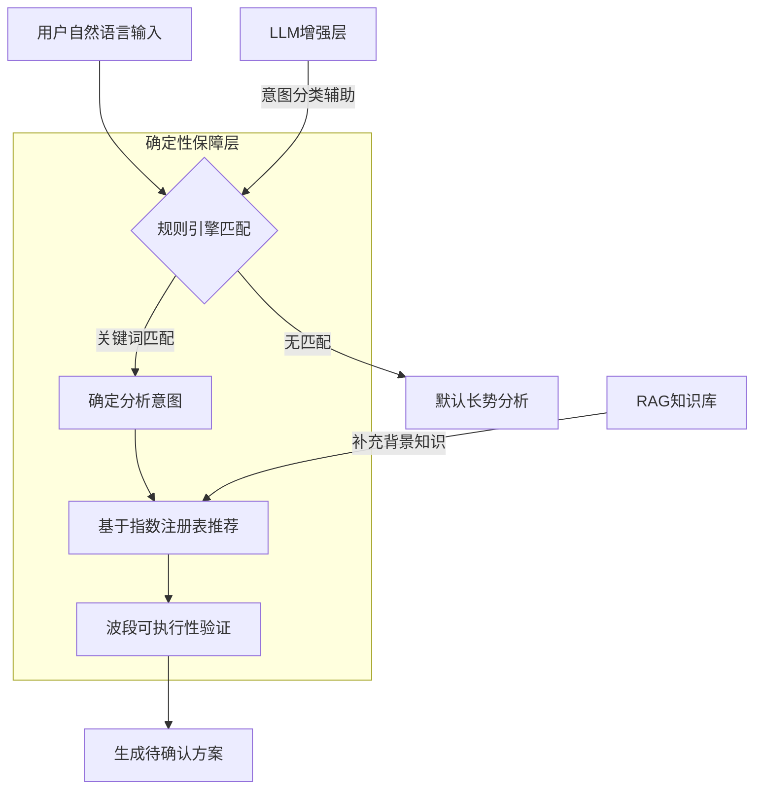

本页深入阐述植被分析智能体（VegetationAgent）的核心设计理念与安全架构。该Agent并非开放式聊天机器人，而是一个将自然语言意图转化为安全、可审计的遥感分析工作流的智能规划器。其设计哲学强调**确定性优先、安全边界、可追溯性**，确保用户在完全掌控的状态下进行植被指数分析。

## 一、核心设计理念：规则引擎优先，LLM作为增强

植被分析Agent采用**混合智能架构**，其核心设计原则是：**确定性规则引擎始终是可靠的基石，大型语言模型（LLM）仅作为可插拔的增强组件**。这一设计源于对可靠性和可控性的深刻考量。

### 1.1 规则引擎的确定性保障

在 `backend/app/services/agent.py` 中，`RULES` 数据结构定义了五种核心分析意图：`growth`（作物长势）、`sparse`（稀疏植被）、`chlorophyll`（叶绿素）、`water_stress`（水分胁迫）和 `change`（变化监测）。每个意图规则都包含明确的关键词、推荐指数、描述和风险提示。



Sources: [agent.py](backend/app/services/agent.py#L44-L111), [agent.py](backend/app/services/agent.py#L255-L295)

### 1.2 LLM的有限增强角色

LLM通过 `_classify_with_llm` 方法参与意图分类，但其作用受到严格限制。在 `backend/app/services/agent.py` 的第335-395行，LLM被明确约束：

1. **仅能返回JSON格式的意图分类**，且意图值必须属于预定义的五个选项。
2. **禁止引入用户问题中未明确提及的病害、虫害、灾害或成因**。
3. **RAG资料仅用于辅助分类**，若与问题不直接相关必须忽略。

当LLM调用失败时，系统会优雅地降级到规则引擎，并在方案中明确标注 `llmStatus: "failed"` 和降级原因。

Sources: [agent.py](backend/app/services/agent.py#L335-L395), [SKILL.md](skills/vegetation-agent-designer/SKILL.md)

## 二、安全边界：从确认到执行的四层防护

Agent的安全架构是其最核心的设计特征，确保**未经用户明确确认，绝不执行任何计算任务**。这一原则贯穿从意图理解到结果解读的全过程。

### 2.1 第一层：意图识别与知识边界

Agent首先从**指数注册表**（`INDEX_REGISTRY`）中检索知识，这是唯一的权威数据源。在 `backend/app/services/agent_tools.py` 的 `search_index_knowledge` 函数中，系统优先检索内置指数库，然后才考虑外部文档和网络搜索。

外部知识（用户上传、网络检索）被视为**不可信数据**，必须经过结构化校验。在 `agent_knowledge_store.py` 中，知识文档的标题、内容、来源都有长度限制，且查询文本不作为指令执行。

Sources: [agent_tools.py](backend/app/services/agent_tools.py#L115-L150), [agent_knowledge_store.py](backend/app/services/agent_knowledge_store.py)

### 2.2 第二层：波段可执行性验证

在方案生成阶段，Agent会严格验证用户影像的可用波段与候选指数所需波段的匹配情况。`agent.py` 中的 `create_plan` 方法会计算每个候选指数的 `missingBands`（缺失波段）。

```python
# agent.py 第180-195行
for index_id in candidate_indices:
    definition = INDEX_REGISTRY[index_id]
    missing = sorted(set(definition.required_bands) - available) if available else []
    is_executable = not missing
    if is_executable:
        executable_indices.append(index_id)
    recommendations.append({
        **definition.public_metadata(),
        "executable": is_executable,
        "missingBands": missing,
        ...
    })
```

如果没有任何指数满足波段要求，方案会明确标注 `canExecute: false` 并在警告中提示"当前波段条件不足，禁止提交执行"。

Sources: [agent.py](backend/app/services/agent.py#L180-L195)

### 2.3 第三层：用户确认门（Confirmation Gate）

这是Agent安全架构的核心。方案生成后，状态被设置为 `awaiting_confirmation`，前端界面会展示详细的执行计划，包括：

1. **推荐指数及其公式、预期范围、局限性**
2. **选择的计算引擎及原因**（基于 `ExecutionPlanner` 的自动决策）
3. **预估内存消耗和建议分块大小**
4. **风险提示和警告信息**

只有用户通过 `/api/agent/plans/{plan_id}/confirm` 或 `/api/agent/plans/{plan_id}/confirm/stream` 接口明确提交确认后，系统才会调用 `mark_confirmed` 方法，将方案状态更新为 `confirmed` 并关联任务ID。

Sources: [agent.py](backend/app/services/agent.py#L220-L250), [routes.py](backend/app/api/routes.py#L400-L450)

### 2.4 第四层：执行单二次校验

即使在用户确认后，系统仍会进行最后一道安全校验。在 `routes.py` 的 `stream_confirm_agent_plan` 函数中，系统会：

1. **验证执行单中的指数是否在方案的可执行指数列表中**
2. **构建完整的 `RasterTask` 并调用 `_validate_raster_task` 进行路径、波段映射的最终验证**
3. **只有校验通过后才提交到任务队列**

这种设计确保了即使前端被篡改或API被恶意调用，后端也能拦截非法的执行请求。

Sources: [routes.py](backend/app/api/routes.py#L420-L470)

## 三、自定义指数的安全注册机制

Agent允许用户在运行期注册自定义植被指数，但这过程受到严格的安全约束。`agent_tools.py` 中的 `register_custom_index` 函数实现了**三阶段验证**：

### 3.1 表达式白名单验证

自定义表达式必须通过 `validate_custom_expression` 函数的AST（抽象语法树）白名单检查。只允许使用预定义的安全函数：`abs`、`sqrt`、`minimum`、`maximum`、`safe_divide`，以及预定义的波段变量。

```python
# agent_tools.py 第280-295行
def _build_expression(expression: str) -> Callable:
    tree = ast.parse(expression, mode="eval")
    code = compile(tree, "<runtime-index>", "eval")
    
    def calculate(xp, bands, _parameters):
        functions = {
            "abs": xp.abs,
            "sqrt": xp.sqrt,
            "minimum": xp.minimum,
            "maximum": xp.maximum,
            "safe_divide": lambda n, d: safe_divide(xp, n, d),
        }
        return eval(code, {"__builtins__": {}}, {**functions, **bands})
    return calculate
```

Sources: [agent_tools.py](backend/app/services/agent_tools.py#L280-L295)

### 3.2 波段依赖推断与验证

系统会自动从表达式中推断所需的波段（`required_bands`），并验证这些波段是否在允许的波段列表 `ALLOWED_BANDS` 中。如果表达式不引用任何波段，注册将被拒绝。

### 3.3 样本数组执行验证

在正式注册前，系统会使用模拟的样本数组执行表达式，确保表达式在语法和语义上都是正确的，并且不会产生运行时错误。

### 3.4 持久化存储模式

注册成功后，如果配置了PostgreSQL数据库（`VIP_DATABASE_URL`），自定义指数将被持久化存储；否则仅保存在内存中，并在API响应中明确标注存储模式。

Sources: [agent_tools.py](backend/app/services/agent_tools.py#L200-L260), [custom_index_store.py](backend/app/services/custom_index_store.py)

## 四、可追溯性与可观测性设计

Agent的每个操作步骤都生成详细的**追踪轨迹**（trace），确保整个决策过程完全透明和可审计。

### 4.1 全链路追踪结构

从用户提问到结果解读，Agent在每个关键节点都会生成追踪事件：

1. **question**：接收问题和上下文信息
2. **rag**：RAG检索指数知识的结果
3. **web_search**：网络检索的状态和结果
4. **custom_index**：自定义指数注册过程（如果适用）
5. **understand**：理解问题意图
6. **catalog**：检索指数库
7. **validate**：校验可执行性
8. **engine**：选择执行引擎
9. **confirm**：等待用户确认
10. **execution_submitted**：提交异步计算

这些追踪步骤通过 `agent.py` 中的 `trace` 列表累积，并通过SSE流式传输到前端，在 `AgentDrawer.vue` 中以思考步骤的形式实时展示。

Sources: [agent.py](backend/app/services/agent.py#L120-L160), [agent_tools.py](backend/app/services/agent_tools.py#L300-L320)

### 4.2 会话事件持久化

Agent的每次交互都会通过 `agent_session_store.py` 记录会话事件，支持内存和PostgreSQL两种存储模式。这确保了即使系统重启，用户的历史对话和决策过程也能被完整保留。

Sources: [agent_session_store.py](backend/app/services/agent_session_store.py)

## 五、引擎选择与资源管理

Agent的决策不仅限于指数推荐，还包括**计算引擎的智能选择**。`ExecutionPlanner` 类基于数据规模和硬件能力做出透明、可解释的决策。

### 5.1 保守阈值策略

在 `planner.py` 中，引擎选择遵循保守阈值原则：

- **小型任务**（<200万像素）或同步请求：使用NumPy引擎，避免并行调度开销
- **中大型任务**：使用Joblib引擎进行CPU线程并行
- **大型任务**（≥2000万像素或≥4个指数）且CUDA可用：使用PyTorch引擎进行GPU加速

这种设计避免了小任务因GPU传输产生的负加速，同时确保大型任务能充分利用硬件资源。

Sources: [planner.py](backend/app/services/planner.py#L35-L70)

## 六、降级与容错机制

Agent的架构设计充分考虑了各种故障场景，并提供了优雅的降级路径。

### 6.1 LLM服务不可用

当LLM服务配置缺失或调用失败时，系统会：
1. 将 `llmStatus` 设置为 `"skipped"` 或 `"failed"`
2. 在方案警告中明确标注降级原因
3. 完全依赖规则引擎完成方案生成

### 6.2 数据库不可用

当PostgreSQL数据库不可用时，自定义指数和知识文档会降级到内存存储，API响应中会明确标注 `storage: "memory"`。

### 6.3 网络搜索失败

当网络搜索未返回结果时，系统会降级使用本地指数知识库，并在追踪中标记 `"status": "warning"`。

Sources: [agent.py](backend/app/services/agent.py#L335-L395), [agent_tools.py](backend/app/services/agent_tools.py#L155-L200)

## 七、总结：安全与智能的平衡艺术

植被分析Agent的设计哲学体现了在**人工智能能力**与**系统可靠性**之间寻求平衡的工程智慧。其核心价值主张包括：

1. **确定性优先**：规则引擎作为可靠基石，LLM作为可插拔增强
2. **安全边界清晰**：四层防护确保用户对计算任务的完全控制
3. **完全可追溯**：全链路追踪让每个决策都有据可查
4. **优雅降级**：各种故障场景都有明确的降级路径
5. **资源智能管理**：基于数据规模和硬件能力的透明引擎选择

这种设计使得Agent既能利用LLM的自然语言理解能力，又能保持传统软件系统的可靠性和可控性，为遥感分析领域提供了一个安全、可靠、可解释的智能助手范例。