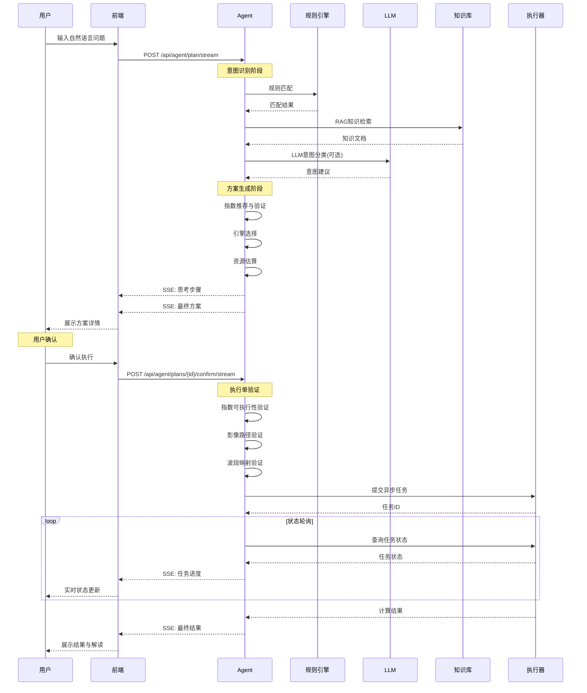

本页详细阐述植被分析智能体如何将用户的自然语言意图转化为安全、可解释且需人工确认的分析方案。整个流程采用**混合智能架构**，结合确定性规则引擎与可插拔的LLM增强，确保在智能性与可靠性之间取得平衡。

## 一、意图识别：从自然语言到结构化分析目标

意图识别是整个流程的起点，其核心目标是将用户的自然语言问题（如"检查这片农田的长势"）转化为结构化的分析意图。系统采用**双重验证机制**：规则引擎提供确定性保障，LLM提供智能增强。

### 1.1 规则引擎的确定性基础

在 `backend/app/services/agent.py` 中，`RULES` 数据结构定义了五种核心分析意图，每种意图都包含明确的关键词映射：

```python
# backend/app/services/agent.py#L44-L111
RULES = (
    IntentRule("growth", "作物长势空间差异分析", ("长势", "健康", "不好", "覆盖", "生物量", "农田"), ...),
    IntentRule("sparse", "稀疏植被与裸土背景分析", ("稀疏", "苗期", "裸土", "荒漠", "土壤"), ...),
    IntentRule("chlorophyll", "叶绿素与氮素状态分析", ("叶绿素", "氮", "营养", "红边", "黄化"), ...),
    IntentRule("water_stress", "植被水分胁迫辅助分析", ("干旱", "水分", "缺水", "胁迫", "灌溉"), ...),
    IntentRule("change", "多时相植被变化监测", ("变化", "两期", "前后", "退化", "恢复", "火灾"), ...),
)
```

规则匹配采用加权计分机制，在 `_match_rule` 方法中实现：

```python
# backend/app/services/agent.py#L255-L295
@staticmethod
def _match_rule(message: str, llm_intent: str | None) -> IntentRule:
    if llm_intent:
        for rule in RULES:
            if rule.intent == llm_intent:
                return rule
    scores = {
        rule.intent: sum(1 for keyword in rule.keywords if keyword in message) for rule in RULES
    }
    selected_intent = max(scores, key=scores.get)
    if scores[selected_intent] == 0:
        selected_intent = "growth"  # 默认回退到长势分析
    return next(rule for rule in RULES if rule.intent == selected_intent)
```

**设计要点**：当LLM返回有效意图时优先采用，否则回退到关键词匹配；当所有规则都无匹配时，系统默认选择最常见的"长势分析"意图。

Sources: [agent.py](backend/app/services/agent.py#L44-L111), [agent.py](backend/app/services/agent.py#L255-L295)

### 1.2 LLM的智能增强与约束

LLM通过 `_classify_with_llm` 方法参与意图分类，但其作用受到严格约束：

```python
# backend/app/services/agent.py#L335-L395
async def _classify_with_llm(self, message, llm_config, knowledge_hits):
    schema = {"allowed": [rule.intent for rule in RULES]}
    system_prompt = (
        "你是遥感植被指数智能体，只返回JSON。字段intent只能取："
        + ",".join(schema["allowed"])
        + "。可选字段reason用一句中文说明依据。RAG资料仅用于辅助分类；"
        "禁止引入用户问题中未明确提及的具体病害、虫害、灾害或成因，"
        "若资料与问题不直接相关必须忽略。"
    )
```

**安全约束**：
1. **意图值必须属于预定义的五个选项**，不能返回未知意图
2. **禁止引入未提及的病害、虫害等具体成因**，避免过度解读
3. **RAG资料仅作为参考**，不能直接作为指令执行

当LLM调用失败时，系统会优雅降级，并在返回结果中明确标注：

```python
# backend/app/services/agent.py#L380-L395
except (ImportError, KeyError, ValueError, AttributeError, json.JSONDecodeError) as error:
    return {
        "intent": None,
        "status": "failed",
        "provider": config["provider"],
        "message": f"LangChain调用失败，已降级规则引擎: {error}",
    }
```

Sources: [agent.py](backend/app/services/agent.py#L335-L395)

### 1.3 RAG知识检索增强

在意图识别阶段，系统会同时检索相关知识作为上下文补充：

```python
# backend/app/services/agent.py#L125-L145
knowledge_hits = search_index_knowledge(message, external_documents)
trace.append({
    "id": "rag",
    "title": "RAG检索指数知识",
    "status": "done",
    "detail": f"已召回 {len(knowledge_hits)} 条内置/外部指数知识。",
})
```

`search_index_knowledge` 函数在 `backend/app/services/agent_tools.py` 中实现，检索范围包括：

1. **内置农学知识库**：9类常见场景的判读规则
2. **指数注册表**：所有内置指数的公式、波段、适用场景
3. **外部文档**：用户上传的知识文档
4. **持久化知识**：PostgreSQL中的历史知识

Sources: [agent.py](backend/app/services/agent.py#L125-L145), [agent_tools.py](backend/app/services/agent_tools.py#L115-L150)

## 二、方案生成：从意图到可执行方案

方案生成是整个流程的核心，将识别出的意图转化为详细的分析计划，包括指数推荐、引擎选择、资源估算等。

### 2.1 指数推荐与可执行性验证

基于识别出的意图，系统从规则中提取候选指数，并进行严格的波段可执行性验证：

```python
# backend/app/services/agent.py#L180-L200
executable_indices = []
candidate_indices = list(rule.indices)
if custom_index_metadata:
    candidate_indices.insert(0, custom_index_metadata["id"])

for index_id in candidate_indices:
    definition = INDEX_REGISTRY[index_id]
    missing = sorted(set(definition.required_bands) - available) if available else []
    is_executable = not missing
    if is_executable:
        executable_indices.append(index_id)
    recommendations.append({
        **definition.public_metadata(),
        "executable": is_executable,
        "missingBands": missing,
        "reason": self._recommendation_reason(definition.recommendation_tags, message),
    })
```

**验证逻辑**：
- 检查每个候选指数所需的波段是否在当前影像的可用波段中
- 为每个指数生成详细的推荐理由，基于标签匹配
- 如果没有任何指数满足波段要求，方案会明确标注 `canExecute: false`

Sources: [agent.py](backend/app/services/agent.py#L180-L200)

### 2.2 引擎选择与资源估算

系统使用 `ExecutionPlanner` 类基于数据规模和硬件能力选择最合适的计算引擎：

```python
# backend/app/services/agent.py#L200-L215
planner = ExecutionPlanner()
decision = planner.choose(
    width or 5000,
    height or 5000,
    max(len(available), 3),
    max(len(executable_indices), 1),
)
```

`ExecutionPlanner` 在 `backend/app/services/planner.py` 中实现，采用保守阈值策略：

```python
# backend/app/services/planner.py#L35-L70
def choose(self, width, height, band_count, index_count, requested="auto", is_synchronous=False):
    pixels = width * height
    estimated_memory_mb = pixels * (band_count + index_count) * 4 / 1024**2
    
    if is_synchronous or pixels < 2_000_000:
        return ExecutionDecision(requested, "numpy", "小型或同步任务优先降低调度开销", estimated_memory_mb)
    if has_cuda() and (pixels >= 20_000_000 or index_count >= 4):
        return ExecutionDecision(requested, "torch", "大型或多指数任务且检测到CUDA", estimated_memory_mb)
    return ExecutionDecision(requested, "joblib", "中大型任务使用CPU线程并行", estimated_memory_mb)
```

**引擎选择逻辑**：
- **小型任务**（<200万像素）：使用NumPy引擎，避免并行调度开销
- **中大型任务**：使用Joblib引擎进行CPU线程并行
- **大型任务**（≥2000万像素或≥4个指数）且CUDA可用：使用PyTorch引擎进行GPU加速

Sources: [agent.py](backend/app/services/agent.py#L200-L215), [planner.py](backend/app/services/planner.py#L35-L70)

### 2.3 方案结构化输出

最终方案包含详细的结构化信息，便于前端展示和用户理解：

```python
# backend/app/services/agent.py#L215-L250
plan = {
    "id": plan_id,
    "status": "awaiting_confirmation",
    "intent": rule.intent,
    "title": rule.title,
    "summary": rule.description,
    "recommendations": recommendations,
    "selectedIndices": executable_indices,
    "engine": decision.selected,
    "engineReason": decision.reason,
    "estimatedMemoryMb": round(decision.estimated_memory_mb, 2),
    "suggestedBlockSize": 1024,
    "suggestedColorRamp": "soil-to-canopy",
    "suggestedThresholds": self._thresholds(rule.intent),
    "warnings": list(rule.warnings),
    "requiresConfirmation": True,
    "canExecute": bool(executable_indices),
    "trace": trace,
    "processSteps": [],
    "knowledgeHits": knowledge_hits,
    "webHits": web_hits,
    "llmStatus": llm_result["status"],
    "llmProvider": llm_result["provider"],
    "llmMessage": llm_result["message"],
    "customIndex": custom_index_metadata,
    "agentMode": "langchain+rag+web-search+rules",
    "sessionId": session_id,
}
```

**方案关键字段**：
- `status: "awaiting_confirmation"`：明确表示需要人工确认
- `canExecute`：是否满足执行条件
- `trace`：完整的决策过程追踪
- `processSteps`：面向演示的执行步骤

Sources: [agent.py](backend/app/services/agent.py#L215-L250)

## 三、用户确认：安全执行的核心保障

用户确认是整个流程的安全核心，确保**未经用户明确同意，绝不执行任何计算任务**。

### 3.1 确认门机制

方案生成后，前端界面会展示详细的执行计划，用户需要明确点击"确认执行"按钮。前端通过SSE流式接口提交确认：

```typescript
// frontend/src/composables/usePlatformApi.ts#L250-L300
async function confirmPlanStream(
  planId: string,
  localPath: string,
  bands: Record<string, number>,
  executionSheet: AgentExecutionSheet,
  onEvent: (event: AgentStreamEvent) => void | Promise<void>,
): Promise<void> {
  return requestStream(
    `/api/agent/plans/${planId}/confirm/stream`,
    { source: { localPath }, bands, indices: executionSheet.indices, ... },
    onEvent,
  )
}
```

后端接收到确认请求后，会进行严格的二次校验：

```python
# backend/app/api/routes.py#L420-L470
async def stream_confirm_agent_plan(plan_id: str, request: ConfirmPlanRequest):
    async def events():
        yield _sse("status", {"message": "正在校验执行单、影像路径和波段映射。"})
        plan = vegetation_agent.get_plan(plan_id)
        allowed_indices = {item["id"] for item in plan["recommendations"] if item["executable"]}
        selected_indices = request.indices or plan["selectedIndices"]
        invalid_indices = sorted(set(selected_indices) - allowed_indices)
        if invalid_indices:
            raise ValueError(f"执行单包含不可执行指数: {', '.join(invalid_indices)}")
        # ... 后续验证和提交
```

Sources: [usePlatformApi.ts](frontend/src/composables/usePlatformApi.ts#L250-L300), [routes.py](backend/app/api/routes.py#L420-L470)

### 3.2 执行单二次校验

即使在用户确认后，系统仍会进行最后一道安全校验，确保执行单的合法性：

1. **指数可执行性验证**：确认执行单中的指数都在方案的可执行列表中
2. **影像路径验证**：检查影像文件是否存在且可访问
3. **波段映射验证**：验证波段映射是否与影像元数据匹配
4. **任务构建验证**：构建完整的 `RasterTask` 并进行最终校验

```python
# backend/app/api/routes.py#L450-L470
execution_request = ExecutionRequest(
    source=request.source,
    indices=selected_indices,
    bands=request.bands,
    engine=request.engine or plan["engine"],
    block_size=request.block_size,
    priority=request.priority,
)
task = _to_raster_task(execution_request, selected_indices)
_validate_raster_task(task)
```

**设计意义**：这种多层验证机制确保了即使前端被篡改或API被恶意调用，后端也能拦截非法的执行请求。

Sources: [routes.py](backend/app/api/routes.py#L450-L470)

### 3.3 任务提交与状态追踪

校验通过后，系统将任务提交到异步队列，并通过SSE实时推送任务状态：

```python
# backend/app/api/routes.py#L460-L500
record = job_manager.submit(task, request.priority)
confirmed = vegetation_agent.mark_confirmed(plan_id, record.id, {
    "indices": selected_indices,
    "engine": execution_request.engine,
    "blockSize": execution_request.block_size,
    "priority": request.priority,
})
yield _sse("plan", confirmed)
yield _sse("status", {"message": f"任务 {record.id} 已进入队列。"})

# 实时轮询任务状态
while True:
    job = job_manager.get(record.id).public()
    yield _sse("job", job)
    if job["status"] in {"successful", "failed", "dismissed"}:
        if job["status"] == "successful":
            yield _sse("result", job.get("result") or {})
        else:
            yield _sse("error", {"message": job.get("error") or job.get("message")})
        break
    await asyncio.sleep(0.8)
```

前端通过SSE事件处理器实时更新界面：

```typescript
// frontend/src/components/AgentDrawer.vue#L350-L400
async function handleConfirmStreamEvent(event: AgentStreamEvent) {
  if (event.event === "plan") {
    const plan = event.data as unknown as NonNullable<typeof store.activePlan>
    store.setActivePlan(plan)
    syncConversation(plan.conversation)
    return
  }
  if (event.event === "job") {
    const job = event.data as unknown as NonNullable<typeof activeJob.value>
    store.setJobs([job, ...store.jobs.filter((item) => item.id !== job.id)])
    executionMessage.value = `${job.status} / ${job.progress}% / ${job.message}`
    return
  }
  // ... 其他事件处理
}
```

Sources: [routes.py](backend/app/api/routes.py#L460-L500), [AgentDrawer.vue](frontend/src/components/AgentDrawer.vue#L350-L400)

## 四、流程可视化：从输入到执行的完整链路

下图展示了从用户输入到任务执行的完整流程，清晰呈现了意图识别、方案生成和用户确认的关键环节：



## 五、安全边界与降级机制

整个流程设计了多层安全边界和优雅的降级机制：

### 5.1 四层防护体系

1. **意图识别层**：规则引擎提供确定性保障，LLM仅作增强
2. **方案生成层**：严格的波段可执行性验证，无法执行时明确禁止
3. **用户确认层**：必须人工确认才能执行计算任务
4. **执行验证层**：二次校验确保执行单合法性

### 5.2 降级机制

- **LLM不可用**：完全降级到规则引擎，标注 `llmStatus: "skipped"`
- **网络搜索失败**：降级使用本地知识库，标注 `"status": "warning"`
- **数据库不可用**：自定义指数和知识文档降级到内存存储

### 5.3 完全可追溯性

每个决策步骤都生成详细的追踪轨迹，包括：
- 意图识别的依据（规则匹配或LLM建议）
- 知识检索的来源和结果
- 引擎选择的原因
- 资源估算的依据

这些追踪信息通过SSE流式传输到前端，确保整个决策过程完全透明和可审计。

Sources: [agent.py](backend/app/services/agent.py#L120-L160), [agent_tools.py](backend/app/services/agent_tools.py#L300-L320)

## 六、关键设计决策与权衡

### 6.1 确定性优先 vs 智能增强

**选择**：规则引擎作为可靠基石，LLM作为可插拔增强
**原因**：在遥感分析领域，错误决策的代价很高，必须确保基本功能的可靠性
**权衡**：牺牲了部分灵活性，但获得了更好的可控性和可解释性

### 6.2 人工确认门 vs 自动执行

**选择**：必须人工确认才能执行计算任务
**原因**：避免误操作导致资源浪费，确保用户对计算任务的完全控制
**权衡**：增加了用户交互步骤，但提高了安全性和用户体验

### 6.3 保守引擎选择 vs 激进优化

**选择**：采用保守阈值策略，避免小任务因GPU传输产生负加速
**原因**：在不确定任务规模的情况下，优先保证性能可预测
**权衡**：可能无法充分利用硬件资源，但避免了性能波动

## 七、总结

意图识别、方案生成与用户确认流程是植被分析智能体的核心安全架构，体现了**安全第一、用户控制、完全可追溯**的设计原则。通过混合智能架构、多层验证机制和优雅降级策略，系统在智能性与可靠性之间取得了良好平衡，为遥感分析领域提供了一个安全、可靠、可解释的智能助手范例。

**核心价值主张**：
1. **安全可靠**：四层防护确保用户对计算任务的完全控制
2. **智能增强**：LLM提供意图理解增强，但不破坏确定性基础
3. **完全透明**：全链路追踪让每个决策都有据可查
4. **优雅降级**：各种故障场景都有明确的降级路径

这种设计使得Agent既能利用LLM的自然语言理解能力，又能保持传统软件系统的可靠性和可控性，为遥感分析领域提供了一个安全、可靠、可解释的智能助手范例。