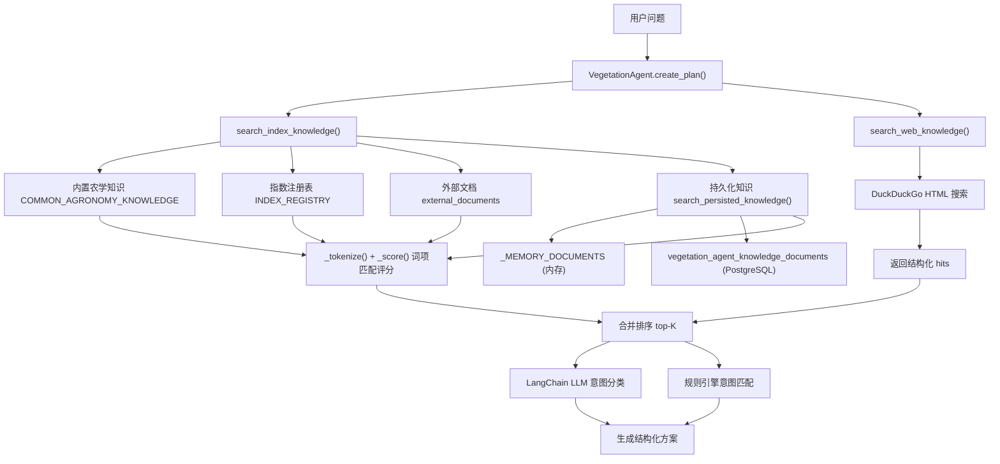
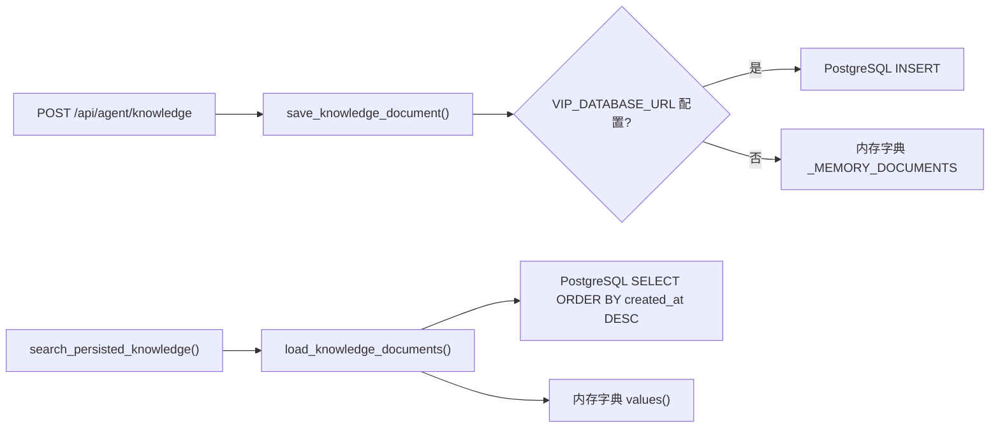
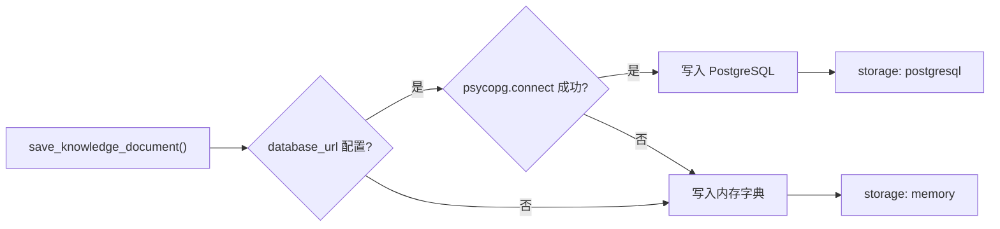

本文档详细描述植被指数智能分析平台中的知识检索（RAG）系统架构与网络搜索集成方案。该系统是智能体（Agent）决策的核心支撑组件，通过多源知识召回为意图识别、指数推荐和方案生成提供上下文依据。

## 系统架构总览

RAG 系统采用**多层知识融合架构**，将内置农学知识、指数注册表、持久化外部文档和网络搜索结果统一纳入召回管线。智能体在生成分析方案前，会依次执行本地知识检索和可选的网络搜索，最终将召回结果作为 LLM 分类和规则匹配的上下文输入。



Sources: [agent.py](backend/app/services/agent.py#L91-L124) [agent_tools.py](backend/app/services/agent_tools.py#L103-L162) [agent_knowledge_store.py](backend/app/services/agent_knowledge_store.py#L154-L173)

## 三层本地知识召回

本地 RAG 召回由 `search_index_knowledge()` 函数统一调度，覆盖三个独立的知识层，每层采用相同的词项匹配评分机制但具有不同的内容来源和优先级偏移。

### 第一层：内置农学知识库

内置农学知识以硬编码元组形式存储在 `COMMON_AGRONOMY_KNOWLEDGE` 中，包含 9 条覆盖长势判读、叶绿素分析、水分胁迫、稀疏植被、盐碱胁迫、倒伏监测、病虫害筛查和多时相变化监测等典型遥感农学场景的标准化描述。每条记录由标题、关键词和内容三部分组成，内容中明确标注了推荐指数组合和判读限制。

```python
COMMON_AGRONOMY_KNOWLEDGE = (
    (
        "通用作物长势判读",
        "长势 健康 覆盖 生物量 农田",
        "长势判读优先联合NDVI、EVI和GNDVI；NDVI适合覆盖度，EVI缓解高覆盖饱和，"
        "GNDVI补充叶绿素和氮素响应。结论应结合云阴影掩膜、地块边界和历史同期。",
    ),
    # ... 共 9 条
)
```

命中内置农学知识的条目会被赋予 `+0.04` 的评分偏移，使其在同等匹配度下优先于指数注册表条目被召回。

Sources: [agent_tools.py](backend/app/services/agent_tools.py#L27-L82) [agent_tools.py](backend/app/services/agent_tools.py#L111-L121)

### 第二层：指数注册表元数据

第二层遍历 `INDEX_REGISTRY` 中所有已注册的植被指数定义（含 35 个内置指数和运行期新增的自定义指数），将每个指数的名称、公式、描述、必需波段、分类、推荐标签和限制条件拼接为检索文本进行匹配。

```python
for definition in INDEX_REGISTRY.values():
    content = " ".join([
        definition.name,
        definition.formula,
        definition.description,
        " ".join(definition.required_bands),
        " ".join(definition.categories),
        " ".join(definition.recommendation_tags),
        " ".join(definition.limitations),
    ])
    score = _score(terms, content)
```

指数注册表条目的召回结果会被格式化为包含公式、必需波段、期望范围、用途、推荐场景和限制等结构化字段的知识片段，便于 LLM 和前端进行精准展示。

Sources: [agent_tools.py](backend/app/services/agent_tools.py#L122-L143) [indices.py](backend/app/core/indices.py#L29-L71)

### 第三层：外部文档与持久化知识

第三层整合两种外部知识来源：

1. **请求级外部文档**：通过 API 请求的 `externalDocuments` 字段传入的临时文档，命中时获得 `+0.05` 的评分偏移
2. **持久化知识文档**：通过知识导入 API 写入 PostgreSQL 或内存的知识库，由 `search_persisted_knowledge()` 函数检索

持久化知识存储在 `vegetation_agent_knowledge_documents` 表中，包含标题、内容、来源和关联会话 ID 等字段。当 PostgreSQL 不可用时，系统自动降级到内存字典存储。



持久化知识检索使用与主 RAG 相同的 `_tokenize()` 和 `_score()` 评分函数，但在返回前会添加 `+0.08` 的评分偏移以确保其在最终排序中的竞争力。

Sources: [agent_knowledge_store.py](backend/app/services/agent_knowledge_store.py#L31-L99) [agent_tools.py](backend/app/services/agent_tools.py#L144-L162)

## 词项匹配评分机制

整个 RAG 系统采用统一的轻量级词项匹配评分算法，由 `_tokenize()` 和 `_score()` 两个函数组成。

### 分词策略

`_tokenize()` 函数同时处理英文技术术语和中文农学术语：

- **英文分词**：使用正则表达式 `[a-zA-Z0-9_]+` 提取英文和数字词项，统一转为小写
- **中文术语**：预定义包含 23 个高频遥感农学中文术语的集合，通过 `in` 操作符检测查询文本中是否包含这些术语

```python
def _tokenize(value: str) -> set[str]:
    words = set(re.findall(r"[a-zA-Z0-9_]+", value.lower()))
    chinese_terms = {
        term for term in (
            "长势", "健康", "叶绿素", "水分", "干旱", "裸土", "稀疏",
            "变化", "火灾", "红边", "黄化", "氮素", "设施农业", "无人机",
            "rgb", "病虫害", "病害", "虫害", "灌溉", "积水", "涝害",
            "盐碱", "倒伏", "冠层",
        )
        if term in value.lower()
    }
    return words | chinese_terms
```

### 评分计算

`_score()` 函数计算查询词项在目标内容中的覆盖率，返回 0 到 1 之间的浮点数：

```python
def _score(terms: set[str], content: str) -> float:
    if not terms:
        return 0.0
    lowered = content.lower()
    matches = sum(1 for term in terms if term in lowered)
    return matches / max(len(terms), 1)
```

这种评分机制的优势在于**可解释性强**和**零外部依赖**，适合在无向量数据库的轻量部署场景下提供稳定的召回质量。

Sources: [agent_tools.py](backend/app/services/agent_tools.py#L371-L413)

## 特定诊断术语过滤

为防止知识库中的特定病害诊断信息被错误注入到不相关的用户查询中，`search_persisted_knowledge()` 函数实现了术语隔离机制：

```python
SPECIFIC_DIAGNOSIS_TERMS = (
    "根腐病", "白粉病", "锈病", "稻瘟病",
    "赤霉病", "枯萎病", "晚疫病", "炭疽病",
)
```

当持久化知识文档包含特定诊断术语但用户查询中未提及时，该文档会被过滤掉。这一设计确保了智能体不会在用户询问一般性长势分析时，错误推荐与特定病害相关的诊断方案。

Sources: [agent_knowledge_store.py](backend/app/services/agent_knowledge_store.py#L20-L29) [agent_knowledge_store.py](backend/app/services/agent_knowledge_store.py#L154-L173)

## 网络搜索集成

网络搜索作为 RAG 的补充层，通过公开搜索引擎获取最新的植被指数适用场景和判读方法。

### DuckDuckGo 搜索实现

系统使用 DuckDuckGo HTML 接口进行网络搜索，通过 `httpx` 异步 HTTP 客户端发送请求，并使用正则表达式解析 HTML 响应中的标题、摘要和链接：

```python
async def search_web_knowledge(query: str, limit: int = 4) -> list[dict[str, Any]]:
    params = {"q": f"{query} vegetation index remote sensing use case", "kl": "wt-wt"}
    async with httpx.AsyncClient(timeout=8, follow_redirects=True) as client:
        response = await client.get("https://duckduckgo.com/html/", params=params)
    pattern = re.compile(
        r'class="result__a"[^>]*href="(?P<url>[^"]+)"[^>]*>(?P<title>.*?)</a>.*?'
        r'class="result__snippet"[^>]*>(?P<snippet>.*?)</a>',
        re.S,
    )
```

网络搜索结果被固定分配 `0.72` 的评分，标题和摘要会被 HTML 清理函数处理后截断为 500 字符。搜索超时设置为 8 秒，当网络不可用时返回空列表，不影响整体方案生成流程。

### 前端控制开关

网络搜索功能通过前端的 `enableWebSearch` 开关控制，该开关状态会在 API 请求中传递给后端：

| 控制方式 | 位置 | 默认值 | 说明 |
|---------|------|--------|------|
| 前端开关 | `AgentDrawer.vue` 配置面板 | `true` | 用户可随时切换 |
| API 参数 | `AgentPlanRequest.enableWebSearch` | `true` | 请求级覆盖 |
| 后端逻辑 | `agent.py` 第 133-147 行 | 检查开关 | 决定是否调用网络搜索 |

当网络搜索被禁用或未返回结果时，系统会在追踪信息中标记 `warning` 状态，告知用户已降级使用本地指数知识。

Sources: [agent_tools.py](backend/app/services/agent_tools.py#L184-L214) [agent.py](backend/app/services/agent.py#L133-L147) [AgentDrawer.vue](frontend/src/components/AgentDrawer.vue#L44) [AgentDrawer.vue](frontend/src/components/AgentDrawer.vue#L872-L875)

## 知识导入 API

平台提供专用的知识导入端点，允许用户通过前端界面或 API 调用向知识库注入外部文档。

### API 端点

```
POST /api/agent/knowledge
```

请求体遵循 `AgentKnowledgeImportRequest` 模型：

| 字段 | 类型 | 约束 | 说明 |
|------|------|------|------|
| `title` | string | 1-200 字符 | 知识文档标题 |
| `content` | string | 1-12000 字符 | 知识文档正文 |
| `source` | string | 最大 500 字符 | 来源标识，默认 `user-upload` |
| `sessionId` | string | 可选，最大 80 字符 | 关联会话 ID |

### 前端导入流程

前端在 `AgentDrawer.vue` 中提供知识库管理面板，支持两种导入方式：

1. **文本输入**：用户在文本框中直接粘贴指数说明文档内容
2. **文件上传**：支持 `.txt`、`.md`、`.csv` 格式的本地文件导入

导入成功后，前端会显示存储模式（PostgreSQL 或内存）和确认消息，知识文档将在下次方案生成时进入 RAG 召回管线。

Sources: [routes.py](backend/app/api/routes.py#L503-L510) [schemas.py](backend/app/api/schemas.py#L69-L76) [AgentDrawer.vue](frontend/src/components/AgentDrawer.vue#L388-L421) [AgentDrawer.vue](frontend/src/components/AgentDrawer.vue#L832-L861)

## 检索结果在方案生成中的应用

RAG 和网络搜索的召回结果在方案生成过程中被用于三个关键环节：

### 1. LLM 意图分类增强

召回的知识片段被格式化为 RAG 上下文，注入到 LangChain LLM 的系统提示中：

```python
rag_context = "\n".join(
    f"- {hit['title']}: {hit['content']} 来源={hit['source']}"
    for hit in knowledge_hits[:8]
)
```

LLM 使用这些上下文辅助意图分类，但系统提示中明确禁止引入用户未提及的具体病害、虫害或灾害信息。

### 2. 方案元数据记录

完整的知识召回结果和网络搜索结果被记录在方案的 `knowledgeHits` 和 `webHits` 字段中，供前端展示和审计追踪。

### 3. 前端来源展示

前端在方案详情面板中展示去重后的检索来源，包括标题、来源标识和内容摘要：

```typescript
const visibleSources = computed(() => dedupeSources([
  ...(store.activePlan?.knowledgeHits ?? []),
  ...(store.activePlan?.webHits ?? []),
]))
```

Sources: [agent.py](backend/app/services/agent.py#L163) [agent.py](backend/app/services/agent.py#L330-L346) [AgentDrawer.vue](frontend/src/components/AgentDrawer.vue#L89-L92) [AgentDrawer.vue](frontend/src/components/AgentDrawer.vue#L778-L788)

## SSE 流式追踪

RAG 和网络搜索的执行过程通过 SSE 流式接口实时推送至前端，用户可以观察到知识检索的每个阶段：

| SSE 事件 | 标题 | 说明 |
|---------|------|------|
| `thought` | 检索知识 | 正在匹配指数适用场景、必要波段、公式约束和可执行性 |
| `status` | - | 正在检索本地指数知识和外部知识库 |
| `thought` | 网络检索 | 正在补充公开资料中的适用场景（仅当 `enableWebSearch=true`） |
| `thought` | 推荐指数 | 已选指数列表和可执行数量 |

前端通过队列化思考步骤（`enqueueThinkingStep`）机制，将快速到达的 SSE 事件按固定间隔（1180ms）逐条展示，避免界面瞬时跳动。

Sources: [routes.py](backend/app/api/routes.py#L253-L368) [AgentDrawer.vue](frontend/src/components/AgentDrawer.vue#L225-L257)

## 存储降级策略

知识存储系统实现了**优雅降级**策略，当 PostgreSQL 不可用时自动回退到内存存储：



| 存储模式 | 持久性 | 容量 | 适用场景 |
|---------|--------|------|---------|
| PostgreSQL | 服务重启后保留 | 仅受磁盘限制 | 生产部署 |
| 内存字典 | 服务重启后丢失 | 最近 80 条 | 本地开发 |

系统能力接口 `/api/system/capabilities` 会返回当前知识存储模式，供前端和运维人员查询。

Sources: [agent_knowledge_store.py](backend/app/services/agent_knowledge_store.py#L43-L60) [routes.py](backend/app/api/routes.py#L588-L604)

## 安全边界

RAG 系统的设计遵循以下安全原则：

1. **知识文档内容上限**：单篇文档内容限制为 12000 字符，防止注入过长内容影响 LLM 推理
2. **术语隔离**：特定诊断术语（如根腐病、白粉病等）仅在用户查询明确提及时才被召回
3. **LLM 约束**：系统提示明确禁止 LLM 引入用户未提及的具体病害信息
4. **网络搜索降级**：网络搜索超时或失败时不影响方案生成，仅记录警告
5. **无代码执行**：知识文档仅作为文本上下文使用，不会被执行或解析为指令

Sources: [agent_knowledge_store.py](backend/app/services/agent_knowledge_store.py#L20-L29) [agent.py](backend/app/services/agent.py#L330-L336) [schemas.py](backend/app/api/schemas.py#L69-L76)

## 下一步阅读

- [自定义指数注册与 PostgreSQL 持久化](14-zi-ding-yi-zhi-shu-zhu-ce-yu-postgresql-chi-jiu-hua)：了解自定义指数的运行期注册和持久化机制
- [Agent 会话事件存储与结果解读](15-agent-hui-hua-shi-jian-cun-chu-yu-jie-guo-jie-du)：了解会话事件如何记录 RAG 检索过程和方案生成结果
- [意图识别、方案生成与用户确认流程](11-yi-tu-shi-bie-fang-an-sheng-cheng-yu-yong-hu-que-ren-liu-cheng)：了解 RAG 结果如何参与意图分类和方案生成