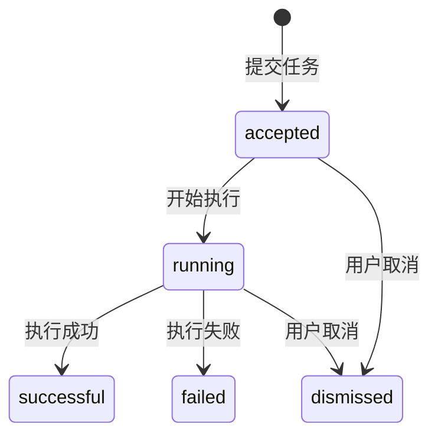
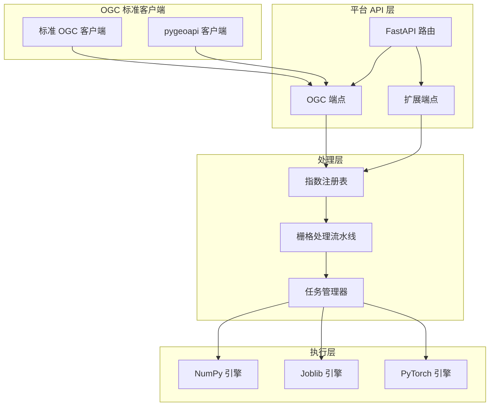

本页面详细阐述平台如何通过 RESTful API 实现与 OGC API - Processes 规范的对齐。平台在 FastAPI 框架上构建了兼容 OGC 标准的接口层，同时提供了内部扩展接口，并通过 pygeoapi 处理器插件支持独立的 OGC 服务实例。

## OGC API - Processes 规范核心概念

OGC API - Processes 是地理空间处理服务的 Web 标准，定义了如何发现、描述和执行地理空间处理进程。平台实现了规范的核心资源路径：`/processes` 用于发现可用进程，`/processes/{processId}` 用于获取进程描述，`/processes/{processId}/execution` 用于提交执行请求，以及 `/jobs` 系列端点用于管理异步任务。规范要求每个进程必须包含 `id`、`title`、`description`、`version` 和 `jobControlOptions` 等元数据字段。

```mermaid
graph LR
    A[OGC API - Processes 规范] --> B[进程发现 /processes]
    A --> C[进程描述 /processes/{id}]
    A --> D[进程执行 /processes/{id}/execution]
    A --> E[任务管理 /jobs]
    
    B --> F[平台实现]
    C --> F
    D --> F
    E --> F
    
    F --> G[35个植被指数进程]
    F --> H[同步/异步执行]
    F --> I[Celery任务队列]
    F --> J[pygeoapi处理器]
```

## 平台 API 架构对齐

平台通过 FastAPI 路由实现了完整的 OGC API - Processes 资源路径，同时保留了内部扩展端点。这种设计既保证了与标准客户端的兼容性，又提供了智能分析代理等高级功能。

### 核心 OGC 端点实现

平台将每个注册的植被指数定义为一个 OGC 进程，通过统一的注册表机制实现动态进程发现。`GET /processes` 端点遍历 `INDEX_REGISTRY`，为每个指数生成符合 OGC 规范的进程描述。

```python
@router.get("/processes")
def list_processes() -> dict[str, Any]:
    """执行 list_processes 对应的领域操作并返回结构化结果。"""
    return {
        "processes": [
            {
                "id": item.id,
                "title": item.name,
                "description": item.description,
                "version": "1.0.0",
                "jobControlOptions": ["sync-execute", "async-execute", "dismiss"],
            }
            for item in INDEX_REGISTRY.values()
        ]
    }
```

Sources: [backend/app/api/routes.py](backend/app/api/routes.py#L87-L101)

`GET /processes/{process_id}` 端点提供详细的进程描述，包括输入输出 schema、引擎选项和元数据。平台扩展了标准字段，添加了 `inputs` 和 `outputs` 的详细定义。

```python
@router.get("/processes/{process_id}")
def describe_process(process_id: str) -> dict[str, Any]:
    """执行 describe_process 对应的领域操作并返回结构化结果。"""
    try:
        item = get_index(process_id)
    except ValueError as error:
        raise HTTPException(status_code=404, detail=str(error)) from error
    return {
        **item.public_metadata(),
        "version": "1.0.0",
        "jobControlOptions": ["sync-execute", "async-execute", "dismiss"],
        "inputs": {
            "source": {"schema": {"type": "object"}},
            "bands": {"schema": {"type": "object"}},
            "engine": {"schema": {"enum": ["auto", "numpy", "joblib", "torch"]}},
        },
        "outputs": {"result": {"schema": {"type": "object"}}},
    }
```

Sources: [backend/app/api/routes.py](backend/app/api/routes.py#L104-L121)

### 进程执行与任务管理

`POST /processes/{process_id}/execution` 端点是平台的核心执行入口，支持同步和异步两种执行模式。通过 HTTP `Prefer` 头实现模式选择：`Prefer: respond-async` 触发异步执行，否则默认同步执行。

```python
@router.post("/processes/{process_id}/execution")
def execute_process(
    process_id: str,
    request: ExecutionRequest,
    prefer: Annotated[str | None, Header()] = None,
) -> dict[str, Any]:
    """根据 Prefer 头选择同步结果或异步任务响应。"""
    try:
        indices = request.indices
        if process_id != "batch":
            get_index(process_id)
            indices = [process_id]
        task = _to_raster_task(request, indices)
    except ValueError as error:
        if "未知植被指数" in str(error):
            raise HTTPException(status_code=404, detail=str(error)) from error
        raise HTTPException(status_code=422, detail=str(error)) from error
    except FileNotFoundError as error:
        raise HTTPException(status_code=422, detail=str(error)) from error

    if prefer and "respond-async" in prefer.lower():
        record = job_manager.submit(task, request.priority)
        return {
            "jobID": record.id,
            "status": record.status,
            "location": f"/jobs/{record.id}",
        }
    try:
        return {"status": "successful", "outputs": job_manager.execute_sync(task)}
    except (ValueError, FileNotFoundError) as error:
        raise HTTPException(status_code=422, detail=str(error)) from error
```

Sources: [backend/app/api/routes.py](backend/app/api/routes.py#L124-L155)

任务管理端点完全遵循 OGC API - Processes 规范：

| 端点 | 方法 | 功能 | OGC 规范对齐 |
|------|------|------|--------------|
| `/jobs` | GET | 列出所有任务 | 符合规范 |
| `/jobs/{job_id}` | GET | 获取任务详情 | 符合规范 |
| `/jobs/{job_id}/results` | GET | 获取任务结果 | 符合规范，仅状态为 `successful` 时可用 |
| `/jobs/{job_id}` | DELETE | 取消任务 | 符合规范，返回 202 Accepted |

Sources: [backend/app/api/routes.py](backend/app/api/routes.py#L157-L191)

## pygeoapi 处理器集成

平台提供了 `SpectralIndexProcessor` 类作为 pygeoapi 的处理器插件，实现了独立的 OGC 服务实例。该处理器复用了平台的指数注册表和栅格处理流水线，通过 `PROCESS_METADATA` 定义了符合 OGC 规范的进程元数据。

```python
PROCESS_METADATA = {
    "version": "1.0.0",
    "id": "spectral-index",
    "title": {"en": "Spectral index", "zh": "植被指数动态处理器"},
    "description": {"en": "Windowed vegetation index calculation"},
    "jobControlOptions": ["sync-execute", "async-execute"],
    "keywords": ["vegetation", "raster", "remote-sensing"],
    "inputs": {
        "source": {
            "title": "GeoTIFF path",
            "schema": {"type": "string"},
            "minOccurs": 1,
            "maxOccurs": 1,
        },
        "index": {
            "title": "Index identifier",
            "schema": {"type": "string"},
            "minOccurs": 1,
            "maxOccurs": 1,
        },
        "bands": {
            "title": "Logical band mapping",
            "schema": {"type": "object"},
            "minOccurs": 1,
            "maxOccurs": 1,
        },
    },
    "outputs": {
        "result": {
            "title": "Processing result",
            "schema": {"type": "object", "contentMediaType": "application/json"},
        }
    },
}
```

Sources: [backend/app/pygeoapi_processor.py](backend/app/pygeoapi_processor.py#L21-L54)

pygeoapi 通过配置文件将 `spectral-index` 进程绑定到 `SpectralIndexProcessor` 类：

```yaml
resources:
  spectral-index:
    type: process
    processor:
      name: app.pygeoapi_processor.SpectralIndexProcessor
```

Sources: [infra/pygeoapi/config.yml](infra/pygeoapi/config.yml#L49-L53)

## 数据模型与输入验证

平台使用 Pydantic 模型进行严格的输入验证，确保符合 OGC API - Processes 规范要求。核心的 `ExecutionRequest` 模型定义了进程执行所需的所有参数：

| 字段 | 类型 | 必填 | 描述 | OGC 规范对齐 |
|------|------|------|------|--------------|
| `source` | SourceReference | 是 | 数据源引用 | 扩展实现 |
| `indices` | list[str] | 是 | 指数标识符列表 | 扩展实现 |
| `bands` | dict[str, int] | 是 | 逻辑波段映射 | 扩展实现 |
| `engine` | Literal["auto", "numpy", "joblib", "torch"] | 否 | 计算引擎选择 | 扩展实现 |
| `block_size` | int | 否 | 分块大小 | 扩展实现 |
| `priority` | int | 否 | 任务优先级 | 扩展实现 |
| `statistics` | bool | 否 | 是否计算统计信息 | 扩展实现 |
| `preview` | bool | 否 | 是否生成预览 | 扩展实现 |
| `parameters` | dict[str, dict[str, float]] | 否 | 指数参数 | 扩展实现 |

Sources: [backend/app/api/schemas.py](backend/app/api/schemas.py#L31-L43)

`SourceReference` 模型支持两种数据源引用方式：对象存储键 (`objectKey`) 或本地路径 (`localPath`)，确保了灵活性和可移植性。

## 任务生命周期与状态管理

平台实现了完整的任务生命周期管理，状态转换严格遵循 OGC API - Processes 规范。任务状态包括：`accepted`（已接受）、`running`（运行中）、`successful`（成功）、`failed`（失败）和 `dismissed`（已取消）。



任务管理器支持两种执行后端：本地线程池（开发模式）和 Celery 异步队列（部署模式）。通过 `settings.celery_always_eager` 配置切换。

```python
class JobManager:
    """统一封装本地线程池与 Celery 异步执行。"""
    def __init__(self, max_workers: int = 3) -> None:
        """初始化实例依赖、运行状态和可配置参数。"""
        self._jobs: dict[str, JobRecord] = {}
        self._lock = threading.Lock()
        self._executor = ThreadPoolExecutor(
            max_workers=max_workers, thread_name_prefix="raster-job"
        )

    def submit(self, task: RasterTask, priority: int = 3) -> JobRecord:
        """执行 submit 对应的领域操作并返回结构化结果。"""
        if not settings.celery_always_eager:
            return self._submit_celery(task, priority)
        record = JobRecord(id=uuid.uuid4().hex, engine=task.engine, index_count=len(task.indices))
        with self._lock:
            self._jobs[record.id] = record
        self._executor.submit(self._run, record.id, task)
        return record
```

Sources: [backend/app/services/jobs.py](backend/app/services/jobs.py#L54-L72)

## API 端点全景图

平台 REST API 包含 OGC 标准端点和内部扩展端点，形成完整的功能体系：

| 端点分组 | 端点 | 功能 | OGC 兼容性 |
|----------|------|------|------------|
| **进程发现** | `GET /processes` | 列出所有进程 | ✅ 完全兼容 |
| | `GET /processes/{id}` | 获取进程描述 | ✅ 完全兼容 |
| **进程执行** | `POST /processes/{id}/execution` | 执行进程 | ✅ 完全兼容 |
| | `POST /processes/batch/execution` | 批量执行 | ✅ 扩展实现 |
| **任务管理** | `GET /jobs` | 列出所有任务 | ✅ 完全兼容 |
| | `GET /jobs/{id}` | 获取任务详情 | ✅ 完全兼容 |
| | `GET /jobs/{id}/results` | 获取任务结果 | ✅ 完全兼容 |
| | `DELETE /jobs/{id}` | 取消任务 | ✅ 完全兼容 |
| **指数管理** | `GET /api/indices` | 列出指数 | 内部扩展 |
| | `GET /api/indices/{id}` | 指数详情 | 内部扩展 |
| | `POST /api/indices/custom` | 创建自定义指数 | 内部扩展 |
| **智能代理** | `POST /api/agent/plan` | 生成分析方案 | 内部扩展 |
| | `POST /api/agent/plan/stream` | 流式方案生成 | 内部扩展 |
| | `POST /api/agent/plans/{id}/confirm` | 确认方案 | 内部扩展 |
| **系统信息** | `GET /api/system/capabilities` | 系统能力 | 内部扩展 |
| | `GET /health` | 健康检查 | 内部扩展 |

## 测试验证与合规性

平台通过全面的测试验证确保 OGC API - Processes 规范的合规性。测试覆盖了进程发现、描述、执行和任务管理的全流程。

```python
def test_ogc_process_catalog_contains_core_and_legacy_processes() -> None:
    """验证 ogc process catalog contains core and legacy processes 场景的行为和回归边界。"""
    response = client.get("/processes")
    assert response.status_code == 200
    assert len(response.json()["processes"]) == 35
```

Sources: [backend/tests/test_api.py](backend/tests/test_api.py#L28-L32)

测试验证了同步执行、异步执行、批量执行和错误处理等场景：

```python
def test_sync_process_executes_real_windowed_raster(sample_raster: Path) -> None:
    """验证 sync process executes real windowed raster 场景的行为和回归边界。"""
    response = client.post(
        "/processes/ndvi/execution",
        json=execution_payload(sample_raster),
    )
    assert response.status_code == 200
    payload = response.json()
    assert payload["status"] == "successful"
    assert payload["outputs"]["actualEngine"] == "numpy"
    assert payload["outputs"]["products"][0]["index"] == "ndvi"
    assert Path(payload["outputs"]["products"][0]["path"]).is_file()
```

Sources: [backend/tests/test_api.py](backend/tests/test_api.py#L235-L246)

```python
def test_async_process_returns_job_and_results(sample_raster: Path) -> None:
    """验证 async process returns job and results 场景的行为和回归边界。"""
    response = client.post(
        "/processes/ndvi/execution",
        headers={"Prefer": "respond-async"},
        json=execution_payload(sample_raster),
    )
    assert response.status_code == 200
    job_id = response.json()["jobID"]
    # ... 轮询等待任务完成
    assert record["status"] == "successful"
    assert record["started_at"]
    assert record["finished_at"]
    assert record["eta_seconds"] == 0
```

Sources: [backend/tests/test_api.py](backend/tests/test_api.py#L277-L304)

## 架构优势与扩展性

平台的 API 架构设计具有以下优势：

1. **标准兼容性**：完全遵循 OGC API - Processes 规范，确保与标准客户端的互操作性
2. **动态进程发现**：通过指数注册表实现动态进程注册，无需为每个指数编写独立处理器
3. **多执行后端**：支持本地线程池和 Celery 异步队列，适应不同部署环境
4. **pygeoapi 集成**：提供独立的 OGC 服务实例，支持更广泛的 OGC 生态系统集成
5. **扩展性**：内部扩展端点支持智能分析、批量处理等高级功能



## 下一步阅读

了解平台如何通过 Celery 实现异步任务管道，请参考：[同步执行与 Celery 异步任务管道](17-tong-bu-zhi-xing-yu-celery-yi-bu-ren-wu-guan-dao)

了解任务优先级、进度查询与取消机制，请参考：[任务优先级、进度查询与取消](18-ren-wu-you-xian-ji-jin-du-cha-xun-yu-qu-xiao)

了解平台整体架构与技术栈，请参考：[平台整体架构与技术栈](4-ping-tai-zheng-ti-jia-gou-yu-ji-zhu-zhan)