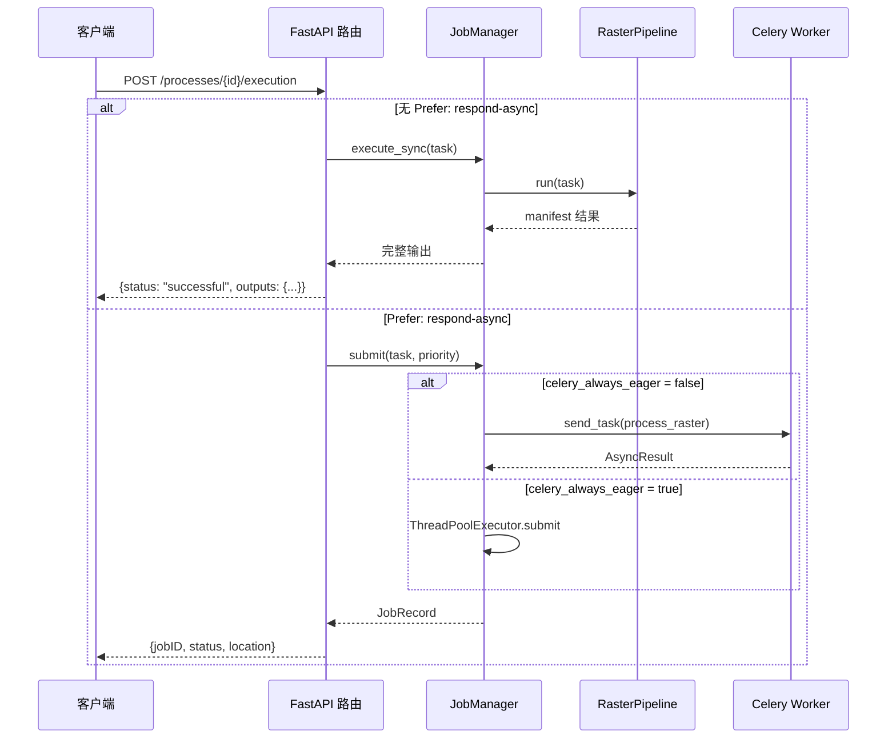
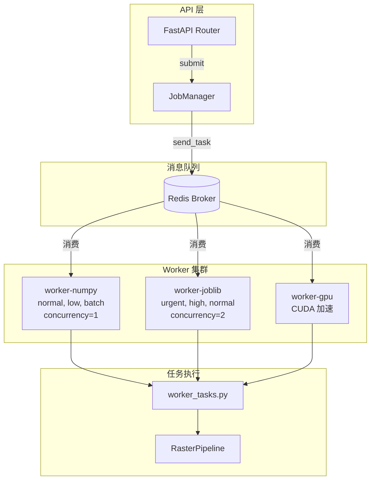
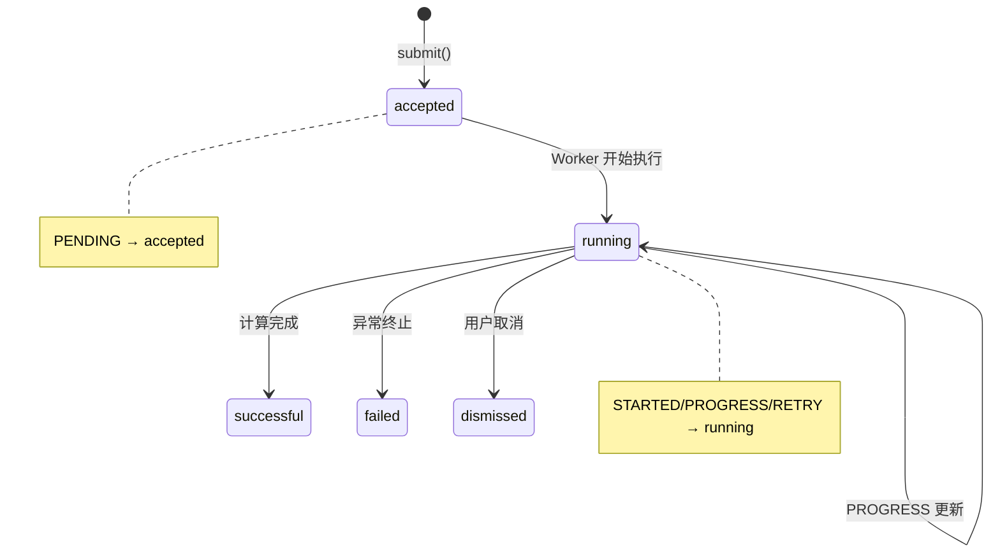

本页面详细阐述植被指数智能分析平台如何通过 OGC API - Processes 规范同时支持**同步阻塞执行**与**基于 Celery 的异步任务管道**，并解释两者在开发模式与生产部署模式下的切换机制、优先队列设计以及进度追踪架构。

## OGC API - Processes 执行模型

平台的执行入口统一为 `POST /processes/{process_id}/execution`，严格对齐 OGC API - Processes 规范。该端点通过 HTTP `Prefer` 头部字段决定执行模式：当请求包含 `Prefer: respond-async` 时进入异步管道，否则执行同步阻塞计算。这种设计使同一接口既能满足前端即时预览需求，也能支撑大规模遥感影像的后台批处理。

[Sources: [routes.py](backend/app/api/routes.py#L120-L160)]



[Sources: [routes.py](backend/app/api/routes.py#L120-L160), [jobs.py](backend/app/services/jobs.py#L55-L100)]

## 同步执行路径

同步执行是平台最直接的计算模式，适用于小型影像或需要即时返回结果的场景。当客户端发送执行请求且未携带 `Prefer: respond-async` 头部时，API 层直接调用 `JobManager.execute_sync()` 方法，该方法在当前请求线程中实例化 `RasterPipeline` 并阻塞执行完整计算流程。

同步模式下，`RasterTask.synchronous` 标志位被设置为 `True`，这会影响 `ExecutionPlanner` 的引擎选择策略——无论影像尺寸如何，同步任务都会优先选择 NumPy 引擎以降低调度开销。执行完成后，API 端点直接返回包含完整 manifest 的 JSON 响应，其中包含每个指数的输出路径、统计信息、预览图路径和溯源清单。

[Sources: [jobs.py](backend/app/services/jobs.py#L70-L73), [planner.py](backend/app/services/planner.py#L55-L60)]

| 特性 | 同步执行 | 异步执行 |
|------|----------|----------|
| **触发方式** | 无 `Prefer` 头部 | `Prefer: respond-async` |
| **响应内容** | 完整计算结果 | 任务 ID 与状态查询位置 |
| **引擎选择** | 强制 NumPy（降低调度开销） | 按规模自动选择 |
| **适用场景** | 小型影像、即时预览 | 大型影像、批量处理 |
| **超时风险** | 高（阻塞请求线程） | 低（后台执行） |
| **进度追踪** | 不支持 | 支持窗口级进度上报 |

[Sources: [routes.py](backend/app/api/routes.py#L145-L160), [planner.py](backend/app/services/planner.py#L55-L60)]

## 异步任务管道架构

异步执行模式通过 Celery 分布式任务队列实现，其核心设计目标是将计算密集型的栅格处理从 API 请求线程中解耦。当 `settings.celery_always_eager` 为 `False`（生产部署模式）时，`JobManager._submit_celery()` 方法通过 `celery_app.send_task()` 将任务序列化后投递到 Redis broker，并根据优先级参数路由到对应的队列。

[Sources: [jobs.py](backend/app/services/jobs.py#L135-L155), [celery_app.py](backend/app/celery_app.py#L1-L36)]



[Sources: [compose.yml](compose.yml#L85-L120), [celery_app.py](backend/app/celery_app.py#L15-L35)]

## 五级优先队列设计

平台实现了五级优先队列机制，通过 Kombu 的 `Queue` 类和 `routing_key` 实现任务分级调度。这种设计确保紧急任务（如用户交互式分析）能够优先于批量后台任务（如历史数据重处理）获得计算资源。

[Sources: [celery_app.py](backend/app/celery_app.py#L20-L35)]

| 优先级 | 队列名称 | 路由键 | 典型场景 |
|--------|----------|--------|----------|
| 1 | `urgent` | `priority.1` | 用户交互式单指数分析 |
| 2 | `high` | `priority.2` | Agent 确认后的执行单 |
| 3 | `normal` | `priority.3` | 常规 API 调用（默认） |
| 4 | `low` | `priority.4` | 非紧急批量任务 |
| 5 | `batch` | `priority.5` | 历史数据重处理、基准测试 |

Worker 队列分配策略体现了资源隔离思想：`worker-numpy` 仅消费 `normal`、`low`、`batch` 队列且并发度为 1，适合低优先级的串行任务；`worker-joblib` 消费 `urgent`、`high`、`normal` 队列且并发度为 2，能够处理高优先级的并行计算；`worker-gpu` 专门处理需要 CUDA 加速的大型任务。

[Sources: [compose.yml](compose.yml#L85-L120), [celery_app.py](backend/app/celery_app.py#L25-L35)]

## 开发模式与生产模式切换

平台通过 `settings.celery_always_eager` 配置项实现开发模式与生产模式的无缝切换。当该值为 `True`（默认值，适用于本地开发）时，Celery 任务会在调用线程中同步执行，无需启动 Redis 和 Worker 进程；当设置为 `False`（Docker Compose 部署）时，任务通过 Redis broker 分发到独立的 Worker 容器。

[Sources: [settings.py](backend/app/settings.py#L20), [compose.yml](compose.yml#L8-L10)]

```python
# 开发模式：任务在当前线程同步执行
celery_always_eager: bool = True

# 生产模式：通过 Redis 分发到 Worker
VIP_CELERY_ALWAYS_EAGER: "false"
```

`JobManager.submit()` 方法内部通过条件判断实现模式切换：

```python
def submit(self, task: RasterTask, priority: int = 3) -> JobRecord:
    if not settings.celery_always_eager:
        return self._submit_celery(task, priority)  # 生产模式
    # 开发模式：本地线程池执行
    record = JobRecord(id=uuid.uuid4().hex, ...)
    self._executor.submit(self._run, record.id, task)
    return record
```

[Sources: [jobs.py](backend/app/services/jobs.py#L55-L70)]

## Celery Worker 任务实现

Worker 端的任务入口定义在 `worker_tasks.py` 中的 `process_raster` 函数。该函数通过 `@celery_app.task` 装饰器注册为 Celery 任务，并配置了自动重试机制——当遇到 `OSError`（如文件系统临时故障）时，任务会以指数退避策略重试最多 1 次。

[Sources: [worker_tasks.py](backend/app/worker_tasks.py#L15-L45)]

任务执行过程中通过 `self.update_state()` 方法上报窗口级进度，使客户端能够实时追踪计算进展。进度元数据包含以下字段：

| 字段 | 类型 | 说明 |
|------|------|------|
| `progress` | `float` | 完成百分比（0-100） |
| `message` | `str` | 当前处理阶段描述 |
| `current` | `int` | 已处理窗口数 |
| `total` | `int` | 总窗口数 |
| `throughput` | `float` | 窗口/秒处理速率 |
| `eta_seconds` | `float` | 预估剩余秒数 |

[Sources: [worker_tasks.py](backend/app/worker_tasks.py#L25-L40)]

## 任务状态查询与生命周期

异步任务提交后，客户端通过 `GET /jobs/{job_id}` 端点轮询任务状态。`JobManager.get()` 方法在生产模式下会调用 `_refresh_celery()` 从 Celery 后端同步最新状态，将 Celery 内部状态映射为平台统一的状态枚举。

[Sources: [jobs.py](backend/app/services/jobs.py#L75-L100), [routes.py](backend/app/api/routes.py#L162-L175)]



状态映射关系如下：

| Celery 状态 | 平台状态 | 说明 |
|-------------|----------|------|
| `PENDING` | `accepted` | 任务已入队，等待 Worker 消费 |
| `STARTED` | `running` | Worker 已开始执行 |
| `PROGRESS` | `running` | 正在处理，进度已更新 |
| `RETRY` | `running` | 临时失败，等待重试 |
| `SUCCESS` | `successful` | 计算完成，结果可用 |
| `FAILURE` | `failed` | 执行异常 |
| `REVOKED` | `dismissed` | 被用户取消 |

[Sources: [jobs.py](backend/app/services/jobs.py#L170-L200)]

## 任务取消机制

平台支持通过 `DELETE /jobs/{job_id}` 端点取消正在执行的任务。在生产模式下，取消操作通过 `celery_app.control.revoke()` 向 Worker 发送终止信号；在开发模式下，取消标志位会被设置为 `True`，`RasterPipeline` 在每个窗口处理前检查该标志并抛出 `RuntimeError` 中断执行。

[Sources: [routes.py](backend/app/api/routes.py#L177-L185), [jobs.py](backend/app/services/jobs.py#L100-L115)]

```python
# Worker 端检查取消标志
for current, window in enumerate(windows, start=1):
    if is_cancelled and is_cancelled():
        raise RuntimeError("任务已取消")
    # ... 继续处理
```

[Sources: [raster_pipeline.py](backend/app/services/raster_pipeline.py#L175-L180)]

## SSE 流式任务追踪

除了轮询机制，平台还提供基于 Server-Sent Events 的流式任务追踪端点 `POST /api/agent/plans/{plan_id}/confirm/stream`。该端点在 Agent 确认执行单后，通过 SSE 持续推送任务状态更新，直到任务达到终态（`successful`、`failed` 或 `dismissed`）。

[Sources: [routes.py](backend/app/api/routes.py#L420-L480)]

SSE 事件类型包括：

| 事件类型 | 数据结构 | 触发时机 |
|----------|----------|----------|
| `status` | `{message: string}` | 状态变更通知 |
| `plan` | 确认后的执行单 | 任务提交成功 |
| `job` | 任务状态快照 | 每次轮询（0.8秒间隔） |
| `result` | 完整计算结果 | 任务成功完成 |
| `error` | 错误信息与任务快照 | 任务失败或异常 |
| `done` | `{message: string}` | 流式传输结束 |

[Sources: [routes.py](backend/app/api/routes.py#L440-L475)]

## pygeoapi 处理器集成

平台通过 `SpectralIndexProcessor` 类实现了 pygeoapi 标准处理器插件，使植被指数计算能够通过 OGC 标准接口被外部系统调用。该处理器声明支持 `sync-execute` 和 `async-execute` 两种执行模式，内部直接复用 `RasterPipeline` 执行计算。

[Sources: [pygeoapi_processor.py](backend/app/pygeoapi_processor.py#L20-L87)]

```python
PROCESS_METADATA = {
    "jobControlOptions": ["sync-execute", "async-execute"],
    # ...
}
```

需要注意的是，pygeoapi 处理器当前仅实现同步执行路径，异步模式需要通过平台原生的 `/processes/{id}/execution` 端点配合 `Prefer` 头部使用。

[Sources: [pygeoapi_processor.py](backend/app/pygeoapi_processor.py#L55-L75)]

## Docker Compose 部署拓扑

生产环境通过 Docker Compose 编排多个 Worker 容器，实现计算资源的水平扩展。每个 Worker 容器通过 `command` 参数指定监听的队列和并发度，并共享 `vegetation-data` 卷以访问输入影像和写入计算结果。

[Sources: [compose.yml](compose.yml#L85-L130)]

| 容器名称 | 监听队列 | 并发度 | 硬件要求 |
|----------|----------|--------|----------|
| `worker-numpy` | normal, low, batch | 1 | CPU |
| `worker-joblib` | urgent, high, normal | 2 | CPU |
| `worker-gpu` | 所有队列 | 1 | NVIDIA GPU |

Worker 容器通过 `depends_on` 确保 Redis 健康后再启动，并通过 `healthcheck` 机制实现自动重启。Redis 作为消息 broker 和结果 backend，配置了 `appendonly` 持久化模式以防止任务丢失。

[Sources: [compose.yml](compose.yml#L85-L150)]

## 下一步阅读

- [任务优先级、进度查询与取消](18-ren-wu-you-xian-ji-jin-du-cha-xun-yu-qu-xiao) — 深入了解优先级调度算法、进度查询 API 和取消机制的实现细节
- [REST 接口与 OGC API - Processes 规范对齐](16-rest-jie-kou-yu-ogc-api-processes-gui-fan-dui-qi) — 完整的 API 端点参考和规范映射
- [Docker Compose 服务编排全景](23-docker-compose-fu-wu-bian-pai-quan-jing) — 容器化部署的完整配置说明