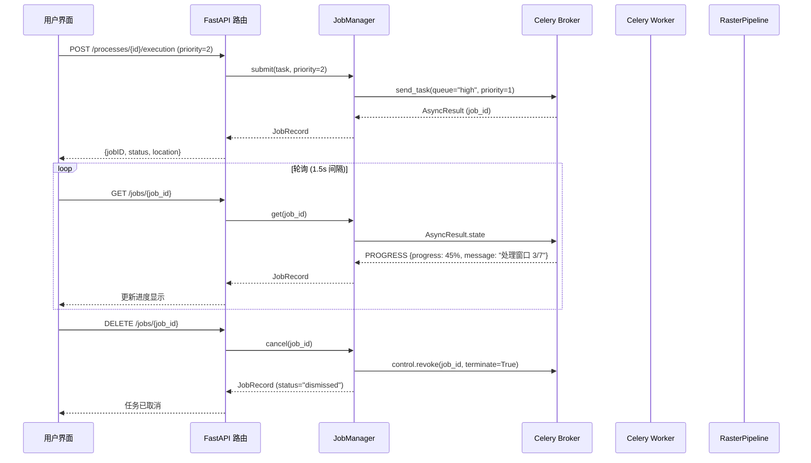
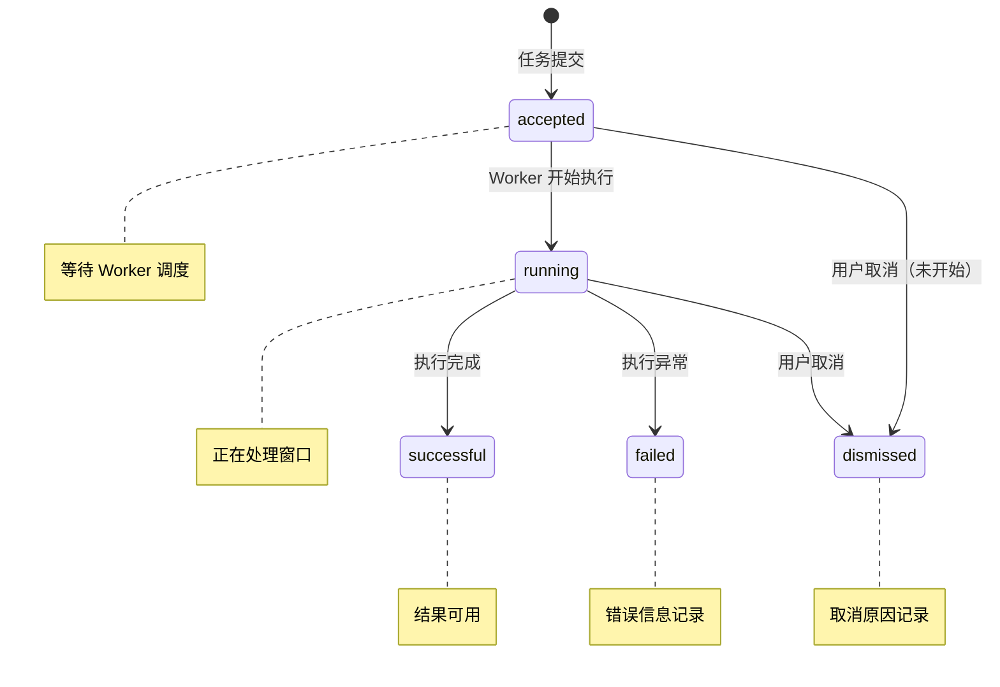

本文档详细阐述植被指数智能分析平台中异步计算任务的优先级调度、实时进度查询与任务取消机制。该系统通过 **Celery 五级优先队列** 实现任务调度优化，结合 **双模式进度上报**（本地线程池与 Celery Worker）确保进度信息实时同步，并通过 **协作者取消协议** 支持任务安全终止。这套机制共同构建了高效、可控的异步计算体验。

## 架构概览与数据流

任务管理系统采用分层架构设计，前端通过 REST API 与后端交互，后端通过 `JobManager` 统一协调本地线程池和 Celery Worker 两种执行模式。下图展示了从任务提交到结果获取的完整数据流：



## 任务优先级机制

### 优先级映射与队列分配

任务优先级通过 `priority` 参数（1-5）控制，数值越小优先级越高。系统将优先级映射到 Celery 的五个专用队列，确保高优先级任务优先执行：

| 优先级 | 队列名称 | 路由键 | 典型场景 |
|--------|----------|--------|----------|
| 1 | `urgent` | `priority.1` | 实时分析、紧急决策支持 |
| 2 | `high` | `priority.2` | 交互式分析、用户主动请求 |
| 3 | `normal` | `priority.3` | 常规计算任务（默认） |
| 4 | `low` | `priority.4` | 批量预处理、后台优化 |
| 5 | `batch` | `priority.5` | 大规模数据集、夜间批处理 |

在 Celery 配置中，通过 `broker_transport_options` 设置 `queue_order_strategy: "priority"` 确保队列按优先级排序。每个任务提交时，`send_task()` 方法将 `priority` 参数转换为 Celery 内部的优先级值（`max(0, priority - 1)`），实现队列内微调。

```python
# 优先级映射逻辑
queues = {1: "urgent", 2: "high", 3: "normal", 4: "low", 5: "batch"}
async_result = celery_app.send_task(
    "app.worker_tasks.process_raster",
    args=[task_as_dict(task)],
    queue=queues[priority],
    priority=max(0, priority - 1),
)
```

### 双模式执行策略

系统支持两种执行模式，通过 `settings.celery_always_eager` 配置切换：

**本地线程池模式**（开发环境）：使用 `ThreadPoolExecutor` 执行任务，优先级参数被忽略，任务按提交顺序执行。此模式便于调试，但缺乏真正的优先级调度。

**Celery 分布式模式**（生产环境）：任务通过 Redis 消息队列分发到专用 Worker，支持真正的优先级调度和水平扩展。Worker 进程从高优先级队列优先消费任务。

## 进度查询与实时监控

### 进度数据结构

任务进度信息封装在 `JobRecord` 数据结构中，包含多个维度的实时指标：

```python
@dataclass(slots=True)
class JobRecord:
    id: str
    status: str = "accepted"  # accepted/running/successful/failed/dismissed
    progress: float = 0.0     # 百分比进度 (0-100)
    message: str = "等待执行"  # 当前阶段描述
    current: int = 0          # 当前处理窗口数
    total: int = 0            # 总窗口数
    throughput: float | None = None  # 窗口/秒 吞吐率
    eta_seconds: float | None = None  # 预计剩余时间
    engine: str = "auto"      # 实际使用的计算引擎
    index_count: int = 0      # 计算的指数数量
    result: dict[str, Any] | None = None  # 任务结果
    error: str | None = None  # 错误信息
```

### 进度上报机制

在 Celery Worker 中，进度通过 `update_state()` 方法实时上报。Worker 执行过程中，每处理一个窗口或达到特定里程碑时，调用回调函数更新状态：

```python
# Worker 进度上报
def progress(current: int, total: int, message: str) -> None:
    elapsed = max(perf_counter() - started_at, 1e-6)
    throughput = current / elapsed if current > 0 else None
    self.update_state(
        state="PROGRESS",
        meta={
            "progress": round(current / max(total, 1) * 100, 2),
            "message": message,
            "current": current,
            "total": total,
            "throughput": round(throughput, 4) if throughput else None,
            "eta_seconds": (
                round((total - current) / throughput, 2)
                if throughput and current < total
                else 0 if current >= total else None
            ),
        },
    )
```

### 前端轮询策略

前端采用 **固定间隔轮询** 策略，每 1.5 秒刷新任务列表。`App.vue` 组件在 `onMounted` 生命周期钩子中启动定时器，确保任务状态实时更新：

```typescript
// 前端轮询实现
onMounted(async () => {
  await refreshSystem()
  pollTimer = window.setInterval(refreshJobs, 1500)
})

async function refreshJobs() {
  try {
    store.setJobs(await api.listJobs())
    store.setBackendOnline(true)
  } catch {
    store.setBackendOnline(false)
  }
}
```

轮询机制结合 **乐观更新** 策略：当用户执行取消操作时，前端立即更新本地状态，同时发送 API 请求，避免界面闪烁。

## 任务取消机制

### 协作者取消协议

任务取消采用 **协作者取消协议**，通过 `cancelled` 标志位实现协作式终止。`RasterPipeline.run()` 方法接受 `is_cancelled` 回调函数，在关键处理节点检查取消状态：

```python
# 取消标志检查
def run(self, task: RasterTask, on_progress=None, is_cancelled=None):
    for window in windows:
        if is_cancelled and is_cancelled():
            raise CancelledError("任务被用户取消")
        # 处理窗口...
        if on_progress:
            on_progress(current, total, f"处理窗口 {current}/{total}")
```

在 Celery 模式下，取消操作通过 `revoke()` 方法实现，支持 `terminate=True` 参数强制终止 Worker 进程：

```python
# Celery 任务取消
def cancel(self, job_id: str) -> JobRecord:
    record = self.get(job_id)
    if not settings.celery_always_eager:
        celery_app.control.revoke(job_id, terminate=True)
    record.cancelled = True
    record.message = "正在取消"
    record.updated_at = datetime.now(UTC).isoformat()
    return record
```

### 状态机与终态处理

任务状态机包含五个状态，状态转换遵循严格的时序规则：



取消操作根据任务当前状态产生不同效果：

| 当前状态 | 取消行为 | 终态 | 备注 |
|----------|----------|------|------|
| `accepted` | 设置 `cancelled=True` | `dismissed` | 任务未开始，直接标记 |
| `running` | 设置 `cancelled=True` + Worker 终止 | `dismissed` | 协作者协议终止 |
| `successful` | 无操作 | 保持原态 | 已完成任务不可取消 |
| `failed` | 无操作 | 保持原态 | 已失败任务不可取消 |

## 配置与调优指南

### 关键配置参数

| 参数 | 环境变量 | 默认值 | 说明 |
|------|----------|--------|------|
| `celery_always_eager` | `VIP_CELERY_ALWAYS_EAGER` | `True` | 开发模式使用本地线程池 |
| `redis_url` | `VIP_REDIS_URL` | `redis://localhost:6379/0` | Celery Broker/Backend |
| `max_workers` | - | `3` | 本地线程池最大并发数 |
| 轮询间隔 | - | `1500ms` | 前端状态刷新频率 |

### 生产环境优化建议

1. **队列隔离**：为不同优先级配置独立的 Worker 进程，确保高优先级任务专用资源：
   ```bash
   # 专用高优先级 Worker
   celery -A app.celery_app worker -Q urgent,high --concurrency=2
   # 通用 Worker
   celery -A app.celery_app worker -Q normal,low,batch --concurrency=4
   ```

2. **轮询优化**：对于长时任务，可实施 **指数退避轮询** 减少服务器压力：
   - 前 30 秒：1.5 秒间隔
   - 30-120 秒：3 秒间隔
   - 120 秒后：5 秒间隔

3. **进度精度**：调整 `RasterPipeline` 的窗口大小，平衡进度精度与汇报频率。较小的窗口提供更细粒度的进度，但增加状态更新开销。

## 最佳实践与故障处理

### 优先级选择策略

- **紧急分析**（优先级 1-2）：用于实时决策、现场勘查等场景。确保这些任务获得即时响应。
- **常规计算**（优先级 3）：默认选择，适用于大多数植被指数计算任务。
- **批量处理**（优先级 4-5）：用于大规模数据集预处理、历史数据重算等非实时场景。

### 取消安全边界

1. **原子性保证**：任务取消不会产生部分结果，要么完全成功，要么完全回滚。
2. **资源清理**：取消后，临时文件和计算资源会被自动释放。
3. **状态一致性**：取消操作是幂等的，重复取消不会导致状态异常。

### 故障恢复机制

| 故障类型 | 检测方式 | 恢复策略 |
|----------|----------|----------|
| Worker 崩溃 | Celery 心跳超时 | 自动重试（最多 1 次） |
| 网络中断 | API 超时 | 前端显示离线状态，自动重连 |
| 内存溢出 | Worker 进程 OOM | 任务标记为 `failed`，建议减小 `block_size` |

## 相关文档与下一步

本文档专注于任务优先级、进度查询与取消机制。如需了解更广泛的上下文，请参考：

- [同步执行与 Celery 异步任务管道](17-tong-bu-zhi-xing-yu-celery-yi-bu-ren-wu-guan-dao)：了解同步/异步执行模式的选择策略
- [REST 接口与 OGC API - Processes 规范对齐](16-rest-jie-kou-yu-ogc-api-processes-gui-fan-dui-qi)：完整的 API 规范与端点详情
- [前端组件与状态管理](6-qian-duan-zu-jian-yu-zhuang-tai-guan-li)：前端状态管理架构与组件交互

对于算法开发者，建议深入阅读 [Rasterio 分块读写与内存安全](9-rasterio-fen-kuai-du-xie-yu-nei-cun-an-quan)，了解窗口级处理的内存优化策略。运维工程师可参考 [Docker Compose 服务编排全景](23-docker-compose-fu-wu-bian-pai-quan-jing) 配置生产环境部署。