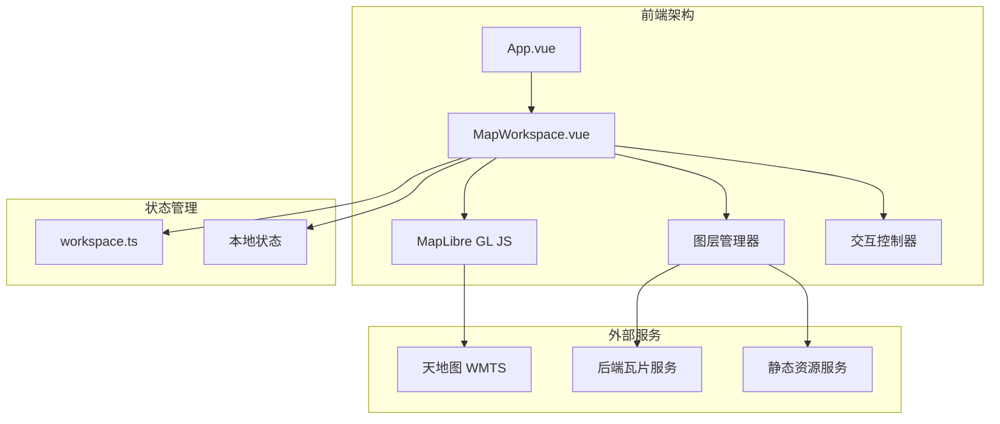

本文档详细介绍了植被指数智能分析平台中 MapLibre 地图工作区的架构设计与天地图集成方案。作为前端遥感可视化的核心组件，该工作区承担着底图展示、影像叠加、计算结果可视化和空间交互等关键功能。

## 架构概览

MapLibre 地图工作区采用分层架构设计，将地图渲染、图层管理、交互逻辑和状态控制分离，确保各模块职责清晰且易于维护。



## 核心实现

### 1. 地图初始化与配置

地图初始化采用 MapLibre GL JS 库，通过 `onMounted` 生命周期创建地图实例。初始配置设置中国中心点坐标 `[105, 35]` 和缩放级别 `3.2`，为遥感影像分析提供合适的初始视野。

地图容器通过 `ResizeObserver` 实现自适应布局，确保在窗口大小变化或面板切换时自动调整尺寸。同时注册了 `mousemove`、`rotate`、`moveend` 和 `sourcedata` 等事件监听器，实现坐标显示、旋转控制、瓦片需求更新和瓦片就绪状态管理。

Sources: [MapWorkspace.vue](frontend/src/components/MapWorkspace.vue#L699-L715)

### 2. 天地图集成方案

天地图通过 WMTS 服务集成，支持三种标准底图类型：矢量、影像和地形。每种底图由两个图层组成：基础图层和注记图层。

```typescript
// 天地图 WMTS 服务配置
const TIANDITU_TILE = 'https://t0.tianditu.gov.cn/{layer}_w/wmts?SERVICE=WMTS&REQUEST=GetTile&VERSION=1.0.0&LAYER={layer}&STYLE=default&TILEMATRIXSET=w&FORMAT=tiles&TILEMATRIX={z}&TILEROW={y}&TILECOL={x}&tk=' + TIANDITU_TOKEN
```

三种底图类型的具体配置如下：

| 底图类型 | 基础图层 | 注记图层 | 说明 |
|---------|----------|----------|------|
| 矢量 | tdt-vec | tdt-cva | 矢量地图与中文注记 |
| 影像 | tdt-img | tdt-cia | 卫星影像与中文注记 |
| 地形 | tdt-ter | tdt-cta | 地形晕渲与中文注记 |

Sources: [MapWorkspace.vue](frontend/src/components/MapWorkspace.vue#L48-L82)

### 3. 环境变量配置

天地图访问令牌通过环境变量 `VITE_TIANDITU_TOKEN` 配置。该变量在项目根目录的 `.env` 文件中定义，并通过 Vite 的 `envDir` 配置传递到前端。

```env
# 可选：前端天地图底图 Token。仅用于本地或部署环境，不提交真实值。
VITE_TIANDITU_TOKEN=683706aa43bb497dac9ce3654f621fb9
```

当令牌未配置时，地图工作区会显示配置提示，避免用户误判为空状态布局故障。前端通过 `hasTiandituToken` 计算属性动态控制提示信息的显示。

Sources: [.env](.env#L15-L19), [MapWorkspace.vue](frontend/src/components/MapWorkspace.vue#L42-L44)

### 4. 图层管理机制

图层管理采用响应式状态驱动模式，通过 `layerState` 对象控制各类图层的可见性：

- **底图图层**：控制天地图底图的显示与隐藏
- **源影像预览**：显示导入影像的预览图或瓦片
- **范围框**：显示影像的地理边界范围
- **计算结果**：显示植被指数计算结果

图层同步通过 `syncMapLayers()` 函数实现，该函数协调底图、源影像和结果图层的更新，确保图层顺序和可见性状态的一致性。

Sources: [MapWorkspace.vue](frontend/src/components/MapWorkspace.vue#L89-L93), [MapWorkspace.vue](frontend/src/components/MapWorkspace.vue#L596-L600)

### 5. 对比模式设计

工作区支持三种显示模式，便于用户对比分析：

1. **计算前模式**：仅显示原始影像和范围框，隐藏计算结果
2. **计算后模式**：仅显示计算结果，隐藏原始影像
3. **对比模式**：同时显示原始影像和计算结果，支持透明度调节

模式切换通过 `setCompareMode()` 函数实现，自动同步相关图层的可见性状态。

Sources: [MapWorkspace.vue](frontend/src/components/MapWorkspace.vue#L585-L594)

## 交互功能

### 1. 坐标显示与指北针

地图左下角实时显示鼠标位置的经纬度坐标，格式为 `经度, 纬度`，精确到小数点后五位。右上角显示动态指北针，根据地图旋转角度自动调整方向指示。

```typescript
// 坐标显示
instance.on('mousemove', (event) => {
  cursorCoordinates.value = `${event.lngLat.lng.toFixed(5)}, ${event.lngLat.lat.toFixed(5)}`
})

// 旋转控制
instance.on('rotate', () => {
  mapBearing.value = instance.getBearing()
})
```

Sources: [MapWorkspace.vue](frontend/src/components/MapWorkspace.vue#L706-L712)

### 2. 结果图例与透明度控制

当存在计算结果时，地图右下角显示结果图例，包含指数名称、颜色渐变条和数值范围。用户可通过滑块控制结果图层的透明度，实现与底图的混合显示。

图例颜色渐变采用从深蓝到亮绿的渐变方案，通过 `legend-ramp` CSS 类实现：

```css
.legend-ramp {
  height: 12px;
  border: 1px solid var(--border-strong);
  background: linear-gradient(90deg, #26546c 0%, #6d8f55 46%, #b2f22a 100%);
}
```

Sources: [MapWorkspace.vue](frontend/src/components/MapWorkspace.vue#L718-L729), [MapWorkspace.vue](frontend/src/components/MapWorkspace.vue#L1058-L1062)

### 3. 自适应定位算法

影像定位采用自适应算法，根据影像范围大小自动选择合适的定位策略：

```typescript
function adaptiveMaxZoom(bounds: [number, number, number, number]) {
  const [west, south, east, north] = bounds
  const span = Math.max(Math.abs(east - west), Math.abs(north - south))
  if (span < 0.02) return DEFAULT_LOCATE_MAX_ZOOM  // 16
  if (span < 0.08) return 15
  if (span < 0.5) return 13
  if (span < 2) return 11
  return 9
}
```

对于小范围影像（跨度小于0.05度），使用 `easeTo` 进行中心点定位；对于大范围影像，使用 `fitBounds` 进行边界框定位。定位动画时长为650毫秒，确保平滑过渡。

Sources: [MapWorkspace.vue](frontend/src/components/MapWorkspace.vue#L521-L531)

## 响应式设计

地图工作区采用响应式设计，适配不同屏幕尺寸。当屏幕宽度小于1100像素时，自动调整布局：

- 地图容器高度调整为 `clamp(420px, 62dvh, 720px)`
- 图层控制面板移至底部，最大高度320像素
- 坐标显示和结果图例位置相应调整
- 控制按钮尺寸和字体大小优化

```css
@media (max-width: 1100px) {
  .map-shell {
    height: clamp(420px, 62dvh, 720px);
    min-height: 420px;
  }
  /* 其他响应式调整... */
}
```

Sources: [MapWorkspace.vue](frontend/src/components/MapWorkspace.vue#L1299-L1343)

## 性能优化策略

### 1. 瓦片加载优化

采用按需加载策略，仅在影像范围与当前视口相交时才加载瓦片。通过 `refreshTileDemand()` 函数动态评估瓦片需求，避免不必要的网络请求。

### 2. 图层渲染优化

使用 `raster-fade-duration: 0` 禁用瓦片淡入动画，确保快速切换时的即时响应。通过签名机制避免重复渲染，仅在数据源或边界发生变化时更新图层。

### 3. 内存管理

地图实例在组件卸载时通过 `onBeforeUnmount` 生命周期正确销毁，避免内存泄漏。ResizeObserver 在组件销毁时断开连接，停止监听容器尺寸变化。

Sources: [MapWorkspace.vue](frontend/src/components/MapWorkspace.vue#L302-L310), [MapWorkspace.vue](frontend/src/components/MapWorkspace.vue#L717-L720)

## 配置与部署

### 1. 本地开发配置

本地开发时，需在项目根目录创建 `.env` 文件并配置天地图令牌：

```env
VITE_TIANDITU_TOKEN=your_tianditu_token_here
```

前端开发服务器固定运行在 `http://127.0.0.1:5174`，通过 Vite 代理将 API 请求转发到后端服务。

### 2. 容器化部署

在 Docker Compose 部署中，天地图令牌通过环境变量注入：

```yaml
services:
  frontend:
    environment:
      - VITE_TIANDITU_TOKEN=${VITE_TIANDITU_TOKEN}
```

Sources: [frontend/vite.config.js](frontend/vite.config.js#L1-L28), [.env](.env#L15-L19)

## 故障排除

### 1. 天地图不显示

**症状**：地图区域显示空白或仅显示灰色背景

**可能原因**：
- 天地图令牌未配置或配置错误
- 网络连接问题导致瓦片请求失败
- 浏览器控制台显示CORS错误

**解决方案**：
1. 检查 `.env` 文件中的 `VITE_TIANDITU_TOKEN` 配置
2. 确认网络连接正常，可访问天地图服务
3. 检查浏览器控制台的网络请求状态

### 2. 影像无法叠加

**症状**：导入影像后地图无变化

**可能原因**：
- 影像缺少地理坐标信息（CRS和bounds）
- 瓦片服务未启动或配置错误
- 影像范围超出当前视口

**解决方案**：
1. 检查影像元数据是否包含有效的地理边界
2. 确认后端瓦片服务正常运行
3. 使用图层控制面板中的"定位"按钮手动定位到影像范围

### 3. 性能问题

**症状**：地图操作卡顿或响应缓慢

**可能原因**：
- 影像尺寸过大导致瓦片加载缓慢
- 浏览器内存不足
- 网络带宽限制

**解决方案**：
1. 使用适当尺寸的影像进行分析
2. 关闭不必要的浏览器标签页
3. 检查网络连接速度

## 最佳实践

### 1. 令牌安全

- 不要将天地图令牌提交到版本控制系统
- 使用环境变量或配置管理工具管理敏感信息
- 定期轮换令牌以降低安全风险

### 2. 性能优化

- 对于大型影像，先使用预览功能确认范围
- 合理设置透明度，避免过度叠加影响性能
- 定期清理浏览器缓存，释放内存资源

### 3. 用户体验

- 提供清晰的操作指引和状态反馈
- 保持界面一致性，遵循平台设计规范
- 支持键盘快捷键，提高操作效率

## 未来扩展方向

### 1. 多源底图支持

计划支持更多底图服务，如OpenStreetMap、Google Maps、Bing Maps等，为用户提供更多选择。

### 2. 三维可视化

探索MapLibre的三维渲染能力，支持地形可视化和三维模型叠加。

### 3. 协作功能

实现多人协作的地图标注和分析功能，支持实时同步和版本管理。

### 4. 离线支持

开发离线地图缓存机制，在没有网络连接时仍能使用基础地图功能。

## 相关资源

- [MapLibre GL JS 官方文档](https://maplibre.org/maplibre-gl-js-docs/)
- [天地图API文档](http://lbs.tianditu.gov.cn/server/MapService.html)
- [GeoTIFF 动态瓦片叠加与图层控制](20-geotiff-dong-tai-wa-pian-die-jia-yu-tu-ceng-kong-zhi)
- [遥感影像上传、波段映射与元数据推断](21-yao-gan-ying-xiang-shang-chuan-bo-duan-ying-she-yu-yuan-shu-ju-tui-duan)
- [统计图表与多指数结果切换](22-tong-ji-tu-biao-yu-duo-zhi-shu-jie-guo-qie-huan)

通过本文档的详细介绍，开发者可以深入理解MapLibre地图工作区与天地图集成的架构设计、实现细节和最佳实践，为后续的功能扩展和性能优化提供坚实的技术基础。