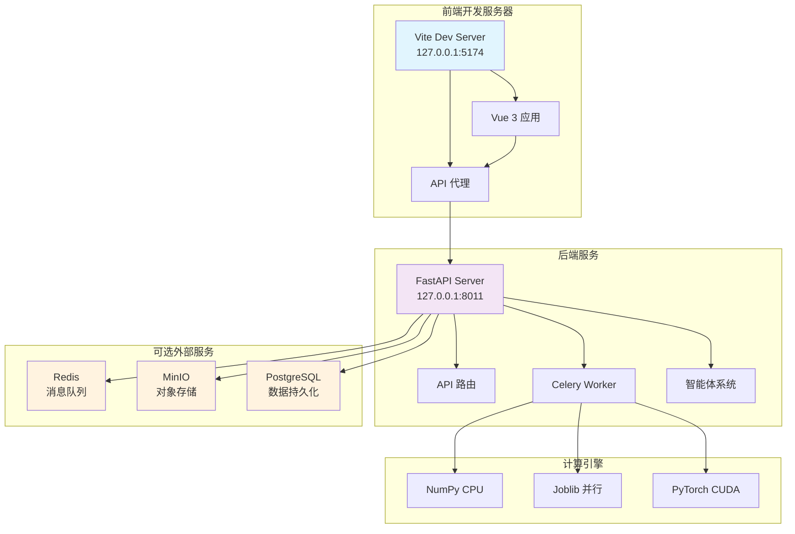
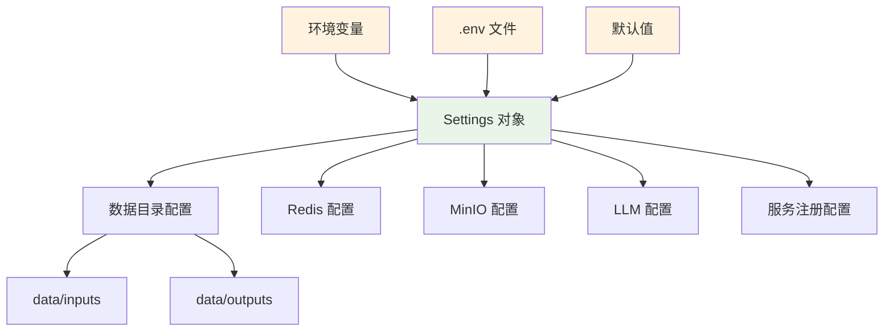

本页文档详细介绍如何在 Windows 系统上搭建植被指数智能分析平台的完整本地开发环境，包括后端 FastAPI 服务、前端 Vue 工作台以及必要的外部服务配置。通过本文档，您将能够从零开始运行完整的开发环境。

## 环境要求与版本矩阵

本地开发需要以下核心组件，版本兼容性是确保系统稳定运行的基础。项目采用前后端分离架构，后端基于 Python 3.11 生态，前端使用 Vue 3 + TypeScript 技术栈。

| 组件 | 版本要求 | 用途 | 安装方式 |
|------|----------|------|----------|
| Python | 3.11.x | 后端运行时 | Miniconda |
| Node.js | 18.x 或 20.x | 前端构建工具 | 官网安装 |
| CUDA Toolkit | 12.8 | GPU 加速计算 | NVIDIA 官网 |
| Miniconda | 最新版 | Python 环境管理 | 官网安装 |
| Git | 最新版 | 版本控制 | 官网安装 |

**关键版本约束**：项目 `pyproject.toml` 明确要求 Python >=3.11,<3.14，且 PyTorch 需要 CUDA 12.8 版本。如果您的 GPU 不支持 CUDA 12.8，需要调整 PyTorch 安装命令。

Sources: [pyproject.toml](backend/pyproject.toml#L1-L52), [README.md](README.md#L18-L30)

## 开发环境架构概览

本地开发采用前后端分离架构，后端提供 REST API 和异步任务处理，前端通过代理访问后端服务。下图展示了本地开发环境的整体架构：



**本地开发模式特点**：
- **前后端热重载**：Vite 和 uvicorn 都支持文件修改后自动刷新
- **最小依赖启动**：无需 Redis、MinIO 等外部服务即可运行基本功能
- **GPU 自动检测**：系统会自动检测 CUDA 可用性，无 GPU 时回退到 CPU 计算

## 后端环境搭建

后端使用 Miniconda 管理 Python 环境，项目已固化环境名称为 `giskeshe`。此环境包含所有依赖项，包括 PyTorch CUDA 支持。

### 1. 安装 Miniconda

从 Miniconda 官网下载 Windows 64-bit 安装包，安装时勾选"Add to PATH"选项。安装完成后，打开 PowerShell 验证：

```powershell
conda --version
```

### 2. 创建并激活 Conda 环境

首次搭建环境时执行以下命令：

```powershell
cd D:\Users\24658\Desktop\软件工程\实习\backend
D:\miniconda\Scripts\conda.exe create -n giskeshe python=3.11 -y
D:\miniconda\Scripts\conda.exe run -n giskeshe python -m pip install -e ".[dev]"
D:\miniconda\Scripts\conda.exe run -n giskeshe python -m pip install torch torchvision torchaudio --index-url https://download.pytorch.org/whl/cu128
```

**命令说明**：
- `create -n giskeshe python=3.11 -y`：创建名为 `giskeshe` 的 Python 3.11 环境
- `pip install -e ".[dev]"`：以开发模式安装项目，包含测试依赖
- `torch...cu128`：安装支持 CUDA 12.8 的 PyTorch 版本

### 3. 验证环境配置

```powershell
D:\miniconda\envs\giskeshe\python.exe -c "import torch; print(f'CUDA: {torch.cuda.is_available()}, Version: {torch.version.cuda}')"
```

预期输出应显示 `CUDA: True` 和 CUDA 版本信息。如果显示 `CUDA: False`，请检查 NVIDIA 驱动和 CUDA Toolkit 安装。

Sources: [README.md](README.md#L18-L30), [pyproject.toml](backend/pyproject.toml#L1-L52)

## 前端环境搭建

前端使用 Vue 3 + TypeScript + Vite 构建，依赖 Node.js 环境。

### 1. 安装 Node.js

从 Node.js 官网下载 LTS 版本（推荐 18.x 或 20.x），安装时勾选"Add to PATH"。安装完成后验证：

```powershell
node --version
npm --version
```

### 2. 安装前端依赖

```powershell
cd D:\Users\24658\Desktop\软件工程\实习\frontend
npm install
```

npm 会根据 `package.json` 自动安装所有依赖项，包括 Vue 3、MapLibre、ECharts 等核心库和 TypeScript、Vite 等开发工具。

### 3. 前端配置说明

前端配置主要集中在两个文件：

| 配置文件 | 作用 | 关键配置 |
|----------|------|----------|
| `vite.config.js` | 开发服务器和构建配置 | 端口、代理、路径别名 |
| `package.json` | 依赖管理和脚本定义 | 开发/构建/类型检查命令 |

**代理配置**：`vite.config.js` 中配置了 `/api`、`/jobs`、`/processes`、`/artifacts` 四个路径代理到后端 `http://127.0.0.1:8011`，确保前端开发时能正确访问后端 API。

Sources: [package.json](frontend/package.json#L1-L28), [vite.config.js](frontend/vite.config.js#L1-L28)

## 启动开发服务器

启动开发服务器需要两个独立的终端窗口，分别运行后端和前端服务。

### 1. 启动后端服务

打开新的 PowerShell 终端，执行：

```powershell
cd D:\Users\24658\Desktop\软件工程\实习\backend
D:\miniconda\envs\giskeshe\python.exe -m uvicorn app.main:app --host 127.0.0.1 --port 8011 --reload
```

**启动参数说明**：
- `--host 127.0.0.1`：仅监听本地回环地址，提高安全性
- `--port 8011`：指定服务端口，与前端代理配置一致
- `--reload`：启用热重载，代码修改后自动重启服务

启动成功后，终端会显示类似以下信息：
```
INFO:     Uvicorn running on http://127.0.0.1:8011 (Press CTRL+C to quit)
INFO:     Started reloader process [xxxxx]
INFO:     Started server process [xxxxx]
INFO:     Waiting for application startup.
INFO:     Application startup complete.
```

### 2. 启动前端服务

打开另一个 PowerShell 终端，执行：

```powershell
cd D:\Users\24658\Desktop\软件工程\实习\frontend
npm run dev
```

前端开发服务器启动后，终端会显示：
```
  VITE v7.x.x  ready in xxxx ms

  ➜  Local:   http://127.0.0.1:5174/
  ➜  Network: use --host to expose
```

### 3. 访问开发环境

在浏览器中打开 `http://127.0.0.1:5174`，即可访问植被指数智能分析工作台。首次加载可能需要几秒钟，Vue 应用会初始化并与后端建立连接。

**验证连接**：打开浏览器开发者工具（F12）的网络面板，刷新页面应能看到对 `/api/indices`、`/processes` 等接口的请求，并返回 200 状态码。

Sources: [README.md](README.md#L18-L45), [main.py](backend/app/main.py#L1-L62)

## 本地开发配置详解

本地开发环境使用最小化配置，大部分功能无需外部服务即可运行。配置系统基于 Pydantic Settings，支持环境变量和 `.env` 文件。

### 后端配置层次



### 本地开发默认配置

| 配置项 | 默认值 | 说明 | 是否需要外部服务 |
|--------|--------|------|----------------|
| `VIP_CELERY_ALWAYS_EAGER` | `true` | 同步执行任务，无需 Redis | 否 |
| `VIP_REDIS_URL` | `redis://localhost:6379/0` | Redis 连接地址 | 是（可选） |
| `VIP_MINIO_ENABLED` | `false` | 禁用 MinIO 对象存储 | 否 |
| `VIP_DATABASE_URL` | `None` | 禁用 PostgreSQL | 否 |
| `VIP_OPENAI_API_KEY` | `None` | 禁用外部 LLM | 否 |

**本地开发模式特点**：
- **同步任务执行**：`celery_always_eager=true` 使任务在本地同步执行，无需 Redis 或 Celery Worker
- **文件系统存储**：禁用 MinIO 后，资产文件直接存储在 `data/` 目录
- **规则优先智能体**：无外部 LLM 时，智能体使用内置规则引擎
- **自动创建目录**：`data/inputs` 和 `data/outputs` 目录会自动创建

Sources: [settings.py](backend/app/settings.py#L1-L43), [conftest.py](backend/tests/conftest.py#L1-L45)

## 前端配置与主题系统

前端采用响应式设计，支持日间/夜间双主题，并提供可自定义的界面布局。

### 主题与布局配置

前端配置主要通过以下机制管理：

1. **主题偏好**：保存在浏览器 `localStorage` 中，包含主题模式、面板可见性等
2. **组件状态**：使用 Pinia 状态管理，维护资产、任务、结果等运行时状态
3. **响应式布局**：CSS Grid 和 Flexbox 结合，自动适应窗口大小和面板状态

### 前端启动脚本

| 脚本命令 | 作用 | 使用场景 |
|----------|------|----------|
| `npm run dev` | 启动开发服务器 | 日常开发调试 |
| `npm run build` | 生产环境构建 | 部署前验证 |
| `npm run typecheck` | TypeScript 类型检查 | 代码质量保证 |
| `npm run preview` | 预览构建结果 | 生产环境本地测试 |

**开发服务器特性**：
- 热模块替换（HMR）：修改 Vue 组件后立即更新，无需刷新页面
- 源码映射：便于调试 TypeScript 源码
- 代理转发：自动将 API 请求转发到后端

Sources: [package.json](frontend/package.json#L1-L28), [App.vue](frontend/src/App.vue#L1-L280)

## 测试与质量验证

项目提供完整的测试套件，确保代码质量和功能正确性。

### 后端测试运行

```powershell
cd D:\Users\24658\Desktop\软件工程\实习\backend
D:\miniconda\envs\giskeshe\python.exe -m pytest
```

**测试套件说明**：
- `test_indices.py`：验证 35 种植被指数的公式正确性
- `test_raster_pipeline.py`：测试分块读写和内存安全
- `test_agent.py`：验证智能体意图识别和方案生成
- `test_api.py`：测试 API 端点和 OGC 兼容性
- `test_advanced_analysis.py`：验证高级分析功能

### 代码质量检查

```powershell
# 后端代码检查
D:\miniconda\envs\giskeshe\python.exe -m ruff check .

# 前端类型检查
cd D:\Users\24658\Desktop\软件工程\实习\frontend
npm run typecheck
```

### 基准测试

```powershell
cd D:\Users\24658\Desktop\软件工程\实习\backend
D:\miniconda\envs\giskeshe\python.exe scripts/benchmark.py --size 2048 --repeats 3
```

基准测试会评估不同计算引擎（NumPy、Joblib、PyTorch）在不同影像尺寸下的性能表现，结果用于优化引擎选择策略。

Sources: [conftest.py](backend/tests/conftest.py#L1-L45), [benchmark.py](backend/scripts/benchmark.py)

## 常见问题排查

### 1. Python 环境问题

**问题**：`conda` 命令未找到
**解决**：确保 Miniconda 已添加到 PATH，或使用完整路径 `D:\miniconda\Scripts\conda.exe`

**问题**：PyTorch CUDA 不可用
**解决**：检查 NVIDIA 驱动版本，确保支持 CUDA 12.8；重新安装 PyTorch：

```powershell
D:\miniconda\envs\giskeshe\python.exe -m pip install torch torchvision torchaudio --index-url https://download.pytorch.org/whl/cu128
```

### 2. 前端依赖问题

**问题**：`npm install` 失败
**解决**：清除缓存重试：

```powershell
npm cache clean --force
npm install
```

**问题**：TypeScript 类型错误
**解决**：运行类型检查并修复错误：

```powershell
npm run typecheck
```

### 3. 服务连接问题

**问题**：前端无法访问后端 API
**解决**：
1. 确认后端服务正在运行（检查终端输出）
2. 检查端口是否被占用：`netstat -ano | findstr :8011`
3. 验证代理配置：检查 `vite.config.js` 中的 `apiTarget` 值

**问题**：后端启动时数据库连接错误
**解决**：本地开发默认不连接数据库，检查 `.env` 文件中是否设置了 `VIP_DATABASE_URL`

### 4. 性能与内存问题

**问题**：处理大型 GeoTIFF 时内存不足
**解决**：系统已内置分块处理机制，确保使用最新版本；检查 `data_dir` 是否有足够磁盘空间

**问题**：GPU 内存不足
**解决**：系统会自动回退到 CPU 计算；可设置环境变量限制 GPU 内存使用：

```powershell
$env:CUDA_VISIBLE_DEVICES="0"
$env:PYTORCH_CUDA_ALLOC_CONF="max_split_size_mb:512"
```

## 开发工作流程建议

### 推荐开发流程


### 调试技巧

1. **后端调试**：在代码中添加 `breakpoint()`，uvicorn 会自动进入调试模式
2. **前端调试**：使用 Vue Devtools 浏览器扩展，检查组件状态和事件
3. **网络调试**：浏览器开发者工具 Network 面板监控 API 请求和响应
4. **日志查看**：后端日志输出到终端，包含请求处理、错误堆栈等信息

### 代码组织最佳实践

- **后端**：业务逻辑在 `services/` 目录，API 路由在 `api/routes.py`
- **前端**：组件在 `components/`，状态管理在 `stores/`，API 调用在 `composables/`
- **测试**：每个模块对应测试文件，使用 pytest 夹具隔离外部依赖

## 下一步阅读建议

成功搭建本地开发环境后，建议按以下顺序深入了解系统：

1. **[项目概述](1-xiang-mu-gai-shu)**：了解平台的整体功能和架构设计
2. **[Docker Compose 容器化部署](3-docker-compose-rong-qi-hua-bu-shu)**：学习生产环境部署方案
3. **[平台整体架构与技术栈](4-ping-tai-zheng-ti-jia-gou-yu-ji-zhu-zhan)**：深入理解技术选型和架构决策
4. **[后端模块职责与目录组织](5-hou-duan-mo-kuai-zhi-ze-yu-mu-lu-zu-zhi)**：掌握后端代码组织和模块职责
5. **[前端组件与状态管理](6-qian-duan-zu-jian-yu-zhuang-tai-guan-li)**：了解前端组件设计和状态管理

通过系统性的学习，您将能够高效地参与平台开发、扩展新功能或解决复杂的技术问题。