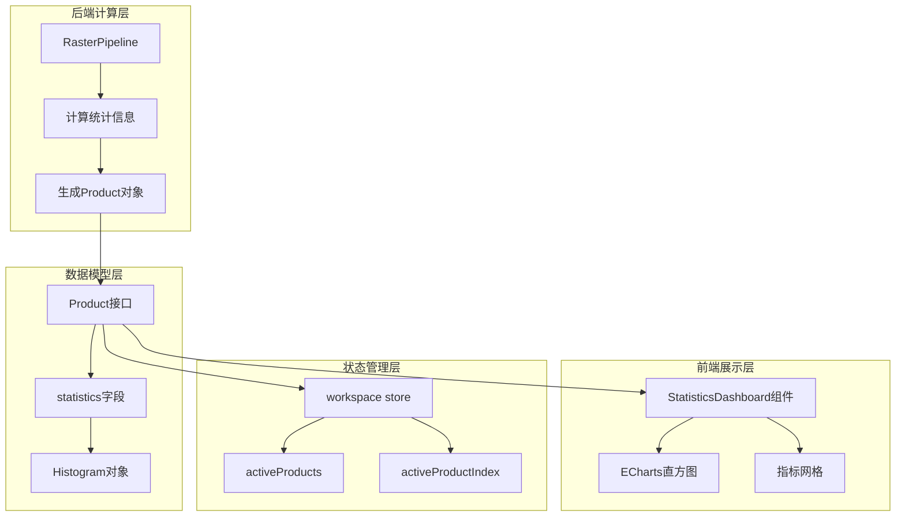
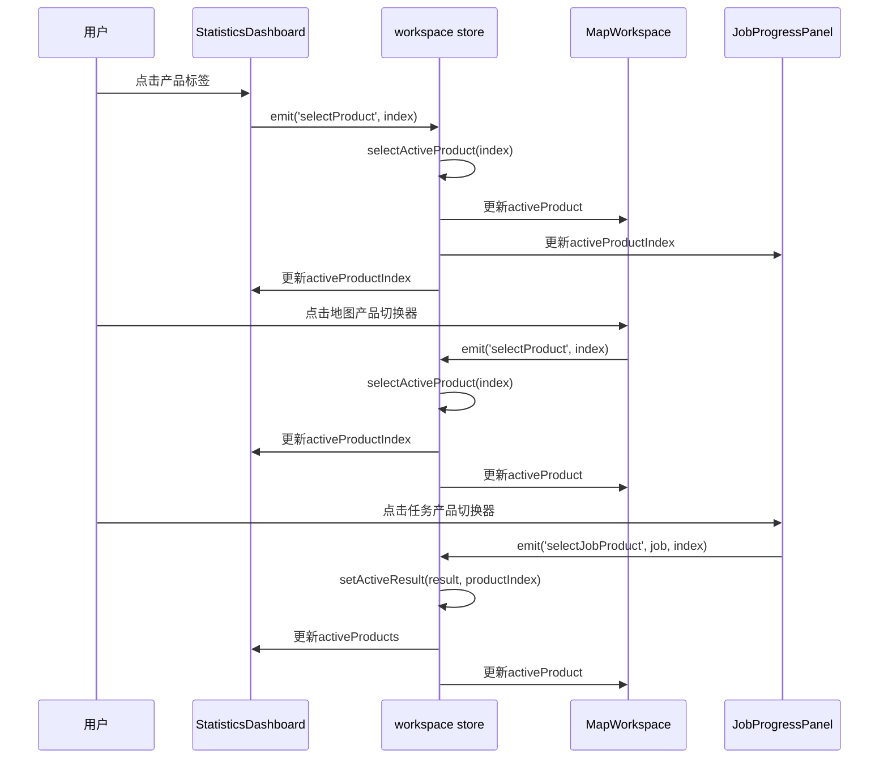

本文档详细说明了植被指数智能分析平台中统计图表的显示机制与多指数结果切换的实现原理。该功能允许用户在同一任务计算多个植被指数后，通过直观的界面切换查看不同指数的统计信息和地图可视化，实现高效的多维度分析。

## 统计图表架构与数据模型

统计图表功能基于ECharts实现，核心组件为`StatisticsDashboard.vue`，负责展示像素分布直方图和关键统计指标。图表数据来源于后端`RasterPipeline`的计算结果，通过`Product`接口传递到前端。

`Product`接口定义了每个植被指数产品的完整数据结构，包含路径信息、预览图、边界范围以及核心的统计数据。统计数据包含有效像元数、最小值、最大值、均值、中位数、标准差和32个区间的直方图分布。

`StatisticsDashboard`组件通过props接收`products`数组和当前活动索引`activeIndex`，并计算当前活动产品及其统计信息。组件使用`shallowRef`管理ECharts实例，并通过`ResizeObserver`和`MutationObserver`实现图表的自适应和主题响应。

Sources: [frontend/src/types/platform.ts](frontend/src/types/platform.ts#L194-L212), [frontend/src/components/StatisticsDashboard.vue](frontend/src/components/StatisticsDashboard.vue#L7-L103), [backend/app/services/raster_pipeline.py](backend/app/services/raster_pipeline.py#L57-L83)

## 多指数结果切换机制

多指数结果切换通过三个层面的交互实现：统计面板、地图面板和任务面板，三者共享同一状态源，确保切换的一致性。

**统计面板切换**：当任务包含多个指数产品时，`StatisticsDashboard`组件会渲染产品标签切换器。标签显示指数缩写（如NDVI、EVI），点击标签通过`emit('selectProduct', index)`事件通知父组件更新活动索引。

**地图面板切换**：`MapWorkspace`组件同样包含产品切换器，位于图层控制面板中。当地图检测到多个产品时，会显示"结果指数"切换组，与统计面板共享相同的切换逻辑。

**任务面板切换**：`JobProgressPanel`组件为每个已完成的任务显示产品切换器，允许用户在不同任务的结果产品之间切换，甚至可以切换到历史任务的特定产品。

状态管理的核心在`workspace.ts`中的`selectActiveProduct`方法，该方法确保索引值在有效范围内，并触发所有依赖组件的更新。`activeResult`存储当前结果，包含多个产品数组，而`activeProductIndex`记录当前选中的产品位置。

Sources: [frontend/src/components/StatisticsDashboard.vue](frontend/src/components/StatisticsDashboard.vue#L111-L121), [frontend/src/components/MapWorkspace.vue](frontend/src/components/MapWorkspace.vue#L786-L798), [frontend/src/components/JobProgressPanel.vue](frontend/src/components/JobProgressPanel.vue#L165-L188), [frontend/src/stores/workspace.ts](frontend/src/stores/workspace.ts#L188-L192)

## 统计计算与后端实现

统计信息的计算在`RasterPipeline`的`_statistics`函数中实现，该函数接收numpy数组和nodata值，返回完整的统计指标。计算过程首先过滤无效值（NaN和nodata），然后使用numpy的统计函数计算基本指标，最后使用`np.histogram`生成32个区间的直方图分布。

直方图计算采用固定32个区间的设计，在保证可视化精度的同时控制数据量。直方图的边界由数据范围自动确定，确保覆盖所有有效值。这种设计使得前端ECharts组件能够高效渲染，无需复杂的分箱算法。

统计信息的计算与产品生成在`RasterPipeline.run`方法中完成。对于每个指数定义，系统会：1）读取计算结果数组；2）调用`_statistics`函数计算统计信息；3）将统计信息嵌入到`Product`对象中。这种设计确保了统计信息与产品数据的原子性，避免状态不一致。

Sources: [backend/app/services/raster_pipeline.py](backend/app/services/raster_pipeline.py#L57-L83), [backend/app/services/raster_pipeline.py](backend/app/services/raster_pipeline.py#L261-L273)

## 前端图表渲染与主题适配

`StatisticsDashboard`组件使用ECharts的模块化导入方式，只引入必要的组件（柱状图、网格、提示框和Canvas渲染器），优化打包体积。图表配置包括：

1. **网格布局**：紧凑的边距设计，包含标签区域
2. **X轴**：显示直方图边界值，间隔4个标签避免重叠
3. **Y轴**：显示像素计数，分割线使用主题边框颜色
4. **系列样式**：线性渐变填充，从强调色基色到强调色

组件通过`MutationObserver`监听`document.documentElement`的`data-theme`属性变化，实现深色/浅色模式的实时切换。当主题变化时，`renderChart`函数会重新计算颜色值并更新图表配置。

响应式设计方面，组件使用`ResizeObserver`监听容器尺寸变化，自动调用`chart.resize()`确保图表始终适配容器。组件还实现了完整的生命周期管理，在组件卸载时清理观察者和销毁图表实例，避免内存泄漏。

Sources: [frontend/src/components/StatisticsDashboard.vue](frontend/src/components/StatisticsDashboard.vue#L8-L22), [frontend/src/components/StatisticsDashboard.vue](frontend/src/components/StatisticsDashboard.vue#L41-L95), [frontend/src/components/StatisticsDashboard.vue](frontend/src/components/StatisticsDashboard.vue#L98-L102)

## 产品切换与地图同步

地图组件`MapWorkspace`通过props接收`product`和`products`数组，实现结果图层的动态切换。当地图检测到多个产品时，会显示产品切换器；当只有一个产品时，切换器隐藏以简化界面。

地图图层同步的核心是`syncMapLayers`函数，该函数根据当前产品状态更新MapLibre图层源。当产品切换时，系统会：
1. 更新结果图层的瓦片源URL
2. 更新图例信息（最小值、中心值、最大值）
3. 调整图层可见性（根据对比模式）
4. 更新状态栏文本

地图支持三种对比模式："计算前"只显示源影像，"计算后"只显示结果，"对比"同时显示两者。产品切换时，对比模式会自动调整以确保最佳可视化效果。

结果图例`resultLegend`计算逻辑考虑了产品统计信息：如果有统计数据，使用实际的最小值、均值和最大值；如果没有统计数据，使用默认范围-1到1。这种设计确保了即使在统计信息缺失的情况下，图例仍然能够提供有意义的参考。

Sources: [frontend/src/components/MapWorkspace.vue](frontend/src/components/MapWorkspace.vue#L160-L174), [frontend/src/components/MapWorkspace.vue](frontend/src/components/MapWorkspace.vue#L786-L798)

## 任务结果管理与历史切换

`JobProgressPanel`组件不仅显示任务进度，还提供任务结果管理功能。对于已完成的任务，组件会显示产品切换器，允许用户在不同任务的结果产品之间切换。

产品切换器的设计考虑了历史任务的场景：用户可能需要比较不同任务的计算结果，或者查看同一任务中不同指数的结果。每个产品按钮显示指数缩写，当前活动产品会有视觉高亮。

组件通过`isProductActive`函数判断产品是否活动，该函数比较当前任务的产品路径与全局活动产品路径。这种设计确保了即使用户切换到其他任务的结果，当前活动产品仍然保持正确的视觉状态。

产品下载功能通过`productDownloadUrl`函数生成下载链接，该函数优先使用对象存储键，回退到本地文件路径。下载链接使用`<a>`标签的`download`属性，确保浏览器直接下载而不是尝试打开文件。

Sources: [frontend/src/components/JobProgressPanel.vue](frontend/src/components/JobProgressPanel.vue#L75-L79), [frontend/src/components/JobProgressPanel.vue](frontend/src/components/JobProgressPanel.vue#L82-L94), [frontend/src/components/JobProgressPanel.vue](frontend/src/components/JobProgressPanel.vue#L165-L188)

## 数据流与状态同步

整个多指数结果切换系统的数据流遵循单向数据流原则：

1. **后端计算**：`RasterPipeline`生成包含统计信息的产品数组
2. **API传输**：结果通过REST API传递到前端
3. **状态存储**：`workspace store`管理活动结果、产品索引和产品数组
4. **组件渲染**：各组件通过props接收数据，通过events通知状态变化
5. **状态更新**：store更新后，所有订阅组件自动重新渲染

这种设计确保了状态的一致性：无论用户从哪个面板切换产品，所有面板都会同步更新。同时，单向数据流使得状态变化可预测，便于调试和维护。

性能优化方面，组件使用`shallowRef`和`computed`避免不必要的重新渲染。`StatisticsDashboard`只在活动产品变化时重新渲染图表，`MapWorkspace`只在产品键变化时更新图层源。这种细粒度的更新策略确保了即使在处理大型多指数结果时，界面仍然保持流畅响应。

Sources: [frontend/src/stores/workspace.ts](frontend/src/stores/workspace.ts#L178-L192), [frontend/src/App.vue](frontend/src/App.vue#L139-L143)

## 最佳实践与扩展建议

基于当前实现，以下是一些最佳实践和扩展建议：

**配置优化**：
- 对于大型数据集，考虑调整直方图区间数量以平衡精度和性能
- 在统计信息计算中添加百分位数统计，支持更高级的分析需求
- 为图表添加导出功能，支持PNG、SVG格式

**用户体验**：
- 添加键盘快捷键支持产品切换（如左右箭头）
- 实现产品切换动画，增强视觉连续性
- 添加产品比较模式，支持并排显示两个指数的统计信息

**性能优化**：
- 对于超大型数据集，考虑实现统计信息的懒加载
- 使用Web Workers在后台线程计算统计信息，避免阻塞主线程
- 实现统计信息的缓存机制，避免重复计算

**功能扩展**：
- 添加统计信息的时间序列比较，支持多时相分析
- 实现自定义统计区间和分箱算法
- 集成机器学习算法，自动检测异常统计模式

这些改进将进一步提升平台在植被指数分析领域的专业性和易用性，满足更复杂的遥感分析需求。