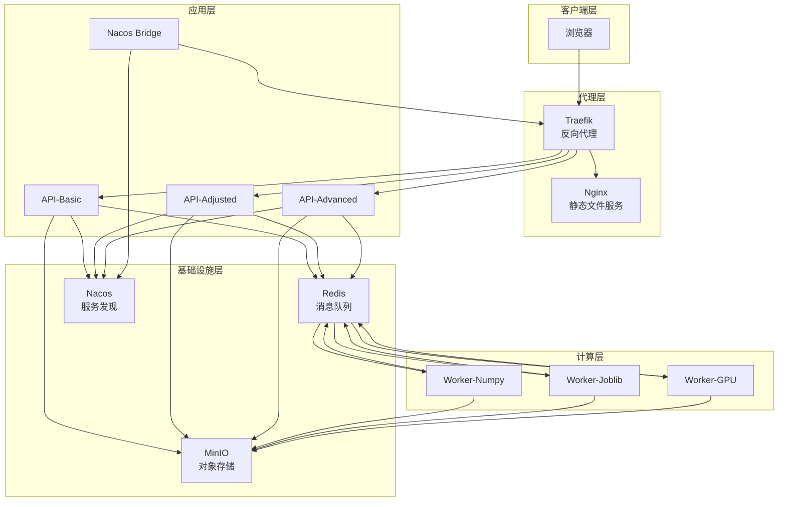
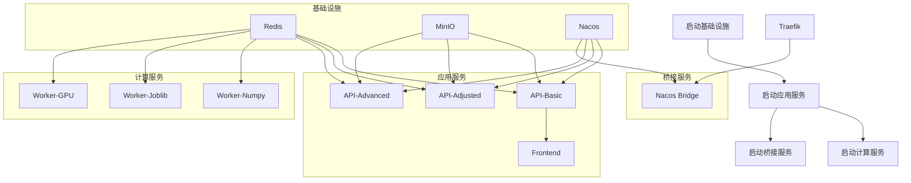
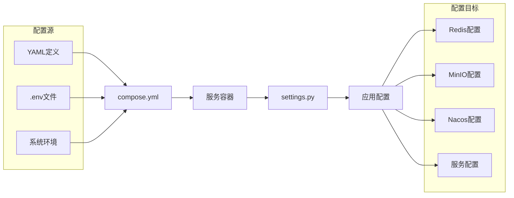
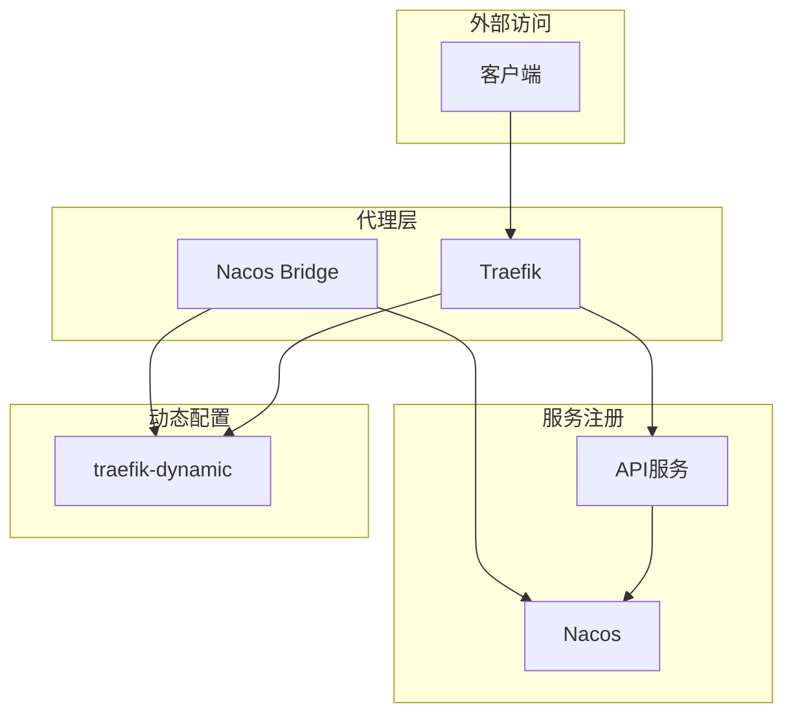

本页面深入解析植被指数智能分析平台的容器化部署架构。通过 `compose.yml` 文件定义的多服务编排体系，平台实现了高可用、可扩展且易于维护的部署方案。我们将从服务拓扑、依赖关系、配置策略三个维度展开分析，帮助开发者理解平台的生产级部署设计。

## 服务拓扑与职责划分

平台采用微服务架构，通过 Docker Compose 编排 12 个容器服务，形成完整的分布式计算体系。以下架构图展示了核心服务间的交互关系：



**架构设计要点**：
- **分层解耦**：代理层、应用层、计算层、基础设施层职责明确分离
- **服务发现**：Nacos Bridge 将服务注册信息同步至 Traefik，实现动态路由
- **负载均衡**：同一类型的服务（如 3 个 API 服务）通过 Traefik 实现负载均衡
- **异步处理**：工作者服务通过 Redis 消息队列接收计算任务

Sources: [compose.yml](compose.yml#L1-L192)

## 服务定义与配置模式

Docker Compose 文件使用 YAML 锚点（Anchors）和合并键（Merge Keys）实现配置复用。以下表格展示了核心服务的配置模式：

| 服务类型 | 服务实例 | 镜像/构建 | 端口映射 | 依赖服务 | 特殊配置 |
|---------|---------|----------|----------|----------|----------|
| **代理服务** | traefik | traefik:v3.4 | 8080:80<br/>8081:8080 | - | 配置文件挂载 |
| **前端服务** | frontend | ./frontend | - | api-basic | Traefik标签 |
| **API服务** | api-basic | ./backend | - | redis<br/>minio<br/>nacos | 环境变量锚点 |
| **工作者服务** | worker-numpy | ./backend | - | redis | 队列：normal,low,batch<br/>并发数：1 |
| **工作者服务** | worker-joblib | ./backend | - | redis | 队列：urgent,high,normal<br/>并发数：2 |
| **工作者服务** | worker-gpu | ./backend (GPU) | - | redis | NVIDIA GPU<br/>并发数：1 |
| **基础设施** | redis | redis:7.4-alpine | - | - | 健康检查 |
| **基础设施** | minio | minio/minio | 9000:9000<br/>9001:9001 | - | 健康检查 |
| **基础设施** | nacos | nacos/nacos-server | 8848:8848<br/>9848:9848 | - | 单机模式 |
| **桥接服务** | nacos-bridge | ./backend | - | nacos<br/>traefik | 同步服务发现 |

**配置复用机制**：
```yaml
x-api-environment: &api-environment  # 定义环境变量锚点
x-api-service: &api-service          # 定义服务配置锚点

services:
  api-basic:
    <<: *api-service                 # 合并服务配置
    environment:
      <<: *api-environment           # 合并环境变量
```

Sources: [compose.yml](compose.yml#L1-L30)

## 依赖管理与健康检查

服务依赖通过 `depends_on` 和 `condition` 条件实现有序启动。以下流程图展示了服务启动顺序：



**健康检查策略**：

| 服务 | 检查命令 | 检查间隔 | 超时时间 | 重试次数 |
|------|----------|----------|----------|----------|
| Redis | `redis-cli ping` | 5s | 3s | 10 |
| MinIO | `curl -f http://localhost:9000/minio/health/live` | 10s | 5s | 10 |
| API服务 | `python -c "import urllib.request; urllib.request.urlopen('http://localhost:8000/health')"` | 15s | 5s | 5 |

**依赖条件类型**：
- `service_started`：服务已启动（不保证健康）
- `service_healthy`：服务健康检查通过（确保服务可用）

Sources: [compose.yml](compose.yml#L31-L50)

## 环境变量配置体系

平台通过环境变量实现服务配置，采用 `VIP_` 前缀避免命名冲突。以下表格展示关键环境变量：

| 环境变量 | 默认值 | 服务类型 | 说明 |
|----------|--------|----------|------|
| `VIP_REDIS_URL` | `redis://redis:6379/0` | API、Worker | Redis连接地址 |
| `VIP_CELERY_ALWAYS_EAGER` | `false` | API、Worker | 开发模式同步执行 |
| `VIP_MINIO_ENDPOINT` | `minio:9000` | API、Worker | MinIO服务端点 |
| `VIP_MINIO_ACCESS_KEY` | `vegetation` | API、Worker | MinIO访问密钥 |
| `VIP_MINIO_SECRET_KEY` | `vegetation-secret` | API、Worker | MinIO秘密密钥 |
| `VIP_MINIO_ENABLED` | `true` | API、Worker | 启用MinIO存储 |
| `VIP_NACOS_URL` | `http://nacos:8848` | API、Nacos Bridge | Nacos服务端点 |
| `VIP_SERVICE_NAME` | - | API | 服务注册名称 |
| `VIP_SERVICE_HOST` | - | API | 服务主机名 |
| `NVIDIA_VISIBLE_DEVICES` | `all` | Worker-GPU | GPU设备访问 |

**环境变量注入流程**：


Sources: [compose.yml](compose.yml#L5-L20), [backend/app/settings.py](backend/app/settings.py#L1-L44)

## 数据持久化与卷管理

平台使用 Docker 卷实现数据持久化，避免容器重启导致数据丢失。以下表格展示卷配置：

| 卷名称 | 挂载路径 | 使用服务 | 用途 |
|--------|----------|----------|------|
| `vegetation-data` | `/app/data` | API、Worker | 临时数据处理 |
| `redis-data` | `/data` | Redis | Redis数据持久化 |
| `minio-data` | `/data` | MinIO | 对象存储数据 |
| `nacos-data` | `/home/nacos/data` | Nacos | 服务注册数据 |
| `traefik-dynamic` | `/dynamic` | Traefik、Nacos Bridge | 动态配置文件 |

**卷挂载策略**：
- **命名卷**：用于需要持久化的数据（数据库、对象存储）
- **绑定挂载**：用于配置文件（只读挂载）
- **匿名卷**：用于临时数据处理

Sources: [compose.yml](compose.yml#L170-L192)

## 资源限制与性能优化

特别是对于 GPU 工作者服务，平台实现了精确的资源控制：

```yaml
worker-gpu:
  deploy:
    resources:
      reservations:
        devices:
          - driver: nvidia
            count: 1
            capabilities: [gpu]
```

**资源配置策略**：
- **CPU 工作者**：通过 `--concurrency` 参数控制并发数
- **GPU 工作者**：通过 Docker 资源预留确保 GPU 可用性
- **内存限制**：未显式设置，依赖容器运行时默认限制

**并发配置**：
| 工作者类型 | 并发数 | 队列优先级 | 适用场景 |
|------------|--------|------------|----------|
| Worker-Numpy | 1 | normal,low,batch | CPU密集型计算 |
| Worker-Joblib | 2 | urgent,high,normal | 通用计算任务 |
| Worker-GPU | 1 | urgent,high,normal | GPU加速计算 |

Sources: [compose.yml](compose.yml#L110-L130)

## 网络架构与服务发现

平台通过 Traefik 和 Nacos 实现动态服务发现和负载均衡：



**服务发现流程**：
1. API服务启动时向Nacos注册
2. Nacos Bridge定期查询Nacos中的健康实例
3. Nacos Bridge生成Traefik动态配置文件
4. Traefik加载动态配置，更新路由规则
5. 客户端请求通过Traefik路由到健康的服务实例

**路由规则**：
- 前端服务：`PathPrefix(/)` 优先级1
- API服务：`PathPrefix(/api)` 或 `PathPrefix(/jobs)` 等，优先级100

Sources: [compose.yml](compose.yml#L135-L150), [backend/app/nacos_bridge.py](backend/app/nacos_bridge.py#L1-L91)

## 开发与生产环境差异

平台通过环境变量和配置文件支持开发与生产环境的切换：

| 配置项 | 开发环境 | 生产环境 | 说明 |
|--------|----------|----------|------|
| `VIP_CELERY_ALWAYS_EAGER` | `true` | `false` | 开发模式同步执行 |
| `VIP_MINIO_ENABLED` | `false` | `true` | 开发模式可不用MinIO |
| GPU工作者 | 可注释掉 | 必须运行 | 开发环境可能没有GPU |
| 日志级别 | DEBUG | INFO | 开发环境更详细日志 |

**环境切换方法**：
1. 修改 `compose.yml` 中的环境变量
2. 使用 `.env` 文件覆盖默认值
3. 通过命令行参数传递环境变量

Sources: [backend/app/settings.py](backend/app/settings.py#L20-L40)

## 部署命令与运维操作

**标准部署命令**：
```powershell
# 构建并启动所有服务
docker compose -f compose.yml up --build

# 后台运行
docker compose -f compose.yml up -d

# 查看服务状态
docker compose ps

# 查看日志
docker compose logs -f [service_name]

# 停止并删除容器
docker compose down

# 清理所有数据（谨慎使用）
docker compose down -v
```

**服务访问地址**：
- 平台入口：`http://localhost:8080`
- Traefik面板：`http://localhost:8081`
- MinIO控制台：`http://localhost:9001`（用户名：vegetation，密码：vegetation-secret）
- Nacos控制台：`http://localhost:8848/nacos`

**故障排查**：
1. 检查服务健康状态：`docker compose ps`
2. 查看服务日志：`docker compose logs [service_name]`
3. 验证网络连接：`docker network inspect [network_name]`
4. 检查资源使用：`docker stats`

Sources: [README.md](README.md#L60-L80)

## 下一步阅读

完成对 Docker Compose 服务编排的理解后，建议继续阅读：

1. **[Traefik 反向代理与 Nacos 服务发现桥接](24-traefik-fan-xiang-dai-li-yu-nacos-fu-wu-fa-xian-qiao-jie)** - 深入了解反向代理和服务发现机制
2. **[MinIO 对象存储与 Redis 消息队列](25-minio-dui-xiang-cun-chu-yu-redis-xiao-xi-dui-lie)** - 理解基础设施服务的详细配置
3. **[后端模块职责与目录组织](5-hou-duan-mo-kuai-zhi-ze-yu-mu-lu-zu-zhi)** - 了解后端服务的内部架构
4. **[前端组件与状态管理](6-qian-duan-zu-jian-yu-zhuang-tai-guan-li)** - 理解前端服务的实现细节

这些文档将帮助您全面掌握平台的部署、运维和开发架构，为后续的定制开发和故障排查奠定基础。