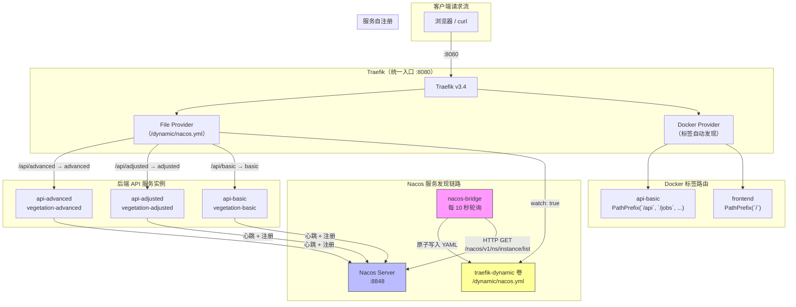
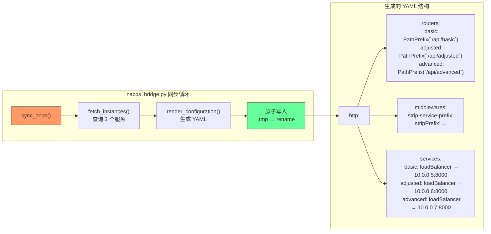

本页深入剖析平台**基础设施层的流量入口**——Traefik 如何作为统一反向代理，Nacos 如何实现服务注册与发现，以及二者之间通过自研桥接脚本实现的动态路由同步机制。理解这一层是排查请求路由异常、新增后端服务实例、以及进行水平扩展的前置知识。

## 架构全景：为什么需要两个组件做桥接

平台采用了一种**混合服务发现**策略：Traefik 原生支持 Docker 标签式自动发现，但后端微服务实例需要在运行时动态增减（如扩容 `api-adjusted`、`api-advanced`），仅靠 Docker 静态标签无法感知实例健康状态的变化。因此引入 Nacos 作为**运行时服务注册中心**，由一个独立的桥接容器定时拉取 Nacos 中的健康实例列表，翻译为 Traefik File Provider 所需的 YAML 路由配置，通过共享卷原子写入——Traefik 监听该目录的文件变更即可热加载新路由，无需重启。

上图的核心信息是：**Traefik 同时从两条路径获得路由规则**——Docker Provider 通过容器标签发现 `frontend` 和 `api-basic`；File Provider 通过 `nacos-bridge` 写入的 YAML 发现所有已注册的 Nacos 服务实例。两条路径互不冲突，Docker 标签路由覆盖的是主入口路径（优先级 100），Nacos 桥接路由覆盖的是按服务名前缀的细分路径。

Sources: [compose.yml](compose.yml#L32-L42), [compose.yml](compose.yml#L130-L142), [infra/traefik/traefik.yml](infra/traefik/traefik.yml#L1-L19)

## Traefik 配置解析

Traefik 以 `traefik:v3.4` 镜像运行，通过挂载配置文件 `/etc/traefik/traefik.yml` 启动，暴露两个端口：`8080` 映射到容器的 `80`（HTTP 入口），`8081` 映射到 `8080`（Dashboard 管理界面）。

**静态配置**定义了三个核心段：

| 配置段 | 作用 | 关键参数 |
|---|---|---|
| `entryPoints.web` | 定义入口监听端口 | `address: ":80"` |
| `providers.docker` | 自动发现 Docker 容器 | `exposedByDefault: false`（需显式标签启用） |
| `providers.file` | 加载文件路由配置 | `directory: /dynamic`, `watch: true`（热加载） |
| `api.dashboard` | 启用管理面板 | `insecure: true`（开发环境免认证） |

`exposedByDefault: false` 是一个**安全关键配置**——它意味着只有显式添加了 `traefik.enable=true` 标签的容器才会被 Traefik 发现。平台中仅 `frontend` 和 `api-basic` 添加了该标签，其他服务（如 Redis、MinIO、Nacos）不会被意外暴露到外部。

Docker Provider 和 File Provider 的**优先级关系**：当两条规则匹配同一路径前缀时，Traefik 按 `priority` 字段决定。`api-basic` 的 Docker 标签设置了 `priority: 100`，确保主平台 API 路径（`/api`、`/jobs`、`/processes` 等）始终由 `api-basic` 主实例处理，而 Nacos 桥接生成的 `/api/basic`、`/api/adjusted`、`/api/advanced` 前缀路由则用于精确的子服务分发。

Sources: [infra/traefik/traefik.yml](infra/traefik/traefik.yml#L1-L19), [compose.yml](compose.yml#L32-L42), [compose.yml](compose.yml#L51-L67)

## 后端服务自注册机制（Nacos Registration）

每个后端 API 服务实例在 FastAPI 生命周期的 `startup` 阶段，通过 `NacosRegistration` 类向 Nacos 注册自身。注册信息包含 **服务名**（由环境变量 `VIP_SERVICE_NAME` 决定）、**实例 IP**（通过 `socket.gethostbyname` 将 Docker 主机名解析为 IP）、**端口号**（默认 `8000`）以及健康标记。

注册完成后，服务以 **5 秒间隔**向 Nacos 发送心跳续约。Nacos 采用临时实例模式（`ephemeral: true`），如果心跳中断超过阈值，实例会被自动摘除——这正是桥接机制能感知实例上下线的关键。在 FastAPI 的 `shutdown` 阶段，服务主动向 Nacos 发送注销请求，实现优雅下线。

三个 API 服务实例通过环境变量区分身份：

| 容器名 | `VIP_SERVICE_NAME` | `VIP_SERVICE_HOST` | 路由前缀 |
|---|---|---|---|
| `api-basic` | `vegetation-basic` | `api-basic` | `/api/basic` |
| `api-adjusted` | `vegetation-adjusted` | `api-adjusted` | `/api/adjusted` |
| `api-advanced` | `vegetation-advanced` | `api-advanced` | `/api/advanced` |

值得注意的是，注册失败（如 Nacos 尚未启动）**不会阻断服务启动**——`lifespan` 中的 `try/except` 确保本地开发环境可以无 Nacos 运行。心跳失败时会自动尝试重新注册，具备一定的自愈能力。

Sources: [backend/app/services/nacos.py](backend/app/services/nacos.py#L21-L100), [backend/app/main.py](backend/app/main.py#L23-L34), [backend/app/settings.py](backend/app/settings.py#L30-L33), [compose.yml](compose.yml#L57-L81)

## Nacos Bridge：从服务发现到路由配置的翻译层

`nacos-bridge` 是整个桥接架构的核心，作为独立容器运行（命令 `python -m app.nacos_bridge`），每 **10 秒**执行一次同步循环。其工作流程分为三步：**查询实例 → 渲染配置 → 原子写入**。

### 查询实例（fetch_instances）

桥接脚本遍历预定义的 `SERVICES` 字典（三个服务名），向 Nacos 的 `/nacos/v1/ns/instance/list` 接口发送 GET 请求，参数 `healthyOnly=true` 确保只获取通过健康检查的实例。返回的实例列表被转换为 `http://{ip}:{port}` 格式的 URL 列表。如果查询超时或异常，该服务的实例列表会被设为空，触发回退逻辑。

### 渲染配置（render_configuration）

这是桥接脚本最关键的逻辑——将 Nacos 的服务发现数据结构翻译为 Traefik File Provider 的 YAML 格式。每个服务生成三个配置段：

**1. Routers（路由规则）**：为每个服务创建一个路由器，使用 `PathPrefix` 规则匹配 URL 前缀，并关联到对应的 service。同时绑定 `strip-service-prefix` 中间件。

**2. Middlewares（中间件）**：定义 `stripPrefix` 中间件，移除所有已注册的路径前缀（`/api/basic`、`/api/adjusted`、`/api/advanced`），确保后端服务收到的是干净的请求路径。

**3. Services（负载均衡）**：为每个服务定义 `loadBalancer.servers`，列出所有健康实例的 URL。如果 Nacos 返回空列表（无健康实例），则回退到 Docker DNS 名称（如 `http://api-basic:8000`），保证**至少有一个可用后端**。

Sources: [backend/app/nacos_bridge.py](backend/app/nacos_bridge.py#L1-L91)

### 原子写入与文件监听

配置写入采用了经典的 **temp 文件 + rename** 模式：先将内容写入 `nacos.yml.tmp`，再通过 `Path.replace` 原子替换 `nacos.yml`。这避免了 Traefik 在写入过程中读取到半截文件导致解析错误。Traefik 的 File Provider 配置了 `watch: true`，通过文件系统事件（inotify）感知变更并自动重载路由，整个过程**无需重启 Traefik 容器**。

`traefik-dynamic` 是一个 Docker named volume，在 `compose.yml` 中被 `traefik` 和 `nacos-bridge` 两个容器同时挂载——前者挂载到 `/dynamic`，后者也将 `/dynamic` 挂载为写入目标。这种**共享卷模式**是容器间传递文件的标准做法，避免了依赖网络文件系统。

Sources: [backend/app/nacos_bridge.py](backend/app/nacos_bridge.py#L72-L84), [compose.yml](compose.yml#L41-L42), [compose.yml](compose.yml#L141-L142)

## 前端 Nginx 的二次代理

一个容易忽略的细节是 `frontend` 容器内部的 Nginx 配置——它不仅服务静态文件，还将匹配 `/api`、`/jobs`、`/processes`、`/artifacts`、`/metrics` 的请求**反向代理回 Traefik**（`http://traefik:80`）。这形成了一个**请求环路**：浏览器 → Traefik → Nginx → Traefik → 后端 API。

这种设计的意图是：前端容器作为 Traefik 的第一个路由目标（`PathPrefix(/)` 优先级 1），由 Nginx 决定哪些请求是 API 请求（需要转发）、哪些是静态资源请求（直接返回）。这使得 SPA 的历史路由回退（`try_files $uri $uri/ /index.html`）和 API 代理可以在同一层面统一处理，避免 Traefik 直接处理复杂的前端路由逻辑。

Sources: [frontend/nginx.conf](frontend/nginx.conf#L1-L16), [compose.yml](compose.yml#L44-L55)

## 故障回退与容错机制

系统在多个层面设计了容错策略：

| 故障场景 | 回退行为 | 涉及组件 |
|---|---|---|
| Nacos 服务不可达 | 注册失败不阻断启动；心跳重试 | `nacos.py` |
| 某服务无健康实例 | 桥接回退到 Docker DNS 名称 `api-{name}:8000` | `nacos_bridge.py` L66-L68 |
| 桥接查询超时 | 该服务实例列表置空，触发上述回退 | `nacos_bridge.py` L78-L79 |
| 配置文件写入中断 | 使用 temp + rename 原子操作 | `nacos_bridge.py` L83-L84 |
| 实例心跳丢失 | Nacos 将实例标记为不健康，桥接下次同步自动摘除 | Nacos 内置机制 |

Docker DNS 名称回退是最后一道防线——即使 Nacos 完全宕机，只要 `compose.yml` 中定义的服务容器在运行，Traefik 仍然可以通过 Docker 内部 DNS 解析到对应容器，只是**失去了负载均衡和健康检查能力**（退化为单点路由）。

Sources: [backend/app/nacos_bridge.py](backend/app/nacos_bridge.py#L66-L68), [backend/app/services/nacos.py](backend/app/services/nacos.py#L27-L32)

## 服务路由映射总览

下表汇总了平台中所有通过 Traefik 可达的路由，以及它们的发现方式：

| 路径前缀 | 后端服务 | 发现方式 | 优先级 | 中间件 |
|---|---|---|---|---|
| `/` (通配) | frontend (Nginx) | Docker 标签 | 1 | 无 |
| `/api`, `/jobs`, `/processes`, `/artifacts`, `/metrics` | api-basic | Docker 标签 | 100 | 无 |
| `/api/basic` | vegetation-basic 实例组 | Nacos 桥接 | 默认 | stripPrefix |
| `/api/adjusted` | vegetation-adjusted 实例组 | Nacos 桥接 | 默认 | stripPrefix |
| `/api/advanced` | vegetation-advanced 实例组 | Nacos 桥接 | 默认 | stripPrefix |

Docker 标签路由的 `priority: 100` 确保 `/api` 前缀优先匹配到 `api-basic`，而 Nacos 桥接路由的 `/api/basic`、`/api/adjusted`、`/api/advanced` 更具体的前缀则用于精确分发到对应的服务实例组。`stripPrefix` 中间件会移除路径前缀后再转发，后端服务收到的是不带前缀的原始路径。

Sources: [compose.yml](compose.yml#L51-L67), [backend/app/nacos_bridge.py](backend/app/nacos_bridge.py#L39-L69)

## 下一步阅读

理解了流量入口和服务发现之后，建议继续阅读以下页面以形成完整的基础设施认知：

- [Docker Compose 服务编排全景](23-docker-compose-fu-wu-bian-pai-quan-jing) — 完整的容器编排视角，理解每个服务的角色和依赖关系
- [MinIO 对象存储与 Redis 消息队列](25-minio-dui-xiang-cun-chu-yu-redis-xiao-xi-dui-lie) — 了解请求到达后端后如何与存储和消息队列交互
- [后端模块职责与目录组织](5-hou-duan-mo-kuai-zhi-ze-yu-mu-lu-zu-zhi) — 深入后端代码的模块划分