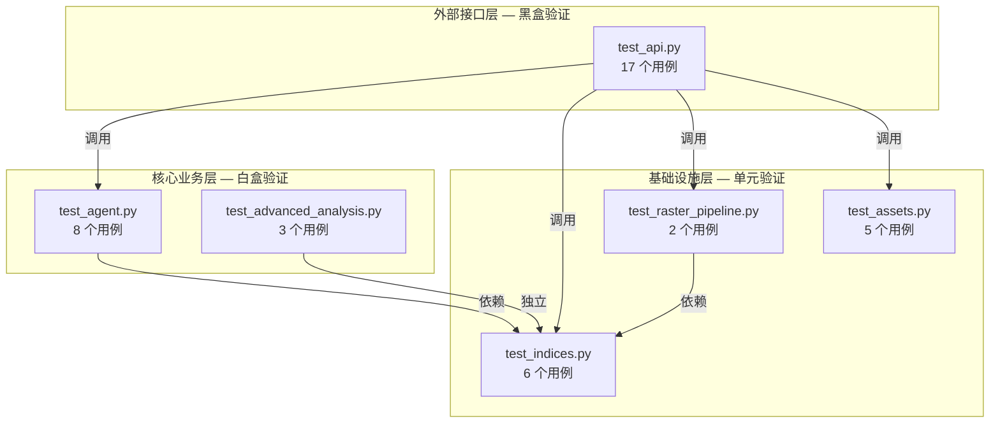
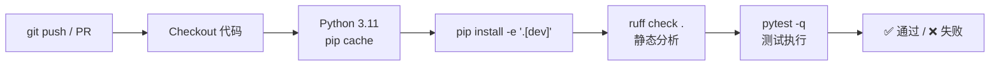
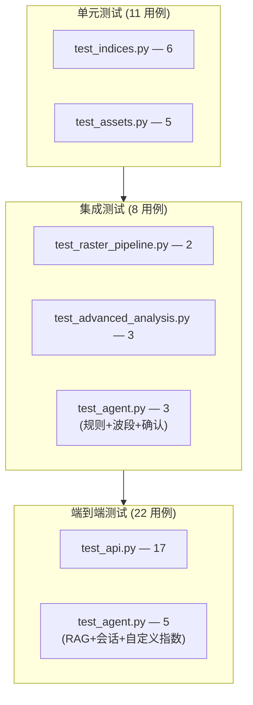

本文档系统介绍植被指数智能分析平台后端的测试架构：从**外部服务隔离**的全局夹具设计，到**六大测试模块**的功能覆盖映射，再到 **CI 流水线**中的自动执行与质量门禁。文档面向需要理解测试边界、扩展测试用例或排查回归问题的开发者。

## 测试隔离策略：零外部依赖的验证环境

后端测试的核心设计原则是**任何测试用例都不依赖运行时环境中的外部服务**。这一目标通过 `conftest.py` 中声明的 `autouse=True` 夹具 `isolate_external_services` 实现——该夹具在每个测试函数执行前自动注入，通过 `monkeypatch` 将数据库、对象存储和 LLM 三项关键外部依赖强制置为不可用状态。

| 隔离目标 | monkeypatch 路径 | 置值 | 隔离效果 |
|----------|-----------------|------|---------|
| PostgreSQL | `settings.database_url` | `None` | 自定义指数和会话事件存储退化为内存模式 |
| MinIO 对象存储 | `settings.minio_enabled` | `False` | 上传产物直接写入本地 `data/inputs` 目录 |
| OpenAI/Anthropic LLM | `settings.openai_api_key` / `settings.openai_base_url` | `None` | Agent 推荐退化为纯规则模式，不发起网络调用 |

这种设计意味着：**测试通过的断言在任何机器上都具有确定性**——无需配置 `.env` 文件，无需启动 Docker Compose，无需网络连接。测试仅验证业务逻辑的正确性，而非外部服务的可用性。

Sources: [conftest.py](backend/tests/conftest.py#L17-L24)

## 测试夹具：可复现的四波段 GeoTIFF 生成

除全局隔离外，`conftest.py` 还提供了 `sample_raster` 夹具，生成一个用于 API 端到端测试和流水线几何验证的标准 GeoTIFF 文件。该文件具有以下固定参数：

| 属性 | 值 | 设计意图 |
|------|-----|---------|
| 尺寸 | 96×64 像素 | 非正方形，防止误假设宽高相等 |
| 波段数 | 4 (Blue, Green, Red, NIR) | 覆盖 NDVI、EVI、GNDVI 等核心指数所需波段 |
| 数据类型 | float32 | 与真实反射率数据一致 |
| CRS | EPSG:4326 | 地理坐标系标准 |
| 像素值 | Blue=0.1, Green=0.2, Red=0.3, NIR=0.7 | 经典"健康植被"光谱——NIR 远高于 Red |
| nodata | -9999 | 行业标准缺失值标记 |

该夹具在 `tmp_path`（pytest 内置临时目录）中创建，每个测试函数获得独立的临时文件，测试结束后自动清理。

Sources: [conftest.py](backend/tests/conftest.py#L26-L46)

## 六大测试模块覆盖矩阵

后端测试套件由 6 个文件组成，共 **41 个测试用例**，按领域职责划分为三个层次：



### 外部接口层：test_api.py（17 个用例）

`test_api.py` 使用 `fastapi.testclient.TestClient` 直接驱动 FastAPI 应用，验证所有对外 HTTP 端点的行为契约。这是覆盖范围最广的单一测试文件，横跨七大功能域：

| 功能域 | 关键测试 | 验证要点 |
|--------|---------|---------|
| **健康与指数目录** | `test_health_and_index_catalog` | `/health` 返回 200，`/api/indices` 返回 35 个指数 |
| **OGC Processes 规范** | `test_ogc_process_catalog_contains_core_and_legacy_processes` | `/processes` 列表长度为 35，符合 OGC API - Processes |
| **Agent 计划生成** | `test_agent_plan_endpoint_is_safe_by_default` | 计划端点返回 `requiresConfirmation: true`，不返回 `jobId` |
| **SSE 流式通信** | `test_agent_plan_stream_returns_sse_events` | 流式响应包含 `status`、`plan`、`done` 三种事件 |
| **知识库 RAG** | `test_agent_knowledge_import_enters_rag` | 导入知识后查询命中 `knowledge-base` 来源 |
| **Agent 确认流程** | `test_agent_confirm_rejects_unapproved_execution_sheet` | 未批准的执行单返回 422 |
| **影像上传** | `test_upload_asset_saves_geotiff_and_returns_metadata` | 返回元数据包含波段信息、地理范围和预览路径 |
| **瓦片渲染** | `test_geotiff_tile_endpoint_renders_uploaded_tif` | `/api/tiles` 返回 PNG 格式响应 |
| **同步/异步执行** | `test_sync_process_executes_real_windowed_raster` / `test_async_process_returns_job_and_results` | 同步立即返回结果，异步轮询至 `successful` |
| **批量计算** | `test_batch_process_shares_one_request_for_multiple_indices` | 单次请求同时计算 NDVI、EVI、GNDVI |
| **错误处理** | `test_execution_rejects_missing_file_and_invalid_band` | 缺失文件返回 422，无效波段号提示"波段号超出影像范围" |
| **能力声明** | `test_capabilities_match_task_book_requirements` | 引擎列表为 `["numpy", "joblib", "torch"]`，支持异步任务 |
| **任务书覆盖** | `test_taskbook_coverage_has_no_missing_items` | `missing == 0`，覆盖条目 ≥ 25 |

Sources: [test_api.py](backend/tests/test_api.py#L1-L342)

### 核心业务层

#### test_agent.py（8 个用例）

直接测试 `VegetationAgent.create_plan` 和 `interpret_results` 方法，绕过 HTTP 层验证智能体的核心决策逻辑：

- **意图识别与推荐**：`test_agent_recommends_growth_workflow` 验证"长势"意图被正确映射为 `ndvi/evi/gndvi` 组合，且 `canExecute` 为 `true`
- **波段缺失拦截**：`test_agent_blocks_indices_with_missing_bands` 确保缺少红边波段时 GNDVI 不被选中
- **确认门控**：`test_agent_requires_confirmation_before_execution` 验证计划状态始终为 `awaiting_confirmation`
- **会话事件**：`test_agent_interpretation_appends_session_event` 确认结果解读以 `interpretation` 事件追加
- **RAG 检索**：`test_agent_exposes_trace_and_rag_hits` 验证 trace 中存在 `rag` 步骤
- **知识注入与隔离**：`test_agent_rag_uses_imported_knowledge_document` 和 `test_agent_rag_does_not_inject_unmentioned_specific_disease` 验证 RAG 仅召回相关知识，不注入未提及的特定病害
- **运行期自定义指数**：`test_agent_can_register_runtime_custom_index` 验证动态注册 `demo_diff` 指数并将其加入执行计划

Sources: [test_agent.py](backend/tests/test_agent.py#L1-L172)

#### test_advanced_analysis.py（3 个用例）

验证安全自定义公式和高级空间分析功能：

- **白名单表达式**：`test_custom_formula_uses_whitelisted_bands_and_operators` 验证 `(nir-red)/(nir+red)` 通过 AST 校验并正确计算
- **安全拦截**：`test_custom_formula_rejects_attribute_access` 确保 `nir.__class__` 等属性访问被拒绝
- **变化检测与统计**：`test_change_detection_and_zonal_statistics` 构造两期影像，验证差值分类和 GeoJSON 地块统计

Sources: [test_advanced_analysis.py](backend/tests/test_advanced_analysis.py#L1-L90)

### 基础设施层

#### test_indices.py（6 个用例）

围绕 `INDEX_REGISTRY` 和三个引擎实现进行单元级验证：

| 测试 | 验证目标 |
|------|---------|
| `test_registry_contains_taskbook_and_legacy_service_indices` | 注册表包含 35 个指数，关键指数集完整 |
| `test_ndvi_matches_manual_formula` | NumpyEngine 计算的 NDVI 与手写公式 `(NIR-Red)/(NIR+Red)` 数值一致 |
| `test_all_indices_produce_finite_float32_arrays` | 全部 35 个指数产出 finite、float32 数组，无 NaN/Inf 污染 |
| `test_evi_rejects_pathological_denominator_outliers` | EVI 分母病态放大时返回 nodata (-9999) 而非爆值 |
| `test_joblib_matches_numpy` | JoblibEngine 与 NumpyEngine 对 NDVI/EVI/MSAVI 的结果数值一致 |
| `test_torch_engine_falls_back_or_matches` | TorchEngine 在有/无 PyTorch 环境下均能正确计算或回退 |

Sources: [test_indices.py](backend/tests/test_indices.py#L1-L85)

#### test_raster_pipeline.py（2 个用例）

验证 `RasterPipeline` 的分块 I/O 和反射率推断逻辑：

- **几何保持**：`test_windowed_raster_pipeline_preserves_geometry` 确认输出 GeoTIFF 的尺寸、CRS 和数值与输入一致
- **整数反射率**：`test_integer_reflectance_raster_uses_evi_reflectance_scale` 验证 uint16 反射率影像被正确归一化到 0-1 范围后再计算 EVI

Sources: [test_raster_pipeline.py](backend/tests/test_raster_pipeline.py#L1-L91)

#### test_assets.py（5 个用例）

验证影像元数据推断和金字塔生成：

| 测试 | 验证目标 |
|------|---------|
| `test_first_open_builds_and_reuses_internal_overviews` | 首次调用生成 overview，二次调用复用不重复构建 |
| `test_small_raster_does_not_create_unnecessary_overviews` | 小尺寸影像（256×256）不生成不必要的金字塔 |
| `test_sensor_filename_profiles_restore_exported_band_metadata` | 文件名匹配 GF-1、Landsat 8/9、Sentinel-2 等传感器配置 |
| `test_sensor_profile_requires_expected_band_count_and_preserves_description` | 波段数不匹配时不启用传感器配置，已有描述不被覆盖 |
| `test_original_filename_hint_restores_profile_after_uuid_storage` | UUID 存储后通过原始文件名 hint 恢复传感器元数据 |

Sources: [test_assets.py](backend/tests/test_assets.py#L1-L171)

## pytest 配置与运行方式

后端使用 `pyproject.toml` 集中管理 pytest 配置，无需额外的 `pytest.ini` 或 `setup.cfg`：

```toml
[tool.pytest.ini_options]
pythonpath = ["."]
testpaths = ["tests"]
```

| 配置项 | 值 | 说明 |
|--------|-----|------|
| `pythonpath` | `["."]` | 将 `backend/` 加入 Python 路径，使 `from app.xxx import ...` 直接可用 |
| `testpaths` | `["tests"]` | 自动发现 `backend/tests/` 下的 `test_*.py` 文件 |

测试开发依赖通过 `[project.optional-dependencies].dev` 声明：

| 依赖 | 版本约束 | 用途 |
|------|---------|------|
| `pytest` | `>=8.3,<9` | 测试框架核心 |
| `pytest-asyncio` | `>=0.25,<1` | 支持 Agent 测试中的 `asyncio.run` |
| `ruff` | `>=0.9,<1` | 静态分析与代码风格检查 |

**本地运行命令**：

```bash
# 安装开发依赖
cd backend && pip install -e ".[dev]"

# 运行全部测试（静默模式）
python -m pytest -q

# 运行指定模块并显示详细输出
python -m pytest tests/test_indices.py -v

# 仅运行包含特定关键词的测试
python -m pytest -k "agent" -v
```

Sources: [pyproject.toml](backend/pyproject.toml#L39-L42)

## CI 流水线中的质量门禁

GitHub Actions 在每次推送到 `main` 分支和每个 Pull Request 上自动执行后端质量检查，流程分为两步：



| 步骤 | 命令 | 失败影响 |
|------|------|---------|
| Ruff 静态分析 | `python -m ruff check .` | 代码风格或潜在 bug 不合规时阻断合并 |
| pytest 测试 | `python -m pytest -q` | 任何测试用例失败时阻断合并 |

该流水线确保：**主分支上的每一条提交都经过 41 个测试用例的完整验证**，且代码风格符合 Ruff 规则（行宽 100、目标 Python 3.11、启用 E/F/I/UP/B 规则集）。

Sources: [ci.yml](\.github/workflows/ci.yml#L10-L33)

## 测试金字塔与覆盖边界

综合分析 41 个测试用例的依赖深度和验证粒度，可以绘制出当前的测试金字塔：



**已覆盖的核心路径**：指数注册表完整性、三引擎计算一致性、分块 I/O 几何保持、OGC API 契约、Agent 意图→推荐→确认完整链路、RAG 知识注入与隔离、自定义公式安全校验、影像元数据推断、同步/异步任务生命周期、变化检测与地块统计。

**当前测试不覆盖的边界**（属于其他文档职责）：

- **Celery Worker 真实队列执行**：测试中 `celery_always_eager=True`，异步任务在进程内同步执行
- **MinIO 对象存储 I/O**：隔离后退化为本地文件系统
- **LLM 真实调用**：隔离后 Agent 退化为纯规则模式
- **前端 UI 交互**：属于 [前端类型检查与构建验证](27-qian-duan-lei-xing-jian-cha-yu-gou-jian-yan-zheng) 范畴
- **性能基线与吞吐量**：属于 [基准测试与性能评估](28-ji-zhun-ce-shi-yu-xing-neng-ping-gu) 范畴

## 后续阅读建议

- 若需了解测试所验证的指数定义和公式注册机制，参见 [统一公式注册表与指数定义](7-tong-gong-shi-zhu-ce-biao-yu-zhi-shu-ding-yi)
- 若需了解测试所验证的引擎选择与回退逻辑，参见 [多引擎选择与自动回退策略](8-duo-yin-qing-xuan-ze-yu-zi-dong-hui-tui-ce-lue)
- 若需了解测试所验证的 Agent 设计哲学，参见 [植被分析 Agent 设计哲学与安全边界](10-zhi-bei-fen-xi-agent-she-ji-zhe-xue-yu-an-quan-bian-jie)
- 若需了解测试所验证的 RAG 与知识检索机制，参见 [指数知识检索（RAG）与网络搜索集成](13-zhi-shu-zhi-shi-jian-suo-rag-yu-wang-luo-sou-suo-ji-cheng)
- 若需了解前端侧的质量保障体系，参见 [前端类型检查与构建验证](27-qian-duan-lei-xing-jian-cha-yu-gou-jian-yan-zheng)