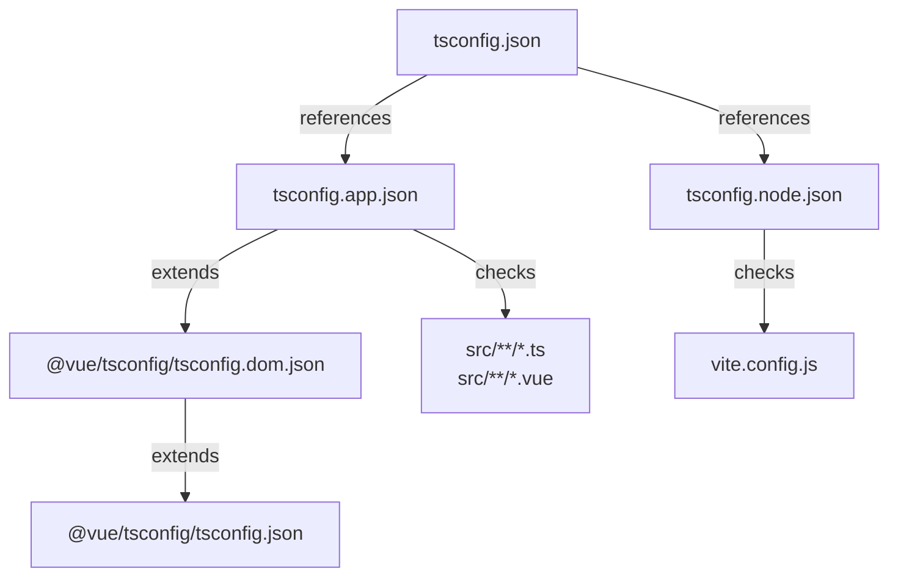
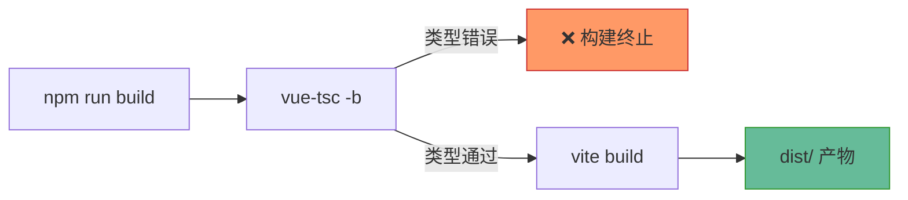
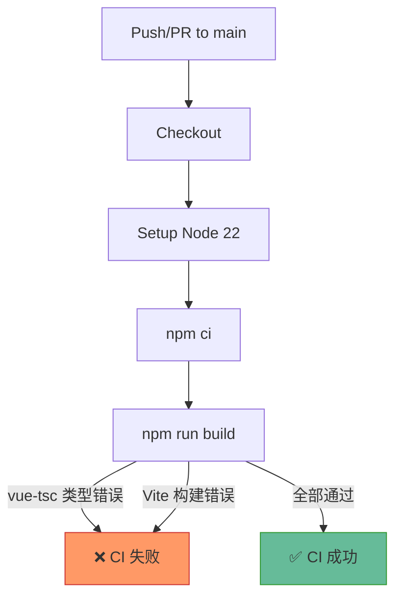
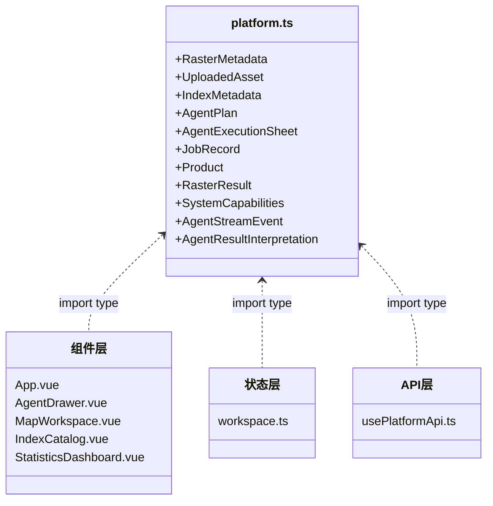
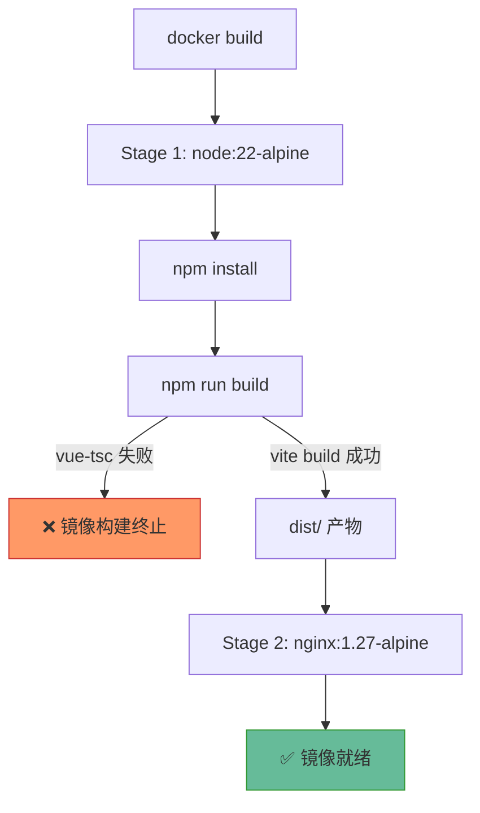

本文档阐述植被指数智能分析平台前端的 TypeScript 类型检查体系与构建验证流程。平台前端基于 Vue 3 + TypeScript + Vite 构建，通过 `vue-tsc` 实现 Vue 单文件组件的类型检查，并将类型检查集成到构建管道与 CI 流水线中，确保代码在部署前通过严格的类型安全验证。

## TypeScript 配置架构

项目采用 **TypeScript 项目引用（Project References）** 模式，将应用代码与构建配置的类型检查分离。根配置 `tsconfig.json` 本身不包含任何编译选项，仅声明两个子项目的引用关系：`tsconfig.app.json` 负责检查 `src/` 下的所有 `.ts` 和 `.vue` 文件，`tsconfig.node.json` 负责检查 `vite.config.js` 等 Node.js 环境文件。



这种分离设计使得应用代码和构建工具配置各自拥有独立的严格检查策略。应用代码启用 `strict: true` 及更严格的 `noUnusedLocals` 和 `noUnusedParameters`，而构建配置则通过 `allowJs` 和 `checkJs` 对 JavaScript 文件进行类型推断检查，无需将其改写为 TypeScript。

Sources: [tsconfig.json](frontend/tsconfig.json#L1-L8), [tsconfig.app.json](frontend/tsconfig.app.json#L1-L18), [tsconfig.node.json](frontend/tsconfig.node.json#L1-L14)

## 应用代码严格模式配置

`tsconfig.app.json` 继承自 `@vue/tsconfig/tsconfig.dom.json`，该预设已包含 `strict: true`、`verbatimModuleSyntax: true`、`moduleResolution: Bundler` 等 Vue 3 + Vite 项目的推荐配置。项目在此基础上追加了三项关键约束：

| 配置项 | 值 | 作用 |
|--------|-----|------|
| `strict` | `true` | 启用所有严格类型检查子项（`noImplicitAny`、`strictNullChecks`、`strictFunctionTypes` 等） |
| `noUnusedLocals` | `true` | 禁止声明但未使用的局部变量，防止死代码残留 |
| `noUnusedParameters` | `true` | 禁止声明但未使用的函数参数，强制接口契约的精确性 |

`composite: true` 是项目引用的必要选项，它要求 TypeScript 生成 `.tsbuildinfo` 缓存文件以支持增量编译。缓存文件统一放置在 `node_modules/.tmp/` 目录下，避免污染源码目录。路径别名 `@/*` 映射到 `./src/*`，使组件间的导入路径保持统一。

Sources: [tsconfig.app.json](frontend/tsconfig.app.json#L1-L18)

## 构建管道中的类型检查

项目的 `npm run build` 脚本定义为 `vue-tsc -b && vite build`，这确保类型检查在 Vite 生产构建之前执行。`vue-tsc` 是 Vue 官方提供的类型检查工具，它基于 TypeScript 编译器，但能够理解 `.vue` 单文件组件的 `<script setup lang="ts">` 语法，将模板中的表达式也纳入类型检查范围。



`vue-tsc -b` 的 `-b` 参数启用构建模式（build mode），它会读取 `tsconfig.json` 中的项目引用，依次检查 `tsconfig.app.json` 和 `tsconfig.node.json` 覆盖的文件范围。这种模式支持增量编译，首次检查后会缓存结果，后续构建只重新检查有变更的文件。

除 `build` 外，项目还提供独立的 `typecheck` 脚本（`vue-tsc -b`），可在不执行生产构建的情况下单独运行类型检查，适用于开发阶段的快速反馈。

Sources: [package.json](frontend/package.json#L7-L8)

## CI 流水线集成

在 GitHub Actions 的 CI 配置中，前端构建任务使用 Node.js 22 环境，依次执行 `npm ci`（安装精确依赖）和 `npm run build`（类型检查 + Vite 构建）。由于 `build` 脚本包含 `vue-tsc -b`，任何类型错误都会导致 CI 流水线失败，从而阻止包含类型问题的代码合并到主分支。



CI 环境的类型检查与本地 `npm run build` 执行完全一致的流程，确保开发者的本地验证结果与远程 CI 判断对齐。这种"构建即检查"的策略避免了类型检查与构建脱节的风险。

Sources: [ci.yml](.github/workflows/ci.yml#L33-L57)

## 类型定义策略

项目将所有前后端共享的业务类型集中定义在 `frontend/src/types/platform.ts` 中。该文件声明了与后端 Pydantic Schema 对齐的 TypeScript 接口，涵盖栅格元数据、指数定义、任务记录、智能体计划、SSE 事件等核心数据结构。



所有类型定义均使用 `interface` 而非 `type`（联合类型场景除外），遵循"字段变化必须与 Pydantic Schema 和 API 同步"的契约约束。组件通过 `import type` 语法导入类型，确保类型信息在编译后被完全擦除，不影响运行时产物体积。

Sources: [platform.ts](frontend/src/types/platform.ts#L1-L234)

## Vue 组件类型模式

项目中的 Vue 组件统一使用 `<script setup lang="ts">` 语法，并采用 **类型声明式 Props 和 Emits**。这种方式将 props 的类型约束与运行时解耦，仅在编译阶段进行检查：

```typescript
// 类型声明式 Props —— 编译期检查，运行时零开销
const props = defineProps<{
  indices: IndexMetadata[]
  product: Product | null
}>()

// 类型声明式 Emits —— 事件载荷类型安全
const emit = defineEmits<{
  toggleTheme: []
  selectProduct: [index: number]
  navigate: [target: string]
}>()
```

在 `AppToolbar.vue` 中，`defineEmits` 使用元组语法 `[index: number]` 声明事件参数类型；在 `MapWorkspace.vue` 中，联合类型 `UploadedAsset | null` 精确描述了可空的资产 prop。这种模式在所有组件中保持一致。

组件内部的局部类型也遵循严格的类型安全原则。`IndexCatalog.vue` 定义了 `FormulaToken` 接口来描述公式分词结果，`AgentDrawer.vue` 定义了 `AgentThinkingStep` 接口来描述思考步骤的内部状态，这些类型均不导出，仅在组件作用域内使用。

Sources: [AppToolbar.vue](frontend/src/components/AppToolbar.vue#L10-L26), [MapWorkspace.vue](frontend/src/components/MapWorkspace.vue#L11-L21), [IndexCatalog.vue](frontend/src/components/IndexCatalog.vue#L12-L24), [AgentDrawer.vue](frontend/src/components/AgentDrawer.vue#L22-L34)

## 响应式状态类型

Pinia Store 和 Composables 中的响应式状态通过泛型参数显式标注类型。`shallowRef<T>` 用于不需要深度响应的对象引用，`computed<T>` 通过返回类型自动推断，`reactive<T>` 用于可变配置对象：

| 工具函数 | 类型标注方式 | 使用场景 |
|----------|-------------|----------|
| `shallowRef<ThemeMode>` | 显式泛型 | 简单值或大型对象引用，避免深度代理开销 |
| `reactive<AgentLLMConfig>` | 显式泛型 | 配置对象，需要深层响应 |
| `computed(() => ...)` | 返回类型推断 | 派生状态，类型从回调返回值自动推断 |
| `defineStore(...)` | 返回类型推断 | Store 实例，类型从函数体自动推断 |

`useTheme.ts` 导出自定义类型 `ThemeMode = 'light' | 'dark'`，供组件的 Props 声明使用。`workspace.ts` 中的 `inferBandMapping` 函数返回 `Record<string, number>`，并接受 `UploadedAsset | null` 参数，函数内部通过类型守卫处理空值场景。

Sources: [useTheme.ts](frontend/src/composables/useTheme.ts#L8-L10), [workspace.ts](frontend/src/stores/workspace.ts#L1-L50)

## API 层泛型封装

`usePlatformApi.ts` 中的 `requestJson<T>` 函数使用泛型参数 `T` 来描述 API 响应的预期结构。调用方通过类型参数指定返回类型，编译器会确保后续的属性访问与类型声明一致：

```typescript
async function requestJson<T>(url: string, init?: RequestInit): Promise<T> {
  // ...
  return response.json() as Promise<T>
}

// 调用方指定返回类型
const indices = await api.listIndices()  // 返回 IndexMetadata[]
const capabilities = await api.getCapabilities()  // 返回 SystemCapabilities
```

SSE 流式通信的 `requestStream` 函数接收 `onEvent: (event: AgentStreamEvent) => void | Promise<void>` 回调，其中 `AgentStreamEvent` 定义了事件类型与数据载荷的结构化映射，确保流式事件处理的类型安全。

Sources: [usePlatformApi.ts](frontend/src/composables/usePlatformApi.ts#L27-L42)

## Docker 构建验证

前端的 Docker 构建采用两阶段构建模式。第一阶段在 `node:22-alpine` 镜像中执行 `npm run build`（包含类型检查），第二阶段将构建产物复制到 `nginx:1.27-alpine` 镜像中。这意味着 Docker 构建同样会触发类型检查，任何类型错误都会导致镜像构建失败。



在 Docker Compose 编排中，前端服务依赖 `api-basic` 服务健康检查通过后才启动，确保前后端部署顺序的正确性。

Sources: [Dockerfile](frontend/Dockerfile#L1-L13)

## 常见类型问题与排查

在项目实践中，以下是常见的类型检查问题及其解决模式：

| 问题类型 | 典型错误信息 | 解决方式 |
|----------|-------------|---------|
| 未使用变量 | `'xxx' is declared but its value is never read` | 删除变量或在不需要返回值时使用 `_` 前缀 |
| 空值未处理 | `Type 'xxx \| null' is not assignable to type 'xxx'` | 使用可选链 `?.`、空值合并 `??` 或类型守卫 |
| Props 类型不匹配 | `Type 'A' is not assignable to type 'B'` | 检查组件 Props 声明与传入值的类型一致性 |
| 导入路径错误 | `Cannot find module '@/xxx'` | 确认 `tsconfig.app.json` 中 `paths` 配置与 Vite `resolve.alias` 一致 |
| 模板表达式错误 | vue-tsc 报告模板中的类型错误 | 检查 `defineProps` 声明的类型与模板中使用的属性是否匹配 |

对于构建产物体积警告（如 MapLibre 或 ECharts 的 chunk 超过 500kB），这属于 Vite 的性能提醒而非类型错误，不阻断构建流程。可通过动态导入 `defineAsyncComponent` 进行代码分割优化。

Sources: [App.vue](frontend/src/App.vue#L17-L19)

## 下一步阅读

完成前端类型检查与构建验证的了解后，建议按以下顺序继续阅读：

- **[基准测试与性能评估](28-ji-zhun-ce-shi-yu-xing-neng-ping-gu)**：了解后端计算引擎的性能基准测试方法
- **[后端测试策略与 pytest 覆盖范围](26-hou-duan-ce-shi-ce-lue-yu-pytest-fu-gai-fan-wei)**：了解后端的质量保障体系
- **[前端组件与状态管理](6-qian-duan-zu-jian-yu-zhuang-tai-guan-li)**：深入了解前端组件架构与 Pinia 状态管理模式