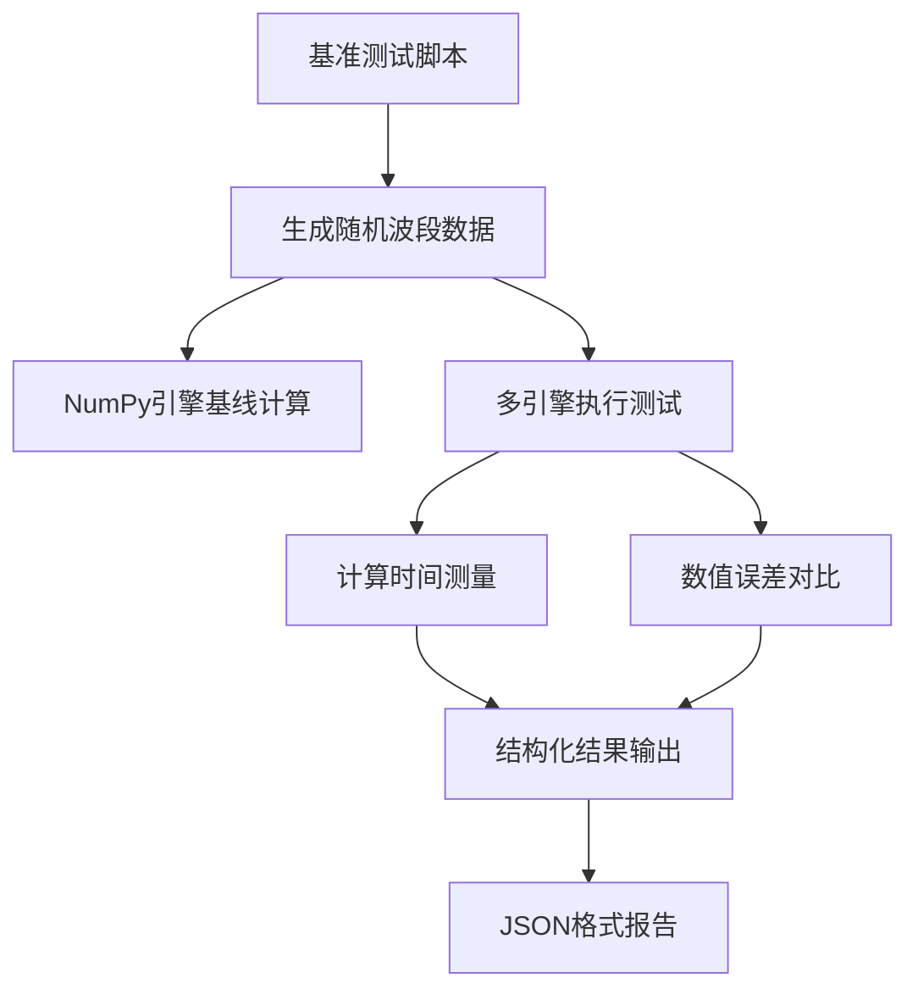
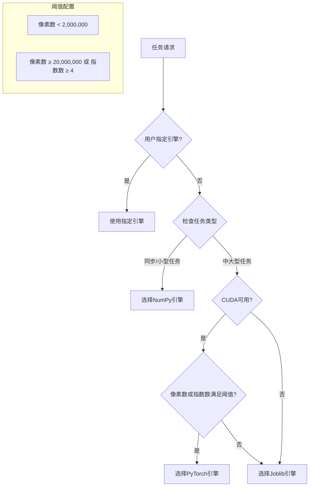

本页面详细阐述植被指数智能分析平台的性能基准测试框架、多引擎计算性能评估方法以及系统性能优化策略。平台通过标准化的基准测试脚本、多维度性能指标和自动引擎选择机制，确保在不同硬件环境和数据规模下提供最优的计算性能。

## 基准测试框架概述

平台采用微基准测试（Microbenchmark）方法评估多计算引擎的性能表现。基准测试框架位于 `backend/scripts/benchmark.py`，其核心设计遵循以下原则：使用固定随机种子确保结果可复现性、以NumPy引擎作为数值精度基线、测量多次执行的平均时间、以及记录引擎回退原因。



基准测试脚本默认使用2048×2048像素的七波段数据集（blue、green、red、red_edge、nir、swir1、swir2），测试五个代表性植被指数（NDVI、EVI、GNDVI、SAVI、NDMI），每个引擎重复执行3次以获取稳定的时间测量结果。测试结果以JSON格式输出，包含引擎名称、计算尺寸、重复次数、平均执行时间、最大数值误差和回退原因等关键指标。

Sources: [benchmark.py](backend/scripts/benchmark.py#L1-L63)

## 多引擎性能对比分析

平台实现三种计算引擎，每种引擎针对不同的计算场景和硬件环境进行优化：

| 引擎类型 | 实现文件 | 并行策略 | 适用场景 | 性能特点 |
|---------|---------|---------|---------|---------|
| **NumPy引擎** | numpy_engine.py | 顺序执行 | 小型任务、同步请求 | 低调度开销，CPU单核执行 |
| **Joblib引擎** | joblib_engine.py | 线程并行 | 中大型任务 | CPU多核并行，适合多指数计算 |
| **PyTorch引擎** | torch_engine.py | CUDA GPU | 大型任务、GPU可用 | GPU加速，支持自动混合精度 |

引擎选择遵循自动回退策略：当请求PyTorch引擎但CUDA不可用时，自动回退到Joblib引擎；当Joblib引擎未安装时，回退到NumPy引擎。这种设计确保在不同硬件环境下都能提供合理的计算性能。

Sources: [numpy_engine.py](backend/app/engines/numpy_engine.py#L1-L43), [joblib_engine.py](backend/app/engines/joblib_engine.py#L1-L59), [torch_engine.py](backend/app/engines/torch_engine.py#L1-L121)

## 自动引擎选择策略

平台通过 `ExecutionPlanner` 类实现智能引擎选择，根据数据规模、指数数量和硬件能力自动选择最优引擎：



自动选择策略基于以下阈值配置：
- **NumPy引擎**：像素数少于2,000,000或同步任务
- **PyTorch引擎**：CUDA可用且像素数大于20,000,000或指数数大于4
- **Joblib引擎**：其他中大型任务

这种保守策略避免小任务因GPU传输产生负加速，同时确保大型任务充分利用GPU计算能力。

Sources: [planner.py](backend/app/services/planner.py#L1-L71)

## 系统性能监控与基准API

平台提供两个关键的系统性能监控端点：

### 系统能力检测端点

`GET /api/system/capabilities` 端点返回当前系统的硬件和软件能力：

```json
{
  "cuda": true,
  "engines": ["numpy", "joblib", "torch"],
  "indexCount": 30,
  "totalIndexCount": 35,
  "customIndexCount": 5,
  "customIndexStorage": "postgresql",
  "agentSessionStorage": "postgresql",
  "agentKnowledgeStorage": "postgresql",
  "asyncJobs": true,
  "objectStorage": "minio",
  "agentMode": "langchain+rag+web-search+rules"
}
```

该端点动态检测CUDA可用性，返回当前支持的引擎列表和系统配置，为前端提供引擎选择依据。

### 引擎基准阈值端点

`GET /api/benchmarks/engines` 端点提供引擎选择的阈值配置：

```json
{
  "thresholds": {
    "numpyMaxPixels": 2000000,
    "torchMinPixels": 20000000,
    "torchMinIndices": 4
  },
  "note": "实际基准需在目标机器执行backend/scripts/benchmark.py生成。"
}
```

Sources: [routes.py](backend/app/api/routes.py#L580-L600)

## 性能测试验证体系

平台通过多层次的测试验证确保计算性能和数值精度：

### 引擎一致性测试

`test_indices.py` 文件包含多引擎一致性验证，确保不同引擎在相同输入下产生相同结果：

1. **数值精度验证**：比较NumPy引擎与手动公式计算结果
2. **跨引擎一致性**：验证Joblib引擎与NumPy引擎结果一致
3. **GPU回退测试**：验证PyTorch引擎在CUDA不可用时的回退行为

### 分块流水线测试

`test_raster_pipeline.py` 验证分块计算流水线的性能和正确性：

1. **几何信息保持**：验证输出GeoTIFF保持原始空间参考
2. **反射率尺度处理**：测试整数反射率数据的自动归一化
3. **内存安全**：验证大文件分块处理不会导致内存溢出

Sources: [test_indices.py](backend/tests/test_indices.py#L1-L85), [test_raster_pipeline.py](backend/tests/test_raster_pipeline.py#L1-L91)

## 实际性能优化案例

平台在实际部署中进行了多项性能优化：

### Landsat波段映射性能优化

针对Landsat 8/9影像的波段映射，平台实现了基于文件名的智能识别，避免人工映射的开销。优化后，上传后117毫秒内即可启动自动定位，首屏由底图和预览立即反馈，TIF瓦片渐进接管。

### MapLibre地图初始化优化

通过解耦地图初始化与瓦片加载，减少初始样式同时注册三套底图的网络请求。优化后，初始外部底图请求仅包含影像底图和影像注记，避免上百个天地图请求的性能瓶颈。

### 内部概览批量构建性能

平台支持GeoTIFF内部概览（Overview）的批量构建，以下为实际测试数据：

| 文件名 | 状态 | 构建时间 | 原始大小 | 构建后大小 | 传感器 |
|-------|------|----------|----------|------------|--------|
| bajiepart1.tif | built | 14.45秒 | 510MB | 646MB | - |
| GF01_130200_202301.tif | built | 60.66秒 | 869MB | 1169MB | GF-1 |
| LAD08_130200_202301.tif | built | 39.73秒 | 1729MB | 1972MB | Landsat 8/9 OLI |
| SHB02_130200_202301.tif | built | 40.36秒 | 2223MB | 2533MB | Sentinel-2A/2B MSI |

概览构建通过金字塔层级（2、4、8、16、32、64、128）显著提升地图显示性能，同时增加约15-20%的存储空间。

Sources: [20260702-内部概览批量构建.log](.evidence/runtime-logs/20260702-内部概览批量构建.log#L1-L5)

## 性能基准测试执行指南

### 执行基准测试

在目标机器上执行基准测试：

```bash
cd backend
python scripts/benchmark.py --size 2048 --repeats 3
```

参数说明：
- `--size`：测试图像尺寸（像素），默认2048
- `--repeats`：重复执行次数，默认3

### 解读基准测试结果

基准测试输出JSON格式结果，包含以下关键指标：

```json
[
  {
    "engine": "numpy",
    "requestedEngine": "numpy",
    "size": 2048,
    "repeats": 3,
    "meanSeconds": 0.123,
    "maxError": 0.0,
    "fallbackReason": null
  },
  {
    "engine": "joblib",
    "requestedEngine": "joblib",
    "size": 2048,
    "repeats": 3,
    "meanSeconds": 0.098,
    "maxError": 1.19e-07,
    "fallbackReason": null
  },
  {
    "engine": "torch",
    "requestedEngine": "torch",
    "size": 2048,
    "repeats": 3,
    "meanSeconds": 0.156,
    "maxError": 2.38e-07,
    "fallbackReason": null
  }
]
```

关键解读：
1. **meanSeconds**：平均计算时间，越小越好
2. **maxError**：与NumPy基线的最大数值误差，应保持在1e-6以内
3. **fallbackReason**：引擎回退原因，正常情况为null

### 环境特定性能评估

平台支持特定硬件环境的性能评估。在具有NVIDIA GPU的环境中，PyTorch引擎可利用CUDA加速：

```python
# 检测CUDA可用性
from app.services.planner import has_cuda
print(f"CUDA可用: {has_cuda()}")

# 系统能力检测
import requests
response = requests.get("http://localhost:8011/api/system/capabilities")
capabilities = response.json()
print(f"支持引擎: {capabilities['engines']}")
```

Sources: [benchmark.py](backend/scripts/benchmark.py#L30-L63), [planner.py](backend/app/services/planner.py#L20-L30)

## 性能优化最佳实践

### 引擎选择建议

1. **小型任务**（< 2,000,000像素）：使用NumPy引擎，避免调度开销
2. **中型任务**（2,000,000 - 20,000,000像素）：使用Joblib引擎，利用CPU多核
3. **大型任务**（> 20,000,000像素或多指数）：使用PyTorch引擎，充分利用GPU

### 内存管理策略

1. **分块处理**：默认1024像素块大小，可调整以适应不同内存限制
2. **及时释放**：计算完成后立即释放中间结果
3. **GPU内存管理**：PyTorch引擎自动处理CUDA内存不足情况

### 数值精度控制

1. **安全除法**：所有除法操作使用1e-6 epsilon避免除零错误
2. **结果清洗**：统一将NaN、Inf值转换为nodata值
3. **范围检查**：验证计算结果在预期范围内

Sources: [base.py](backend/app/engines/base.py#L30-L58), [raster_pipeline.py](backend/app/services/raster_pipeline.py#L1-L100)

## 性能测试覆盖范围

平台通过任务书覆盖率端点监控性能测试的覆盖情况：

```json
{
  "requirement": "基准测试",
  "status": "covered",
  "location": "scripts/benchmark.py",
  "evidence": "多引擎误差与耗时微基准"
}
```

性能测试覆盖以下方面：
1. **引擎计算性能**：多引擎计算时间对比
2. **数值精度**：与基线引擎的误差分析
3. **回退机制**：引擎不可用时的自动回退验证
4. **系统能力**：硬件和软件环境检测

Sources: [routes.py](backend/app/api/routes.py#L700-L720)

## 性能评估总结

平台的基准测试与性能评估框架提供了全面的性能监控和优化能力。通过标准化的测试脚本、智能的引擎选择策略和实际的性能优化案例，平台能够在不同硬件环境下提供最优的计算性能。关键性能指标包括：计算时间、数值精度、引擎选择准确性和系统资源利用率。

**下一步建议**：了解[后端测试策略与pytest覆盖范围](26-hou-duan-ce-shi-ce-lue-yu-pytest-fu-gai-fan-wei)以深入理解测试体系，或查看[多引擎选择与自动回退策略](8-duo-yin-qing-xuan-ze-yu-zi-dong-hui-tui-ce-lue)了解引擎选择的技术细节。