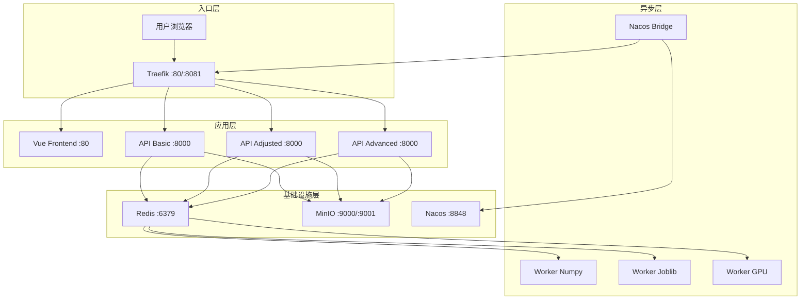
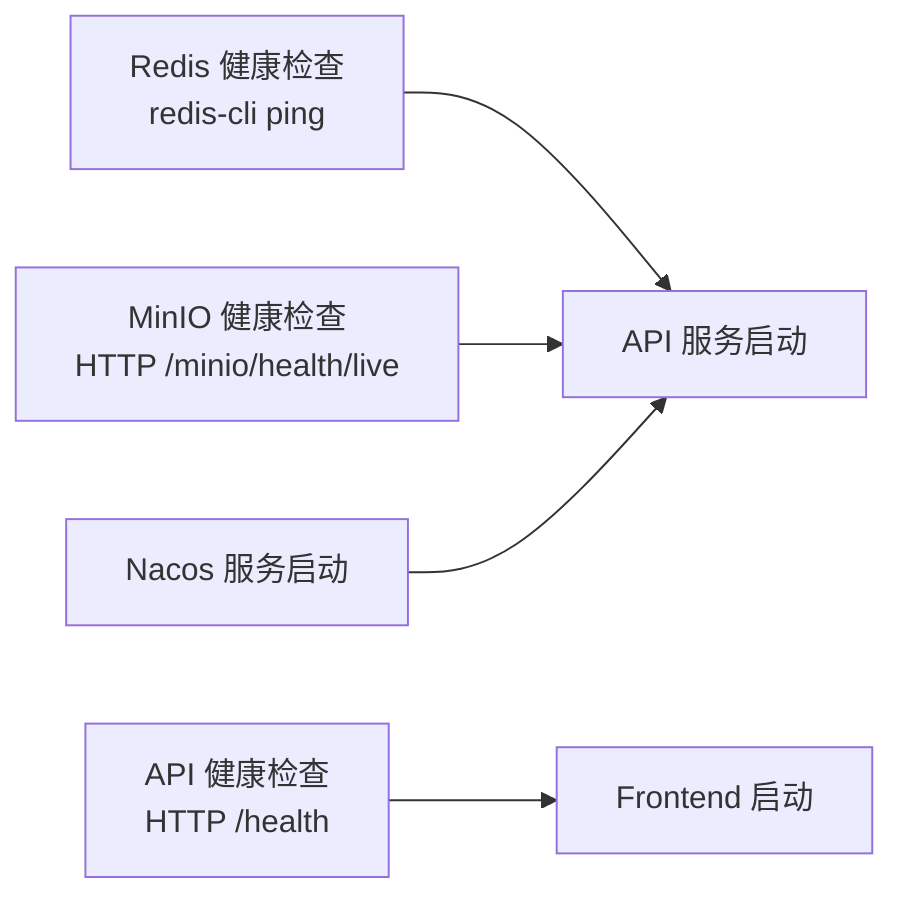

本文档详细说明如何使用 Docker Compose 一键启动植被指数智能分析平台的全部服务。平台采用微服务架构，包含反向代理、API 集群、异步任务队列、对象存储和服务发现等组件，通过 Compose 文件实现声明式编排与自动化部署。

## 部署架构总览

平台的容器化部署采用分层架构设计，从前端静态资源到后端计算引擎均有独立容器负责。整体请求流向为：**用户请求 → Traefik → Frontend/API → Worker → Redis/MinIO**。



## 服务组件清单

Compose 文件定义了 **10 个服务**，按职责可分为三类：入口代理、应用服务和基础设施。以下表格列出各服务的关键配置：

| 服务名称 | 镜像/构建 | 端口 | 健康检查 | 重启策略 |
|---------|----------|------|---------|---------|
| **traefik** | `traefik:v3.4` | 8080:80, 8081:8080 | - | unless-stopped |
| **frontend** | `./frontend` | 通过 Traefik 暴露 | - | unless-stopped |
| **api-basic** | `./backend` | 通过 Traefik 暴露 | `/health` | unless-stopped |
| **api-adjusted** | `./backend` | 内部 | `/health` | unless-stopped |
| **api-advanced** | `./backend` | 内部 | `/health` | unless-stopped |
| **worker-numpy** | `./backend` | - | - | unless-stopped |
| **worker-joblib** | `./backend` | - | - | unless-stopped |
| **worker-gpu** | `./backend` (GPU) | - | - | unless-stopped |
| **redis** | `redis:7.4-alpine` | 内部 | `redis-cli ping` | unless-stopped |
| **minio** | `minio/minio:RELEASE.*` | 9000, 9001 | HTTP 健康端点 | unless-stopped |
| **nacos** | `nacos/nacos-server:v2.4.3` | 8848, 9848 | - | unless-stopped |
| **nacos-bridge** | `./backend` | - | - | unless-stopped |

Sources: [compose.yml](compose.yml#L1-L192)

## 前端容器构建

前端采用多阶段构建策略，先使用 Node.js 镜像编译 Vue 应用，再将产物复制到 Nginx 镜像中提供静态服务。此设计确保生产镜像体积最小化，仅包含编译后的静态文件。

```dockerfile
FROM node:22-alpine AS builder
WORKDIR /app
COPY package.json package-lock.json* ./
RUN npm install
COPY . .
RUN npm run build

FROM nginx:1.27-alpine
COPY nginx.conf /etc/nginx/conf.d/default.conf
COPY --from=builder /app/dist /usr/share/nginx/html
EXPOSE 80
```

Nginx 配置中设置了关键的 API 代理规则，将 `/api`、`/jobs`、`/processes`、`/artifacts`、`/metrics` 路径的请求转发至 Traefik 进行后端路由：

```nginx
location ~ ^/(api|jobs|processes|artifacts|metrics) {
    proxy_pass http://traefik:80;
    proxy_set_header Host $host;
    proxy_set_header X-Forwarded-For $proxy_add_x_forwarded_for;
}
```

这种设计实现了前后端分离部署的同时保持统一入口，用户通过 `http://localhost:8080` 即可访问完整应用。

Sources: [frontend/Dockerfile](frontend/Dockerfile#L1-L13), [frontend/nginx.conf](frontend/nginx.conf#L1-L17)

## 后端容器构建

后端基础镜像基于 `python:3.12-slim`，安装 GDAL 库以支持地理空间数据处理。Dockerfile 遵循最小依赖原则，仅安装运行必需的系统包：

```dockerfile
FROM python:3.12-slim
ENV PYTHONDONTWRITEBYTECODE=1 \
    PYTHONUNBUFFERED=1 \
    PIP_NO_CACHE_DIR=1
RUN apt-get update \
    && apt-get install -y --no-install-recommends libgdal-dev gdal-bin \
    && rm -rf /var/lib/apt/lists/*
WORKDIR /app
COPY pyproject.toml .
COPY app ./app
RUN pip install .
EXPOSE 8000
CMD ["uvicorn", "app.main:app", "--host", "0.0.0.0", "--port", "8000"]
```

GPU 版本镜像基于 `pytorch/pytorch:2.6.0-cuda12.4-cudnn9-runtime`，预装 CUDA 和 cuDNN 运行时，并通过 `pip install ".[gpu]"` 安装 PyTorch 依赖。GPU Worker 专用启动命令为 Celery，处理高优先级任务队列：

```dockerfile
CMD ["celery", "-A", "app.celery_app:celery_app", "worker", "-Q", "urgent,high,normal", "--loglevel=INFO", "--concurrency=1", "--hostname=gpu@%h"]
```

Sources: [backend/Dockerfile](backend/Dockerfile#L1-L18), [backend/Dockerfile.gpu](backend/Dockerfile#L1-L17)

## API 服务集群配置

三个 API 服务实例（basic、adjusted、advanced）通过 YAML 锚点复用配置，仅在环境变量中区分服务名和主机名。这种设计确保代码一致性，同时支持服务发现注册：

```yaml
x-api-environment: &api-environment
  VIP_REDIS_URL: redis://redis:6379/0
  VIP_CELERY_ALWAYS_EAGER: "false"
  VIP_MINIO_ENDPOINT: minio:9000
  VIP_MINIO_ACCESS_KEY: vegetation
  VIP_MINIO_SECRET_KEY: vegetation-secret
  VIP_MINIO_ENABLED: "true"
  VIP_NACOS_URL: http://nacos:8848

x-api-service: &api-service
  build:
    context: ./backend
  restart: unless-stopped
  depends_on:
    redis:
      condition: service_healthy
    minio:
      condition: service_healthy
    nacos:
      condition: service_started
  volumes:
    - vegetation-data:/app/data
  healthcheck:
    test: ["CMD", "python", "-c", "import urllib.request; urllib.request.urlopen('http://localhost:8000/health')"]
    interval: 15s
    timeout: 5s
    retries: 5
```

`api-basic` 服务额外配置了 Traefik 路由标签，使其成为前端请求的主要入口点：

```yaml
api-basic:
  labels:
    - traefik.enable=true
    - traefik.http.routers.platform-api.rule=PathPrefix(`/api`) || PathPrefix(`/jobs`) || PathPrefix(`/processes`) || PathPrefix(`/artifacts`) || PathPrefix(`/metrics`)
    - traefik.http.routers.platform-api.priority=100
    - traefik.http.services.platform-api.loadbalancer.server.port=8000
```

Sources: [compose.yml](compose.yml#L1-L65)

## Celery 异步任务队列

平台配置了三种 Worker 类型，分别处理不同优先级和计算需求的任务：

| Worker | 队列 | 并发数 | 适用场景 |
|--------|------|--------|---------|
| **worker-numpy** | normal, low, batch | 1 | CPU 密集型数值计算 |
| **worker-joblib** | urgent, high, normal | 2 | 通用高优先级任务 |
| **worker-gpu** | urgent, high, normal | 1 | GPU 加速计算（需 NVIDIA 驱动） |

Celery 配置中定义了五级优先队列，通过 Redis 的优先级传输策略实现任务调度：

```python
task_queues=(
    Queue("urgent", routing_key="priority.1"),
    Queue("high", routing_key="priority.2"),
    Queue("normal", routing_key="priority.3"),
    Queue("low", routing_key="priority.4"),
    Queue("batch", routing_key="priority.5"),
),
```

GPU Worker 需要在主机上安装 NVIDIA Container Toolkit，并在 Compose 文件中声明 GPU 资源预留：

```yaml
deploy:
  resources:
    reservations:
      devices:
        - driver: nvidia
          count: 1
          capabilities: [gpu]
```

Sources: [compose.yml](compose.yml#L67-L107), [backend/app/celery_app.py](backend/app/celery_app.py#L1-L36)

## 服务发现与动态路由

Nacos Bridge 组件负责将 Nacos 中注册的服务实例同步到 Traefik 的文件提供者配置中。该组件每 10 秒轮询一次 Nacos API，获取健康实例列表并生成 YAML 配置文件：

```python
SERVICES = {
    "vegetation-basic": "/api/basic",
    "vegetation-adjusted": "/api/adjusted",
    "vegetation-advanced": "/api/advanced",
}
```

生成的路由配置会自动为每个服务创建路径前缀路由器，并配置 StripPrefix 中间件去除前缀后转发到后端。当 Nacos 中无健康实例时，系统会回退到 Docker Compose 内部 DNS 名称（如 `http://api-basic:8000`）。

Traefik 配置中启用了 Docker 提供者和文件提供者双模式，前者自动发现带有标签的容器，后者读取 Nacos Bridge 生成的动态配置：

```yaml
providers:
  docker:
    exposedByDefault: false
  file:
    directory: /dynamic
    watch: true
```

Sources: [backend/app/nacos_bridge.py](backend/app/nacos_bridge.py#L1-L91), [infra/traefik/traefik.yml](infra/traefik/traefik.yml#L1-L19)

## 环境变量配置体系

平台使用 `VIP_` 前缀的环境变量，通过 Pydantic Settings 进行类型安全的配置管理。以下表格列出关键环境变量及其作用：

| 变量名 | 默认值 | 说明 |
|--------|--------|------|
| `VIP_REDIS_URL` | `redis://localhost:6379/0` | Redis 连接地址 |
| `VIP_MINIO_ENDPOINT` | `localhost:9000` | MinIO 服务端点 |
| `VIP_MINIO_ACCESS_KEY` | `vegetation` | MinIO 访问密钥 |
| `VIP_MINIO_SECRET_KEY` | `vegetation-secret` | MinIO 密钥 |
| `VIP_MINIO_ENABLED` | `false` | 是否启用 MinIO |
| `VIP_CELERY_ALWAYS_EAGER` | `true` | 是否同步执行任务 |
| `VIP_NACOS_URL` | `None` | Nacos 服务地址 |
| `VIP_SERVICE_NAME` | `vegetation-basic` | 当前服务注册名 |
| `VIP_OPENAI_API_KEY` | `None` | LLM API 密钥 |

本地开发时可通过 `.env` 文件覆盖默认值，生产部署建议通过 Compose 环境变量注入敏感信息。

Sources: [backend/app/settings.py](backend/app/settings.py#L1-L44)

## 数据持久化卷

Compose 定义了 5 个命名卷用于持久化存储，确保容器重建后数据不丢失：

| 卷名 | 挂载路径 | 用途 |
|------|---------|------|
| `vegetation-data` | `/app/data` | 影像处理中间产物 |
| `redis-data` | `/data` | Redis AOF 持久化 |
| `minio-data` | `/data` | 对象存储文件 |
| `nacos-data` | `/home/nacos/data` | 服务注册信息 |
| `traefik-dynamic` | `/dynamic` | 动态路由配置 |

建议在生产环境中将这些卷挂载到主机目录或使用外部存储驱动，便于备份和迁移。

Sources: [compose.yml](compose.yml#L174-L192)

## 健康检查机制

平台为关键服务配置了健康检查，确保依赖服务就绪后才启动下游服务：



API 服务的健康检查通过 Python 标准库实现，避免引入额外依赖：

```python
test: ["CMD", "python", "-c", "import urllib.request; urllib.request.urlopen('http://localhost:8000/health')"]
```

检查间隔为 15 秒，超时 5 秒，最多重试 5 次。这种配置在容器启动初期给予足够的初始化时间。

Sources: [compose.yml](compose.yml#L37-L42)

## 快速启动指南

### 前置条件

确保系统已安装以下软件：

1. **Docker Engine** ≥ 20.10
2. **Docker Compose** v2（现代版本已内置 Docker）
3. **NVIDIA Container Toolkit**（仅 GPU Worker 需要）

### 启动命令

```bash
# 进入项目根目录
cd vegetation-intelligence-platform

# 构建并启动所有服务（后台运行）
docker compose up -d --build

# 查看服务状态
docker compose ps

# 查看实时日志
docker compose logs -f api-basic

# 停止所有服务
docker compose down

# 停止并删除数据卷（谨慎操作）
docker compose down -v
```

### 访问入口

| 服务 | 地址 | 说明 |
|------|------|------|
| 应用首页 | `http://localhost:8080` | Traefik 代理入口 |
| Traefik Dashboard | `http://localhost:8081` | 路由监控面板 |
| MinIO Console | `http://localhost:9001` | 对象存储管理 |
| Nacos Console | `http://localhost:8848` | 服务注册中心 |

## 常见问题排查

| 问题现象 | 可能原因 | 解决方案 |
|---------|---------|---------|
| API 服务反复重启 | Redis/MinIO 未就绪 | 等待基础设施服务健康检查通过 |
| 前端无法访问 API | Traefik 路由未加载 | 检查 `nacos-bridge` 日志 |
| GPU Worker 不启动 | NVIDIA 驱动未安装 | 安装 NVIDIA Container Toolkit |
| 任务队列积压 | Worker 并发数不足 | 调整 `--concurrency` 参数 |
| 磁盘空间不足 | 数据卷未定期清理 | 执行 `docker system prune` |

## 下一步阅读

完成部署后，建议继续阅读以下文档深入理解系统架构：

- [平台整体架构与技术栈](4-ping-tai-zheng-ti-jia-gou-yu-ji-zhu-zhan) — 理解各组件间的协作关系
- [Docker Compose 服务编排全景](23-docker-compose-fu-wu-bian-pai-quan-jing) — 深入了解服务编排细节
- [本地开发环境搭建与启动](2-ben-di-kai-fa-huan-jing-da-jian-yu-qi-dong) — 如需本地开发调试
- [Traefik 反向代理与 Nacos 服务发现桥接](24-traefik-fan-xiang-dai-li-yu-nacos-fu-wu-fa-xian-qiao-jie) — 理解流量路由机制