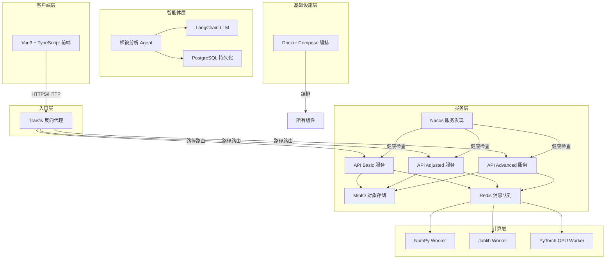
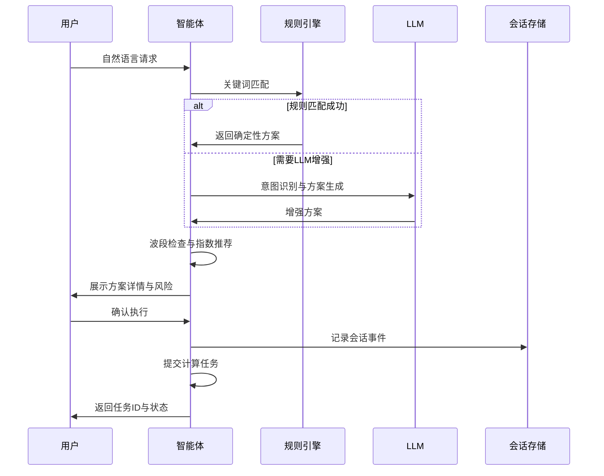
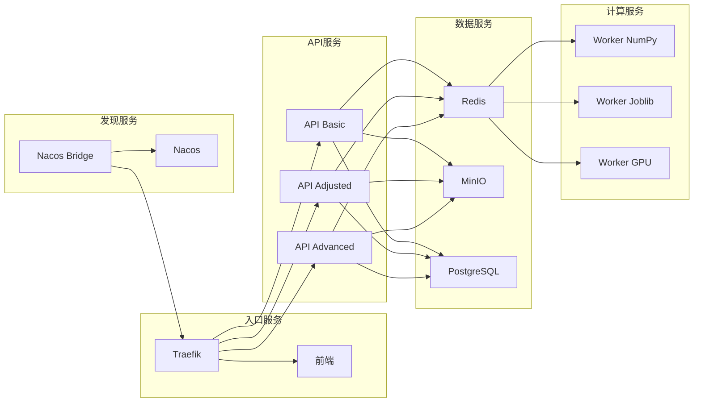

植被指数智能分析平台是一个面向遥感植被分析的现代化Web应用，集成了35种植被指数计算、多引擎自动选择、OGC兼容API、智能分析代理以及交互式地图工作台。本文档将从整体架构视角剖析平台的分层设计、技术选型与组件交互模式，为开发者提供全局认知框架。

## 系统架构全景

平台采用前后端分离、微服务化部署的架构模式，通过反向代理统一入口，后端服务通过消息队列实现异步任务处理，并通过服务发现实现动态负载均衡。

*图注：平台采用分层架构，从客户端到基础设施共五个层次。Traefik作为统一入口，根据路径前缀将请求路由到不同的API服务实例，这些实例通过Redis消息队列将计算任务分发给不同类型的Worker。智能体系统独立运行，通过LLM增强分析能力，并将配置持久化到PostgreSQL。*

Sources: [compose.yml](compose.yml#L1-L192), [backend/app/main.py](backend/app/main.py#L1-L63)

## 技术栈矩阵

平台的技术栈经过精心选择，在开发效率、性能表现和可维护性之间取得平衡。下表详细列出了各层的关键技术组件及其职责：

| 层次 | 组件 | 技术选型 | 版本要求 | 核心职责 |
|------|------|----------|----------|----------|
| **前端** | 框架 | Vue 3 + TypeScript | Vue 3.5+ | 响应式UI与组件化开发 |
| **前端** | 地图引擎 | MapLibre GL JS | 5.6+ | 矢量瓦片渲染与交互 |
| **前端** | 图表库 | ECharts | 5.6+ | 统计图表与数据可视化 |
| **前端** | 状态管理 | Pinia | 3.0+ | 全局状态与响应式数据流 |
| **前端** | 构建工具 | Vite | 7.0+ | 快速开发服务器与生产构建 |
| **后端** | Web框架 | FastAPI | 0.115+ | 异步API与自动文档生成 |
| **后端** | 数据验证 | Pydantic v2 | 2.10+ | 数据模型与序列化 |
| **后端** | 任务队列 | Celery + Redis | Celery 5.4+ | 异步任务调度与优先级管理 |
| **后端** | 栅格处理 | Rasterio + NumPy | Rasterio 1.4+, NumPy 2.0+ | 分块读写与内存安全计算 |
| **后端** | GPU加速 | PyTorch (CUDA) | 2.6+ | GPU并行计算与自动回退 |
| **后端** | 智能体框架 | LangChain | 0.3+ | LLM集成与工具调用 |
| **后端** | 对象存储 | MinIO | 7.2+ | GeoTIFF资产存储与管理 |
| **后端** | 服务发现 | Nacos | 2.4.3 | 服务注册与健康检查 |
| **后端** | OGC兼容 | pygeoapi | 0.20+ | 标准地理空间API实现 |
| **基础设施** | 容器编排 | Docker Compose | - | 多服务部署与依赖管理 |
| **基础设施** | 反向代理 | Traefik | 3.4 | 路径路由与负载均衡 |
| **基础设施** | 消息代理 | Redis | 7.4 | 消息队列与缓存 |
| **基础设施** | 数据库 | PostgreSQL | - | 自定义指数持久化存储 |

*表注：技术栈按前端、后端、基础设施三个维度组织。后端采用Python生态，前端采用Vue生态，基础设施以容器化为核心。所有版本要求均为最低兼容版本。*

Sources: [backend/pyproject.toml](backend/pyproject.toml#L1-L52), [frontend/package.json](frontend/package.json#L1-L28), [compose.yml](compose.yml#L1-L192)

## 分层架构详解

### 1. 客户端层：交互式遥感工作台

前端采用Vue 3组合式API设计，通过Pinia实现单一状态源管理。核心组件包括：

- **MapWorkspace**：基于MapLibre GL JS的地图工作区，支持GeoTIFF动态瓦片叠加、图层控制和空间查询
- **AgentDrawer**：智能体对话界面，支持SSE流式通信与用户确认交互
- **JobProgressPanel**：任务进度监控面板，实时显示计算状态和结果预览
- **IndexCatalog**：指数目录浏览器，支持公式展示、波段需求和分类筛选
- **StatisticsDashboard**：统计图表仪表盘，集成ECharts实现数据可视化

前端通过`usePlatformApi`组合式函数与后端API交互，支持同步/异步两种任务提交模式。主题系统支持日间/夜间模式切换，所有UI状态通过浏览器本地存储持久化。

Sources: [frontend/src/App.vue](frontend/src/App.vue#L1-L289), [frontend/src/stores/workspace.ts](frontend/src/stores/workspace.ts#L1-L280)

### 2. 服务层：OGC兼容API集群

后端采用FastAPI框架，提供三类API服务实例，通过Nacos服务发现实现动态注册：

- **vegetation-basic**：基础指数计算服务，处理同步和轻量级任务
- **vegetation-adjusted**：调整服务，处理参数优化和自定义配置
- **vegetation-advanced**：高级分析服务，支持变化检测、区域统计等复杂操作

每个服务实例都遵循OGC API - Processes规范，提供标准化的任务执行接口。服务通过Traefik的File Provider动态配置实现路径路由，路由规则通过`nacos_bridge`组件从Nacos健康实例自动生成。

Sources: [backend/app/main.py](backend/app/main.py#L1-L63), [backend/app/nacos_bridge.py](backend/app/nacos_bridge.py#L1-L91)

### 3. 计算层：多引擎自动选择

计算引擎采用策略模式设计，通过`ExecutionPlanner`根据数据规模和硬件能力自动选择最优引擎：

| 引擎 | 适用场景 | 并行策略 | 内存模型 | GPU支持 |
|------|----------|----------|----------|----------|
| **NumPy** | 小型任务、同步执行 | 单线程 | 内存直接操作 | 否 |
| **Joblib** | 中大型任务 | 多线程并行 | 内存直接操作 | 否 |
| **PyTorch** | 大型任务、多指数计算 | GPU并行 | CUDA显存 | 是 |

引擎选择决策基于以下阈值：
- 像素数 < 2,000,000 或同步任务 → NumPy引擎
- 像素数 ≥ 20,000,000 且CUDA可用 → PyTorch引擎
- 其他情况 → Joblib引擎

当CUDA不可用或显存不足时，系统自动回退到CPU引擎，确保计算任务始终可执行。

Sources: [backend/app/engines/base.py](backend/app/engines/base.py#L1-L46), [backend/app/services/planner.py](backend/app/services/planner.py#L1-L71)

### 4. 智能体层：安全可解释的分析代理

智能体系统采用"规则优先、LLM可插拔"的设计哲学，确保分析过程的安全性和可解释性：

*图注：智能体工作流程强调安全性：所有方案必须经过用户确认才能执行，LLM仅用于增强理解而非直接执行。会话事件全程记录，确保可追溯性。*

智能体的核心能力包括：
1. **意图识别**：基于规则匹配和LLM理解，识别用户的分析目标
2. **RAG知识检索**：从指数注册表和外部文档中检索相关知识
3. **方案生成**：生成包含指数选择、参数配置和风险提示的分析方案
4. **用户确认**：所有计算任务必须经过用户明确确认
5. **结果解读**：对计算结果进行统计分析和限制说明

Sources: [backend/app/services/agent.py](backend/app/services/agent.py#L1-L520), [skills/vegetation-agent-designer/SKILL.md](skills/vegetation-agent-designer/SKILL.md#L1-L76)

### 5. 基础设施层：容器化部署与服务编排

平台采用Docker Compose进行服务编排，包含11个容器化服务：

*图注：容器化部署架构展示服务间依赖关系。Traefik作为统一入口，前端和API服务通过它对外提供服务。计算Worker从Redis队列获取任务，数据服务为所有组件提供存储支持。Nacos Bridge负责将服务发现信息同步给Traefik。*

关键基础设施特性：
- **健康检查**：所有服务配置了健康检查，确保依赖服务就绪后再启动
- **数据卷**：`vegetation-data`卷在API服务和Worker间共享，确保数据一致性
- **GPU支持**：Worker GPU服务通过NVIDIA Container Toolkit获得CUDA能力
- **动态路由**：Nacos Bridge每10秒同步一次服务实例，自动生成Traefik路由配置

Sources: [compose.yml](compose.yml#L1-L192), [backend/Dockerfile](backend/Dockerfile#L1-L18), [frontend/Dockerfile](frontend/Dockerfile#L1-L13)

## 核心设计模式

### 1. 统一公式注册表

35种植被指数通过`IndexDefinition`数据类统一注册，每个指数包含：
- 唯一标识符和显示名称
- 数学公式字符串（前端展示用）
- 所需波段列表
- 跨数组后端的计算表达式
- 参数配置和预期值范围
- 分类标签和推荐场景
- 使用限制说明

这种设计使得同一份公式定义可以同时驱动NumPy、Joblib和PyTorch三种计算引擎，确保计算结果的一致性。

Sources: [backend/app/core/indices.py](backend/app/core/indices.py#L1-L559)

### 2. 内存安全的分块处理

栅格数据处理采用分块读写策略，避免将整幅大型影像载入内存：

1. **窗口读取**：Rasterio按指定窗口大小读取GeoTIFF数据
2. **nodata处理**：源数据的nodata值统一转换为NaN，避免计算溢出
3. **分块计算**：每个窗口独立计算，结果立即写入输出文件
4. **内存监控**：计算前估算内存需求，必要时自动选择更适合的引擎

这种设计使得平台能够处理远超物理内存大小的遥感影像。

Sources: [backend/app/services/raster_pipeline.py](backend/app/services/raster_pipeline.py#L1-L100)

### 3. 异步任务管道

任务执行采用Celery异步任务队列，支持：
- **优先级队列**：`urgent`、`high`、`normal`、`low`、`batch`五级优先级
- **任务状态**：`pending`、`started`、`success`、`failure`、`cancelled`五种状态
- **进度查询**：支持实时查询任务执行进度
- **任务取消**：支持在任务执行前取消
- **结果存储**：计算结果存储在MinIO，支持临时URL访问

Sources: [backend/app/celery_app.py](backend/app/celery_app.py#L1-L50), [backend/app/services/jobs.py](backend/app/services/jobs.py#L1-L100)

## 部署与开发模式

### 本地开发环境

本地开发采用前后端分离模式：
- **后端**：使用Miniconda环境，通过`uvicorn`启动热重载开发服务器
- **前端**：使用Vite开发服务器，支持热模块替换
- **配置**：通过`.env`文件管理环境变量，支持数据库、LLM、天地图等配置

### 容器化部署

生产部署通过Docker Compose一键启动：
- **构建**：前后端分别构建Docker镜像
- **网络**：所有服务通过Docker网络内部通信
- **存储**：数据卷确保数据持久化
- **监控**：Traefik提供服务监控面板

Sources: [README.md](README.md#L1-L113)

## 架构演进与边界

### 当前架构边界

1. **安全边界**：不包含身份认证、多租户和计费系统
2. **数据边界**：时序变化检测需要上游保证数据配准与辐射一致化
3. **服务边界**：OGC兼容性通过pygeoapi插件实现，配置位于`infra/pygeoapi/config.yml`
4. **服务发现边界**：Traefik不原生支持Nacos，通过`nacos_bridge`组件桥接

### 扩展性设计

1. **引擎扩展**：新增计算引擎只需实现`ComputeEngine`协议
2. **指数扩展**：新增指数只需在`INDEX_DEFINITIONS`中添加定义
3. **智能体扩展**：新增分析能力只需添加对应的`IntentRule`
4. **存储扩展**：支持切换到其他对象存储和数据库系统

Sources: [backend/app/engines/base.py](backend/app/engines/base.py#L1-L46), [backend/app/core/indices.py](backend/app/core/indices.py#L1-L559)

## 下一步学习建议

基于平台架构的逻辑层次，建议按以下顺序深入学习：

1. **快速上手**：先了解[项目概述](1-xiang-mu-gai-shu)，然后搭建[本地开发环境](2-ben-di-kai-fa-huan-jing-da-jian-yu-qi-dong)
2. **核心架构**：深入理解[后端模块职责](5-hou-duan-mo-kuai-zhi-ze-yu-mu-lu-zu-zhi)和[前端组件设计](6-qian-duan-zu-jian-yu-zhuang-tai-guan-li)
3. **计算引擎**：学习[统一公式注册表](7-tong-gong-shi-zhu-ce-biao-yu-zhi-shu-ding-yi)和[多引擎选择策略](8-duo-yin-qing-xuan-ze-yu-zi-dong-hui-tui-ce-lue)
4. **智能体系统**：理解[智能体设计哲学](10-zhi-bei-fen-xi-agent-she-ji-zhe-xue-yu-an-quan-bian-jie)和[意图识别流程](11-yi-tu-shi-bie-fang-an-sheng-cheng-yu-yong-hu-que-ren-liu-cheng)
5. **OGC API**：掌握[REST接口设计](16-rest-jie-kou-yu-ogc-api-processes-gui-fan-dui-qi)和[异步任务管理](17-tong-bu-zhi-xing-yu-celery-yi-bu-ren-wu-guan-dao)
6. **前端工作台**：探索[地图集成](19-maplibre-di-tu-gong-zuo-qu-yu-tian-di-tu-ji-cheng)和[动态瓦片技术](20-geotiff-dong-tai-wa-pian-die-jia-yu-tu-ceng-kong-zhi)
7. **基础设施**：了解[Docker编排全景](23-docker-compose-fu-wu-bian-pai-quan-jing)和[服务发现机制](24-traefik-fan-xiang-dai-li-yu-nacos-fu-wu-fa-xian-qiao-jie)

这种学习路径遵循从整体到局部、从应用到底层的认知规律，有助于建立完整的架构知识体系。