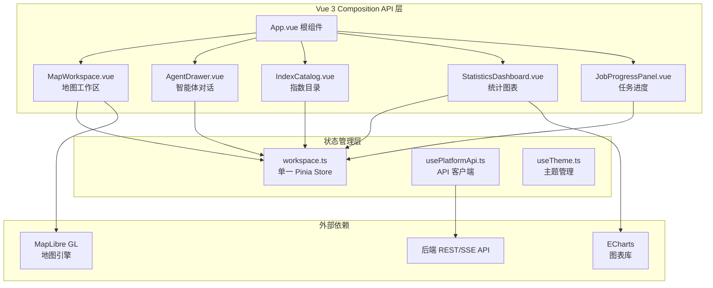
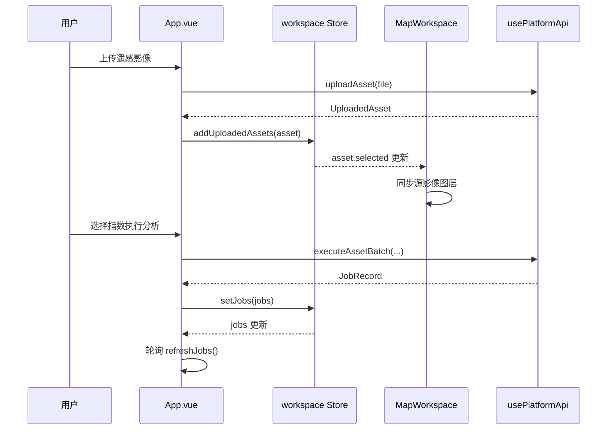

本文档详细阐述植被指数智能分析平台前端的组件架构与状态管理机制。该前端采用 Vue 3 + TypeScript + Pinia 构建，通过**单一状态源（Single Source of Truth）**模式协调复杂的遥感数据可视化、智能体交互和任务管理功能。整个前端遵循**响应式优先**的设计理念，确保地图工作区、指数目录和实时任务面板之间的状态同步。

## 核心技术栈与架构概览

前端技术栈以 **Vue 3 Composition API** 为核心，结合 **Pinia** 进行状态管理，**MapLibre GL** 负责地理空间可视化，**ECharts** 处理统计图表渲染。这种组合提供了优秀的类型安全性和响应式性能，特别适合处理遥感影像数据和实时任务状态。

## 单一状态源：workspace Store

前端采用 **Pinia 单一 Store** 模式管理所有业务状态，该 Store 位于 `frontend/src/stores/workspace.ts`，包含以下核心状态域：

| 状态域 | 响应式类型 | 职责描述 | 状态示例 |
|--------|------------|----------|----------|
| **indices** | `shallowRef<IndexMetadata[]>` | 植被指数元数据列表 | 包含 35+ 预定义指数 |
| **jobs** | `shallowRef<JobRecord[]>` | 任务执行记录 | 状态、进度、结果 |
| **asset** | `reactive` 对象 | 上传资产与波段映射 | 选中资产、队列、波段映射 |
| **activeResult** | `shallowRef<RasterResult>` | 当前分析结果 | 多产品结果、统计信息 |
| **ui** | `reactive` 对象 | UI 面板可见性 | Agent、目录、统计面板 |

Store 采用 `shallowRef` 和 `reactive` 混合策略：对于大型对象（如指数列表、任务记录）使用 `shallowRef` 避免深度响应式开销，对于需要频繁更新的 UI 状态使用 `reactive` 确保响应式追踪。

Sources: [workspace.ts](frontend/src/stores/workspace.ts#L1-L280)

## 核心组件职责与交互模式

### MapWorkspace.vue：地理空间可视化中枢

MapWorkspace 是平台的核心组件，负责管理 **MapLibre GL** 地图实例、底图切换、源影像预览、分析结果瓦片叠加以及图层控制。该组件采用**延迟加载**策略，通过 `defineAsyncComponent` 按需加载，减少初始包体积。

组件通过 props 接收 `asset`（源影像）、`product`（当前产品）和 `products`（多产品列表），通过事件向上通知产品切换。其内部维护复杂的图层状态：

- **底图管理**：支持矢量、影像、地形三种天地图底图切换
- **图层叠放顺序**：确保源影像、分析结果、足迹边界的正确 Z 轴顺序
- **瓦片状态同步**：监控瓦片加载状态，实现预览图到瓦片的无缝切换
- **对比模式**：支持前/后/并排对比分析

组件通过 `artifactUrl` 和 `tileUrl` 工具函数构建后端瓦片服务 URL，实现动态 GeoTIFF 瓦片请求。

Sources: [MapWorkspace.vue](frontend/src/components/MapWorkspace.vue#L1-L200)

### AgentDrawer.vue：智能体交互面板

AgentDrawer 是智能体系统的前端界面，处理 **SSE 流式通信**、用户确认流程和结果解读。该组件实现了完整的对话时间线，支持：

- **流式思考步骤**：通过 `thinkingSteps` 队列管理 Agent 的推理过程
- **RAG 来源展示**：显示知识库检索和网络搜索结果
- **执行确认**：在用户确认前阻塞计算任务提交
- **结果解读**：调用 LLM 生成统计洞察和后续建议

组件通过 `usePlatformApi` 的 `createPlanStream` 方法与后端建立 SSE 连接，实时接收 `status`、`plan`、`job`、`result` 等事件类型。

Sources: [AgentDrawer.vue](frontend/src/components/AgentDrawer.vue#L1-L200)

### IndexCatalog.vue：指数知识库浏览器

IndexCatalog 提供植被指数的分类检索、公式解析和可视化展示。其核心特性包括：

- **公式分词渲染**：将数学公式解析为波段、函数、运算符等 token 类型
- **分式排版**：自动识别顶层除号并渲染为分子/分母结构
- **多维筛选**：支持分类标签、关键词搜索和波段需求过滤
- **波段映射检查**：根据当前资产的波段映射评估指数可执行性

该组件通过 `tokenizeFormula` 和 `fractionFormula` 函数实现公式的智能解析，确保数学表达式的准确可视化。

Sources: [IndexCatalog.vue](frontend/src/components/IndexCatalog.vue#L1-L150)

### StatisticsDashboard.vue：统计图表面板

StatisticsDashboard 使用 **ECharts** 渲染指数结果的直方图和统计指标。组件特点：

- **按需初始化**：仅在有效统计数据到达时创建图表实例
- **主题感知**：监听 `data-theme` 属性变化并同步更新图表配色
- **内存安全**：在组件卸载时销毁图表实例，避免内存泄漏
- **响应式调整**：通过 ResizeObserver 自适应容器尺寸变化

组件通过 `watch(product, renderChart)` 实现产品切换时的图表自动更新。

Sources: [StatisticsDashboard.vue](frontend/src/components/StatisticsDashboard.vue#L1-L150)

## 组合式函数：逻辑复用与关注点分离

### usePlatformApi.ts：统一 API 客户端

该组合式函数封装了所有后端通信逻辑，提供：

- **类型安全的请求**：通过 `requestJson<T>` 泛型函数确保响应类型
- **文件上传**：使用 `XMLHttpRequest` 实现字节级进度回调
- **SSE 流式处理**：解析 `text/event-stream` 格式并分发事件
- **错误标准化**：统一处理 HTTP 状态码和业务错误格式

函数采用**工厂模式**导出，每个组件调用 `usePlatformApi()` 获得独立的 API 客户端实例。

Sources: [usePlatformApi.ts](frontend/src/composables/usePlatformApi.ts#L1-L200)

### useTheme.ts：主题状态管理

该组合式函数管理明暗主题切换，实现：

- **持久化存储**：将主题偏好保存到 `localStorage`
- **系统偏好检测**：初始加载时检查 `prefers-color-scheme` 媒体查询
- **全局同步**：通过 `document.documentElement.dataset.theme` 驱动 CSS 变量切换
- **只读导出**：对外提供 `readonly(theme)` 防止外部直接修改

Sources: [useTheme.ts](frontend/src/composables/useTheme.ts#L1-L49)

## 数据流与组件通信架构

前端数据流遵循**单向数据流**原则，通过 Pinia Store 实现集中式状态管理：

1. **状态更新**：组件通过 `useWorkspaceStore()` 获取 Store 实例，调用 action 更新状态
2. **视图响应**：组件通过 `computed` 或模板插值响应状态变化
3. **事件向上传播**：子组件通过 `emit` 通知父组件，父组件调用 Store action
4. **API 同步**：`App.vue` 在 `onMounted` 中初始化系统状态，并通过定时器轮询任务状态

## 响应式设计与性能优化

前端采用多项性能优化策略：

- **组件懒加载**：`MapWorkspace` 和 `StatisticsDashboard` 使用 `defineAsyncComponent` 按需加载
- **浅层响应式**：大型数据结构使用 `shallowRef` 避免深度代理开销
- **计算属性缓存**：通过 `computed` 缓存派生数据，避免重复计算
- **观察者清理**：在 `onBeforeUnmount` 中销毁 ResizeObserver、MutationObserver 和定时器

布局采用 **CSS Grid** 实现响应式设计，通过媒体查询适配不同屏幕尺寸，在 760px 以下转为单列布局。

Sources: [App.vue](frontend/src/App.vue#L200-L289)

## 类型系统与契约一致性

前端通过 `frontend/src/types/platform.ts` 定义与后端一致的 TypeScript 接口，确保：

- **API 契约同步**：字段名和类型与后端 Pydantic Schema 严格对应
- **智能体状态建模**：`AgentPlan`、`AgentStreamEvent` 等接口准确描述 Agent 生命周期
- **波段映射标准化**：`RasterMetadata.bandMetadata` 支持波长和传感器描述推断

类型定义文件作为前后端的**共享契约**，任何字段变更都需要同步更新。

Sources: [platform.ts](frontend/src/types/platform.ts#L1-L234)

## 扩展点与配置选项

前端提供了多个扩展点：

- **底图配置**：通过 `TIANDITU_TILE` 模板支持其他 WMTS 服务
- **主题定制**：CSS 变量体系允许完全自定义视觉风格
- **API 端点**：`usePlatformApi` 可扩展新的业务接口
- **组件插槽**：主要组件预留了插槽用于功能扩展

环境变量 `VITE_TIANDITU_TOKEN` 控制天地图访问令牌，`vite.config.js` 配置开发服务器代理规则。

## 后续阅读建议

理解前端组件与状态管理后，建议按以下顺序深入：

1. **[MapLibre 地图工作区与天地图集成](19-maplibre-di-tu-gong-zuo-qu-yu-tian-di-tu-ji-cheng)**：深入地图组件的底图集成、图层管理和交互逻辑
2. **[GeoTIFF 动态瓦片叠加与图层控制](20-geotiff-dong-tai-wa-pian-die-jia-yu-tu-ceng-kong-zhi)**：了解遥感影像瓦片的生成、缓存和可视化策略
3. **[SSE 流式通信与前端对话界面](12-sse-liu-shi-tong-xin-yu-qian-duan-dui-hua-jie-mian)**：掌握智能体系统的实时通信机制
4. **[前端类型检查与构建验证](27-qian-duan-lei-xing-jian-cha-yu-gou-jian-yan-zheng)**：了解 TypeScript 配置和 CI 流程