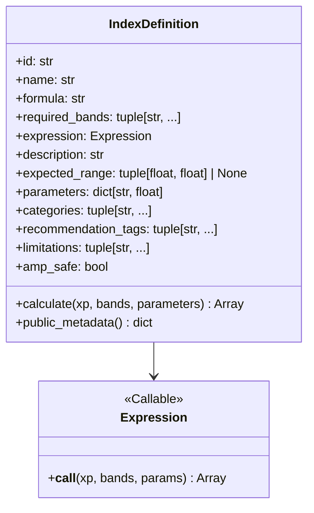
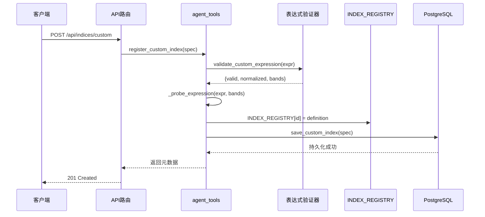

本文档详细阐述植被指数智能分析平台的核心公式管理体系——统一公式注册表（Unified Formula Registry）。该注册表是平台计算引擎体系的基石，通过集中式定义、声明式元数据和跨引擎表达式，实现了35种内置植被指数与动态自定义指数的统一管理。

## 注册表架构与设计原则

统一公式注册表采用**分层架构**，将指数定义、存储管理和运行时注册解耦为三个清晰层次。核心设计理念是**声明式公式定义**，每个指数通过 `IndexDefinition` 数据类描述其元数据、计算逻辑和适用场景，使得公式既可被计算引擎直接执行，也可被API和前端直接展示。

```mermaid
graph TB
    subgraph "声明层"
        A[IndexDefinition 数据类]
        B[35种内置指数定义]
        C[公式表达式 λ(xp, bands, params)]
    end
    
    subgraph "存储层"
        D[INDEX_REGISTRY 字典]
        E[PostgreSQL 自定义指数表]
        F[内存运行时注册]
    end
    
    subgraph "执行层"
        G[NumPy 引擎]
        H[PyTorch 引擎]
        I[Joblib 并行引擎]
    end
    
    subgraph "接口层"
        J[REST API /api/indices]
        K[OGC Processes /processes]
        L[智能体知识检索]
    end
    
    A --> B --> D
    C --> D
    D --> E
    D --> F
    D --> G
    D --> H
    D --> I
    D --> J
    D --> K
    D --> L
```

这种分层架构的核心优势在于**零框架依赖**：公式函数仅依赖传入的数组后端 `xp` 参数，使得同一份定义可由NumPy或PyTorch执行。所有除法统一经过 `safe_divide` 辅助函数，避免无穷值污染计算结果。

Sources: [backend/app/core/indices.py](backend/app/core/indices.py#L1-L12)

## IndexDefinition 数据模型

`IndexDefinition` 是注册表的核心数据结构，采用 `frozen=True` 的 dataclass 设计，确保指数定义的不可变性和线程安全性。该数据类包含以下关键字段：



**字段职责说明**：

| 字段 | 类型 | 职责 | 示例 |
|------|------|------|------|
| `id` | `str` | 唯一标识符，用于API和注册表查找 | `"ndvi"` |
| `name` | `str` | 中文显示名称 | `"归一化植被指数"` |
| `formula` | `str` | 可读公式字符串，用于前端展示 | `"(NIR-Red)/(NIR+Red)"` |
| `required_bands` | `tuple` | 必需的波段标识符列表 | `("nir", "red")` |
| `expression` | `Expression` | 可执行的Python函数，支持多后端 | `_normalized("nir", "red")` |
| `parameters` | `dict` | 可调参数及其默认值 | `{"L": 0.5}` |
| `categories` | `tuple` | 分类标签，用于筛选和推荐 | `("vegetation", "biomass")` |
| `limitations` | `tuple` | 使用限制和注意事项 | `("云、阴影和积雪会影响结果",)` |

`calculate` 方法是公式执行的核心入口，它首先校验必需波段是否齐全，然后合并用户参数与默认参数，最后调用 `expression` 函数执行实际计算。

Sources: [backend/app/core/indices.py](backend/app/core/indices.py#L29-L71)

## 公式表达式设计模式

公式表达式采用**高阶函数**模式，通过 `_ratio`、`_normalized` 等辅助函数生成具体计算逻辑。这种设计既保持了代码简洁性，又确保了跨引擎兼容性。

```python
# 比值公式辅助函数
def _ratio(a: str, b: str) -> Expression:
    return lambda xp, bands, _params: safe_divide(xp, bands[a], bands[b])

# 归一化公式辅助函数  
def _normalized(a: str, b: str) -> Expression:
    return lambda xp, bands, _params: safe_divide(xp, bands[a] - bands[b], bands[a] + bands[b])
```

**公式表达式类型分布**：

| 公式模式 | 数量 | 代表指数 | 特点 |
|----------|------|----------|------|
| 归一化差值 | 8 | NDVI、GNDVI、NDRE | `(A-B)/(A+B)` 结构，结果范围[-1,1] |
| 比值指数 | 5 | RVI、GCI、MSI | `A/B` 结构，需安全除法保护 |
| 复合公式 | 12 | EVI、SAVI、MSAVI | 包含参数和嵌套运算 |
| 变换指数 | 6 | TVI、CTVI、MSR | 包含平方根、绝对值等函数 |
| 可见光指数 | 4 | EXG、GLI、VARI | 仅使用RGB波段 |

所有除法操作统一通过 `safe_divide` 函数处理，该函数在分母绝对值小于 `epsilon`（默认1e-6）时返回安全值，避免除零错误和无穷值传播。

Sources: [backend/app/core/indices.py](backend/app/core/indices.py#L23-L27)

## 注册表初始化与查询机制

注册表在模块导入时自动构建，通过字典推导式将 `INDEX_DEFINITIONS` 元组转换为 `INDEX_REGISTRY` 字典，实现O(1)时间复杂度的指数查找。

```python
INDEX_REGISTRY = {definition.id: definition for definition in INDEX_DEFINITIONS}
CORE_INDEX_COUNT = len(INDEX_DEFINITIONS)

if CORE_INDEX_COUNT < 30:
    raise RuntimeError(f"注册表必须至少包含30种指数，当前为{len(INDEX_REGISTRY)}")
```

**查询接口设计**：

| 函数 | 返回类型 | 使用场景 |
|------|----------|----------|
| `get_index(index_id)` | `IndexDefinition` | 单个指数查询，失败时抛出 `ValueError` |
| `INDEX_REGISTRY.values()` | `IndexDefinition` 集合 | 列表展示和批量处理 |
| `public_metadata()` | `dict` | API响应和前端展示 |

注册表初始化包含**完整性校验**：若内置指数数量少于30个，系统将抛出运行时错误，防止部分指数缺失导致的功能降级。

Sources: [backend/app/core/indices.py](backend/app/core/indices.py#L546-L559)

## 自定义指数动态注册

平台支持运行时注册自定义指数，通过 `register_custom_index` 函数实现**安全验证-内存注册-持久化存储**的三步流程。



**表达式安全验证**是自定义指数的关键环节，采用AST白名单机制：

1. **语法解析**：将表达式字符串解析为抽象语法树（AST）
2. **白名单校验**：遍历AST节点，仅允许预定义的函数、运算符和波段名称
3. **试算验证**：使用测试数据执行表达式，确保返回有限数组
4. **规范化**：将验证通过的表达式转换为标准化形式

允许的函数包括：`abs`、`sqrt`、`minimum`、`maximum`；允许的运算符：`+`、`-`、`*`、`/`、`^`、`()`；允许的波段：`blue`、`green`、`red`、`red_edge`、`nir`、`swir1`、`swir2`。

Sources: [backend/app/services/agent_tools.py](backend/app/services/agent_tools.py#L217-L279), [backend/app/services/advanced_analysis.py](backend/app/services/advanced_analysis.py#L29-L86)

## 持久化存储与恢复

自定义指数支持PostgreSQL持久化存储，通过 `custom_index_store` 模块实现。存储表结构设计如下：

```sql
CREATE TABLE IF NOT EXISTS vegetation_custom_indices (
    id TEXT PRIMARY KEY,
    name TEXT NOT NULL,
    expression TEXT NOT NULL,
    description TEXT NOT NULL DEFAULT '',
    expected_range JSONB,
    categories JSONB NOT NULL DEFAULT '[]'::jsonb,
    recommendation_tags JSONB NOT NULL DEFAULT '[]'::jsonb,
    limitations JSONB NOT NULL DEFAULT '[]'::jsonb,
    created_at TIMESTAMPTZ NOT NULL DEFAULT now(),
    updated_at TIMESTAMPTZ NOT NULL DEFAULT now()
)
```

**存储策略特点**：

| 特性 | 实现方式 | 优势 |
|------|----------|------|
| 幂等写入 | `ON CONFLICT (id) DO UPDATE` | 避免重复注册错误 |
| JSONB字段 | 结构化元数据存储 | 支持复杂查询和索引 |
| 时间戳 | 自动维护 `created_at/updated_at` | 支持版本追踪和排序 |
| 优雅降级 | 数据库不可用时回退到内存 | 保证系统可用性 |

系统启动时通过 `load_persisted_custom_indices` 函数自动恢复已存储的自定义指数，确保重启后指数定义不丢失。

Sources: [backend/app/services/custom_index_store.py](backend/app/services/custom_index_store.py#L18-L31), [backend/app/services/agent_tools.py](backend/app/services/agent_tools.py#L236-L245)

## 引擎集成与执行流程

统一注册表与计算引擎的集成通过 `ComputeEngine` 协议实现。引擎接收 `IndexDefinition` 列表和波段数据，调用指数的 `calculate` 方法执行计算。

```python
class NumpyEngine:
    name = "numpy"
    
    def compute(self, definitions, bands, parameters=None):
        normalized_bands = {name: np.asarray(array, dtype=np.float32) for name, array in bands.items()}
        arrays = {
            definition.id: sanitize_result(
                definition.calculate(np, normalized_bands, (parameters or {}).get(definition.id))
            )
            for definition in definitions
        }
        return EngineResult(arrays=arrays, engine=self.name)
```

**跨引擎兼容性**通过数组后端抽象实现：

| 引擎 | 数组后端 | 适用场景 | 特点 |
|------|----------|----------|------|
| NumPy | `np` | 通用计算，中小数据集 | 基线引擎，兼容性最好 |
| PyTorch | `torch` | GPU加速，大数据集 | 自动微分支持 |
| Joblib | `np` | 分块并行，内存受限 | 多进程并行处理 |

所有引擎共享同一套 `IndexDefinition`，确保计算结果的一致性。引擎选择由 `planner` 模块根据数据规模和硬件能力自动决策。

Sources: [backend/app/engines/base.py](backend/app/engines/base.py#L27-L39), [backend/app/engines/numpy_engine.py](backend/app/engines/numpy_engine.py#L17-L41)

## API接口与前端集成

注册表通过RESTful API暴露给前端和第三方系统，主要接口包括：

| 端点 | 方法 | 功能 | 响应格式 |
|------|------|------|----------|
| `/api/indices` | GET | 列表查询，支持分类和波段筛选 | `{total, items[]}` |
| `/api/indices/{id}` | GET | 单个指数详情 | `IndexMetadata` |
| `/api/indices/custom` | POST | 注册自定义指数 | `IndexMetadata` |
| `/processes` | GET | OGC Processes列表 | `{processes[]}` |
| `/processes/{id}` | GET | OGC Process详情 | `ProcessDescription` |

前端 `IndexCatalog.vue` 组件实现指数目录的可视化展示，包含以下功能：

1. **分类筛选**：基于 `categories` 字段的动态分类导航
2. **关键词搜索**：对ID、名称、描述和公式的全文搜索
3. **公式渲染**：将文本公式转换为分式排版，提升可读性
4. **元数据展示**：波段需求、预期范围、推荐场景和限制说明

前端通过 `usePlatformApi` composable 调用 `/api/indices` 接口获取数据，并将响应映射为 `IndexMetadata` 类型供组件使用。

Sources: [backend/app/api/routes.py](backend/app/api/routes.py#L64-L85), [frontend/src/components/IndexCatalog.vue](frontend/src/components/IndexCatalog.vue#L1-L50)

## 智能体知识检索集成

统一注册表是智能体知识检索的核心数据源。`search_index_knowledge` 函数在内置指数库中执行轻量级RAG召回，为智能体提供指数适用场景、必需波段和限制条件等结构化知识。

```python
for definition in INDEX_REGISTRY.values():
    content = " ".join([
        definition.name, definition.formula, definition.description,
        " ".join(definition.required_bands), " ".join(definition.categories),
        " ".join(definition.recommendation_tags), " ".join(definition.limitations),
    ])
    score = _score(terms, content)
    if score > 0:
        hits.append(KnowledgeHit(
            title=f"{definition.id.upper()} {definition.name}",
            content=_definition_knowledge_content(definition),
            source="index-registry", score=score
        ))
```

**知识检索流程**：

1. **分词处理**：将用户查询和指数元数据分词为术语集合
2. **相关性评分**：基于术语重叠度计算匹配分数
3. **知识结构化**：将指数定义转换为Agent可理解的结构化描述
4. **结果排序**：按相关性分数降序排列，返回Top-K结果

智能体利用这些知识生成分析方案，推荐适合当前影像和用户目标的指数组合。

Sources: [backend/app/services/agent_tools.py](backend/app/services/agent_tools.py#L103-L162)

## 扩展性与维护指南

**添加新内置指数**的步骤：

1. 在 `INDEX_DEFINITIONS` 元组中添加新的 `IndexDefinition` 实例
2. 确保 `expression` 函数仅依赖 `xp`、`bands` 和 `parameters` 参数
3. 为公式中的除法操作使用 `safe_divide` 辅助函数
4. 添加适当的 `categories`、`recommendation_tags` 和 `limitations`
5. 运行测试验证：`pytest backend/tests/test_indices.py`

**自定义指数最佳实践**：

1. **命名规范**：使用小写字母和下划线，长度不超过40字符
2. **波段选择**：仅使用系统支持的7种波段标识符
3. **公式复杂度**：避免嵌套过深，确保表达式可读性
4. **范围定义**：为有明确物理意义的指数设置 `expected_range`
5. **限制说明**：如实描述指数的适用条件和局限性

**故障排查常见问题**：

| 问题现象 | 可能原因 | 解决方案 |
|----------|----------|----------|
| 指数计算结果全为nodata | 波段映射错误 | 检查 `required_bands` 与实际波段名称匹配 |
| 自定义指数注册失败 | 表达式验证不通过 | 使用 `/api/formulas/validate` 预验证 |
| 前端公式显示异常 | 公式格式不标准 | 确保公式符合数学表达式规范 |
| 智能体推荐指数不可执行 | 波段不足 | 检查影像元数据中的波段信息 |

统一公式注册表作为平台的核心基础设施，其设计体现了**单一数据源**、**声明式配置**和**安全隔离**的架构原则。通过集中管理指数定义，平台实现了计算逻辑的一致性、API响应的标准化和智能体知识的结构化，为上层业务提供了坚实的技术基础。