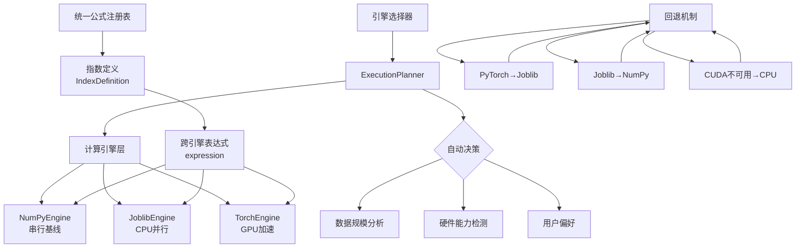
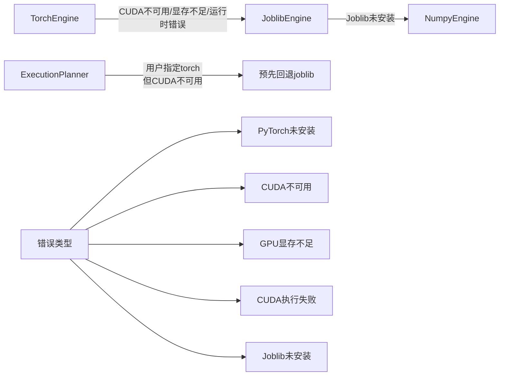

在植被指数智能分析平台中，**多引擎选择与自动回退策略**是计算引擎体系的核心设计，它确保在不同硬件环境和数据规模下都能获得最佳计算性能。该系统通过三层架构实现：**统一公式注册表**提供跨引擎兼容的数学表达式，**智能引擎选择器**根据硬件能力和数据特征自动决策，**多级回退机制**保证计算任务的可靠完成。

## 引擎架构概览

平台支持三种计算引擎，每种引擎针对不同的硬件环境和计算规模进行优化：

| 引擎类型 | 实现库 | 并行策略 | 适用场景 | 性能特点 |
|---------|--------|---------|---------|---------|
| **NumPy** | NumPy | 串行执行 | 小型任务、同步请求 | 最低启动开销，稳定基线 |
| **Joblib** | Joblib | CPU线程并行 | 中大型任务、多核CPU | 线程级并行，内存安全 |
| **PyTorch** | PyTorch | GPU CUDA并行 | 大型任务、多指数计算 | GPU加速，自动混合精度 |



## 统一公式注册表

多引擎兼容性的基础是**统一公式注册表**，它定义了35个植被指数的数学表达式。每个指数定义都包含一个`expression`函数，该函数接受一个数组后端`xp`作为参数，使得同一公式可以在NumPy和PyTorch中无缝执行。

```python
@dataclass(frozen=True, slots=True)
class IndexDefinition:
    id: str
    name: str
    formula: str
    required_bands: tuple[str, ...]
    expression: Expression  # 跨引擎兼容的函数
    description: str
    # ... 其他元数据
```

以NDVI指数为例，其表达式使用`xp`参数调用数组操作：

```python
IndexDefinition(
    "ndvi",
    "归一化植被指数",
    "(NIR-Red)/(NIR+Red)",
    ("nir", "red"),
    _normalized("nir", "red"),  # 使用safe_divide的安全除法
    # ...
)
```

`_normalized`函数返回一个lambda表达式，该表达式使用传入的`xp`参数执行安全除法，确保在NumPy和PyTorch中产生相同的数值结果。

**Sources: [indices.py](backend/app/core/indices.py#L40-L55)**

## 智能引擎选择器

引擎选择由`ExecutionPlanner`类负责，它根据多个维度自动决策最合适的计算引擎。选择算法遵循以下原则：

1. **用户显式请求优先**：如果用户指定特定引擎，优先使用该引擎
2. **小任务避免GPU开销**：像元数少于200万时，优先使用NumPy避免GPU传输开销
3. **大型任务利用GPU**：像元数超过2000万或指数数量≥4时，优先使用PyTorch
4. **中型任务使用CPU并行**：其他情况使用Joblib线程并行

```python
class ExecutionPlanner:
    def choose(
        self,
        width: int,
        height: int,
        band_count: int,
        index_count: int,
        requested: EngineName = "auto",
        is_synchronous: bool = False,
    ) -> ExecutionDecision:
        pixels = width * height
        estimated_memory_mb = pixels * (band_count + index_count) * 4 / 1024**2
        
        # 显式请求处理
        if requested != "auto":
            selected = requested
            reason = f"用户指定{requested}引擎"
            if requested == "torch" and not has_cuda():
                selected = "joblib"
                reason = "用户指定torch，但CUDA不可用，预先回退joblib"
            return ExecutionDecision(requested, selected, reason, estimated_memory_mb)
        
        # 自动决策逻辑
        if is_synchronous or pixels < 2_000_000:
            return ExecutionDecision(
                requested, "numpy", "小型或同步任务优先降低调度开销", estimated_memory_mb
            )
        if has_cuda() and (pixels >= 20_000_000 or index_count >= 4):
            return ExecutionDecision(
                requested, "torch", "大型或多指数任务且检测到CUDA", estimated_memory_mb
            )
        return ExecutionDecision(
            requested, "joblib", "中大型任务使用CPU线程并行", estimated_memory_mb
        )
```

选择器返回一个`ExecutionDecision`对象，包含选择的引擎、决策原因和预估内存使用量，便于后续的监控和调试。

**Sources: [planner.py](backend/app/services/planner.py#L30-L71)**

## 多级回退机制

回退策略是系统可靠性的关键保障，采用**级联回退**模式，确保在任何异常情况下都能完成计算任务：



### PyTorch引擎回退

`TorchEngine`实现了最复杂的回退逻辑，处理多种GPU相关异常：

```python
class TorchEngine:
    def compute(self, definitions, bands, parameters=None) -> EngineResult:
        try:
            import torch
        except ImportError:
            return self._fallback(definitions, bands, parameters, "PyTorch未安装")
        
        if not torch.cuda.is_available():
            return self._fallback(definitions, bands, parameters, "CUDA不可用")
        
        try:
            # GPU计算逻辑...
            return EngineResult(arrays=arrays, engine=self.name)
        except torch.cuda.OutOfMemoryError:
            torch.cuda.empty_cache()
            return self._fallback(definitions, bands, parameters, "GPU显存不足")
        except RuntimeError as error:
            return self._fallback(definitions, bands, parameters, f"CUDA执行失败: {error}")
```

回退函数将任务委托给`JoblibEngine`，并记录回退原因：

```python
@staticmethod
def _fallback(definitions, bands, parameters, reason) -> EngineResult:
    result = JoblibEngine().compute(definitions, bands, parameters)
    result.fallback_reason = f"{reason}，已回退{result.engine}"
    return result
```

### Joblib引擎回退

`JoblibEngine`实现了类似的回退机制，当Joblib库不可用时回退到NumPy：

```python
class JoblibEngine:
    def compute(self, definitions, bands, parameters=None) -> EngineResult:
        try:
            from joblib import Parallel, delayed
        except ImportError:
            fallback = NumpyEngine().compute(definitions, bands, parameters)
            fallback.fallback_reason = "joblib未安装，已回退NumPy"
            return fallback
        # Joblib并行计算逻辑...
```

**Sources: [torch_engine.py](backend/app/engines/torch_engine.py#L70-L118)**，**[joblib_engine.py](backend/app/engines/joblib_engine.py#L30-L59)**

## 引擎实现细节

### NumPy引擎 - 串行基线

`NumpyEngine`是最简单的实现，作为数值正确性的基线和所有回退的最终目标：

```python
class NumpyEngine:
    name = "numpy"
    
    def compute(self, definitions, bands, parameters=None) -> EngineResult:
        normalized_bands = {
            name: np.asarray(array, dtype=np.float32) for name, array in bands.items()
        }
        arrays = {
            definition.id: sanitize_result(
                definition.calculate(np, normalized_bands, (parameters or {}).get(definition.id))
            )
            for definition in definitions
        }
        return EngineResult(arrays=arrays, engine=self.name)
```

关键特性：
- 串行执行所有指数计算
- 统一波段数据为float32类型
- 使用`sanitize_result`清理NaN/Inf值
- 作为数值正确性的参考基准

**Sources: [numpy_engine.py](backend/app/engines/numpy_engine.py#L20-L42)**

### Joblib引擎 - CPU并行

`JoblibEngine`利用Joblib库实现线程级并行，适合多核CPU环境：

```python
class JoblibEngine:
    name = "joblib"
    
    def __init__(self, workers: int | None = None) -> None:
        self.workers = workers or max(1, min(8, (os.cpu_count() or 2) - 1))
    
    def compute(self, definitions, bands, parameters=None) -> EngineResult:
        # ... 回退检查 ...
        
        def calculate(definition: IndexDefinition) -> tuple[str, np.ndarray]:
            result = definition.calculate(np, normalized_bands, (parameters or {}).get(definition.id))
            return definition.id, sanitize_result(result)
        
        results = Parallel(n_jobs=self.workers, prefer="threads", batch_size="auto")(
            delayed(calculate)(definition) for definition in definitions
        )
        return EngineResult(arrays=dict(results), engine=self.name)
```

优化策略：
- 自动检测CPU核心数，设置合理的工作线程数（最大8）
- 使用`prefer="threads"`避免进程间数据序列化开销
- `batch_size="auto"`自动优化任务调度

**Sources: [joblib_engine.py](backend/app/engines/joblib_engine.py#L20-L59)**

### PyTorch引擎 - GPU加速

`TorchEngine`实现了最复杂的GPU计算逻辑，包含自动混合精度和显存管理：

```python
class TorchEngine:
    name = "torch"
    
    def __init__(self, allow_amp: bool = False) -> None:
        self.allow_amp = allow_amp
    
    def compute(self, definitions, bands, parameters=None) -> EngineResult:
        # ... 导入和CUDA检查 ...
        
        device = torch.device("cuda")
        tensor_bands = {
            name: torch.as_tensor(array, dtype=torch.float32, device=device)
            for name, array in bands.items()
        }
        xp = TorchArrayAPI(torch)  # 轻量数组API适配器
        
        amp_enabled = self.allow_amp and all(item.amp_safe for item in definitions)
        amp_context = (
            torch.autocast(device_type="cuda", dtype=torch.float16)
            if amp_enabled
            else nullcontext()
        )
        
        arrays: dict[str, np.ndarray] = {}
        with torch.inference_mode(), amp_context:
            for definition in definitions:
                result = definition.calculate(xp, tensor_bands, ...)
                arrays[definition.id] = sanitize_result(result.float().cpu().numpy())
        
        return EngineResult(arrays=arrays, engine=self.name)
```

GPU优化特性：
- `TorchArrayAPI`适配器补齐公式所需的数组操作
- `torch.inference_mode()`禁用梯度计算，节省显存
- 可选自动混合精度（AMP）支持，进一步优化性能
- 显存不足时自动清理缓存并回退

**Sources: [torch_engine.py](backend/app/engines/torch_engine.py#L20-L118)**

## 流水线集成

引擎选择和回退机制通过`RasterPipeline`集成到完整的处理流程中：

```python
class RasterPipeline:
    def run(self, task: RasterTask, ...) -> dict[str, Any]:
        # 1. 引擎选择决策
        decision = self.planner.choose(
            source.width, source.height, len(required_bands), len(definitions),
            task.engine, task.synchronous
        )
        engine = self._create_engine(decision.selected)
        
        # 2. 窗口处理循环
        for window in windows:
            # 读取波段数据
            # 计算指数
            result = engine.compute(definitions, arrays, task.parameters)
            actual_engine = result.engine
            if result.fallback_reason:
                fallback_reasons.append(result.fallback_reason)
        
        # 3. 清单记录
        manifest = {
            "requestedEngine": task.engine,
            "selectedEngine": decision.selected,
            "actualEngine": actual_engine,
            "selectionReason": decision.reason,
            "fallbackReasons": sorted(set(fallback_reasons)),
            # ... 其他信息
        }
```

清单文件完整记录了引擎选择的全过程，包括请求的引擎、实际选择的引擎、回退原因等，便于调试和性能分析。

**Sources: [raster_pipeline.py](backend/app/services/raster_pipeline.py#L50-L100)**

## 数值一致性保障

多引擎架构的核心挑战是确保不同引擎产生完全一致的数值结果。平台通过以下机制保障数值一致性：

1. **统一数据类型**：所有引擎都使用float32作为计算数据类型
2. **安全除法**：`safe_divide`函数防止除零错误，确保数值稳定性
3. **结果清洗**：`sanitize_result`统一处理NaN/Inf值
4. **基线验证**：测试用例验证Joblib和PyTorch引擎与NumPy基线的一致性

```python
def test_joblib_matches_numpy() -> None:
    definitions = [get_index("ndvi"), get_index("evi"), get_index("msavi")]
    expected = NumpyEngine().compute(definitions, BANDS).arrays
    actual = JoblibEngine(workers=2).compute(definitions, BANDS).arrays
    for index_id in expected:
        np.testing.assert_allclose(actual[index_id], expected[index_id], rtol=1e-6)

def test_torch_engine_falls_back_or_matches() -> None:
    definition = [get_index("ndvi")]
    expected = NumpyEngine().compute(definition, BANDS).arrays["ndvi"]
    result = TorchEngine().compute(definition, BANDS)
    np.testing.assert_allclose(result.arrays["ndvi"], expected, rtol=1e-5)
```

**Sources: [test_indices.py](backend/tests/test_indices.py#L50-L74)**

## 性能基准测试

平台包含专门的基准测试脚本，用于评估不同引擎在不同数据规模下的性能表现：

```python
def run(size: int, repeats: int) -> list[dict[str, object]]:
    # 生成随机测试数据
    bands = {name: random.uniform(0.05, 0.9, (size, size)).astype(np.float32) 
             for name in ("blue", "green", "red", "red_edge", "nir", "swir1", "swir2")}
    definitions = [get_index(item) for item in ("ndvi", "evi", "gndvi", "savi", "ndmi")]
    
    # 以NumPy结果为基准
    baseline = NumpyEngine().compute(definitions, bands).arrays
    
    records = []
    for engine in (NumpyEngine(), JoblibEngine(), TorchEngine()):
        # 测量平均执行时间
        durations = []
        for _ in range(repeats):
            started = perf_counter()
            result = engine.compute(definitions, bands)
            durations.append(perf_counter() - started)
        
        # 计算最大数值误差
        max_error = max(float(np.max(np.abs(result.arrays[key] - baseline[key]))) 
                       for key in baseline)
        
        records.append({
            "engine": result.engine,
            "meanSeconds": sum(durations) / len(durations),
            "maxError": max_error,
            "fallbackReason": result.fallback_reason,
        })
    return records
```

基准测试结果可用于：
- 验证引擎选择算法的合理性
- 识别性能瓶颈和优化机会
- 为不同硬件环境提供配置建议

**Sources: [benchmark.py](backend/scripts/benchmark.py#L20-L63)**

## 配置与调优

引擎选择支持通过API参数进行灵活配置：

| 参数 | 类型 | 默认值 | 说明 |
|------|------|--------|------|
| `engine` | `EngineName` | `"auto"` | 引擎选择策略 |
| `block_size` | `int` | `1024` | 分块处理窗口大小 |
| `synchronous` | `bool` | `False` | 是否同步执行 |

`EngineName`类型定义为：`Literal["auto", "numpy", "joblib", "torch"]`

调优建议：
- **小型数据集**（<200万像元）：使用`engine="numpy"`避免调度开销
- **中型数据集**（200万-2000万像元）：使用`engine="joblib"`利用多核CPU
- **大型数据集**（>2000万像元）：使用`engine="torch"`尝试GPU加速
- **同步请求**：设置`synchronous=True`强制使用NumPy引擎

## 故障诊断与监控

系统提供完善的监控和诊断机制：

1. **清单文件**：每个任务生成`manifest.json`，记录完整的引擎选择过程
2. **回退原因**：详细记录每次回退的具体原因
3. **性能指标**：记录执行时间、内存使用等关键指标
4. **错误日志**：捕获并记录所有引擎相关的异常

示例清单输出：
```json
{
  "requestedEngine": "auto",
  "selectedEngine": "torch",
  "actualEngine": "joblib",
  "selectionReason": "大型或多指数任务且检测到CUDA",
  "fallbackReasons": ["GPU显存不足，已回退joblib"],
  "durationSeconds": 12.345,
  "runtime": {
    "python": "3.10.0",
    "platform": "Windows-10"
  }
}
```

## 与其他组件的关联

多引擎选择与自动回退策略是计算引擎体系的核心组件，与以下组件紧密关联：

- **[统一公式注册表与指数定义](7-tong-gong-shi-zhu-ce-biao-yu-zhi-shu-ding-yi)**：提供跨引擎兼容的数学表达式
- **[Rasterio 分块读写与内存安全](9-rasterio-fen-kuai-du-xie-yu-nei-cun-an-quan)**：负责数据分块和内存管理
- **[同步执行与 Celery 异步任务管道](17-tong-bu-zhi-xing-yu-celery-yi-bu-ren-wu-guan-dao)**：集成异步任务调度

通过这种分层设计，平台实现了**透明的多引擎切换**，开发者无需关心底层硬件差异，系统自动选择最优的计算路径，同时保证在任何环境下都能可靠完成计算任务。