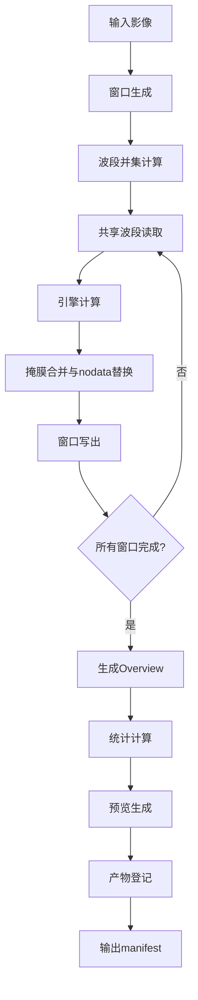

本文档详细阐述植被指数智能分析平台中 Rasterio 分块读写的核心架构、内存安全机制、波段共享策略以及计算引擎协同工作原理。通过系统性的分块处理设计，平台能够高效处理大规模遥感影像，同时确保内存使用可控且可预测。

## 分块读写架构设计

平台的分块读写核心实现在 `RasterPipeline` 类中，该类协调了窗口生成、波段读取、引擎计算、结果写出和产物登记的完整流程。这种设计将大型栅格数据的处理分解为可管理的窗口单元，避免了整幅影像一次性载入内存的风险。



分块大小通过 `RasterTask.block_size` 参数控制，限制在 128 至 2048 像素之间。实际写出时，GeoTIFF 的分块大小需要满足 TIFF 规范要求（必须是 16 的倍数），如果用户指定的值不满足要求，系统会使用稳定的 1024 作为写出块大小，但计算窗口仍使用用户请求值，两者职责彼此独立。

**Sources: [raster_pipeline.py](backend/app/services/raster_pipeline.py#L159-L173)**

## 内存安全机制

### 窗口化读取策略

平台采用严格的窗口化读取策略，确保每次只处理影像的一个小块。窗口生成逻辑基于影像尺寸和指定的块大小，按行优先顺序遍历整个影像区域：

```python
windows = [
    Window(
        column,
        row,
        min(block_size, source.width - column),
        min(block_size, source.height - row),
    )
    for row in range(0, source.height, block_size)
    for column in range(0, source.width, block_size)
]
```

这种设计保证了无论输入影像有多大，单次内存占用都与块大小的平方成正比，而非与影像总面积成正比。

**Sources: [raster_pipeline.py](backend/app/services/raster_pipeline.py#L181-L190)**

### 波段并集优化

当用户请求计算多个指数时，系统首先计算所有指数所需波段的并集。这样在同一个窗口内，每个物理波段只读取一次，多个指数可以共享读取的数组数据，避免了"指数数量 × 磁盘读取次数"的 I/O 放大问题：

```python
required_bands = sorted({band for item in definitions for band in item.required_bands})
```

这种共享读取策略显著减少了磁盘 I/O 操作次数，对于需要计算多个指数的场景性能提升明显。

**Sources: [raster_pipeline.py](backend/app/services/raster_pipeline.py#L135-L138)**

## 无效值统一处理

平台建立了统一的无效值处理流水线，确保所有计算引擎使用相同的语义：

1. **输入阶段**：Rasterio mask（值为 0 表示无效）和源 nodata 值都被标记为无效
2. **计算阶段**：所有无效像元统一转换为 NaN，使所有数组引擎使用相同语义
3. **输出阶段**：计算结果中的 NaN 再转换为固定的 nodata 值（-9999.0）

```python
# 第199-208行：无效值处理逻辑
invalid_mask = source.read_masks(band_number, window=window) == 0
if source.nodata is not None:
    invalid_mask |= np.isclose(array, source.nodata)
array[invalid_mask] = np.nan
arrays[logical_name] = array
masks.append(invalid_mask)
```

这种设计避免了不同指数对同一像元产生矛盾的有效区域判断，提高了结果的可靠性。

**Sources: [raster_pipeline.py](backend/app/services/raster_pipeline.py#L199-L209)**

## 计算引擎协同

平台实现了三种计算引擎，它们共享相同的分块读写基础设施：

| 引擎 | 并行策略 | 适用场景 | 内存特点 |
|------|----------|----------|----------|
| **NumpyEngine** | 顺序执行 | 小型任务、同步请求、兼容性基线 | 内存占用最低 |
| **JoblibEngine** | 线程并行 | 中大型任务、CPU并行计算 | 多线程共享内存 |
| **TorchEngine** | GPU计算 | 大型任务、CUDA可用时 | 需要GPU显存 |

引擎选择由 `ExecutionPlanner` 根据数据规模、指数数量和硬件能力自动决策：

```python
# 第60-70行：引擎选择逻辑
if is_synchronous or pixels < 2_000_000:
    return ExecutionDecision(
        requested, "numpy", "小型或同步任务优先降低调度开销", estimated_memory_mb
    )
if has_cuda() and (pixels >= 20_000_000 or index_count >= 4):
    return ExecutionDecision(
        requested, "torch", "大型或多指数任务且检测到CUDA", estimated_memory_mb
    )
return ExecutionDecision(
    requested, "joblib", "中大型任务使用CPU线程并行", estimated_memory_mb
)
```

**Sources: [planner.py](backend/app/services/planner.py#L60-L70)**

## 输出格式与分块优化

输出的 GeoTIFF 文件经过精心配置以优化后续访问性能：

1. **TIFF分块**：使用 `tiled=True` 模式，支持随机访问窗口
2. **压缩算法**：使用 deflate 压缩（`compress="deflate"`）减少文件大小
3. **预测器**：使用浮点预测器（`predictor=3`）提高压缩比
4. **大数据支持**：通过 `BIGTIFF="IF_SAFER"` 支持超过 4GB 的文件
5. **Overview生成**：计算完成后自动生成 2、4、8、16 倍降采样概览

```python
profile.update(
    driver="GTiff",
    count=1,
    dtype="float32",
    nodata=self.nodata,
    compress="deflate",
    predictor=3,
    tiled=True,
    blockxsize=block_size if block_size % 16 == 0 else 1024,
    blockysize=block_size if block_size % 16 == 0 else 1024,
    BIGTIFF="IF_SAFER",
)
```

**Sources: [raster_pipeline.py](backend/app/services/raster_pipeline.py#L162-L173)**

## 进度报告与取消机制

平台提供了细粒度的进度报告和任务取消支持：

1. **进度回调**：基于已完成窗口数计算进度百分比，避免虚假百分比
2. **取消检查**：每个窗口计算前检查取消标志，支持优雅终止
3. **吞吐量估算**：计算已完成窗口数与耗时的比值，提供 ETA 预测

```python
for current, window in enumerate(windows, start=1):
    if is_cancelled and is_cancelled():
        raise RuntimeError("任务已取消")
    # ... 计算逻辑 ...
    if on_progress:
        on_progress(current, len(windows), f"正在计算窗口 {current}/{len(windows)}")
```

**Sources: [raster_pipeline.py](backend/app/services/raster_pipeline.py#L194-L221)**

## 产物溯源与可复现性

每个处理任务都会生成完整的 manifest 文件，记录所有关键参数和决策：

1. **输入溯源**：源文件路径和 SHA256 哈希
2. **参数记录**：请求的指数、波段映射、计算参数
3. **引擎决策**：请求引擎、选择引擎、回退原因
4. **运行时信息**：Python 版本、操作系统平台
5. **产物清单**：所有输出文件的路径、统计信息和元数据

这种设计确保了结果的可复现性，便于问题诊断和性能优化。

**Sources: [raster_pipeline.py](backend/app/services/raster_pipeline.py#L275-L300)**

## 性能优化策略

### 波段读取共享

通过计算波段并集，系统避免了为每个指数重复读取相同波段。假设一个影像有 4 个波段，需要计算 10 个指数，传统方式需要读取 40 次波段数据，而共享读取只需要 4 次，I/O 效率提升 10 倍。

### 引擎自适应选择

系统根据任务规模自动选择最优引擎：
- **小影像（< 200万像素）**：使用 NumpyEngine 避免并行开销
- **中型影像**：使用 JoblibEngine 进行 CPU 并行计算
- **大型影像（≥ 2000万像素）**：在 CUDA 可用时使用 TorchEngine 进行 GPU 加速

### 内存使用估算

`ExecutionPlanner` 会估算任务的内存使用量，帮助用户理解资源需求：

```python
estimated_memory_mb = pixels * (band_count + index_count) * 4 / 1024**2
```

**Sources: [planner.py](backend/app/services/planner.py#L50-L51)**

## 测试验证

平台通过 `test_raster_pipeline.py` 验证分块读写的空间几何保持性：

1. **尺寸保持**：输出影像尺寸与输入一致
2. **坐标参考系统保持**：CRS 信息正确传递
3. **数值精度**：计算结果在容差范围内与预期值一致
4. **引擎一致性**：不同引擎计算结果保持数值一致性

```python
def test_windowed_raster_pipeline_preserves_geometry(tmp_path: Path) -> None:
    # ... 测试数据准备 ...
    result = RasterPipeline().run(task)
    with rasterio.open(result["products"][0]["path"]) as output:
        assert (output.width, output.height) == (64, 64)
        assert output.crs.to_string() == "EPSG:4326"
        np.testing.assert_allclose(output.read(1), 0.4, atol=1e-5)
```

**Sources: [test_raster_pipeline.py](backend/tests/test_raster_pipeline.py#L16-L54)**

## 部署与配置

在容器化部署中，分块读写配置可以通过环境变量调整：

| 配置项 | 默认值 | 说明 |
|--------|--------|------|
| `VIP_CELERY_ALWAYS_EAGER` | `true` | 开发模式使用线程池，生产模式使用 Celery |
| `VIP_DATA_DIR` | `data` | 数据存储目录 |
| `VIP_MINIO_ENABLED` | `false` | 是否启用 MinIO 对象存储 |

生产环境推荐配置：
- 使用 Celery 异步任务队列
- 启用 MinIO 对象存储管理工件
- 根据硬件配置调整 Worker 并发数
- 为 GPU Worker 分配专用 NVIDIA 设备

**Sources: [settings.py](backend/app/settings.py#L14-L44)**

## 最佳实践建议

### 块大小选择

1. **小影像（< 1000×1000）**：使用默认值 1024
2. **中等影像（1000×1000 - 10000×10000）**：使用 512-1024
3. **大影像（> 10000×10000）**：使用 256-512，减少单次内存占用

### 引擎选择指南

1. **开发测试**：使用 `numpy` 引擎确保兼容性
2. **批量处理**：使用 `joblib` 引擎提高 CPU 利用率
3. **大规模计算**：确保 CUDA 可用，使用 `torch` 引擎加速

### 内存监控

1. 监控 Worker 进程的内存使用情况
2. 根据可用内存调整 Celery Worker 并发数
3. 为大型任务分配专用 Worker 节点

## 与相关模块的集成

### 与指数注册表集成

分块读写系统与指数注册表紧密集成，确保：
- 波段映射正确传递
- 参数正确合并
- 计算结果正确清洗

**Sources: [indices.py](backend/app/core/indices.py#L45-L56)**

### 与任务管理系统集成

分块进度与任务管理系统集成，提供：
- 实时进度更新
- 预计剩余时间
- 吞吐量统计
- 任务取消支持

**Sources: [jobs.py](backend/app/services/jobs.py#L107-L152)**

### 与资产存储系统集成

输出产物自动上传到 MinIO 对象存储，支持：
- 结果文件持久化
- 预览图生成
- 文件元数据管理

**Sources: [raster_pipeline.py](backend/app/services/raster_pipeline.py#L250-L260)**

## 扩展与定制

### 自定义分块策略

可以通过继承 `RasterPipeline` 类实现自定义分块策略，例如：
- 自适应分块大小
- 基于内容复杂度的分块
- 多分辨率分块

### 新引擎集成

添加新计算引擎需要：
1. 实现 `ComputeEngine` 协议
2. 在 `ExecutionPlanner` 中添加选择逻辑
3. 更新相关测试和文档

**Sources: [base.py](backend/app/engines/base.py#L27-L39)**

## 总结

Rasterio 分块读写与内存安全机制是植被指数智能分析平台的核心基础设施之一。通过精心设计的窗口化读取、波段共享、引擎协同和产物溯源系统，平台能够安全、高效地处理大规模遥感影像数据，同时保证结果的可靠性和可复现性。这种设计不仅满足了当前任务需求，也为未来的功能扩展奠定了坚实基础。