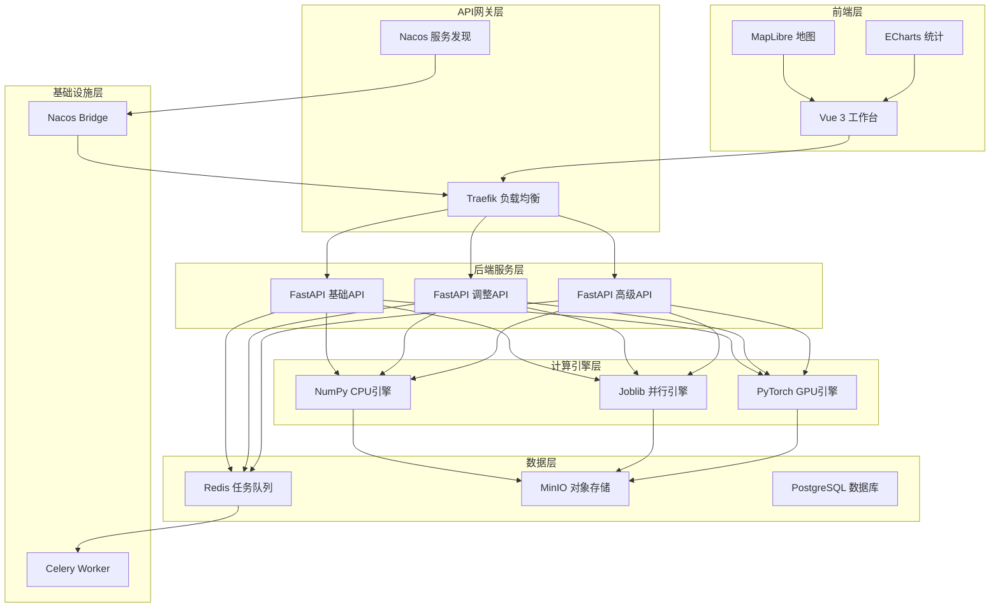
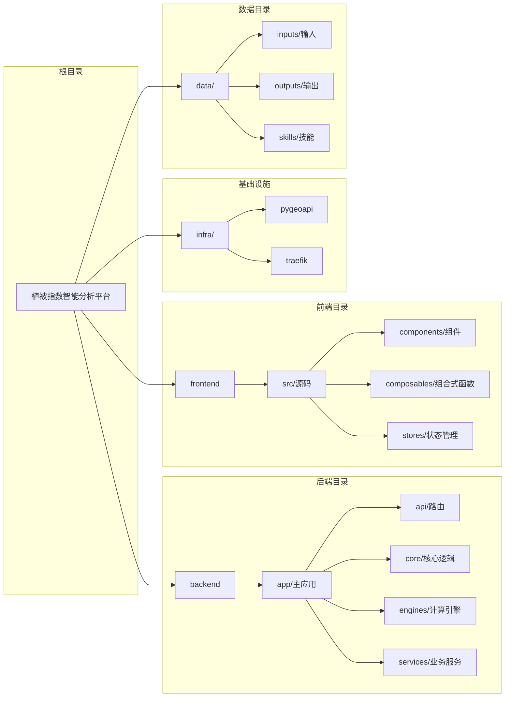
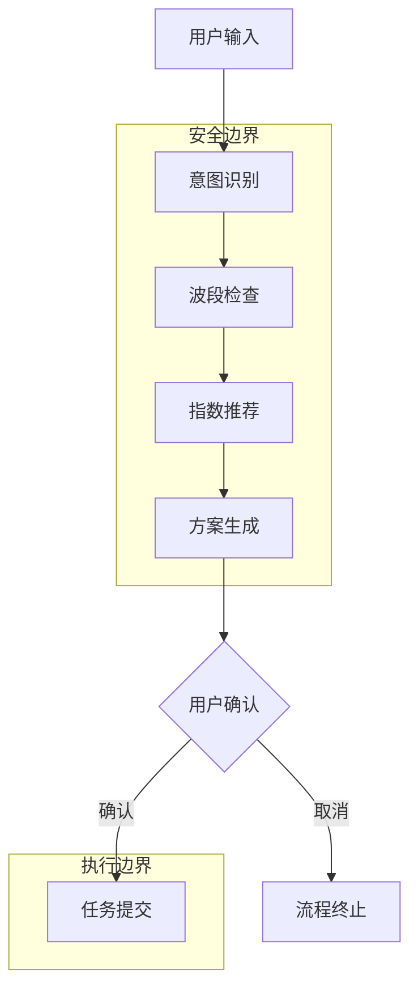

植被指数智能分析平台是一个面向遥感植被分析的实习项目，提供30种植被指数、多引擎分块计算、OGC兼容服务和智能方案推荐。本文档将帮助你快速了解项目的核心能力、技术架构和组织结构，为深入学习奠定基础。

## 核心能力概览

本平台的核心价值在于将复杂的遥感分析任务转化为用户友好的Web服务。平台支持**30种植被指数**的自动计算，包括NDVI、EVI、SAVI等常用指数，通过统一注册表实现公式复用。

**多引擎计算架构**是平台的关键创新。同一份公式定义可以同时驱动NumPy、Joblib和PyTorch三种计算后端，系统会根据数据规模和硬件条件自动选择最优引擎。当CUDA不可用或显存不足时，平台会无缝回退到CPU计算。

**OGC API - Processes兼容接口**确保平台遵循行业标准，支持同步执行、Celery异步执行、五级优先队列、进度查询和任务取消。这意味着平台可以轻松集成到现有的地理空间工作流中。

**智能分析代理**采用规则优先、LLM可插拔的架构，能够理解用户意图、检查波段匹配、推荐适合的指数方案，并在用户确认后才提交计算任务。

**可视化工作台**基于Vue 3和MapLibre构建，提供地图叠加、任务面板、指数目录和ECharts统计图，支持日间/夜间双主题和响应式设计。

Sources: [README.md](README.md#L1-L20)

## 技术架构

平台采用前后端分离架构，后端使用Python FastAPI框架，前端使用Vue 3 + TypeScript。容器化部署通过Docker Compose编排，包含API服务、Worker进程、Redis、MinIO、Nacos和Traefik等多个组件。



Sources: [compose.yml](compose.yml#L1-L192), [backend/app/main.py](backend/app/main.py#L1-L55)

## 项目结构

项目采用清晰的目录结构，分离关注点，便于维护和扩展：



### 后端核心模块

后端代码组织在`backend/app/`目录下，主要模块包括：

- **api/**: FastAPI路由和请求/响应模式定义
- **core/**: 植被指数注册表和核心计算逻辑
- **engines/**: NumPy、Joblib、PyTorch三种计算引擎实现
- **services/**: 业务服务层，包括任务管理、智能体、资产处理等
- **celery_app.py**: Celery异步任务配置
- **settings.py**: 应用配置管理

Sources: [backend/app/main.py](backend/app/main.py#L1-L55), [backend/app/settings.py](backend/app/settings.py#L1-L33)

### 前端核心模块

前端代码组织在`frontend/src/`目录下，采用Vue 3 Composition API：

- **components/**: 8个核心组件，包括地图工作台、智能体抽屉、任务面板等
- **composables/**: 可复用的组合式函数，如API调用、主题管理
- **stores/**: Pinia状态管理，维护工作区状态
- **types/**: TypeScript类型定义

Sources: [frontend/src/App.vue](frontend/src/App.vue#L1-L200)

## 技术栈详情

### 后端技术栈

| 技术领域 | 技术选型 | 版本要求 | 主要用途 |
|---------|---------|---------|---------|
| Web框架 | FastAPI | 0.115+ | RESTful API服务 |
| 任务队列 | Celery + Redis | 5.4+ | 异步任务处理 |
| 计算引擎 | NumPy, Joblib, PyTorch | 2.0+, 1.4+, 2.6+ | 多后端计算 |
| 栅格处理 | Rasterio | 1.4+ | GeoTIFF读写和处理 |
| 对象存储 | MinIO | 7.2+ | 资产文件存储 |
| 服务发现 | Nacos | 2.4.3 | 服务注册与发现 |
| 配置管理 | Pydantic Settings | 2.7+ | 类型安全配置 |
| 监控 | Prometheus Client | 0.21+ | 指标收集 |

Sources: [backend/pyproject.toml](backend/pyproject.toml#L1-L52)

### 前端技术栈

| 技术领域 | 技术选型 | 版本要求 | 主要用途 |
|---------|---------|---------|---------|
| 框架 | Vue 3 | 3.5+ | 用户界面构建 |
| 状态管理 | Pinia | 3.0+ | 应用状态管理 |
| 地图引擎 | MapLibre GL | 5.6+ | 地图渲染和交互 |
| 图表库 | ECharts | 5.6+ | 数据可视化 |
| 构建工具 | Vite | 7.0+ | 开发服务器和构建 |
| 类型检查 | TypeScript | 5.8+ | 类型安全 |

Sources: [frontend/package.json](frontend/package.json#L1-L28)

## 核心功能特性

### 1. 植被指数计算

平台支持30种植被指数，通过统一注册表管理。指数定义包含公式、所需波段、预期范围、参数等元数据。

```python
# 指数定义示例
IndexDefinition(
    id="ndvi",
    name="归一化植被指数",
    formula="(NIR-Red)/(NIR+Red)",
    required_bands=("NIR", "Red"),
    expected_range=(-1.0, 1.0),
    categories=("vegetation",),
    recommendation_tags=("growth", "health")
)
```

Sources: [backend/app/core/indices.py](backend/app/core/indices.py#L1-L80)

### 2. 多引擎计算

平台实现三种计算引擎，支持自动选择和回退：

| 引擎 | 适用场景 | 并行方式 | 显存需求 |
|------|---------|---------|---------|
| NumPy | 小规模数据、CPU环境 | 单线程 | 无 |
| Joblib | 中等规模数据、CPU并行 | 多进程 | 无 |
| PyTorch | 大规模数据、GPU加速 | CUDA并行 | 需要 |

系统根据数据大小和硬件条件自动选择最优引擎，当CUDA不可用时自动回退到CPU引擎。

### 3. 异步任务管理

通过Celery实现五级优先队列任务系统：

| 优先级 | 队列名称 | 适用场景 | 响应时间 |
|--------|---------|---------|---------|
| 1 | urgent | 紧急任务 | 秒级 |
| 2 | high | 高优先级 | 秒级 |
| 3 | normal | 普通任务 | 分钟级 |
| 4 | low | 低优先级 | 分钟级 |
| 5 | batch | 批量任务 | 小时级 |

### 4. 智能分析代理

智能体系统采用分层架构，确保安全性和可解释性：



智能体只负责意图分类、波段检查、指数推荐和结构化方案生成，不生成任意代码，不接收任意输出路径，也不会在用户确认前提交计算。

## 容器化部署

平台提供完整的Docker Compose编排方案，包含以下服务：

| 服务名称 | 镜像/构建 | 端口 | 主要功能 |
|---------|---------|------|---------|
| traefik | traefik:v3.4 | 8080, 8081 | 反向代理和负载均衡 |
| frontend | 自定义构建 | 80 | Vue前端应用 |
| api-basic | 自定义构建 | 8000 | 基础API服务 |
| api-adjusted | 自定义构建 | 8000 | 调整API服务 |
| api-advanced | 自定义构建 | 8000 | 高级API服务 |
| worker-numpy | 自定义构建 | - | NumPy计算Worker |
| worker-joblib | 自定义构建 | - | Joblib计算Worker |
| worker-gpu | GPU构建 | - | PyTorch GPU Worker |
| redis | redis:7.4-alpine | 6379 | 任务队列和缓存 |
| minio | minio/minio | 9000, 9001 | 对象存储服务 |
| nacos | nacos/nacos-server | 8848 | 服务发现和配置 |
| nacos-bridge | 自定义构建 | - | Nacos-Traefik桥接 |

Sources: [compose.yml](compose.yml#L1-L192)

## 开发环境要求

### 本地开发环境

- **Python**: 3.11+ (推荐使用Miniconda管理环境)
- **Node.js**: 18+ (前端开发)
- **CUDA**: 11.8+ (可选，用于GPU加速)
- **Docker Desktop**: 4.0+ (容器化部署)
- **NVIDIA Container Toolkit**: 最新版本 (GPU容器支持)

### 关键依赖版本

- **PyTorch**: 2.11.0+cu128 (CUDA 12.8支持)
- **FastAPI**: 0.115+
- **Vue**: 3.5+
- **MapLibre GL**: 5.6+

## 快速开始指南

### 1. 环境准备

```powershell
# 后端环境配置
cd D:\Users\24658\Desktop\软件工程\实习\backend
D:\miniconda\Scripts\conda.exe create -n giskeshe python=3.11 -y
D:\miniconda\Scripts\conda.exe run -n giskeshe python -m pip install -e ".[dev]"
D:\miniconda\Scripts\conda.exe run -n giskeshe python -m pip install torch torchvision torchaudio --index-url https://download.pytorch.org/whl/cu128
```

### 2. 启动后端服务

```powershell
cd D:\Users\24658\Desktop\软件工程\实习\backend
D:\miniconda\envs\giskeshe\python.exe -m uvicorn app.main:app --host 127.0.0.1 --port 8011 --reload
```

### 3. 启动前端服务

```powershell
cd D:\Users\24658\Desktop\软件工程\实习\frontend
npm install
npm run dev -- --host 127.0.0.1 --port 5174
```

### 4. 访问应用

浏览器访问 `http://127.0.0.1:5174`，即可开始使用植被指数智能分析平台。

## 主要API接口

平台提供RESTful API和OGC兼容接口：

| 接口路径 | 方法 | 功能描述 |
|---------|------|---------|
| `/api/indices` | GET | 获取所有植被指数列表 |
| `/processes` | GET | OGC标准进程列表 |
| `/processes/{indexId}/execution` | POST | 执行指数计算 |
| `/processes/batch/execution` | POST | 批量执行计算 |
| `/jobs/{jobId}` | GET | 查询任务状态 |
| `/jobs/{jobId}/results` | GET | 获取任务结果 |
| `/api/assets/inspect` | POST | 检查栅格资产 |
| `/api/agent/plan` | POST | 创建智能体方案 |
| `/api/formulas/validate` | POST | 验证自定义公式 |
| `/api/analysis/change` | POST | 变化检测分析 |
| `/api/analysis/zonal-statistics` | POST | 区域统计分析 |

Sources: [backend/app/api/routes.py](backend/app/api/routes.py#L1-L200)

## 测试与质量保证

平台包含完整的测试套件和基准测试：

```powershell
# 后端测试
cd backend
pytest
ruff check .

# 前端构建检查
cd frontend
npm run build

# 性能基准测试
python scripts/benchmark.py --size 2048 --repeats 3
```

测试覆盖30种指数、真实GeoTIFF同步/异步/批量执行、错误波段处理、变化检测、区域统计和智能体功能。

## 下一步阅读建议

基于你的学习目标，建议按以下顺序深入探索：

### 入门路径
1. **[快速开始](2-kuai-su-kai-shi)** - 详细的安装和配置指南
2. **[后端环境配置](3-hou-duan-huan-jing-pei-zhi)** - Python环境和依赖管理
3. **[前端环境配置](4-qian-duan-huan-jing-pei-zhi)** - Node.js和Vue开发环境

### 核心功能路径
1. **[植被指数计算](6-zhi-bei-zhi-shu-ji-suan)** - 指数注册表和计算引擎详解
2. **[智能体交互](7-zhi-neng-ti-jiao-hu)** - 智能分析代理工作原理
3. **[任务管理](8-ren-wu-guan-li)** - 异步任务和队列系统

### 架构深入路径
1. **[系统架构](9-xi-tong-jia-gou)** - 整体架构设计和组件关系
2. **[后端架构](10-hou-duan-jia-gou)** - FastAPI服务层和业务逻辑
3. **[前端架构](11-qian-duan-jia-gou)** - Vue组件和状态管理

### 运维部署路径
1. **[容器化部署](5-rong-qi-hua-bu-shu)** - Docker Compose部署详解
2. **[服务发现与负载均衡](31-fu-wu-fa-xian-yu-fu-zai-jun-heng)** - Nacos和Traefik配置
3. **[性能基准测试](32-xing-neng-ji-zhun-ce-shi)** - 性能测试和优化

## 项目边界与限制

在开始深入学习前，请了解以下项目边界：

- **不包含**身份认证、多租户、计费和生产级高可用
- **时序变化检测**的数据配准与辐射归一化需要上游保证
- **pygeoapi插件**和配置位于`backend/app/pygeoapi_processor.py`与`infra/pygeoapi/config.yml`
- **Traefik不原生支持Nacos**，本项目通过`app.nacos_bridge`原子生成File Provider配置

Sources: [README.md](README.md#L100-L113)

## 总结

植被指数智能分析平台是一个功能完整、架构清晰的遥感分析Web应用。通过本文档，你已经了解了平台的核心能力、技术架构、项目结构和主要功能。现在可以按照建议的阅读路径，深入探索你感兴趣的领域。

无论你是想了解植被指数计算原理、学习智能体设计模式，还是掌握Vue 3前端开发，这个平台都提供了丰富的学习素材和实践机会。开始你的探索之旅吧！