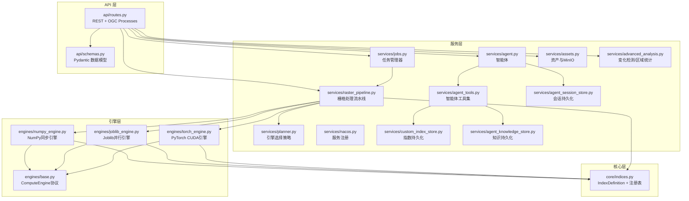
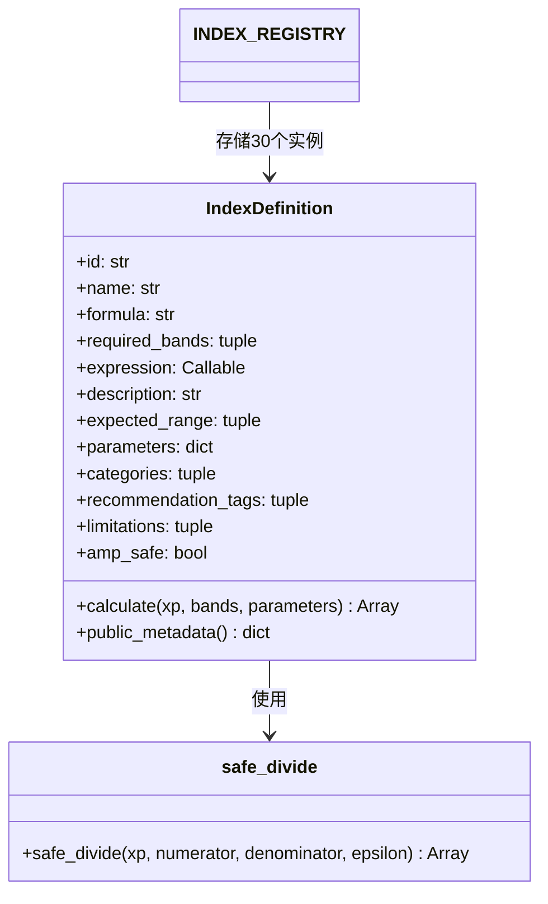
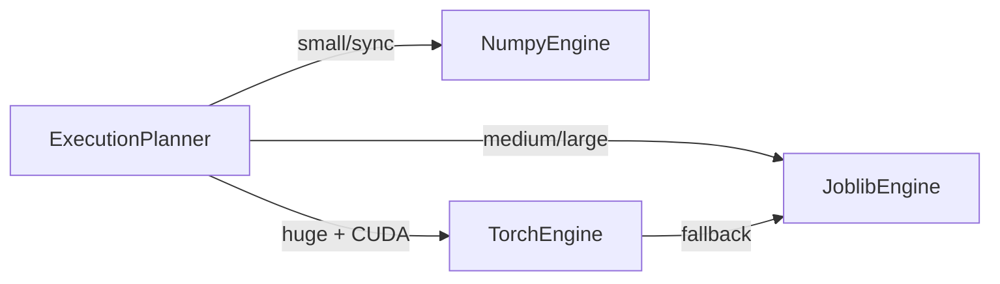
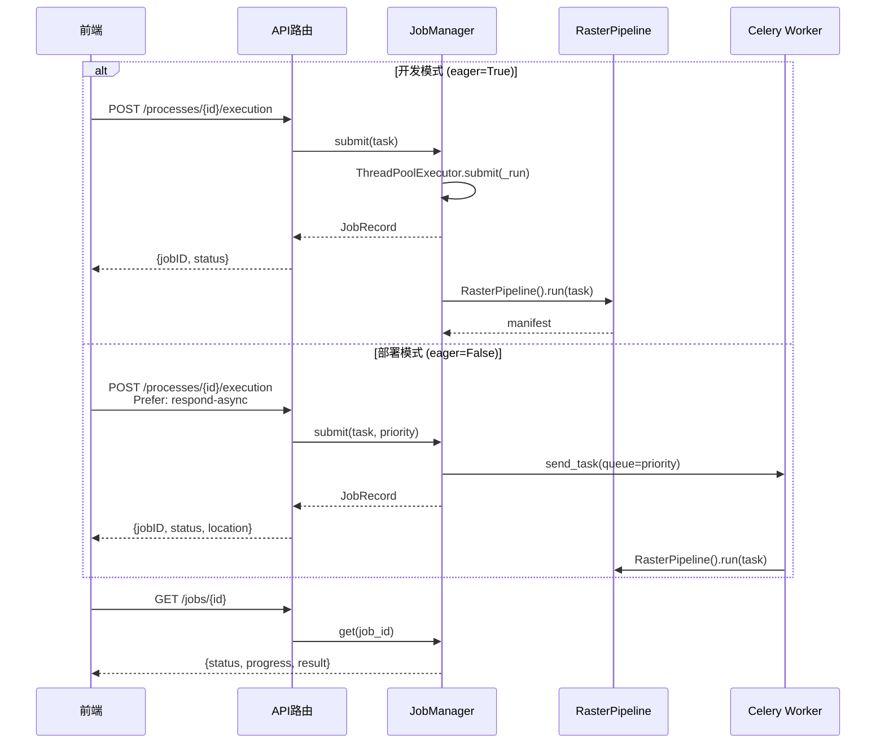
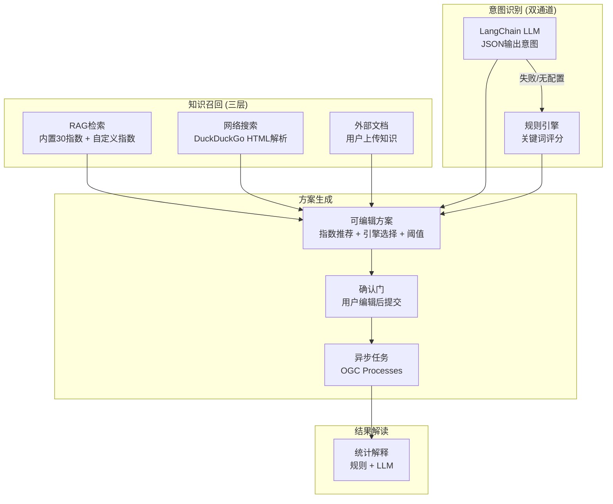

本文档系统性阐述植被指数智能分析平台后端的分层架构设计，覆盖从HTTP请求入口到栅格计算引擎的完整调用链。平台采用**FastAPI异步框架**构建REST与OGC兼容接口，通过**指数注册表**统一管理30种植被指数的公式定义，借助**多引擎策略**在NumPy、Joblib和PyTorch之间自动选择最优计算后端，并以**Celery+Redis五级优先队列**实现生产级异步任务调度。智能体子系统融合规则引擎、LangChain LLM、RAG知识检索和网络搜索四层能力，为用户意图提供可解释的分析方案。

---

## 整体分层架构

后端代码组织遵循**四层职责分离**原则：API层负责协议适配与参数校验，服务层编排业务流程与跨模块协调，核心层定义领域模型与计算逻辑，引擎层封装不同硬件后端的数值计算实现。

Sources: [main.py](backend/app/main.py#L1-L55), [routes.py](backend/app/api/routes.py#L1-L50), [settings.py](backend/app/settings.py#L1-L33)

---

## 应用入口与中间件

FastAPI应用在 `main.py` 中通过 `lifespan` 上下文管理器完成启动初始化：创建数据目录、加载PostgreSQL中持久化的自定义指数、启动Nacos服务注册心跳。应用挂载三条路径：根路由器承载所有业务API，`/metrics` 挂载Prometheus指标端点，`/artifacts` 暴露静态文件目录以提供结果GeoTIFF和预览PNG的直接下载。

CORS中间件采用全开放策略（`allow_origins=["*"]`），这是因为平台通过Traefik网关统一处理跨域与路由策略，后端API服务本身不需要额外的源限制。健康检查端点 `/health` 为容器编排提供存活探针。

Sources: [main.py](backend/app/main.py#L17-L55)

---

## 配置管理

`Settings` 类基于 `pydantic-settings` 实现，所有配置项以 `VIP_` 为环境变量前缀，从 `.env` 文件和运行时环境变量中加载。核心配置分三组：

| 配置组 | 关键配置项 | 默认值 | 说明 |
|--------|-----------|--------|------|
| **数据与存储** | `data_dir` | `data` | 本地输入/输出目录 |
| | `redis_url` | `redis://localhost:6379/0` | Celery Broker + Backend |
| | `database_url` | `None` | PostgreSQL，为空时降级内存 |
| | `minio_*` | localhost:9000 | MinIO对象存储，`minio_enabled=False`时跳过 |
| **AI与智能体** | `openai_base_url` | `None` | LLM API端点 |
| | `openai_api_key` | `None` | LLM Token |
| | `openai_model` | `gpt-4.1-mini` | 默认模型 |
| **服务发现** | `nacos_url` | `None` | Nacos注册中心 |
| | `service_name/host/port` | `vegetation-basic` | 实例标识 |
| **运行模式** | `celery_always_eager` | `True` | 开发模式线程池，部署模式Celery队列 |

`celery_always_eager` 是开发与部署模式的关键开关：为 `True` 时任务在API进程内通过 `ThreadPoolExecutor` 同步执行，为 `False` 时任务分发至Celery Worker集群的优先队列。

Sources: [settings.py](backend/app/settings.py#L8-L33)

---

## 植被指数注册表

指数注册表是整个平台的**领域核心**，采用冻结数据类 `IndexDefinition` 定义每个指数的完整元数据。关键设计决策是**公式函数与数组后端解耦**：每个指数的 `expression` 字段是一个接受 `xp`（数组命名空间）参数的lambda，当 `xp=numpy` 时在CPU上执行，当 `xp=TorchArrayAPI` 时在GPU上执行，无需为每个引擎重复实现公式。

30个内置指数按功能类别覆盖以下场景：

| 类别 | 指数 | 典型用途 |
|------|------|---------|
| **植被覆盖** | NDVI, RVI, DVI, TVI, CTVI, IPVI | 通用长势、生物量评估 |
| **土壤调节** | SAVI, OSAVI, MSAVI, EVI, EVI2 | 稀疏植被、裸土背景 |
| **叶绿素/红边** | GNDVI, NDRE, GCI, RECI, MCARI, TCARI, MTCI | 氮素状态、作物胁迫 |
| **大气抗性** | ARVI, VARI | 大气散射补偿 |
| **可见光** | GLI, NGRDI, ExG | 无人机RGB影像 |
| **水分** | NDMI, NDWI, MSI | 干旱监测、水分胁迫 |
| **扰动** | NBR, PSRI, SIPI, BSI | 火烧迹地、色素比值 |

`INDEX_REGISTRY` 字典以指数ID为键，在运行时支持动态扩展——自定义指数通过 `/api/indices/custom` 注册后追加到同一字典，计算流水线无需修改即可处理。启动时断言确保注册表严格包含30个核心指数。

Sources: [indices.py](backend/app/core/indices.py#L23-L482)

---

## 多引擎计算架构

引擎选择是平台性能优化的关键环节。三个引擎实现共享 `ComputeEngine` 协议接口，返回统一的 `EngineResult` 数据类，上层调用者无需感知底层差异。

**NumpyEngine** 是基线引擎，对每个指数顺序调用 `definition.calculate(np, bands)`，适用于小影像或同步请求。**JoblibEngine** 利用 `joblib.Parallel` 将多指数计算分发到CPU线程池，适合中等规模的CPU并行场景。**TorchEngine** 将波段数据转为CUDA张量后在GPU上并行计算，支持AMP半精度加速，但在CUDA不可用或显存不足时自动回退到JoblibEngine。

`ExecutionPlanner.choose()` 实现自动引擎选择策略，决策依据包括影像像素数、指数数量、CUDA可用性和执行模式：

| 条件 | 选择引擎 | 决策理由 |
|------|---------|---------|
| 同步请求 或 像素 < 2M | numpy | 降低调度开销 |
| CUDA可用 且 (像素 ≥ 20M 或 指数 ≥ 4) | torch | GPU吞吐优势 |
| 其他中大型任务 | joblib | CPU线程并行 |
| 指定torch但CUDA不可用 | joblib | 预先回退 |

Sources: [base.py](backend/app/engines/base.py#L1-L35), [numpy_engine.py](backend/app/engines/numpy_engine.py#L1-L34), [torch_engine.py](backend/app/engines/torch_engine.py#L1-L102), [planner.py](backend/app/services/planner.py#L1-L62)

---

## 栅格处理流水线

`RasterPipeline.run()` 是所有计算任务的统一执行入口，编排从源文件读取到结果产物生成的完整流程。流水线按 `block_size`（默认1024像素，范围128-2048）将影像切分为窗口，逐窗口读取波段、调用引擎计算、写入输出GeoTIFF。每个输出文件采用Deflate压缩+Tiled存储优化随机访问性能，并自动构建2/4/8/16级概览金字塔。

关键设计包括：**波段映射**允许用户将逻辑波段名（如 `nir`）映射到影像中的任意物理波段号；**掩膜传播**在窗口级别合并所有输入波段的有效性掩膜，确保无效像元不参与统计；**可复现清单**（`manifest.json`）记录源文件SHA-256、引擎选择理由、运行时环境和精确耗时。

处理完成后，流水线自动生成统计信息（有效像元数、极值、均值、中位数、标准差、32级直方图）和RGBA预览图（2%-98%百分位拉伸的红-绿渐变着色），并将产物上传至MinIO（如已启用）。

Sources: [raster_pipeline.py](backend/app/services/raster_pipeline.py#L97-L288)

---

## 任务调度系统

任务管理器 `JobManager` 提供同步和异步两种执行路径，通过 `celery_always_eager` 配置切换运行模式。异步任务提交后返回 `JobRecord`，前端通过 `/jobs/{id}` 轮询进度，通过 `DELETE /jobs/{id}` 取消任务。

部署模式下，Celery配置五级优先队列：

| 优先级 | 队列名 | 典型场景 | Worker |
|--------|--------|---------|--------|
| 1 (最高) | urgent | 交互式请求 | worker-joblib |
| 2 | high | 用户确认任务 | worker-joblib |
| 3 | normal | 标准批量 | worker-numpy, worker-joblib |
| 4 | low | 低优先级 | worker-numpy |
| 5 (最低) | batch | 大面积扫描 | worker-numpy |

三个专用Worker分工明确：`worker-numpy` 处理低优先级的单线程任务，`worker-joblib` 处理高优先级的CPU并行任务，`worker-gpu` 基于NVIDIA Docker运行时处理GPU加速任务。

Sources: [jobs.py](backend/app/services/jobs.py#L1-L155), [celery_app.py](backend/app/celery_app.py#L1-L30), [worker_tasks.py](backend/app/worker_tasks.py#L1-L22)

---

## API路由层

路由层遵循**OGC API - Processes**规范，同时提供平台专有扩展接口。所有请求参数通过Pydantic模型严格校验，错误统一转换为HTTP状态码。

### 核心接口分组

| 接口组 | 方法与路径 | 功能说明 |
|--------|-----------|---------|
| **指数查询** | `GET /api/indices` | 列表筛选（类别/波段） |
| | `GET /api/indices/{id}` | 单指数详情 |
| **OGC Processes** | `GET /processes` | 进程列表 |
| | `GET /processes/{id}` | 进程描述 |
| | `POST /processes/{id}/execution` | 同步/异步执行 |
| **任务管理** | `GET /jobs` | 任务列表 |
| | `GET /jobs/{id}` | 任务状态 |
| | `GET /jobs/{id}/results` | 任务结果 |
| | `DELETE /jobs/{id}` | 取消任务 |
| **智能体** | `POST /api/agent/plan` | 创建分析方案 |
| | `POST /api/agent/chat` | 对话式交互 |
| | `POST /api/agent/plans/{id}/confirm` | 确认执行 |
| | `POST /api/agent/interpret-results` | 结果解读 |
| **资产管理** | `POST /api/assets/inspect` | 影像元数据检查 |
| | `POST /api/assets/upload` | GeoTIFF上传 |
| | `POST /api/assets/upload-url` | MinIO预签名URL |
| **高级分析** | `POST /api/analysis/change` | 变化检测 |
| | `POST /api/analysis/zonal-statistics` | 区域统计 |
| | `POST /api/formulas/validate` | 自定义公式校验 |
| **系统** | `GET /api/system/capabilities` | 运行时能力探测 |
| | `GET /api/system/taskbook-coverage` | 任务书覆盖清单 |

执行入口 `POST /processes/{id}/execution` 是平台的核心路由，当 `process_id` 为 `batch` 时支持多指数批量计算，通过 `Prefer: respond-async` 头部切换同步/异步模式。智能体确认接口 `POST /api/agent/plans/{id}/confirm` 实现了**确认门**模式——方案创建后需用户显式确认才提交计算，允许在此期间编辑指数选择和引擎参数。

Sources: [routes.py](backend/app/api/routes.py#L54-L496), [schemas.py](backend/app/api/schemas.py#L1-L148)

---

## 智能体子系统

智能体 `VegetationAgent` 采用**规则引擎优先+LLM增强**的混合架构，确保在无LLM配置时仍能完成完整的方案生成。意图识别首先通过LangChain调用LLM进行分类，失败时回退到关键词匹配的五条规则。

五条内置意图规则覆盖典型分析场景：

| 意图 | 关键词 | 推荐指数 | 应用场景 |
|------|--------|---------|---------|
| `growth` | 长势、覆盖、生物量 | NDVI, EVI, GNDVI | 通用作物长势评估 |
| `sparse` | 稀疏、苗期、裸土 | SAVI, OSAVI, MSAVI, BSI | 稀疏植被与裸土背景 |
| `chlorophyll` | 叶绿素、氮、红边 | GNDVI, NDRE, GCI, RECI | 营养状态监测 |
| `water_stress` | 干旱、水分、胁迫 | NDVI, NDMI, MSI | 水分胁迫分析 |
| `change` | 变化、两期、火灾 | NDVI, EVI, NBR | 多时相变化监测 |

RAG知识检索在内置30个指数的元数据、用户上传的外部文档和PostgreSQL持久化知识库之间进行轻量级关键词召回与评分排序。网络搜索通过DuckDuckGo HTML接口获取公开资料，自动补充指数的适用场景描述。LLM配置支持OpenAI兼容API和Anthropic Claude两种provider，通过前端传入或环境变量默认值两种方式提供。

自定义指数运行时注册是智能体的扩展能力：用户通过对话描述自定义公式，智能体调用AST白名单校验器验证表达式安全性（仅允许 `abs/sqrt/minimum/maximum` 和四则运算），校验通过后注册到全局 `INDEX_REGISTRY` 并持久化到PostgreSQL，后续计算流水线可直接使用。

Sources: [agent.py](backend/app/services/agent.py#L78-L496), [agent_tools.py](backend/app/services/agent_tools.py#L1-L200), [advanced_analysis.py](backend/app/services/advanced_analysis.py#L1-L91)

---

## 数据持久化策略

平台采用**渐进式持久化**设计，PostgreSQL和MinIO均为可选依赖，未配置时自动降级为内存或本地文件：

| 组件 | 启用条件 | 存储内容 | 降级行为 |
|------|---------|---------|---------|
| PostgreSQL | `database_url` 非空 | 自定义指数、智能体会话、知识库 | 内存字典 |
| MinIO | `minio_enabled=True` | 输入影像、输出GeoTIFF、预览图 | 仅本地文件 |
| Redis | 部署模式 | Celery消息队列+结果存储 | 不可用 |

PostgreSQL模式下使用三张独立表：`vegetation_custom_indices` 存储自定义指数定义，智能体会话表存储对话事件流，知识库表存储RAG文档片段。建表SQL通过 `CREATE TABLE IF NOT EXISTS` 保证幂等，连接错误时自动降级为内存模式并记录警告日志。

Sources: [custom_index_store.py](backend/app/services/custom_index_store.py#L1-L111), [assets.py](backend/app/services/assets.py#L1-L116)

---

## 基础设施集成

### 服务发现与网关

Nacos注册通过异步心跳（5秒间隔）维持实例存活状态，注册参数包括服务名、IP地址和端口。`nacos_bridge` 容器监听Nacos服务列表变化，自动生成Traefik动态路由配置文件，实现无需重启的流量切换。

Traefik网关根据路径前缀规则进行路由分发：`/api`、`/jobs`、`/processes`、`/artifacts`、`/metrics` 路径优先级100路由到API服务，`/` 路径优先级1路由到前端静态资源。

### 容器编排

Docker Compose定义了完整的部署拓扑：3个API实例（basic/adjusted/advanced）实现负载分散，3个专用Worker按引擎类型分工，Redis、MinIO、Nacos作为基础设施服务，Traefik作为入口网关。所有服务共享名为 `vegetation-data` 的命名卷以统一数据目录。

Sources: [nacos.py](backend/app/services/nacos.py#L1-L87), [compose.yml](compose.yml#L1-L192)

---

## 技术依赖与版本约束

后端核心依赖按职责分为四组：

| 职责 | 依赖 | 说明 |
|------|------|------|
| **Web框架** | FastAPI ≥0.115, Uvicorn, Pydantic ≥2.10 | 异步HTTP + 数据校验 |
| **遥感计算** | Rasterio ≥1.4, NumPy ≥2.0, Joblib ≥1.4 | 栅格IO + 数值计算 |
| **任务队列** | Celery ≥5.4, Redis | 异步任务 + 消息代理 |
| **AI集成** | LangChain ≥0.3, langchain-openai, langchain-anthropic | LLM编排 |
| **存储** | psycopg ≥3.2, MinIO ≥7.2 | PostgreSQL + 对象存储 |
| **监控** | prometheus-client ≥0.21 | 指标暴露 |

GPU支持为可选依赖（`pip install .[gpu]`），PyTorch ≥2.6仅在 `Dockerfile.gpu` 构建镜像中安装。