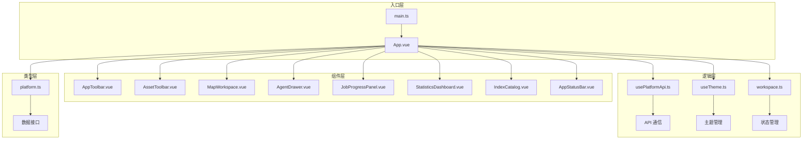
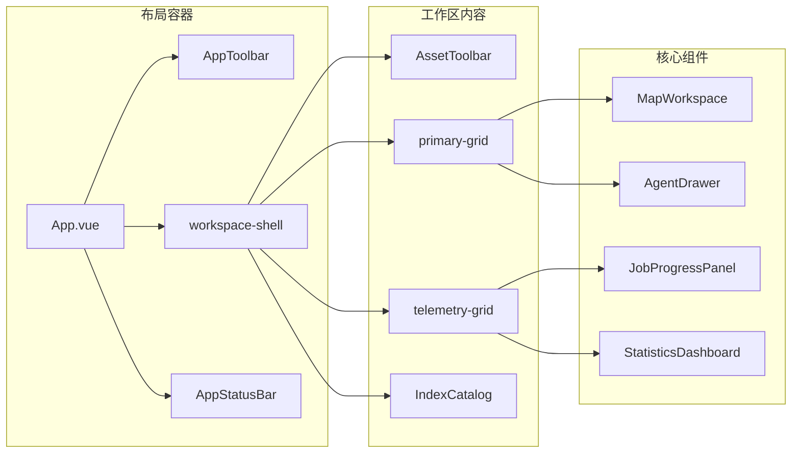
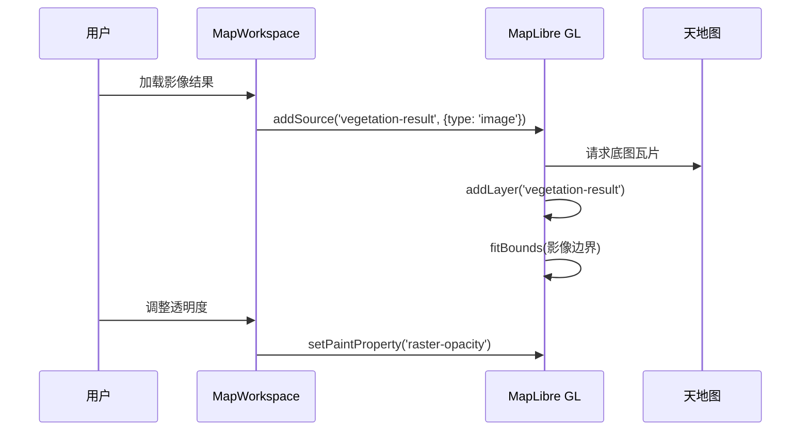
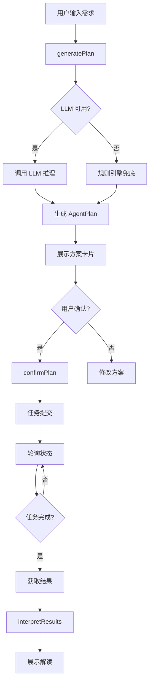
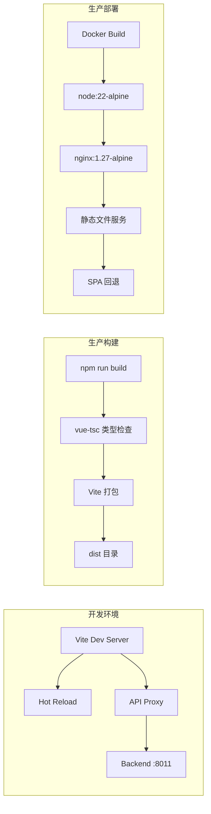

本文档深入剖析植被指数智能分析平台的前端架构设计，涵盖技术选型、组件体系、状态管理、API集成、主题系统、响应式设计以及构建部署策略。前端采用 Vue 3 Composition API + TypeScript 的现代化技术栈，通过 MapLibre GL 实现专业级地图工作台，结合 ECharts 提供数据可视化能力，构建出面向遥感操作台的单页应用。

## 技术栈与设计原则

前端技术栈基于 Vue 3 生态系统构建，采用 Composition API 作为核心编程范式，结合 TypeScript 提供类型安全保障。构建工具选择 Vite 7.0，提供快速的开发服务器和优化的生产构建。状态管理使用 Pinia 3.0，地图渲染依赖 MapLibre GL 5.6，数据可视化采用 ECharts 5.6，路由管理使用 Vue Router 4.5。

架构设计遵循三个核心原则：**组合式架构**，通过 composables 目录下的组合式函数封装可复用的业务逻辑；**状态集中管理**，所有全局状态通过 Pinia store 统一管理；**组件职责单一**，每个组件专注于特定的 UI 功能域，如地图工作台、智能体抽屉、任务监控面板等。

Sources: [package.json](frontend/package.json#L1-L28), [main.ts](frontend/src/main.ts#L1-L7)

## 项目结构与模块划分

前端项目采用标准的 Vue 3 项目结构，src 目录下的组织遵循功能模块化原则。components 目录包含所有 UI 组件，每个组件对应一个 Vue 单文件组件；composables 目录存放可复用的逻辑函数；stores 目录管理 Pinia 状态；types 目录定义 TypeScript 接口；assets 目录包含静态资源和全局样式。



Sources: [App.vue](frontend/src/App.vue#L1-L309), [目录结构](frontend/src/)

## 状态管理架构

状态管理采用 Pinia 的 Composition API 风格，通过 defineStore 函数定义 workspace store。store 管理五个核心状态域：**索引数据**（indices）存储可用植被指数元数据；**任务队列**（jobs）管理异步计算任务；**活跃产品**（activeProduct）保存当前选中的计算结果；**资产信息**（asset）管理上传的 GeoTIFF 影像；**UI 状态**（ui）控制面板可见性。

store 使用 shallowRef 优化响应式性能，避免深层嵌套对象的深度监听。computed 属性 derived 出运行中任务和已完成任务的过滤列表，为 UI 组件提供派生状态。所有状态变更通过 action 函数执行，确保状态变更的可追溯性。

```typescript
// 状态结构示例
const indices = shallowRef<IndexMetadata[]>([])
const jobs = shallowRef<JobRecord[]>([])
const activeProduct = shallowRef<Product | null>(null)
const asset = reactive({
  localPath: '',
  selected: null as UploadedAsset | null,
  queue: [] as UploadedAsset[],
  bandMapping: { blue: 1, green: 2, red: 3, ... }
})
const ui = reactive({
  isAgentVisible: true,
  isTelemetryVisible: true,
  isCatalogVisible: true,
  isCompact: false,
})
```

Sources: [workspace.ts](frontend/src/stores/workspace.ts#L1-L120), [platform.ts](frontend/src/types/platform.ts#L1-L195)

## 组件架构与交互模式

组件架构采用"工具栏 + 工作区 + 面板"的三层布局。AppToolbar 提供全局导航和功能切换；MapWorkspace 作为核心工作区承载地图可视化；AgentDrawer、JobProgressPanel、StatisticsDashboard、IndexCatalog 作为可切换的功能面板。

组件间通信采用 props-down, events-up 模式，通过 defineProps 和 defineEmits 定义清晰的接口边界。跨组件状态共享通过 Pinia store 实现，避免 props 逐层传递。异步组件使用 defineAsyncComponent 实现代码分割，MapWorkspace 和 StatisticsDashboard 按需加载，优化初始包体积。



Sources: [App.vue](frontend/src/App.vue#L1-L309), [AppToolbar.vue](frontend/src/components/AppToolbar.vue#L1-L273)

## API 集成与数据流

API 集成通过 usePlatformApi 组合式函数封装，提供类型安全的 HTTP 客户端。该函数内部实现 requestJson 和 uploadForm 两个基础请求函数，统一处理 JSON 和 FormData 请求。所有 API 端点遵循 RESTful 风格，与后端 OGC API - Processes 规范对齐。

数据流遵循单向数据流原则：用户交互触发 action → action 调用 API → API 响应更新 store → store 变更驱动 UI 更新。对于长时间运行的任务，采用轮询机制监控状态，每 1500ms 轮询一次任务状态，直到任务完成或失败。

```typescript
// API 调用示例
async function createPlan(message: string, availableBands: string[], options: {
  llm?: AgentLLMConfig | null
  enableWebSearch?: boolean
  customIndex?: { id: string; name: string; expression: string; description: string } | null
  sessionId?: string | null
} = {}): Promise<AgentPlan> {
  return requestJson<AgentPlan>('/api/agent/plan', {
    method: 'POST',
    body: JSON.stringify({ message, sessionId: options.sessionId, availableBands, llm: options.llm, ... }),
  })
}
```

Sources: [usePlatformApi.ts](frontend/src/composables/usePlatformApi.ts#L1-L199), [App.vue](frontend/src/App.vue#L15-L35)

## 主题系统与样式架构

主题系统基于 CSS 自定义属性实现，通过 data-theme 属性切换明暗主题。main.css 定义两套颜色方案：:root 选择器定义暗色主题变量，:root[data-theme='light'] 选择器定义亮色主题变量。变量命名遵循语义化规范，如 --surface-0 到 --surface-3 定义表面层级，--text-0 到 --text-3 定义文本层级。

useTheme 组合式函数管理主题状态，使用 localStorage 持久化用户偏好，支持系统主题检测。主题切换时，通过 document.documentElement.dataset.theme 和 document.documentElement.style.colorScheme 同步更新，确保 CSS 变量和浏览器原生主题的一致性。

```css
/* 主题变量示例 */
:root {
  --accent: #9ee81f;
  --surface-0: #070c09;
  --text-0: #f2f8ee;
  --border: rgba(167, 202, 106, 0.16);
}

:root[data-theme='light'] {
  --accent: #5f8f13;
  --surface-0: #f6f7f2;
  --text-0: #152013;
  --border: rgba(50, 78, 42, 0.14);
}
```

Sources: [main.css](frontend/src/assets/main.css#L1-L142), [useTheme.ts](frontend/src/composables/useTheme.ts#L1-L40)

## 地图工作台实现

地图工作台基于 MapLibre GL 实现，采用天地图作为底图数据源。MapWorkspace 组件管理地图实例生命周期，通过 ResizeObserver 监听容器尺寸变化，确保地图自适应。坐标显示功能通过 mousemove 事件实现，实时更新鼠标位置信息。

影像叠加层使用 MapLibre GL 的 image source 类型，将计算结果的预览图作为图层叠加到底图上。图层透明度通过 defineModel 实现双向绑定，支持用户实时调整。视图范围自动适配结果影像的边界，通过 fitBounds 方法实现平滑动画过渡。



Sources: [MapWorkspace.vue](frontend/src/components/MapWorkspace.vue#L1-L301), [App.vue](frontend/src/App.vue#L15-L25)

## 智能体交互架构

智能体系统通过 AgentDrawer 组件实现，提供完整的对话式交互体验。组件维护对话状态、LLM 配置、自定义指数草案、知识库导入等多个状态域。交互流程分为四个阶段：**需求描述** → **方案生成** → **人工确认** → **执行监控**。

方案生成调用 /api/agent/plan 端点，支持可选的 LLM 配置和网络检索开关。确认执行调用 /api/agent/plans/{planId}/confirm 端点，提交执行参数。结果解读调用 /api/agent/interpret-results 端点，基于统计信息生成分析建议。整个流程通过会话 ID 维持上下文连续性。



Sources: [AgentDrawer.vue](frontend/src/components/AgentDrawer.vue#L1-L1345), [usePlatformApi.ts](frontend/src/composables/usePlatformApi.ts#L50-L100)

## 响应式设计与布局策略

响应式设计采用 CSS Grid + clamp 函数的现代方案。主布局使用 grid-template-rows 定义行轨道，通过 minmax(clamp(...)) 实现流体尺寸。clamp 函数结合视口单位（vw, vh）和固定像素值，在不同屏幕尺寸间平滑过渡。

工作区采用 primary-grid 和 telemetry-grid 两个网格容器，通过 agent-collapsed 类名控制智能体面板的显示/隐藏，动态调整网格列数。组件内部使用 CSS Grid 和 Flexbox 混合布局，确保内容自适应。全局设置 overflow: hidden 防止页面滚动，所有可滚动区域通过局部 overflow: auto 实现。

```css
/* 响应式布局示例 */
.workspace-shell {
  grid-template-rows: auto auto minmax(clamp(430px, calc(100dvh - 360px), 920px), auto) auto auto auto;
  gap: clamp(8px, 0.8vw, 14px);
  padding: clamp(10px, 1.1vw, 22px);
}

.primary-grid {
  display: grid;
  grid-template-columns: 1fr;
  gap: clamp(12px, 1.5vw, 24px);
}

.agent-collapsed {
  grid-template-columns: 1fr;
}
```

Sources: [App.vue](frontend/src/App.vue#L200-L309), [main.css](frontend/src/assets/main.css#L1-L142)

## 数据可视化与统计面板

统计面板通过 StatisticsDashboard 组件实现，使用 ECharts 渲染直方图。组件采用按需引入策略，仅加载 BarChart、GridComponent、TooltipComponent 和 CanvasRenderer，优化包体积。图表配置响应主题变化，通过 MutationObserver 监听 data-theme 属性变更，自动更新图表样式。

数据绑定通过 computed 属性派生，从 product.statistics 提取统计信息。图表实例使用 ResizeObserver 监听容器尺寸变化，确保响应式布局下的正确渲染。颜色方案从 CSS 变量动态读取，保持与整体主题的一致性。

```typescript
// 图表配置示例
chart.value.setOption({
  grid: { left: 12, right: 8, top: 15, bottom: 18, containLabel: true },
  xAxis: {
    type: 'category',
    data: stats.value.histogram.edges.slice(0, -1).map((value) => value.toFixed(2)),
    axisLabel: { color: textColor, fontSize: 8, interval: 4 },
  },
  yAxis: { type: 'value', axisLabel: { color: textColor, fontSize: 8 } },
  series: [{
    type: 'bar',
    data: stats.value.histogram.counts,
    itemStyle: { color: { type: 'linear', colorStops: [...] } },
  }],
})
```

Sources: [StatisticsDashboard.vue](frontend/src/components/StatisticsDashboard.vue#L1-L185), [App.vue](frontend/src/App.vue#L50-L60)

## 构建与部署策略

构建配置通过 Vite 的 defineConfig 函数定义，支持开发和生产两种模式。开发模式下，配置代理规则将 /api、/jobs、/processes、/artifacts 路径转发到后端服务。生产构建通过 vue-tsc 进行类型检查，确保 TypeScript 类型安全。

部署采用 Docker 多阶段构建：第一阶段使用 node:22-alpine 镜像执行 npm install 和 npm run build；第二阶段使用 nginx:1.27-alpine 镜像提供静态文件服务。nginx.conf 配置 SPA 回退规则，所有未匹配路径返回 index.html，支持前端路由。



Sources: [vite.config.ts](frontend/vite.config.ts#L1-L25), [Dockerfile](frontend/Dockerfile#L1-L13), [nginx.conf](frontend/nginx.conf#L1-L17)

## 组件库与功能模块

组件库包含八个核心组件，每个组件承担特定的功能职责。AppToolbar 提供品牌标识、导航菜单、面板切换和主题切换功能。AssetToolbar 实现影像上传、拖拽导入、波段映射和批量任务提交。IndexCatalog 提供指数搜索、分类过滤和详情展示。JobProgressPanel 监控任务队列状态，支持结果查看和任务取消。

组件设计遵循"单一职责"原则，通过 props 接收数据，通过 emit 事件通信。样式采用 scoped CSS 隔离，避免样式冲突。组件内部使用 Composition API 组织逻辑，通过 ref 和 reactive 管理本地状态，通过 computed 派生计算属性。

Sources: [AppToolbar.vue](frontend/src/components/AppToolbar.vue#L1-L273), [AssetToolbar.vue](frontend/src/components/AssetToolbar.vue#L1-L366), [IndexCatalog.vue](frontend/src/components/IndexCatalog.vue#L1-L201), [JobProgressPanel.vue](frontend/src/components/JobProgressPanel.vue#L1-L208)

## 性能优化策略

性能优化体现在多个层面：**代码分割**，MapWorkspace 和 StatisticsDashboard 使用 defineAsyncComponent 按需加载；**状态优化**，使用 shallowRef 避免深层响应式监听；**图表优化**，ECharts 按需引入减少包体积；**布局优化**，CSS Grid + clamp 函数实现流体布局，减少重排。

数据更新采用增量策略，任务状态轮询时仅更新变化的记录，避免全量替换。主题切换通过 CSS 变量实现，无需重新渲染组件。地图实例复用 ResizeObserver 和 MutationObserver，避免重复监听器创建。

Sources: [App.vue](frontend/src/App.vue#L5-L10), [workspace.ts](frontend/src/stores/workspace.ts#L1-L20), [StatisticsDashboard.vue](frontend/src/components/StatisticsDashboard.vue#L1-L50)

## 开发工作流与工具链

开发工作流基于 Vite 的快速热重载，支持 TypeScript 实时类型检查。代码质量通过 vue-tsc 确保类型安全，构建前执行类型检查。项目配置三个 TypeScript 配置文件：tsconfig.json 定义基础配置，tsconfig.app.json 针对应用代码，tsconfig.node.json 针对 Node.js 环境。

依赖管理使用 npm，package-lock.json 确保依赖版本一致性。开发依赖包含类型定义、构建工具和 TypeScript 编译器。生产依赖仅包含运行时必需的 Vue 生态库和第三方组件库。