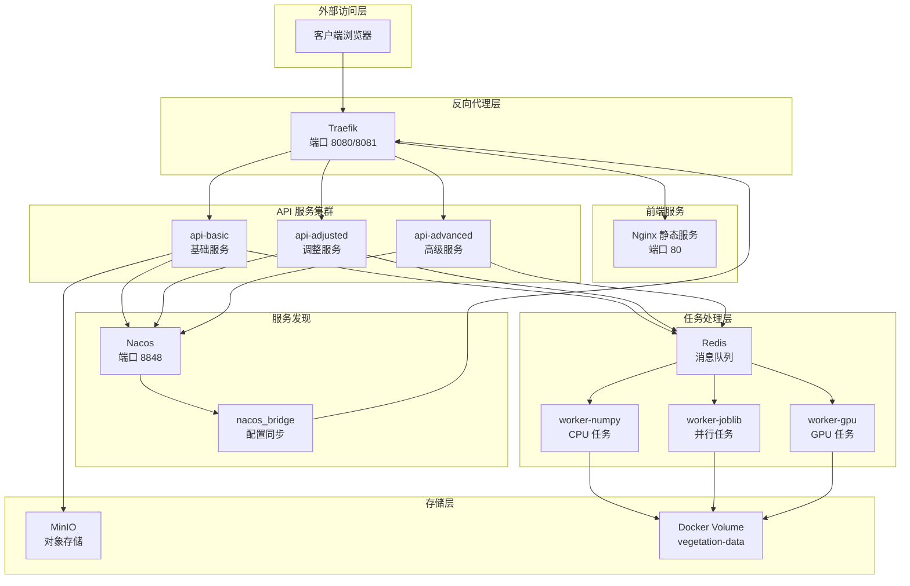
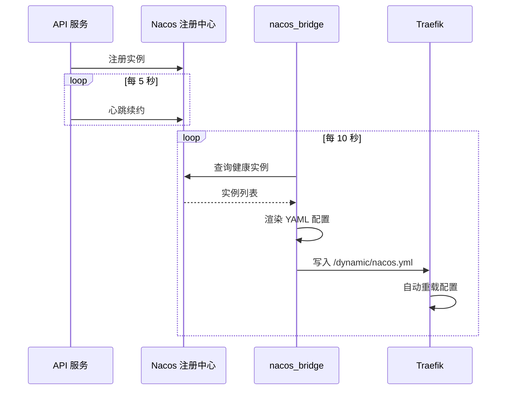

本文档详细阐述植被指数智能分析平台的基础设施架构设计，涵盖容器化编排、反向代理、服务发现、消息队列和存储系统等核心组件。该架构采用微服务设计理念，通过 Docker Compose 实现一键部署，利用 Traefik 作为统一入口点，配合 Nacos 实现动态服务注册与发现。

## 整体架构概览

平台的基础设施由多个协同工作的组件构成，形成完整的请求处理链路。外部请求首先到达 Traefik 反向代理，经过路由规则分发至前端 Nginx 或后端 API 服务集群。后端服务通过 Nacos 注册自身实例，由 nacos_bridge 组件定期同步健康实例列表至 Traefik 动态配置。耗时的栅格计算任务则通过 Celery 分发至专用 Worker 节点执行。



Sources: [compose.yml](compose.yml#L1-L192)

## 容器编排架构

平台使用 Docker Compose 进行服务编排，所有服务定义在 `compose.yml` 文件中。整体采用 YAML 锚点（`&api-environment` 和 `&api-service`）消除重复配置，确保 API 服务集群的一致性。

### 服务拓扑

| 服务名称 | 镜像/构建上下文 | 职责 | 端口映射 |
|---------|---------------|------|---------|
| traefik | traefik:v3.4 | 反向代理与路由 | 8080:80, 8081:8080 |
| frontend | ./frontend | Vue SPA 静态服务 | 内部 80 |
| api-basic | ./backend | 基础 API 服务 | 内部 8000 |
| api-adjusted | ./backend | 调整计算服务 | 内部 8000 |
| api-advanced | ./backend | 高级分析服务 | 内部 8000 |
| worker-numpy | ./backend | NumPy 计算 Worker | - |
| worker-joblib | ./backend | Joblib 并行 Worker | - |
| worker-gpu | ./backend (GPU) | CUDA 加速 Worker | - |
| nacos-bridge | ./backend | 服务发现桥接 | - |
| redis | redis:7.4-alpine | 消息队列/缓存 | 内部 6379 |
| minio | minio/minio | 对象存储 | 9000:9000, 9001:9001 |
| nacos | nacos/nacos-server:v2.4.3 | 服务注册中心 | 8848:8848, 9848:9848 |

Sources: [compose.yml](compose.yml#L31-L184)

### 数据卷管理

平台定义了五个持久化卷，用于存储运行时数据：

| 卷名称 | 挂载目标 | 用途 |
|-------|---------|------|
| vegetation-data | /app/data | 影像输入输出目录 |
| redis-data | /data | Redis 持久化数据 |
| minio-data | /data | MinIO 对象存储 |
| nacos-data | /home/nacos/data | Nacos 注册数据 |
| traefik-dynamic | /dynamic | Traefik 动态配置 |

Sources: [compose.yml](compose.yml#L186-L192)

## 反向代理与路由

Traefik 作为平台的统一入口点，负责请求路由、负载均衡和健康检查。配置采用双 Provider 模式：Docker Provider 自动发现带标签的容器服务，File Provider 加载 nacos_bridge 生成的动态路由规则。

### 静态配置

```yaml
api:
  dashboard: true
  insecure: true

entryPoints:
  web:
    address: ":80"

providers:
  docker:
    exposedByDefault: false
  file:
    directory: /dynamic
    watch: true
```

Traefik 监听 80 端口接收 HTTP 请求，8080 端口提供管理仪表盘。Docker Provider 配置为 `exposedByDefault: false`，仅处理带 `traefik.enable=true` 标签的容器。File Provider 监听 `/dynamic` 目录，当 nacos_bridge 更新配置文件时自动重载路由。

Sources: [infra/traefik/traefik.yml](infra/traefik/traefik.yml#L1-L19)

### 路由规则

平台定义了两条主要路由路径：

**前端路由**：通过 Docker 标签配置，匹配 `PathPrefix(/)` 且优先级为 1，将所有未匹配其他规则的请求转发至 Nginx。

**API 路由**：通过 Docker 标签配置，匹配 `/api`、`/jobs`、`/processes`、`/artifacts`、`/metrics` 路径前缀，优先级为 100，确保 API 请求优先路由至后端服务。

Sources: [compose.yml](compose.yml#L44-L67)

## 服务发现机制

平台采用 Nacos 作为服务注册中心，配合自研的 nacos_bridge 组件实现动态服务发现。该架构解决了传统静态配置在服务扩缩容时的局限性。

### 注册流程

每个 API 服务启动时，通过 `NacosRegistration` 类向 Nacos 注册自身实例。注册信息包含服务名、IP 地址、端口和健康状态。注册完成后，启动心跳协程每 5 秒发送一次心跳，维持实例的临时（ephemeral）状态。

```python
# 注册参数构建
params = {
    "serviceName": settings.service_name,
    "ip": service_ip,
    "port": settings.service_port,
    "healthy": "true",
    "enabled": "true",
    "ephemeral": "true",
}
```

服务停止时，主动向 Nacos 发送注销请求，确保注册表中不残留过期实例。

Sources: [backend/app/services/nacos.py](backend/app/services/nacos.py#L15-L86)

### 配置同步

nacos_bridge 是一个独立运行的桥接服务，每 10 秒执行一次同步循环：

1. 从 Nacos 查询三个服务（vegetation-basic、vegetation-adjusted、vegetation-advanced）的健康实例列表
2. 将实例列表渲染为 Traefik File Provider 格式的 YAML 配置
3. 使用原子写入（先写临时文件再替换）更新 `/dynamic/nacos.yml`



生成的配置包含三个路由器定义，每个路由器配置了 `stripPrefix` 中间件，移除服务路径前缀后再转发至后端实例。

Sources: [backend/app/nacos_bridge.py](backend/app/nacos_bridge.py#L1-L82)

### 服务路由映射

| Nacos 服务名 | 路径前缀 | Traefik 路由器 | 后端服务 |
|-------------|---------|---------------|---------|
| vegetation-basic | /api/basic | basic | api-basic |
| vegetation-adjusted | /api/adjusted | adjusted | api-adjusted |
| vegetation-advanced | /api/advanced | advanced | api-advanced |

## 消息队列与任务调度

平台使用 Redis 作为消息代理（Broker）和结果后端（Backend），Celery 作为分布式任务队列框架。该架构支持五级优先级队列，确保不同紧急程度的任务得到合理调度。

### 优先级队列设计

| 队列名称 | 优先级 | 路由键 | 处理 Worker |
|---------|-------|-------|------------|
| urgent | 1 (最高) | priority.1 | worker-joblib, worker-gpu |
| high | 2 | priority.2 | worker-joblib, worker-gpu |
| normal | 3 (默认) | priority.3 | 所有 Worker |
| low | 4 | priority.4 | worker-numpy |
| batch | 5 (最低) | priority.5 | worker-numpy |

Sources: [backend/app/celery_app.py](backend/app/celery_app.py#L1-L30)

### Worker 节点配置

平台部署了三类 Worker 节点，针对不同计算场景优化：

**worker-numpy**：单并发 Worker，处理 `normal`、`low`、`batch` 队列。适用于轻量级 NumPy 计算任务，避免资源竞争。

**worker-joblib**：双并发 Worker，处理 `urgent`、`high`、`normal` 队列。适用于需要并行化的 CPU 密集型任务。

**worker-gpu**：单并发 GPU Worker，处理 `urgent`、`high`、`normal` 队列。基于 PyTorch CUDA 镜像，预留 NVIDIA GPU 资源，适用于深度学习相关的计算任务。

Sources: [compose.yml](compose.yml#L83-L128), [backend/Dockerfile.gpu](backend/Dockerfile.gpu#L1-L17)

### 任务执行流程

任务提交后，Celery 根据路由键将任务分发至对应队列。Worker 从队列中拉取任务，执行 `RasterPipeline.run()` 方法处理栅格数据。任务执行过程中，通过 `update_state()` 方法更新进度状态，支持客户端轮询任务进展。

Sources: [backend/app/worker_tasks.py](backend/app/worker_tasks.py#L1-L22)

## 存储架构

平台采用分层存储策略，结合本地文件系统、Docker Volume 和 MinIO 对象存储，满足不同场景的数据持久化需求。

### 本地文件系统

应用数据目录 `/app/data` 通过 Docker Volume `vegetation-data` 挂载，包含两个子目录：

- **inputs/**：存储上传的原始 GeoTIFF 影像
- **outputs/**：存储计算生成的指数产品，每个任务创建独立子目录

### MinIO 对象存储

MinIO 作为可选的对象存储服务，提供 S3 兼容的 API 接口。在容器化部署模式下，默认启用 MinIO 存储派生产品（artifacts）。开发模式下可通过 `VIP_MINIO_ENABLED=false` 禁用。

| 配置项 | 环境变量 | 默认值 |
|-------|---------|-------|
| 端点地址 | VIP_MINIO_ENDPOINT | minio:9000 |
| 访问密钥 | VIP_MINIO_ACCESS_KEY | vegetation |
| 密钥 | VIP_MINIO_SECRET_KEY | vegetation-secret |
| 存储桶 | VIP_MINIO_BUCKET | vegetation-assets |
| 启用状态 | VIP_MINIO_ENABLED | true (容器) / false (开发) |

MinIO 提供两个访问端口：9000 端口用于 S3 API 访问，9001 端口提供 Web 管理控制台。

Sources: [backend/app/services/assets.py](backend/app/services/assets.py#L34-L116), [backend/app/settings.py](backend/app/settings.py#L8-L31)

## 前端静态服务

前端应用采用多阶段构建，最终通过 Nginx 提供静态文件服务。Nginx 配置实现了 SPA 路由回退和 API 代理功能。

```nginx
server {
    listen 80;
    server_name _;
    root /usr/share/nginx/html;
    index index.html;

    location / {
        try_files $uri $uri/ /index.html;
    }

    location ~ ^/(api|jobs|processes|artifacts|metrics) {
        proxy_pass http://traefik:80;
        proxy_set_header Host $host;
        proxy_set_header X-Forwarded-For $proxy_add_x_forwarded_for;
    }
}
```

`location /` 块配置了 `try_files` 指令，当请求的文件不存在时回退至 `index.html`，支持 Vue Router 的 History 模式。`location ~ ^/(api|jobs|processes|artifacts|metrics)` 块将 API 请求代理回 Traefik，由 Traefik 进一步路由至后端服务。

Sources: [frontend/nginx.conf](frontend/nginx.conf#L1-L17), [frontend/Dockerfile](frontend/Dockerfile#L1-L13)

## OGC 兼容服务

平台集成了 pygeoapi 作为 OGC API Processes 兼容服务端点，提供标准化的地理空间处理接口。pygeoapi 配置定义了一个 `spectral-index` 处理器，支持同步和异步执行模式。

该处理器通过 `SpectralIndexProcessor` 类实现，动态调用平台的 `RasterPipeline` 执行植被指数计算。处理器接受 `source`（GeoTIFF 路径）、`index`（指数标识符）和 `bands`（波段映射）三个输入参数。

Sources: [infra/pygeoapi/config.yml](infra/pygeoapi/config.yml#L1-L44), [backend/app/pygeoapi_processor.py](backend/app/pygeoapi_processor.py#L1-L78)

## 监控与可观测性

平台集成了 Prometheus 指标导出功能，通过 `/metrics` 端点暴露应用性能数据。FastAPI 应用使用 `prometheus_client.make_asgi_app()` 创建指标中间件，挂载至 `/metrics` 路径。

Traefik 同时配置了访问日志（accessLog）和应用日志，日志级别设置为 INFO，便于请求链路追踪和问题诊断。

Sources: [backend/app/main.py](backend/app/main.py#L44), [infra/traefik/traefik.yml](infra/traefik/traefik.yml#L16-L19)

## 环境配置管理

平台通过环境变量实现配置外部化，所有配置项使用 `VIP_` 前缀命名。Pydantic Settings 类负责解析环境变量和 `.env` 文件，提供类型安全的配置访问。

| 配置类别 | 关键配置项 | 说明 |
|---------|-----------|------|
| Redis | VIP_REDIS_URL | 消息队列连接地址 |
| Celery | VIP_CELERY_ALWAYS_EAGER | 是否同步执行任务（开发模式） |
| MinIO | VIP_MINIO_* | 对象存储连接配置 |
| Nacos | VIP_NACOS_URL | 服务注册中心地址 |
| OpenAI | VIP_OPENAI_* | LLM 模型配置（智能体功能） |
| PostgreSQL | VIP_DATABASE_URL | 自定义指数持久化（可选） |

开发环境下，`VIP_CELERY_ALWAYS_EAGER` 默认为 `true`，任务在主线程同步执行，简化调试流程。容器化部署时，该值设为 `false`，启用真正的分布式任务调度。

Sources: [backend/app/settings.py](backend/app/settings.py#L1-L33), [.env.example](.env.example#L1-L16)

## 健康检查机制

各服务组件配置了完善的健康检查策略，确保容器编排系统能够正确感知服务状态：

| 服务 | 检查方式 | 间隔 | 超时 | 重试次数 |
|-----|---------|-----|-----|---------|
| API 服务 | HTTP GET /health | 15s | 5s | 5 |
| Redis | redis-cli ping | 5s | 3s | 10 |
| MinIO | HTTP GET /minio/health/live | 10s | 5s | 10 |

API 服务的依赖关系配置了 `condition: service_healthy`，确保 Redis 和 MinIO 健康检查通过后才启动 API 服务，避免启动时连接失败。

Sources: [compose.yml](compose.yml#L12-L29), [backend/app/main.py](backend/app/main.py#L52-L54)

## 下一步阅读

- [服务发现与负载均衡](31-fu-wu-fa-xian-yu-fu-zai-jun-heng)：深入了解 Nacos 集成细节
- [容器化部署](5-rong-qi-hua-bu-shu)：获取部署操作指南
- [后端架构](10-hou-duan-jia-gou)：了解后端服务内部设计
- [任务调度系统](16-ren-wu-diao-du-xi-tong)：深入理解 Celery 任务调度机制