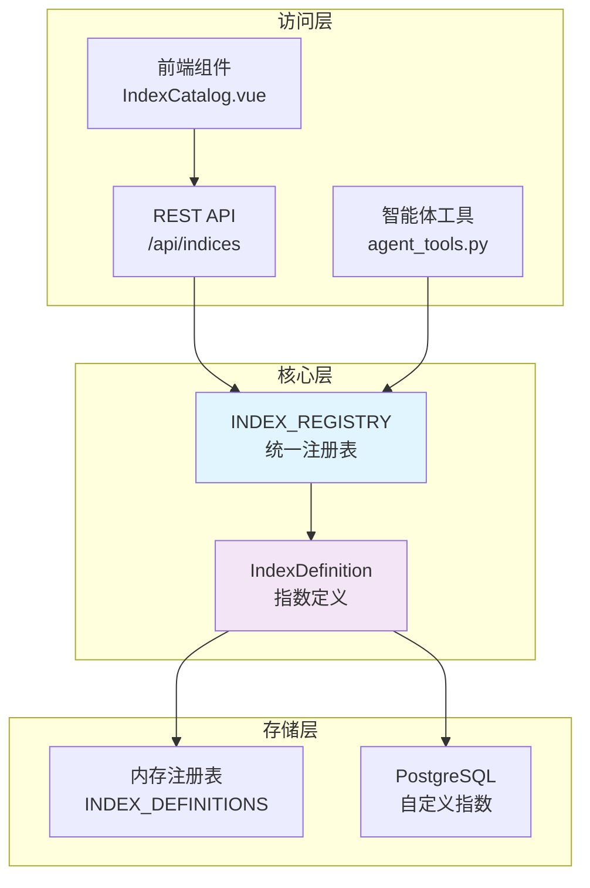
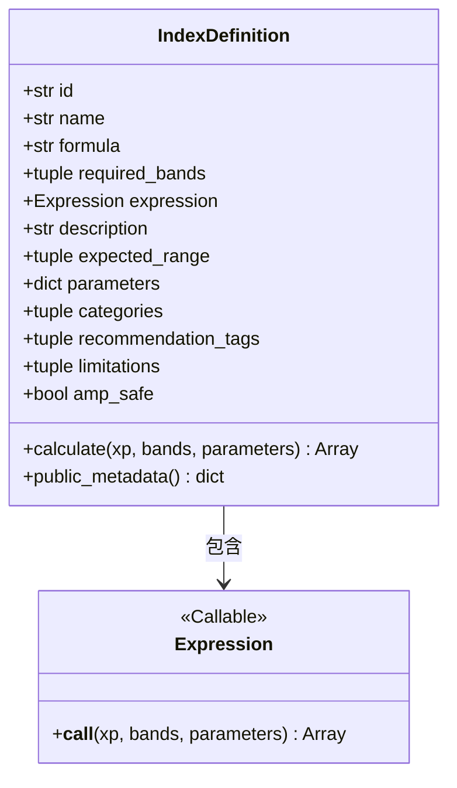
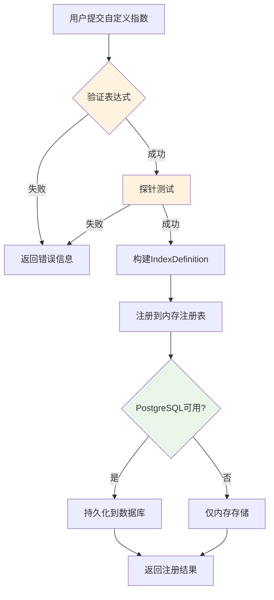
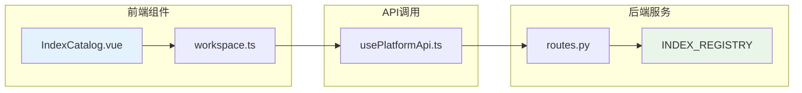

指数注册表是植被指数智能分析平台的核心模块，负责统一管理所有植被指数的定义、公式和元数据。它采用**数据驱动的注册模式**，将30种内置指数与运行时自定义指数整合到同一个注册表中，为计算引擎、智能体和前端提供一致的指数访问接口。

## 架构概览

指数注册表采用**分层架构**设计，将指数定义、存储和访问分离为三个层次：



**Sources: [indices.py](backend/app/core/indices.py#L1-L15)**

## IndexDefinition 数据结构

每个植被指数通过 `IndexDefinition` 数据类定义，该类采用**不可变设计**（`frozen=True`），确保指数定义在运行时不会被意外修改：



**核心字段说明**：

| 字段 | 类型 | 说明 | 示例 |
|------|------|------|------|
| `id` | `str` | 唯一标识符，全小写 | `"ndvi"` |
| `name` | `str` | 中文名称 | `"归一化植被指数"` |
| `formula` | `str` | 数学公式表达 | `"(NIR-Red)/(NIR+Red)"` |
| `required_bands` | `tuple[str, ...]` | 必需波段列表 | `("nir", "red")` |
| `expression` | `Expression` | 可调用计算函数 | `lambda xp, bands, params: ...` |
| `expected_range` | `tuple[float, float] \| None` | 预期值范围 | `(-1, 1)` |
| `parameters` | `dict[str, float]` | 可调参数 | `{"L": 0.5}` |
| `categories` | `tuple[str, ...]` | 分类标签 | `("vegetation", "biomass")` |
| `recommendation_tags` | `tuple[str, ...]` | 推荐场景标签 | `("植被覆盖", "长势评估")` |
| `limitations` | `tuple[str, ...]` | 使用限制说明 | `("云、阴影和积雪会影响结果",)` |

**Sources: [indices.py](backend/app/core/indices.py#L23-L62)**

## 内置指数注册表

平台内置了**30种植被指数**，覆盖植被监测、叶绿素分析、水分胁迫、土壤调节等多个应用场景。注册表通过 `INDEX_DEFINITIONS` 元组定义，启动时会进行完整性校验：

```python
INDEX_REGISTRY = {definition.id: definition for definition in INDEX_DEFINITIONS}
CORE_INDEX_COUNT = len(INDEX_DEFINITIONS)

if CORE_INDEX_COUNT != 30:
    raise RuntimeError(f"注册表必须包含30种指数，当前为{len(INDEX_REGISTRY)}")
```

**Sources: [indices.py](backend/app/core/indices.py#L470-L474)**

### 指数分类体系

内置指数按应用场景分为以下类别：

| 类别 | 指数数量 | 代表指数 | 典型应用场景 |
|------|----------|----------|--------------|
| `vegetation` | 8 | NDVI, RVI, DVI, EVI2, TVI, CTVI, IPVI | 植被覆盖度、长势评估 |
| `chlorophyll` | 7 | GNDVI, NDRE, GCI, RECI, MCARI, TCARI, MTCI | 叶绿素含量、氮素状态 |
| `soil-adjusted` | 4 | SAVI, OSAVI, MSAVI | 稀疏植被、裸土背景 |
| `atmosphere-resistant` | 2 | EVI, ARVI | 大气影响校正 |
| `visible` | 4 | VARI, GLI, NGRDI, EXG | 无人机RGB影像 |
| `water` | 3 | NDMI, NDWI, MSI | 水分胁迫、干旱监测 |
| `red-edge` | 4 | NDRE, RECI, MCARI, MTCI | 红边波段分析 |
| `disturbance` | 1 | NBR | 火烧迹地、植被扰动 |
| `soil` | 1 | BSI | 裸土识别 |
| `senescence` | 1 | PSRI | 叶片衰老 |
| `pigment` | 1 | SIPI | 色素比例 |

**Sources: [indices.py](backend/app/core/indices.py#L76-L468)**

### 公式表达式设计

指数注册表采用**函数式表达式**设计，通过 `lambda` 表达式或辅助函数定义计算逻辑。这种设计的核心优势是**后端无关性**——同一份表达式可以由 NumPy 或 PyTorch 执行：

```python
# 归一化指数辅助函数
def _normalized(a: str, b: str) -> Expression:
    return lambda xp, bands, _params: safe_divide(xp, bands[a] - bands[b], bands[a] + bands[b])

# 比值指数辅助函数
def _ratio(a: str, b: str) -> Expression:
    return lambda xp, bands, _params: safe_divide(xp, bands[a], bands[b])

# 带参数的复杂指数（SAVI）
lambda xp, b, p: (
    (1 + p["L"]) * safe_divide(xp, b["nir"] - b["red"], b["nir"] + b["red"] + p["L"])
)
```

**Sources: [indices.py](backend/app/core/indices.py#L65-L71)**

### 安全除法机制

所有除法运算统一经过 `safe_divide` 函数，避免分母为零导致的无穷值污染：

```python
def safe_divide(xp: Any, numerator: Array, denominator: Array, epsilon: float = 1e-6) -> Array:
    """在 NumPy/PyTorch 间保持一致的安全除法语义。"""
    safe_denominator = xp.where(xp.abs(denominator) < epsilon, epsilon, denominator)
    return numerator / safe_denominator
```

**Sources: [indices.py](backend/app/core/indices.py#L17-L20)**

## 自定义指数系统

除内置指数外，平台支持**运行时自定义指数**，允许用户通过 API 动态注册新的植被指数。自定义指数系统包含内存注册和持久化存储两个层次。

### 注册流程



### 表达式验证机制

自定义指数的表达式必须通过**AST白名单校验**，确保安全性：

```python
ALLOWED_BANDS = ("blue", "green", "red", "red_edge", "nir", "swir1", "swir2")

def validate_custom_expression(expression: str, allowed_bands: list[str]) -> dict[str, Any]:
    # AST解析 + 白名单校验
    # 返回标准化表达式和必需波段
```

**Sources: [agent_tools.py](backend/app/services/agent_tools.py#L20)**

### 探针测试

在正式注册前，系统会使用虚拟数据进行**探针测试**，验证表达式的计算正确性：

```python
def _probe_expression(expression: str, required_bands: tuple[str, ...]) -> None:
    arrays = {band: np.array([[0.2, 0.6]], dtype=np.float32) for band in required_bands}
    result = _build_expression(expression)(np, arrays, {})
    array = np.asarray(result, dtype=np.float32)
    if array.shape != (1, 2) or not np.isfinite(array).all():
        raise ValueError("表达式试算失败，结果必须为有限数组")
```

**Sources: [agent_tools.py](backend/app/services/agent_tools.py#L249-L254)**

### PostgreSQL 持久化

当 PostgreSQL 可用时，自定义指数会被持久化到 `vegetation_custom_indices` 表，支持跨会话复用：

```sql
CREATE TABLE IF NOT EXISTS vegetation_custom_indices (
    id TEXT PRIMARY KEY,
    name TEXT NOT NULL,
    expression TEXT NOT NULL,
    description TEXT NOT NULL DEFAULT '',
    expected_range JSONB,
    categories JSONB NOT NULL DEFAULT '[]'::jsonb,
    recommendation_tags JSONB NOT NULL DEFAULT '[]'::jsonb,
    limitations JSONB NOT NULL DEFAULT '[]'::jsonb,
    created_at TIMESTAMPTZ NOT NULL DEFAULT now(),
    updated_at TIMESTAMPTZ NOT NULL DEFAULT now()
)
```

**Sources: [custom_index_store.py](backend/app/services/custom_index_store.py#L12-L25)**

## API 接口

指数注册表通过 REST API 暴露给前端和第三方集成：

### 指数列表查询

```
GET /api/indices?category=vegetation&band=nir
```

**查询参数**：
- `category`：按分类过滤（可选）
- `band`：按必需波段过滤（可选）

**响应格式**：
```json
{
  "total": 30,
  "items": [
    {
      "id": "ndvi",
      "name": "归一化植被指数",
      "formula": "(NIR-Red)/(NIR+Red)",
      "requiredBands": ["nir", "red"],
      "description": "通用植被覆盖度和长势指标。",
      "expectedRange": [-1, 1],
      "parameters": {},
      "categories": ["vegetation", "biomass"],
      "recommendationTags": ["植被覆盖", "长势评估", "变化监测"],
      "limitations": ["云、阴影和积雪会影响结果", "使用前需确认波段映射与反射率尺度", "高覆盖度区域容易饱和"]
    }
  ]
}
```

**Sources: [routes.py](backend/app/api/routes.py#L54-L64)**

### 自定义指数注册

```
POST /api/indices/custom
```

**请求体**（`AgentCustomIndexRequest`）：

| 字段 | 类型 | 必填 | 说明 |
|------|------|------|------|
| `id` | `string` | 是 | 唯一标识符，2-40字符 |
| `name` | `string` | 是 | 显示名称，2-100字符 |
| `expression` | `string` | 是 | 数学表达式，1-500字符 |
| `description` | `string` | 否 | 描述信息 |
| `expectedRange` | `[number, number]` | 否 | 预期值范围 |
| `categories` | `string[]` | 否 | 分类标签，默认 `["custom"]` |
| `recommendationTags` | `string[]` | 否 | 推荐场景标签 |
| `limitations` | `string[]` | 否 | 使用限制说明 |

**Sources: [schemas.py](backend/app/api/schemas.py#L66-L80)**

### OGC API - Processes 兼容

指数注册表同时兼容 OGC API - Processes 标准，每个指数都被映射为一个可执行的处理过程：

```
GET /processes          # 列出所有指数（作为处理过程）
GET /processes/{id}     # 获取指数详细信息
POST /processes/{id}/execution  # 执行指数计算
```

**Sources: [routes.py](backend/app/api/routes.py#L75-L107)**

## 前端集成

指数注册表通过 `IndexCatalog.vue` 组件在前端展示，提供**分类浏览**和**关键词搜索**功能：



### 数据流

1. **初始化加载**：`App.vue` 挂载时调用 `refreshSystem()` 获取指数列表
2. **状态管理**：`workspace.ts` 存储指数元数据
3. **组件渲染**：`IndexCatalog.vue` 根据分类和搜索条件过滤显示
4. **用户交互**：支持按分类筛选和关键词搜索

**Sources: [App.vue](frontend/src/App.vue#L25-L38)**

### 智能体集成

指数注册表与智能体系统深度集成，支持：
- **知识检索**：智能体可搜索指数库获取相关知识
- **推荐生成**：基于用户意图推荐合适的指数
- **运行时注册**：智能体可通过工具注册自定义指数

**Sources: [agent_tools.py](backend/app/services/agent_tools.py#L39-L87)**

## 设计原则

指数注册表的设计遵循以下核心原则：

1. **后端无关性**：表达式函数只依赖传入的数组后端 `xp`，支持 NumPy 和 PyTorch
2. **类型安全**：使用 `dataclass(frozen=True)` 确保不可变性
3. **渐进增强**：内置指数保证完整性，自定义指数支持扩展
4. **标准化兼容**：同时支持 REST API 和 OGC API - Processes 标准
5. **安全优先**：自定义表达式必须通过 AST 白名单校验和探针测试

**Sources: [indices.py](backend/app/core/indices.py#L1-L5)**

## 下一步

- 了解指数如何通过[计算引擎](14-ji-suan-yin-qing)执行
- 探索[栅格处理流水线](15-zha-ge-chu-li-liu-shui-xian)的分块计算机制
- 深入[智能体架构](17-zhi-neng-ti-jia-gou)了解指数推荐逻辑
- 查看[自定义指数管理](20-zi-ding-yi-zhi-shu-guan-li)的详细实现