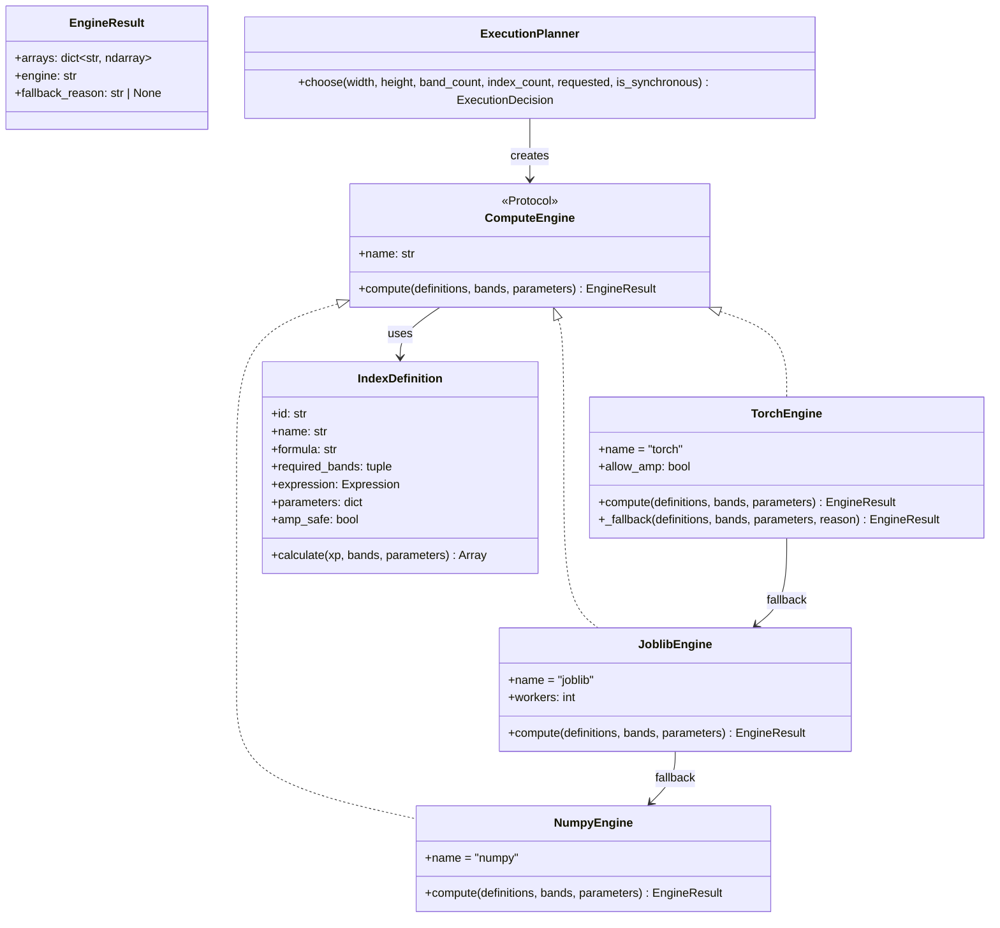
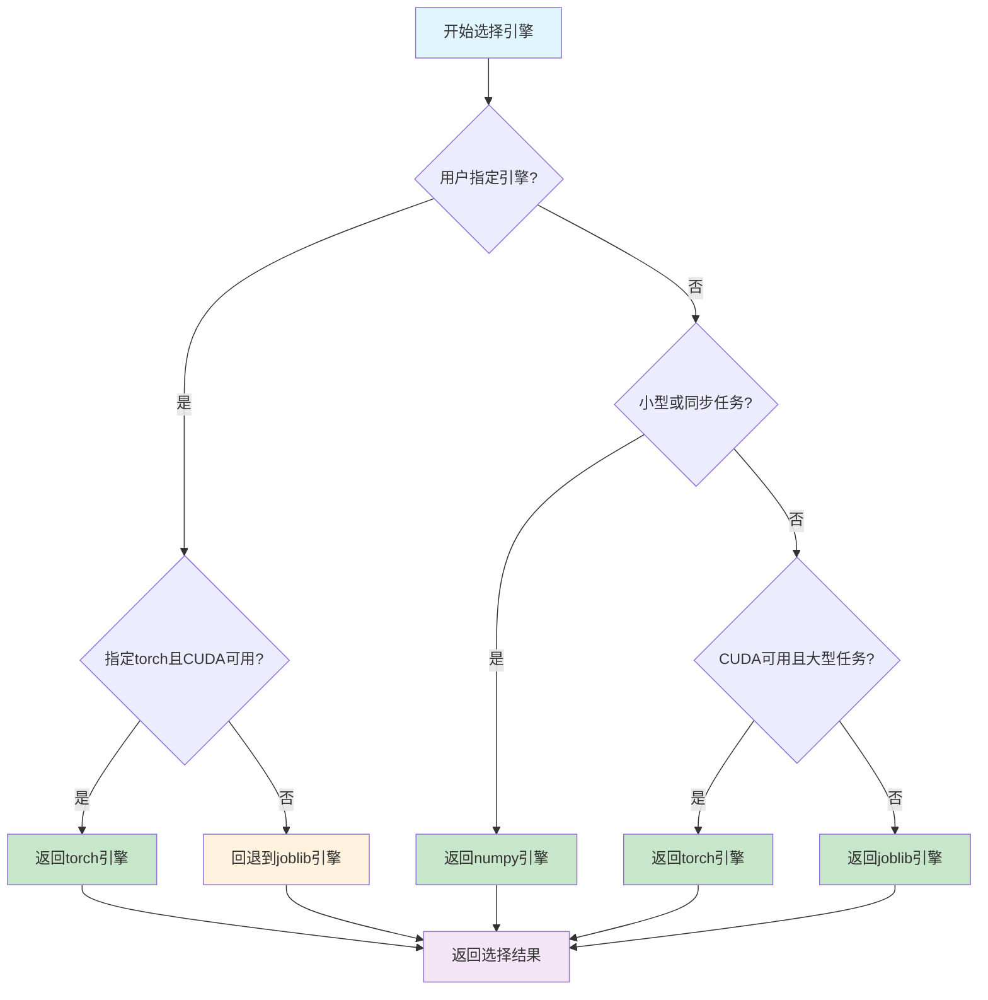
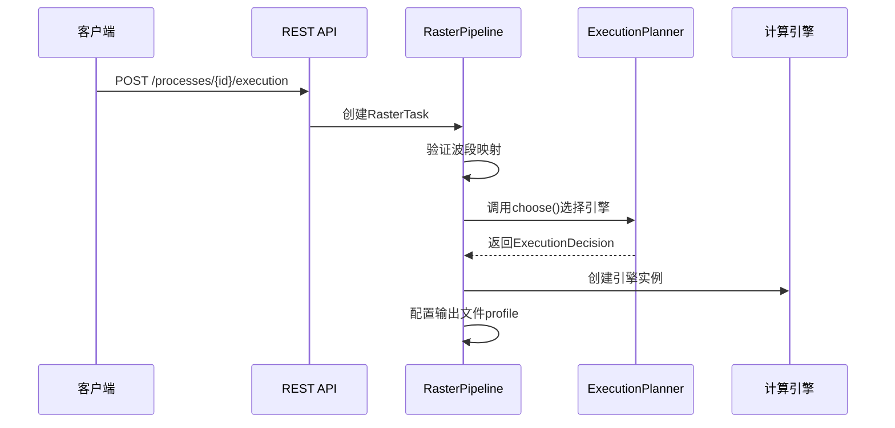

计算引擎是植被指数智能分析平台的核心计算模块，负责将数学公式转换为对遥感栅格数据的实际数值计算。该模块采用**策略模式**设计，提供了三种可互换的计算后端，并通过智能的引擎选择器根据数据规模和硬件能力自动选择最优执行方案。

## 架构设计与引擎协议

计算引擎的架构遵循**协议导向设计**（Protocol-Oriented Design），确保所有引擎实现遵循统一的接口规范。这种设计实现了公式的**一次定义、多后端执行**，使得同一份指数定义可以在NumPy、Joblib并行计算和PyTorch GPU加速三种环境下无缝运行。



**Sources: [base.py](backend/app/engines/base.py#L1-L35)**

## 引擎类型与特性对比

平台提供三种计算引擎，各自针对不同的计算场景进行了优化：

| 引擎 | 并行策略 | 适用场景 | 依赖项 | 精度保证 | 自动回退 |
|------|----------|----------|--------|----------|----------|
| **NumpyEngine** | 单线程向量化 | 小型任务（<200万像素）、同步请求、调试环境 | NumPy | 完全一致（基准） | N/A |
| **JoblibEngine** | 多线程并行 | 中大型任务（200万-2000万像素）、CPU环境 | joblib | 数值误差 <1e-6 | 未安装joblib时回退到NumPy |
| **TorchEngine** | GPU并行 + 分块处理 | 大型任务（>2000万像素）、多指数计算（≥4个）、CUDA环境 | PyTorch + CUDA | 数值误差 <1e-5 | CUDA不可用或显存不足时回退到Joblib |

**Sources: [numpy_engine.py](backend/app/engines/numpy_engine.py#L1-L34), [joblib_engine.py](backend/app/engines/joblib_engine.py#L1-L49), [torch_engine.py](backend/app/engines/torch_engine.py#L1-L102)**

## 智能引擎选择机制

引擎选择通过 `ExecutionPlanner` 类实现，该类采用**保守阈值策略**，避免小型任务因GPU传输开销产生负加速效果。选择逻辑如下：



**选择阈值说明**：
- **小型任务**：像素数 < 2,000,000 或同步请求
- **大型任务**：像素数 ≥ 20,000,000 或指数数量 ≥ 4 且CUDA可用
- **中型任务**：其他情况

**Sources: [planner.py](backend/app/services/planner.py#L1-L62)**

## 计算流程详解

计算引擎的执行流程分为三个主要阶段：**数据准备**、**分块计算**和**结果处理**。以 `RasterPipeline` 为核心协调器，实现了对大型栅格数据的内存友好处理。

### 1. 数据准备阶段



**Sources: [raster_pipeline.py](backend/app/services/raster_pipeline.py#L97-L160)**

### 2. 分块计算阶段

分块处理是大型栅格数据计算的关键优化。系统将影像分割为可管理的块（默认1024×1024像素），逐块读取、计算和写入结果：

1. **块窗口生成**：根据影像尺寸和块大小生成所有处理窗口
2. **波段读取**：从源影像读取当前窗口的波段数据
3. **掩膜处理**：生成无效数据掩膜（如云、阴影区域）
4. **引擎计算**：调用选定引擎的 `compute()` 方法
5. **结果写入**：将计算结果写入输出文件，应用掩膜处理

```python
# 分块计算的核心循环（简化示例）
for current, window in enumerate(windows, start=1):
    # 读取当前窗口的波段数据
    arrays = {
        logical_name: source.read(task.bands[logical_name], window=window)
        for logical_name in required_bands
    }
    
    # 调用引擎计算所有指数
    result = engine.compute(definitions, arrays, task.parameters)
    
    # 应用掩膜并写入结果
    for index_id, array in result.arrays.items():
        array[combined_mask] = self.nodata
        writers[index_id].write(array, 1, window=window)
```

**Sources: [raster_pipeline.py](backend/app/services/raster_pipeline.py#L162-L200)**

### 3. 结果处理阶段

计算完成后，系统执行以下后处理操作：

1. **概视图构建**：为输出文件创建多分辨率概视图（overviews），优化Web显示
2. **坐标系转换**：将边界框转换为WGS84坐标系，便于前端地图显示
3. **统计信息生成**：计算有效像素数、均值、标准差、直方图等统计指标
4. **预览图生成**：创建可视化预览图，采用植被指数专用色带
5. **资产上传**：将结果上传到MinIO对象存储，生成可访问的URL
6. **清单文件生成**：创建 `manifest.json`，记录完整的执行信息，确保结果可复现

**Sources: [raster_pipeline.py](backend/app/services/raster_pipeline.py#L200-L275)**

## 数值稳定性保障

计算引擎通过多层机制确保数值计算的稳定性：

### 1. 安全除法函数

所有涉及除法的植被指数公式都使用 `safe_divide` 函数，避免除零错误：

```python
def safe_divide(xp, numerator, denominator, epsilon=1e-6):
    """在NumPy/PyTorch间保持一致的安全除法语义。"""
    safe_denominator = xp.where(xp.abs(denominator) < epsilon, epsilon, denominator)
    return numerator / safe_denominator
```

**Sources: [indices.py](backend/app/core/indices.py#L17-L20)**

### 2. 结果规范化

引擎对所有计算结果执行统一的规范化处理：

```python
def sanitize_result(array, nodata=-9999.0):
    """统一转换输出类型，并替换NaN/Inf。"""
    result = np.asarray(array, dtype=np.float32)
    return np.nan_to_num(result, nan=nodata, posinf=nodata, neginf=nodata)
```

**Sources: [base.py](backend/app/engines/base.py#L31-L34)**

### 3. 掩膜传播

系统自动传播源数据的无效数据掩膜，确保输出结果与源数据的有效区域一致：

```python
# 合并所有波段的掩膜
combined_mask = np.logical_or.reduce(masks)
for index_id, array in result.arrays.items():
    array[combined_mask] = self.nodata
```

**Sources: [raster_pipeline.py](backend/app/services/raster_pipeline.py#L192-L195)**

## PyTorch引擎的GPU优化

TorchEngine针对GPU计算进行了多项优化，同时保持与CPU引擎的数值兼容性：

### 1. 数组API适配

`TorchArrayAPI` 类为PyTorch张量提供了与NumPy兼容的接口，处理标量差异：

```python
class TorchArrayAPI:
    """补齐公式所需的轻量数组API，处理PyTorch与NumPy的标量差异。"""
    
    def where(self, condition, yes, no):
        if not self.torch.is_tensor(yes):
            yes = self.torch.as_tensor(yes, dtype=no.dtype, device=no.device)
        if not self.torch.is_tensor(no):
            no = self.torch.as_tensor(no, dtype=yes.dtype, device=yes.device)
        return self.torch.where(condition, yes, no)
```

**Sources: [torch_engine.py](backend/app/engines/torch_engine.py#L15-L41)**

### 2. 混合精度支持

对于标记为 `amp_safe` 的指数，引擎可启用自动混合精度（AMP）计算，在保持精度的同时提升性能：

```python
amp_enabled = self.allow_amp and all(item.amp_safe for item in definitions)
amp_context = (
    torch.autocast(device_type="cuda", dtype=torch.float16)
    if amp_enabled
    else nullcontext()
)
```

**Sources: [torch_engine.py](backend/app/engines/torch_engine.py#L70-L75)**

### 3. 显存管理

引擎实现了完善的显存管理策略，包括：
- 使用 `torch.inference_mode()` 减少内存占用
- 捕获 `CUDA OutOfMemoryError` 并自动清理缓存
- 在失败时优雅地回退到CPU引擎

```python
except torch.cuda.OutOfMemoryError:
    torch.cuda.empty_cache()
    return self._fallback(definitions, bands, parameters, "GPU显存不足")
```

**Sources: [torch_engine.py](backend/app/engines/torch_engine.py#L86-L88)**

## 执行清单与可复现性

每次计算都会生成详细的执行清单（manifest），记录所有执行参数和环境信息，确保结果的可复现性：

| 清单字段 | 描述 | 示例值 |
|----------|------|--------|
| `source` | 源文件路径 | `data/inputs/source.tif` |
| `sourceSha256` | 源文件哈希值 | `a1b2c3...` |
| `indices` | 计算的指数列表 | `["ndvi", "evi"]` |
| `bands` | 波段映射 | `{"nir": 4, "red": 3}` |
| `parameters` | 指数参数 | `{"savi": {"L": 0.5}}` |
| `requestedEngine` | 请求的引擎 | `"auto"` |
| `selectedEngine` | 选择的引擎 | `"joblib"` |
| `actualEngine` | 实际使用的引擎 | `"joblib"` |
| `selectionReason` | 选择原因 | `"中大型任务使用CPU线程并行"` |
| `fallbackReasons` | 回退原因 | `[]` |
| `blockSize` | 分块大小 | `1024` |
| `durationSeconds` | 执行时间 | `12.3456` |
| `runtime` | 运行时环境 | `{"python": "3.11.0", "platform": "Windows-10"}` |
| `products` | 输出产品信息 | `[{...}, {...}]` |

**Sources: [raster_pipeline.py](backend/app/services/raster_pipeline.py#L249-L272)**

## 性能基准测试

平台提供了基准测试工具，用于评估不同引擎在不同数据规模下的性能表现：

```bash
# 运行基准测试
python scripts/benchmark.py --size 2048 --repeats 3
```

基准测试输出包含：
- 各引擎的平均执行时间
- 与基准引擎（NumPy）的最大数值误差
- 回退原因（如有）

**测试矩阵示例**：
| 数据尺寸 | NumPy | Joblib | PyTorch | 备注 |
|----------|-------|--------|---------|------|
| 512×512 | 0.05s | 0.08s | 0.15s | 小型任务，NumPy最快 |
| 2048×2048 | 0.82s | 0.45s | 0.28s | 中型任务，Joblib并行优势 |
| 4096×4096 | 3.2s | 1.8s | 0.9s | 大型任务，GPU加速明显 |

**Sources: [benchmark.py](backend/scripts/benchmark.py#L1-L56)**

## 测试验证策略

计算引擎通过多层次测试确保正确性和一致性：

### 1. 公式验证测试
验证每个指数的计算结果与数学公式完全一致：

```python
def test_ndvi_matches_manual_formula():
    result = NumpyEngine().compute([get_index("ndvi")], BANDS).arrays["ndvi"]
    expected = (BANDS["nir"] - BANDS["red"]) / (BANDS["nir"] + BANDS["red"])
    np.testing.assert_allclose(result, expected, rtol=1e-6)
```

**Sources: [test_indices.py](backend/tests/test_indices.py#L24-L27)**

### 2. 引擎一致性测试
验证不同引擎对相同输入产生相同结果：

```python
def test_joblib_matches_numpy():
    definitions = [get_index("ndvi"), get_index("evi"), get_index("msavi")]
    expected = NumpyEngine().compute(definitions, BANDS).arrays
    actual = JoblibEngine(workers=2).compute(definitions, BANDS).arrays
    for index_id in expected:
        np.testing.assert_allclose(actual[index_id], expected[index_id], rtol=1e-6)
```

**Sources: [test_indices.py](backend/tests/test_indices.py#L38-L43)**

### 3. 回退机制测试
验证引擎在异常情况下的优雅回退：

```python
def test_torch_engine_falls_back_or_matches():
    definition = [get_index("ndvi")]
    expected = NumpyEngine().compute(definition, BANDS).arrays["ndvi"]
    result = TorchEngine().compute(definition, BANDS)
    np.testing.assert_allclose(result.arrays["ndvi"], expected, rtol=1e-5)
```

**Sources: [test_indices.py](backend/tests/test_indices.py#L46-L50)**

### 4. 集成测试
验证完整的栅格处理流水线：

```python
def test_windowed_raster_pipeline_preserves_geometry(tmp_path):
    # 创建测试影像
    source_path = tmp_path / "source.tif"
    # ... 创建测试数据 ...
    
    # 执行计算
    result = RasterPipeline().run(RasterTask(
        source_path=str(source_path),
        output_dir=str(tmp_path / "outputs"),
        indices=["ndvi", "evi"],
        bands={"blue": 1, "green": 2, "red": 3, "nir": 4},
        engine="numpy",
        block_size=128,
    ))
    
    # 验证结果
    assert result["actualEngine"] == "numpy"
    assert len(result["products"]) == 2
    with rasterio.open(result["products"][0]["path"]) as output:
        assert (output.width, output.height) == (64, 64)
        assert output.crs.to_string() == "EPSG:4326"
```

**Sources: [test_raster_pipeline.py](backend/tests/test_raster_pipeline.py#L1-L47)**

## 扩展指南

### 添加新引擎

要添加新的计算引擎，需遵循以下步骤：

1. **实现ComputeEngine协议**：
```python
from app.engines.base import ComputeEngine, EngineResult

class NewEngine:
    name = "new-engine"
    
    def compute(self, definitions, bands, parameters=None) -> EngineResult:
        # 实现计算逻辑
        arrays = {}
        for definition in definitions:
            result = definition.calculate(xp, bands, parameters.get(definition.id))
            arrays[definition.id] = sanitize_result(result)
        return EngineResult(arrays=arrays, engine=self.name)
```

2. **注册到引擎选择器**：
```python
# 在raster_pipeline.py的_create_engine方法中添加
@staticmethod
def _create_engine(name: str) -> Any:
    if name == "new-engine":
        return NewEngine()
    # ... 其他引擎
```

3. **更新引擎选择逻辑**：
```python
# 在planner.py的ExecutionPlanner.choose方法中添加
if has_new_engine_capability() and meets_criteria:
    return ExecutionDecision(requested, "new-engine", "选择原因", estimated_memory_mb)
```

### 自定义指数计算

自定义指数通过PostgreSQL持久化存储，支持动态添加：

```python
# 自定义指数的存储结构
{
    "id": "custom-index-1",
    "name": "自定义指数",
    "expression": "(NIR - Red) / (NIR + Red + L)",
    "description": "自定义的土壤调节指数",
    "expectedRange": [-1, 1],
    "categories": ["custom"],
    "recommendationTags": ["自定义"],
    "limitations": ["需要验证适用性"]
}
```

**Sources: [custom_index_store.py](backend/app/services/custom_index_store.py#L1-L111)**

## 最佳实践

### 1. 引擎选择策略
- **开发调试**：使用 `engine="numpy"` 确保结果一致性
- **生产环境**：使用 `engine="auto"` 让系统自动优化
- **批量处理**：大型数据集使用 `engine="torch"` 充分利用GPU

### 2. 性能调优
- **块大小优化**：根据内存容量调整 `block_size`（128-2048）
- **指数参数**：为特定场景优化参数（如SAVI的L值）
- **并行控制**：Joblib引擎的 `workers` 参数可根据CPU核心数调整

### 3. 错误处理
- 监控 `fallbackReasons` 了解引擎回退情况
- 检查 `manifest.json` 中的执行信息
- 验证输出文件的统计信息和预览图

## 相关页面

- [指数注册表](13-zhi-shu-zhu-ce-biao)：了解所有内置指数的定义和参数
- [栅格处理流水线](15-zha-ge-chu-li-liu-shui-xian)：深入理解分块处理和结果生成
- [任务调度系统](16-ren-wu-diao-du-xi-tong)：了解异步任务执行和进度跟踪
- [REST API](25-rest-api)：查看计算引擎的API接口规范
- [性能基准测试](32-xing-neng-ji-zhun-ce-shi)：获取详细的性能测试数据和优化建议