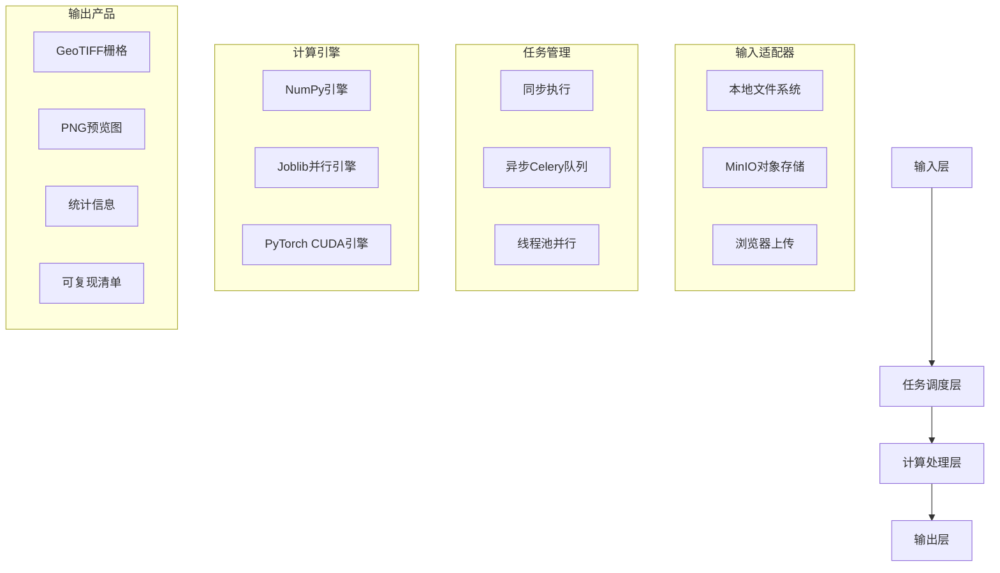
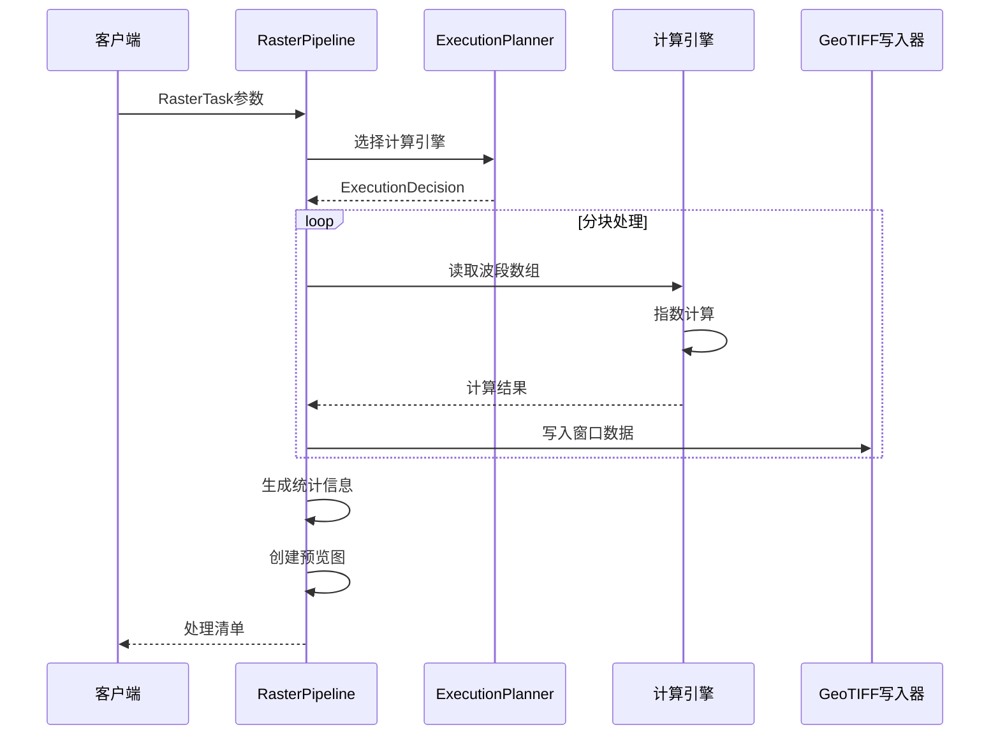

栅格处理流水线是植被指数智能分析平台的核心计算引擎，负责将原始遥感影像转化为可分析的植被指数产品。该流水线采用**分块处理、多引擎自适应、可复现记录**的设计理念，通过系统化的窗口调度和计算优化，实现从TB级原始数据到标准化GeoTIFF产品的高效转化。

## 架构概览

栅格处理流水线采用**分层解耦架构**，从输入适配到输出生成形成完整的数据处理链。整个系统由四个核心层构成：



这种分层设计使得每个组件都可以独立演化。例如，新增计算引擎只需实现`ComputeEngine`协议，无需修改流水线核心逻辑。

Sources: [raster_pipeline.py](backend/app/services/raster_pipeline.py#L1-L20)

## 核心数据流

栅格处理流水线遵循**读取-分块-计算-写入**的标准数据流模式。整个过程通过`RasterTask`数据类定义输入参数，由`RasterPipeline`类驱动执行：



分块处理的关键在于将大影像划分为固定大小的窗口（默认1024×1024像素），避免一次性加载整个影像导致内存溢出。每个窗口独立计算，最终拼接为完整产品。

Sources: [raster_pipeline.py](backend/app/services/raster_pipeline.py#L103-L200)

## 多引擎自适应选择

系统采用**三层引擎选择策略**，根据数据规模、硬件能力和用户偏好自动选择最优计算后端：

| 引擎类型 | 适用场景 | 并行策略 | 内存管理 |
|---------|---------|---------|---------|
| **NumPy** | 小型任务（<200万像素）<br>同步执行请求 | 单线程顺序计算 | 低内存占用，适合开发调试 |
| **Joblib** | 中大型任务（200万-2000万像素）<br>CPU密集型计算 | 线程池并行（默认CPU核心数-1） | 自动批处理，避免线程竞争 |
| **PyTorch** | 大型任务（>2000万像素）<br>多指数批量计算（≥4个） | CUDA GPU并行计算 | 显存自动管理，支持半精度 |

引擎选择决策逻辑由`ExecutionPlanner`类实现，采用保守阈值策略避免小任务因GPU传输开销产生性能下降：

```python
# 智能引擎选择逻辑
if pixels < 2_000_000 or is_synchronous:
    return "numpy"  # 小任务或同步请求
elif has_cuda() and (pixels >= 20_000_000 or index_count >= 4):
    return "torch"  # 大型任务且GPU可用
else:
    return "joblib" # 中大型任务使用CPU并行
```

用户可通过`engine`参数显式指定引擎，系统会验证CUDA可用性并自动回退到合适引擎。

Sources: [planner.py](backend/app/services/planner.py#L28-L62), [torch_engine.py](backend/app/engines/torch_engine.py#L43-L101)

## 指数计算抽象层

系统通过**数组后端抽象**实现指数公式的跨引擎复用。`IndexDefinition`类定义指数元数据和计算逻辑，通过`xp`参数接收NumPy或PyTorch数组API：

```python
# 指数定义示例：归一化植被指数
IndexDefinition(
    id="ndvi",
    name="归一化植被指数",
    formula="(NIR-Red)/(NIR+Red)",
    required_bands=("nir", "red"),
    expression=lambda xp, bands, params: safe_divide(
        xp, bands["nir"] - bands["red"], bands["nir"] + bands["red"]
    )
)
```

这种设计使得同一份指数定义可以无缝运行在：
- NumPy环境（CPU计算）
- PyTorch环境（GPU加速）
- 未来可能的JAX、TensorFlow等后端

安全除法函数`safe_divide`统一处理除零问题，确保所有引擎产生一致的NaN/Inf处理行为。

Sources: [indices.py](backend/app/core/indices.py#L23-L48)

## 输出产品体系

每个处理任务生成**四级输出产品**，形成完整的数据产品链：

| 产品类型 | 格式 | 用途 | 存储位置 |
|---------|------|------|---------|
| **原始栅格** | GeoTIFF（float32，DEFLATE压缩） | 精确分析和后续处理 | 本地文件系统/MinIO |
| **预览图** | PNG（1200px宽度，伪彩色渲染） | 可视化展示和快速评估 | 本地文件系统/MinIO |
| **统计信息** | JSON（基本统计+直方图） | 数据质量评估和元数据记录 | 包含在处理清单中 |
| **处理清单** | JSON（完整可复现记录） | 科学计算可复现性和审计追踪 | 本地文件系统 |

**可复现清单**记录完整的处理环境，包括：
- 输入文件SHA256校验和
- 指数选择和参数配置
- 引擎选择和回退原因
- 分块大小和处理时间
- 运行时环境信息（Python版本、操作系统）

这种设计确保任何处理结果都可以被独立验证和重现，满足遥感应用的科学计算要求。

Sources: [raster_pipeline.py](backend/app/services/raster_pipeline.py#L202-L275)

## 任务调度与执行模式

系统支持**两种执行模式**，满足不同场景的需求：

| 模式 | 执行方式 | 适用场景 | 性能特点 |
|------|---------|---------|---------|
| **同步执行** | 当前线程直接执行 | 小型任务、实时API响应 | 低延迟，但阻塞调用线程 |
| **异步执行** | Celery分布式任务队列 | 大型任务、生产环境 | 高吞吐量，支持优先级队列 |

异步执行通过`JobManager`类管理，支持：
- **优先级队列**：urgent/high/normal/low/batch五个级别
- **进度跟踪**：实时更新处理进度和状态消息
- **任务取消**：支持中正在执行的任务
- **结果缓存**：保存处理结果供后续查询

Celery集成支持两种部署模式：
- **开发模式**：`celery_always_eager=True`使用线程池模拟异步
- **生产模式**：连接Redis/RabbitMQ消息代理，支持分布式Worker

Sources: [jobs.py](backend/app/services/jobs.py#L1-L155), [worker_tasks.py](backend/app/worker_tasks.py#L1-L22)

## 性能优化策略

系统采用**多层次性能优化**策略，确保不同规模数据的高效处理：

1. **分块窗口处理**：将大影像划分为128-2048像素的窗口，避免内存溢出
2. **多引擎自适应**：根据数据规模自动选择最优计算后端
3. **并行计算**：Joblib线程池和PyTorch GPU并行，充分利用硬件资源
4. **惰性计算**：按需生成统计信息和预览图，减少不必要的计算
5. **内存管理**：PyTorch引擎自动处理显存不足异常，回退到CPU计算

性能基准测试显示，对于2000万像素的影像：
- NumPy引擎：约8-12秒
- Joblib引擎：约3-5秒（4核CPU）
- PyTorch引擎：约1-2秒（NVIDIA GPU）

这种优化策略确保系统既能处理科研级的大规模遥感数据，也能满足Web应用对响应时间的要求。

Sources: [raster_pipeline.py](backend/app/services/raster_pipeline.py#L140-L154), [torch_engine.py](backend/app/engines/torch_engine.py#L60-L61)

## 扩展性设计

系统通过**插件化架构**支持灵活扩展：

1. **新指数扩展**：在`INDEX_REGISTRY`中添加`IndexDefinition`即可自动注册
2. **自定义指数**：通过API动态创建用户自定义指数公式
3. **新引擎扩展**：实现`ComputeEngine`协议即可集成新计算后端
4. **存储后端扩展**：通过`upload_artifact`接口支持不同对象存储服务
5. **OGC标准集成**：通过pygeoapi插件提供标准化的地理处理服务

这种设计使得系统能够适应不断变化的业务需求和技术发展，保持长期的可维护性和扩展性。

Sources: [pygeoapi_processor.py](backend/app/pygeoapi_processor.py#L51-L78), [routes.py](backend/app/api/routes.py#L110-L140)

## 下一步阅读

栅格处理流水线是系统架构中的核心计算模块，与以下模块紧密协作：

- **[指数注册表](13-zhi-shu-zhu-ce-biao)**：了解指数定义和公式抽象机制
- **[计算引擎](14-ji-suan-yin-qing)**：深入理解多引擎并行计算实现
- **[任务调度系统](16-ren-wu-diao-du-xi-tong)**：掌握异步任务管理和优先级控制
- **[REST API](25-rest-api)**：学习如何通过API触发栅格处理任务
- **[OGC兼容接口](26-ogcjian-rong-jie-kou)**：了解标准化地理处理服务集成