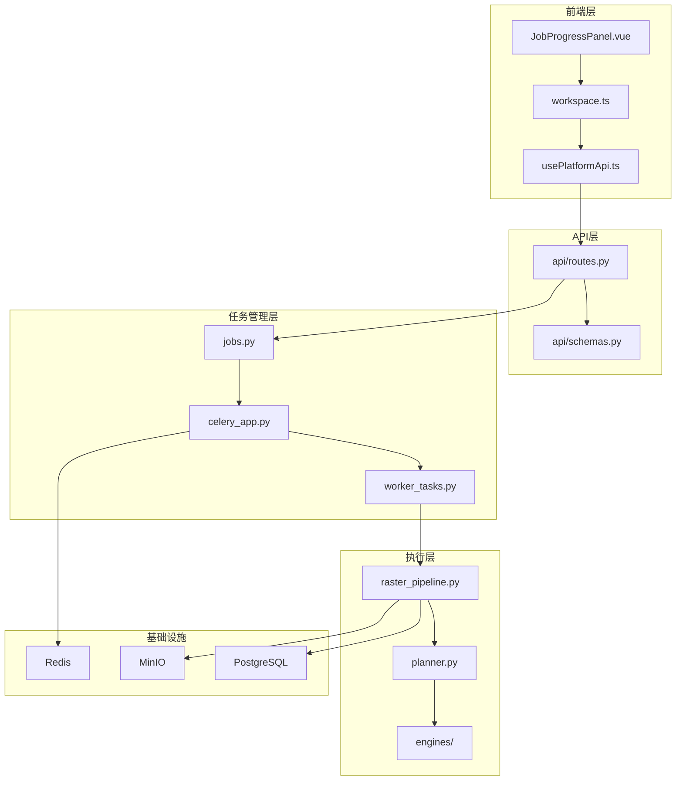
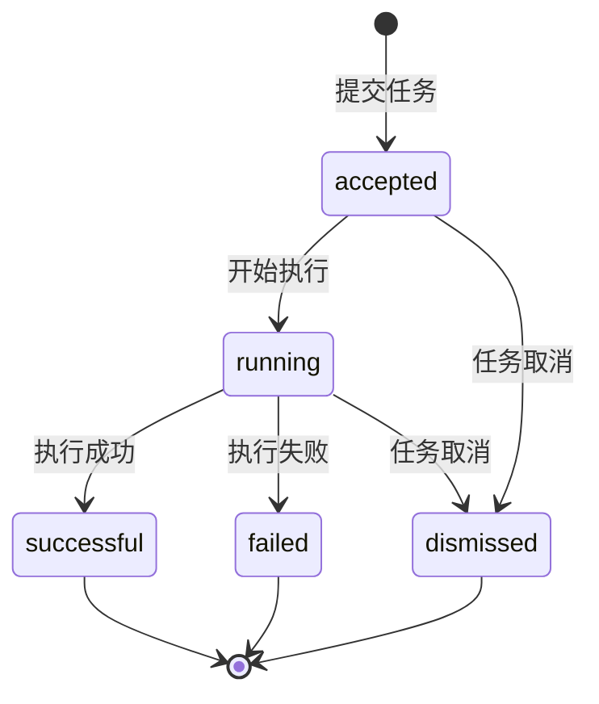
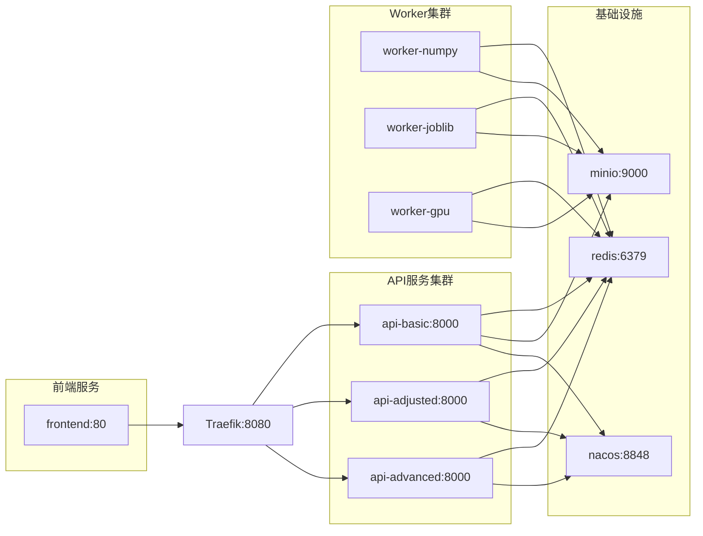

任务调度系统是植被指数智能分析平台的核心基础设施，负责管理栅格数据处理任务的全生命周期。该系统采用**双模式架构**，开发阶段使用轻量级线程池，生产部署则通过Celery + Redis实现分布式任务队列，支持五级优先级调度和实时进度跟踪。

## 架构概览

任务调度系统采用分层设计，从API层到执行层形成清晰的调用链路。核心组件包括`JobManager`任务管理器、`Celery`分布式队列、`RasterPipeline`计算流水线和`ExecutionPlanner`引擎选择器。



Sources: [backend/app/services/jobs.py](backend/app/services/jobs.py), [backend/app/celery_app.py](backend/app/celery_app.py), [backend/app/worker_tasks.py](backend/app/worker_tasks.py)

## 双模式执行架构

系统根据部署环境自动切换执行模式，通过`settings.celery_always_eager`配置项控制。开发模式下任务在本地线程池执行，生产模式则通过Celery分发到专用Worker容器。

| 模式 | 执行器 | 适用场景 | 配置条件 |
|------|--------|----------|----------|
| **开发模式** | `ThreadPoolExecutor` | 本地调试、单元测试 | `celery_always_eager=True` |
| **生产模式** | Celery + Redis | 高并发、分布式部署 | `celery_always_eager=False` |

在开发模式中，`JobManager`维护一个内存中的任务字典和线程池，最多支持3个并发任务：

```python
class JobManager:
    def __init__(self, max_workers: int = 3) -> None:
        self._jobs: dict[str, JobRecord] = {}
        self._lock = threading.Lock()
        self._executor = ThreadPoolExecutor(
            max_workers=max_workers, thread_name_prefix="raster-job"
        )
```

生产模式下，任务通过Celery的`send_task`方法分发到对应优先级的队列，并由专用Worker容器处理。

Sources: [backend/app/services/jobs.py#L37-L53](backend/app/services/jobs.py#L37-L53), [backend/app/settings.py#L12](backend/app/settings.py#L12)

## 五级优先队列系统

Celery配置实现了五级优先队列，允许不同类型的任务获得差异化的处理资源。优先级从1（最高）到5（最低），对应不同的队列名称。

```python
task_queues=(
    Queue("urgent", routing_key="priority.1"),   # 紧急：优先级1
    Queue("high", routing_key="priority.2"),      # 高：优先级2
    Queue("normal", routing_key="priority.3"),    # 正常：优先级3（默认）
    Queue("low", routing_key="priority.4"),       # 低：优先级4
    Queue("batch", routing_key="priority.5"),     # 批量：优先级5
),
task_default_queue="normal",
```

在`JobManager._submit_celery`方法中，优先级被映射到对应的队列：

```python
queues = {1: "urgent", 2: "high", 3: "normal", 4: "low", 5: "batch"}
async_result = celery_app.send_task(
    "app.worker_tasks.process_raster",
    args=[task_as_dict(task)],
    queue=queues[priority],
    priority=max(0, priority - 1),
)
```

生产环境中的Worker容器配置了不同的队列订阅策略，实现资源隔离：

| Worker | 订阅队列 | 并发数 | 主要职责 |
|--------|----------|--------|----------|
| `worker-numpy` | normal, low, batch | 1 | 小型任务、批量处理 |
| `worker-joblib` | urgent, high, normal | 2 | 中型任务、紧急处理 |
| `worker-gpu` | 所有队列 | GPU加速 | 大型任务、GPU计算 |

Sources: [backend/app/celery_app.py#L20-L26](backend/app/celery_app.py#L20-L26), [backend/app/services/jobs.py#L110-L124](backend/app/services/jobs.py#L110-L124), [compose.yml#L83-L128](compose.yml#L83-L128)

## 任务生命周期管理

每个任务都封装为`JobRecord`数据结构，包含完整的状态信息和元数据。任务状态机包含以下状态：



`JobRecord`数据结构定义了任务的所有属性：

```python
@dataclass(slots=True)
class JobRecord:
    id: str
    status: str = "accepted"
    progress: float = 0.0
    message: str = "等待执行"
    created_at: str = field(default_factory=lambda: datetime.now(UTC).isoformat())
    updated_at: str = field(default_factory=lambda: datetime.now(UTC).isoformat())
    result: dict[str, Any] | None = None
    error: str | None = None
    cancelled: bool = False
```

任务状态转换由`JobManager._run`方法控制，支持进度回调和取消检查：

```python
def _run(self, job_id: str, task: RasterTask) -> None:
    record = self.get(job_id)
    record.status = "running"
    
    def progress(current: int, total: int, message: str) -> None:
        record.progress = round(current / max(total, 1) * 100, 2)
        record.message = message
    
    try:
        result = RasterPipeline().run(
            task,
            on_progress=progress,
            is_cancelled=lambda: record.cancelled,
        )
        record.status = "successful"
        record.result = result
    except Exception as error:
        record.status = "dismissed" if record.cancelled else "failed"
        record.error = str(error)
```

Sources: [backend/app/services/jobs.py#L19-L34](backend/app/services/jobs.py#L19-L34), [backend/app/services/jobs.py#L83-L108](backend/app/services/jobs.py#L83-L108)

## 智能引擎选择机制

`ExecutionPlanner`根据数据规模和硬件能力自动选择最优计算引擎，避免小任务因GPU传输产生负加速，同时为大型任务启用GPU加速。

```python
class ExecutionPlanner:
    def choose(
        self,
        width: int,
        height: int,
        band_count: int,
        index_count: int,
        requested: EngineName = "auto",
        is_synchronous: bool = False,
    ) -> ExecutionDecision:
        pixels = width * height
        estimated_memory_mb = pixels * (band_count + index_count) * 4 / 1024**2
        
        if requested != "auto":
            # 用户指定引擎处理
            ...
        
        if is_synchronous or pixels < 2_000_000:
            return ExecutionDecision(requested, "numpy", "小型或同步任务优先降低调度开销", ...)
        if has_cuda() and (pixels >= 20_000_000 or index_count >= 4):
            return ExecutionDecision(requested, "torch", "大型或多指数任务且检测到CUDA", ...)
        return ExecutionDecision(requested, "joblib", "中大型任务使用CPU线程并行", ...)
```

引擎选择策略如下：

| 任务特征 | 选择引擎 | 选择理由 |
|----------|----------|----------|
| 像素数 < 200万 或 同步执行 | NumPy | 降低调度开销 |
| 像素数 ≥ 2000万 或 指数≥4 且 CUDA可用 | Torch (GPU) | 大型任务GPU加速 |
| 其他情况 | Joblib (CPU并行) | 中大型任务CPU并行 |
| 用户指定引擎 | 按用户选择 | 尊重用户偏好 |

Sources: [backend/app/services/planner.py#L28-L62](backend/app/services/planner.py#L28-L62)

## OGC兼容API设计

任务调度系统实现了OGC API - Processes标准，支持同步和异步两种执行模式。通过`Prefer: respond-async`请求头控制执行模式。

### 同步执行

```http
POST /processes/ndvi/execution
Content-Type: application/json

{
  "source": {"localPath": "/data/sample.tif"},
  "indices": ["ndvi"],
  "bands": {"blue": 1, "green": 2, "red": 3, "nir": 4},
  "engine": "auto",
  "blockSize": 1024,
  "priority": 3
}
```

### 异步执行

```http
POST /processes/batch/execution
Prefer: respond-async
Content-Type: application/json

{
  "source": {"localPath": "/data/sample.tif"},
  "indices": ["ndvi", "evi", "gndvi"],
  "bands": {"blue": 1, "green": 2, "red": 3, "nir": 4},
  "engine": "auto",
  "priority": 2
}
```

异步执行返回任务ID和状态查询URL：

```json
{
  "jobID": "a1b2c3d4e5f6",
  "status": "accepted",
  "location": "/jobs/a1b2c3d4e5f6"
}
```

### 任务查询端点

| 端点 | 方法 | 功能 |
|------|------|------|
| `/jobs` | GET | 列出所有任务 |
| `/jobs/{job_id}` | GET | 查询任务状态 |
| `/jobs/{job_id}/results` | GET | 获取任务结果 |
| `/jobs/{job_id}` | DELETE | 取消任务 |

Sources: [backend/app/api/routes.py#L110-L172](backend/app/api/routes.py#L110-L172), [backend/app/api/schemas.py#L23-L34](backend/app/api/schemas.py#L23-L34)

## 进度跟踪与状态同步

任务支持实时进度更新，通过回调机制和状态轮询实现前后端同步。Celery任务通过`update_state`方法上报进度：

```python
@celery_app.task(bind=True, autoretry_for=(OSError,), retry_backoff=2, max_retries=1)
def process_raster(self: Any, task_payload: dict[str, Any]) -> dict[str, Any]:
    task = RasterTask(**task_payload)
    
    def progress(current: int, total: int, message: str) -> None:
        self.update_state(
            state="PROGRESS",
            meta={"progress": round(current / max(total, 1) * 100, 2), "message": message},
        )
    
    return RasterPipeline().run(task, on_progress=progress)
```

`JobManager._refresh_celery`方法负责从Celery获取最新状态并更新本地记录：

```python
@staticmethod
def _refresh_celery(record: JobRecord) -> None:
    result = celery_app.AsyncResult(record.id)
    state_mapping = {
        "PENDING": "accepted",
        "STARTED": "running",
        "PROGRESS": "running",
        "RETRY": "running",
        "SUCCESS": "successful",
        "FAILURE": "failed",
        "REVOKED": "dismissed",
    }
    record.status = state_mapping.get(result.state, result.state.lower())
```

前端通过`JobProgressPanel.vue`组件展示任务状态，支持进度条、状态标签和操作按钮。

Sources: [backend/app/worker_tasks.py#L11-L22](backend/app/worker_tasks.py#L11-L22), [backend/app/services/jobs.py#L126-L152](backend/app/services/jobs.py#L126-L152), [frontend/src/components/JobProgressPanel.vue](frontend/src/components/JobProgressPanel.vue)

## 前端集成架构

前端任务管理采用Pinia状态管理，通过组合式函数封装API调用。`workspace.ts`存储管理任务状态：

```typescript
export const useWorkspaceStore = defineStore('workspace', () => {
  const jobs = shallowRef<JobRecord[]>([])
  
  const runningJobs = computed(() =>
    jobs.value.filter((job) => ['accepted', 'running'].includes(job.status)),
  )
  const completedJobs = computed(() =>
    jobs.value.filter((job) => job.status === 'successful'),
  )
  
  function setJobs(value: JobRecord[]) {
    jobs.value = value
  }
  
  return {
    jobs,
    runningJobs,
    completedJobs,
    setJobs,
    // ...
  }
})
```

`usePlatformApi.ts`提供任务相关的API封装：

```typescript
export function usePlatformApi() {
  async function listJobs(): Promise<JobRecord[]> {
    const response = await requestJson<{ jobs: JobRecord[] }>('/jobs')
    return response.jobs
  }
  
  async function getJob(jobId: string): Promise<JobRecord> {
    return requestJson<JobRecord>(`/jobs/${jobId}`)
  }
  
  async function cancelJob(jobId: string): Promise<JobRecord> {
    return requestJson<JobRecord>(`/jobs/${jobId}`, {
      method: 'DELETE',
    })
  }
  
  async function getResults(jobId: string): Promise<RasterResult> {
    return requestJson<RasterResult>(`/jobs/${jobId}/results`)
  }
  
  // ...
}
```

Sources: [frontend/src/stores/workspace.ts#L41-L46](frontend/src/stores/workspace.ts#L41-L46), [frontend/src/composables/usePlatformApi.ts#L144-L161](frontend/src/composables/usePlatformApi.ts#L144-L161)

## 容器化部署配置

生产环境通过Docker Compose编排，实现服务发现和负载均衡。关键配置包括：

1. **Redis**：消息代理和结果存储，支持持久化
2. **Traefik**：反向代理和负载均衡，支持路径路由
3. **MinIO**：对象存储，存储输入输出文件
4. **Nacos**：服务注册与发现，支持动态配置



Worker容器配置了不同的队列订阅策略，实现资源隔离和负载均衡。

Sources: [compose.yml](compose.yml)

## 性能优化策略

任务调度系统采用多种优化策略提升性能：

1. **分块处理**：`RasterPipeline`将大影像分割为1024×1024的窗口进行处理
2. **引擎自适应**：根据数据规模自动选择最优引擎
3. **进度反馈**：实时更新任务进度，提升用户体验
4. **任务取消**：支持运行中任务的优雅取消
5. **错误重试**：Celery任务配置自动重试机制

```python
@celery_app.task(bind=True, autoretry_for=(OSError,), retry_backoff=2, max_retries=1)
def process_raster(self: Any, task_payload: dict[str, Any]) -> dict[str, Any]:
    # 任务处理逻辑
    ...
```

分块处理的核心逻辑在`RasterPipeline.run`方法中实现：

```python
windows = [
    Window(
        column,
        row,
        min(block_size, source.width - column),
        min(block_size, source.height - row),
    )
    for row in range(0, source.height, block_size)
    for column in range(0, source.width, block_size)
]

for current, window in enumerate(windows, start=1):
    if is_cancelled and is_cancelled():
        raise RuntimeError("任务已取消")
    # 窗口处理逻辑
    ...
```

Sources: [backend/app/services/raster_pipeline.py#L103-L200](backend/app/services/raster_pipeline.py#L103-L200), [backend/app/worker_tasks.py#L11](backend/app/worker_tasks.py#L11)

## 测试与验证

任务调度系统包含完整的测试套件，覆盖同步执行、异步执行、任务取消和错误处理等场景。

```python
def test_async_process_returns_job_and_results(sample_raster: Path) -> None:
    response = client.post(
        "/processes/ndvi/execution",
        headers={"Prefer": "respond-async"},
        json=execution_payload(sample_raster),
    )
    assert response.status_code == 200
    job_id = response.json()["jobID"]
    
    record = {}
    for _ in range(50):
        record = client.get(f"/jobs/{job_id}").json()
        if record["status"] in {"successful", "failed"}:
            break
        time.sleep(0.02)
    
    assert record["status"] == "successful"
    results = client.get(f"/jobs/{job_id}/results")
    assert results.status_code == 200
```

测试验证了以下关键功能：
- 同步执行返回完整结果
- 异步执行返回任务ID和状态
- 任务状态轮询正确更新
- 任务结果正确存储和检索

Sources: [backend/tests/test_api.py#L167-L186](backend/tests/test_api.py#L167-L186)

## 相关文档

- [系统架构](9-xi-tong-jia-gou) - 了解整体系统设计
- [计算引擎](14-ji-suan-yin-qing) - 深入了解引擎选择机制
- [栅格处理流水线](15-zha-ge-chu-li-liu-shui-xian) - 了解数据处理流程
- [REST API](25-rest-api) - API接口详细说明
- [容器化部署](5-rong-qi-hua-bu-shu) - 生产环境部署指南