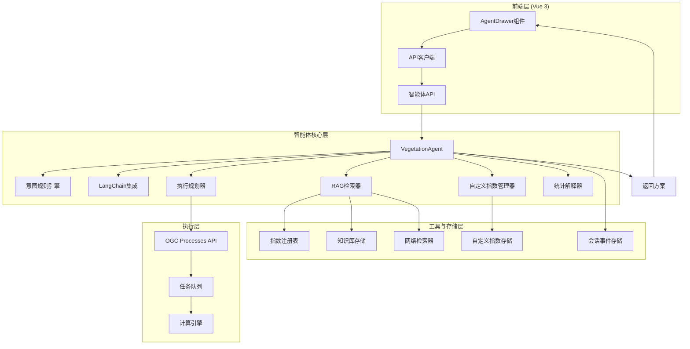
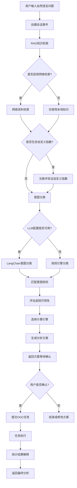
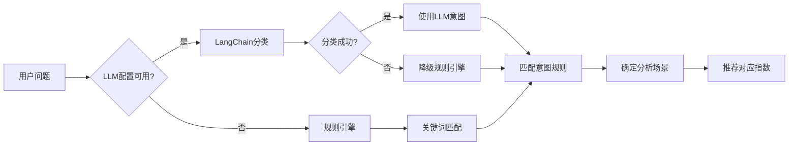
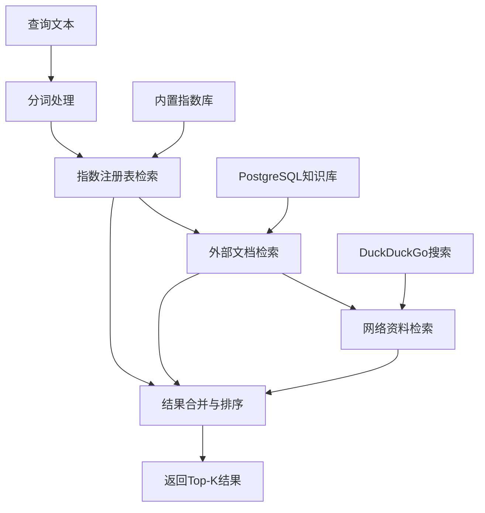
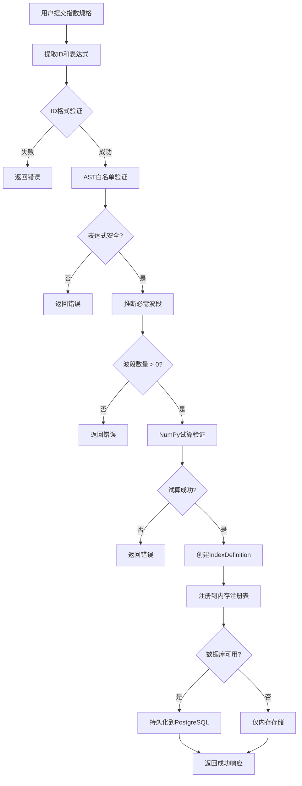
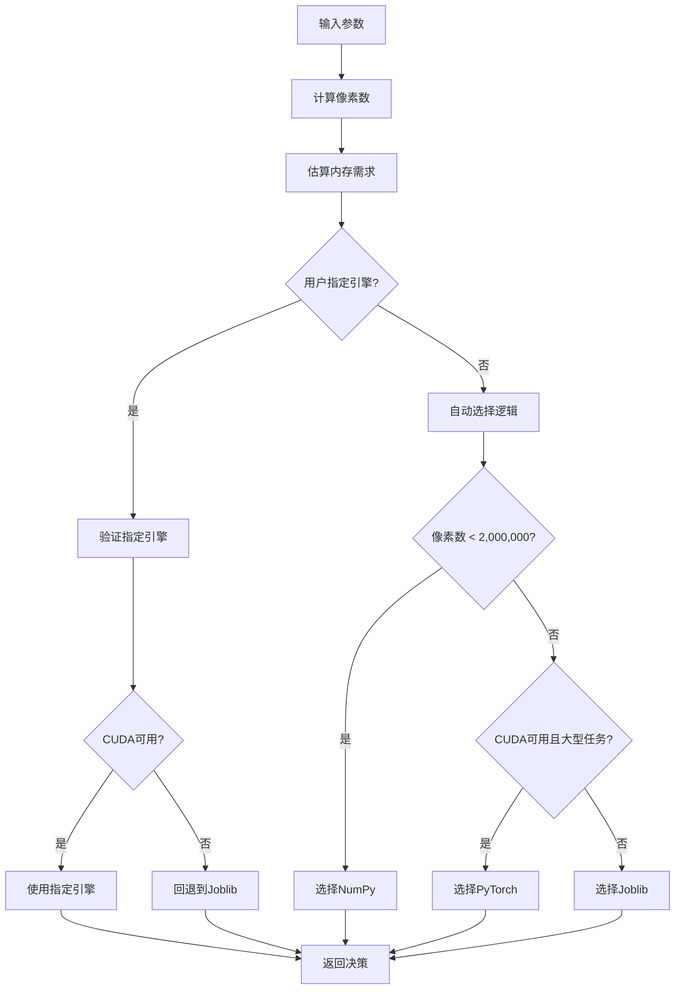
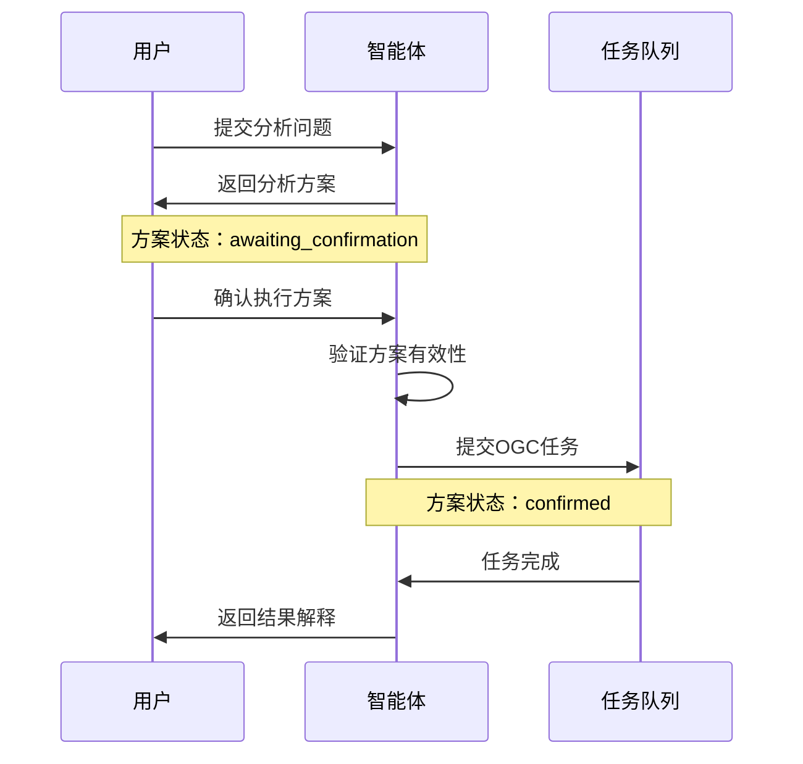
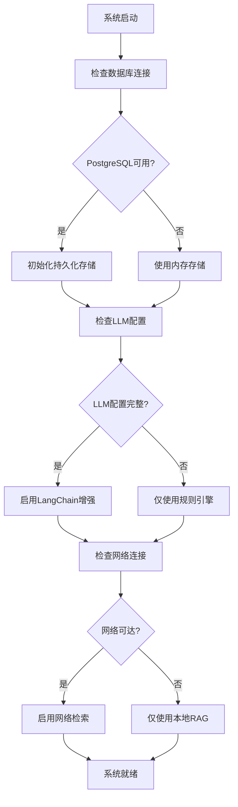
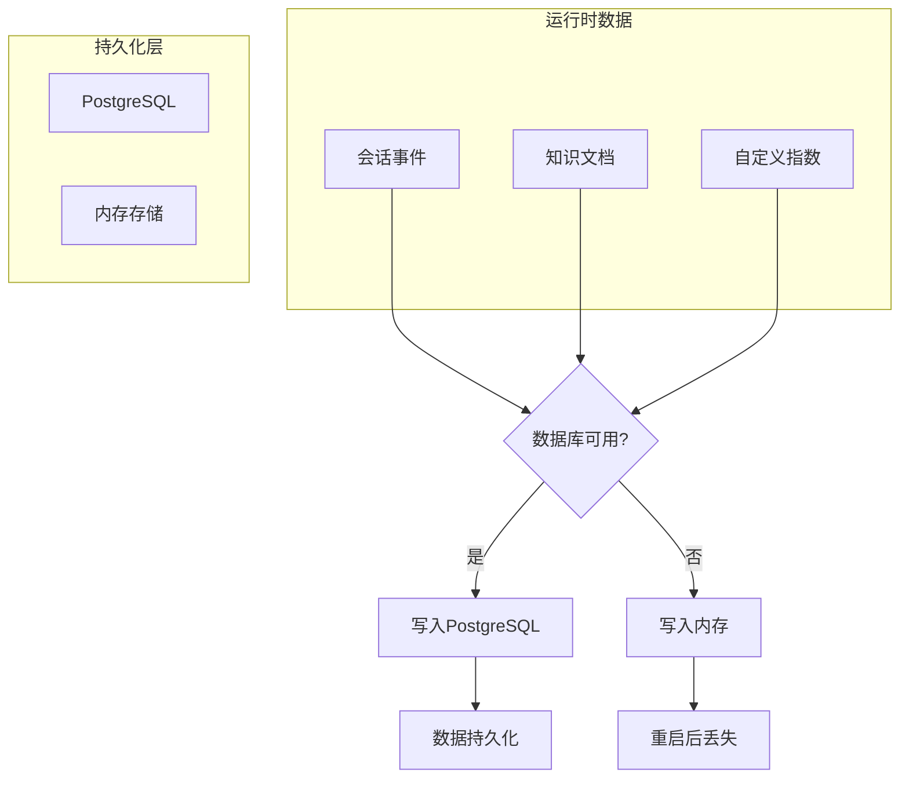

本文档详细阐述植被指数智能分析平台中智能体系统的架构设计。该智能体是一个专注于遥感分析的规划器，能够将用户自然语言意图转化为安全、可审计的植被指数计算工作流。

## 架构设计哲学

智能体采用**混合智能架构**，融合了确定性规则引擎、轻量级RAG检索和可选LLM增强。这种设计确保系统在缺乏外部AI服务时仍能提供可靠的基础功能，同时通过LangChain实现更精细的意图理解和结果解释。架构遵循"安全第一"原则，严格限制LLM的自主执行权限，所有计算任务必须经过人工确认才能提交。

Sources: [backend/app/services/agent.py](backend/app/services/agent.py#L1-L22), [frontend/src/components/AgentDrawer.vue](frontend/src/components/AgentDrawer.vue#L1-L20)

## 核心组件架构

智能体系统由六个核心组件构成，每个组件负责特定功能，通过明确定义的接口协作。下表展示了各组件的职责和关键特性：

| 组件 | 核心职责 | 存储方式 | 降级策略 |
|------|----------|----------|----------|
| **VegetationAgent** | 智能体主控制器，协调所有子系统 | 内存 | 无 |
| **IntentRule引擎** | 基于关键词的意图分类和指数推荐 | 内存 | 主要分类器 |
| **LangChain集成** | LLM增强的意图识别和结果解释 | 无状态 | 规则引擎兜底 |
| **RAG检索器** | 指数知识、外部文档和网络资料检索 | PostgreSQL/内存 | 本地指数注册表 |
| **自定义指数管理器** | 运行期自定义指数注册和持久化 | PostgreSQL/内存 | 进程内存 |
| **会话存储器** | 用户交互事件持久化 | PostgreSQL/内存 | 进程内存 |

Sources: [backend/app/services/agent.py](backend/app/services/agent.py#L24-L50), [backend/app/services/agent_tools.py](backend/app/services/agent_tools.py#L1-L30), [backend/app/services/agent_knowledge_store.py](backend/app/services/agent_knowledge_store.py#L1-L30)

## 智能体工作流程

智能体遵循一个**六阶段可审计工作流**，每个阶段都生成跟踪信息，确保决策过程透明可追溯。以下流程图展示了从用户输入到结果解释的完整数据流：

Sources: [backend/app/services/agent.py](backend/app/services/agent.py#L51-L100), [backend/app/services/agent.py](backend/app/services/agent.py#L101-L150)

## 意图分类机制

智能体采用**双通道意图分类**策略，将规则引擎作为确定性基础，LangChain作为增强通道。意图分类结果直接影响推荐的植被指数集合。

下表展示了五种主要意图场景及其对应的植被指数推荐：

| 意图场景 | 关键词示例 | 推荐指数 | 使用限制 |
|----------|------------|----------|----------|
| **作物长势分析** | 长势、健康、覆盖、农田 | NDVI, EVI, GNDVI | 高覆盖区NDVI可能饱和 |
| **稀疏植被分析** | 稀疏、苗期、裸土、荒漠 | SAVI, OSAVI, MSAVI, BSI | 土壤湿度差异仍可能影响 |
| **叶绿素状态分析** | 叶绿素、氮、营养、红边 | GNDVI, NDRE, GCI, RECI | NDRE和RECI需要红边波段 |
| **水分胁迫分析** | 干旱、水分、缺水、胁迫 | NDMI, MSI | 需要短波红外波段 |
| **多时相变化监测** | 变化、两期、前后、退化 | NDVI, EVI, NBR | 影像必须完成配准与辐射一致化 |

Sources: [backend/app/services/agent.py](backend/app/services/agent.py#L24-L50), [backend/app/services/agent.py](backend/app/services/agent.py#L151-L180)

## RAG知识检索系统

RAG检索系统采用**三级知识源**架构，确保在不同环境下都能提供有价值的参考信息。检索过程遵循优先级顺序，首先从内置指数注册表开始，然后扩展到外部文档和网络资源。

检索系统支持三种知识源类型，每种类型具有不同的特性：

| 知识源类型 | 存储位置 | 更新机制 | 可靠性 | 延迟 |
|------------|----------|----------|--------|------|
| **内置指数注册表** | 内存 | 代码更新 | 最高 | 极低 |
| **用户上传文档** | PostgreSQL/内存 | 运行时导入 | 高 | 中等 |
| **网络搜索结果** | 无状态 | 实时查询 | 可变 | 高 |

Sources: [backend/app/services/agent_tools.py](backend/app/services/agent_tools.py#L30-L80), [backend/app/services/agent_knowledge_store.py](backend/app/services/agent_knowledge_store.py#L1-L50)

## 自定义指数管理

自定义指数系统允许用户在运行期动态注册新的植被指数，同时确保安全性和可维护性。注册过程包含严格的验证步骤，防止错误或恶意表达式进入系统。

自定义指数验证包含以下安全措施：

| 验证步骤 | 检查内容 | 失败处理 |
|----------|----------|----------|
| **ID格式验证** | 小写字母、数字、下划线，长度≤40 | 拒绝注册 |
| **AST白名单验证** | 仅允许安全的数学运算和波段引用 | 拒绝注册 |
| **必需波段推断** | 表达式必须引用至少一个波段 | 拒绝注册 |
| **NumPy试算验证** | 使用测试数组验证表达式可执行性 | 拒绝注册 |
| **预期范围验证** | 可选的数值范围验证 | 使用默认范围 |

Sources: [backend/app/services/agent_tools.py](backend/app/services/agent_tools.py#L100-L150), [backend/app/services/agent_tools.py](backend/app/services/agent_tools.py#L151-L200)

## 执行规划器

执行规划器根据数据规模、硬件能力和用户偏好选择最合适的计算引擎。规划器采用保守策略，避免小任务因GPU传输产生负加速。

引擎选择决策基于以下阈值：

| 条件 | 推荐引擎 | 决策理由 |
|------|----------|----------|
| **像素数 < 2,000,000** | NumPy | 小型任务，降低调度开销 |
| **用户指定引擎** | 指定引擎 | 尊重用户选择 |
| **用户指定torch但无CUDA** | Joblib | GPU不可用，回退CPU |
| **CUDA可用且(像素≥20M或指数≥4)** | PyTorch | 大型任务利用GPU加速 |
| **其他情况** | Joblib | 中大型任务使用CPU并行 |

Sources: [backend/app/services/planner.py](backend/app/services/planner.py#L1-L62)

## 安全与确认机制

智能体系统实施严格的**确认门机制**，所有计算任务必须经过人工确认才能提交。这种设计防止意外的高资源消耗操作，并给予用户修改方案的机会。

安全机制包含以下保护措施：

| 安全措施 | 实施位置 | 保护目标 |
|----------|----------|----------|
| **执行前确认门** | VegetationAgent | 防止意外任务提交 |
| **波段可用性验证** | 意图规则引擎 | 阻止不可执行指数 |
| **自定义指数验证** | 自定义指数管理器 | 防止恶意表达式 |
| **LLM权限限制** | LangChain集成 | 阻止危险操作 |
| **任务优先级控制** | 执行规划器 | 资源消耗管理 |

Sources: [backend/app/services/agent.py](backend/app/services/agent.py#L200-L250), [backend/app/api/routes.py](backend/app/api/routes.py#L200-L250)

## 降级与容错策略

智能体系统采用**优雅降级**设计，确保在各种故障场景下仍能提供基本功能。降级策略遵循"功能渐进"原则，在部分组件不可用时减少功能而非完全失败。

降级场景和应对策略：

| 故障场景 | 影响组件 | 降级策略 | 用户感知 |
|----------|----------|----------|----------|
| **数据库不可用** | 知识库、会话存储、自定义指数 | 内存存储，重启后丢失 | 功能正常但数据不持久 |
| **LLM配置缺失** | LangChain集成 | 仅使用规则引擎 | 意图分类精度降低 |
| **LLM调用失败** | LangChain集成 | 降级规则引擎，显示警告 | 意图分类精度降低 |
| **网络不可达** | 网络检索 | 仅使用本地RAG | 检索结果减少 |
| **CUDA不可用** | PyTorch引擎 | 回退到Joblib | 计算速度可能降低 |

Sources: [backend/app/services/agent_knowledge_store.py](backend/app/services/agent_knowledge_store.py#L30-L50), [backend/app/services/agent_session_store.py](backend/app/services/agent_session_store.py#L30-L50)

## API集成接口

智能体通过RESTful API与前端和其他系统集成，提供完整的生命周期管理接口。所有API都遵循一致的错误处理和响应格式。

| API端点 | HTTP方法 | 功能描述 | 请求参数 |
|---------|----------|----------|----------|
| `/api/agent/plan` | POST | 生成分析方案 | message, availableBands, llm, enableWebSearch, customIndex |
| `/api/agent/plans/{planId}/confirm` | POST | 确认并提交任务 | source, bands, indices, engine, blockSize |
| `/api/agent/interpret-results` | POST | 解释统计结果 | products, userGoal, llm, sessionId |
| `/api/agent/sessions/{sessionId}/events` | GET | 获取会话历史 | sessionId |
| `/api/agent/knowledge` | POST | 导入知识文档 | title, content, source, sessionId |
| `/api/indices/custom` | POST | 注册自定义指数 | id, name, expression, description |

Sources: [backend/app/api/routes.py](backend/app/api/routes.py#L200-L300), [backend/app/api/schemas.py](backend/app/api/schemas.py#L1-L100)

## 前端智能体界面

前端`AgentDrawer`组件提供完整的智能体交互界面，支持对话式交互、方案可视化、执行确认和结果解释。界面设计遵循"渐进披露"原则，将高级配置隐藏在弹出层中。

界面主要功能区域包括：

| 功能区域 | 主要元素 | 交互方式 |
|----------|----------|----------|
| **对话区** | 输入框、消息时间线、状态指示器 | 文本输入、自动滚动 |
| **方案卡** | 运行过程时间线、指数推荐、检索来源 | 只读展示 |
| **执行单** | 指数选择、引擎选择、参数调整 | 表单交互 |
| **知识导入** | 文档上传、内容输入、RAG写入 | 文件选择、文本输入 |
| **模型配置** | LLM提供商、API密钥、模型选择 | 弹出层表单 |

Sources: [frontend/src/components/AgentDrawer.vue](frontend/src/components/AgentDrawer.vue#L1-L100), [frontend/src/components/AgentDrawer.vue](frontend/src/components/AgentDrawer.vue#L400-L500)

## 数据持久化架构

智能体系统支持两种持久化模式，根据数据库可用性自动选择。这种设计确保系统在不同部署环境下都能正常工作。

数据持久化策略：

| 数据类型 | PostgreSQL表 | 内存结构 | 降级行为 |
|----------|--------------|----------|----------|
| **会话事件** | vegetation_agent_sessions, vegetation_agent_events | 字典和列表 | 会话仅当前有效 |
| **知识文档** | vegetation_agent_knowledge_documents | 字典 | 文档仅当前有效 |
| **自定义指数** | vegetation_custom_indices | INDEX_REGISTRY | 指数仅当前有效 |

Sources: [backend/app/services/agent_session_store.py](backend/app/services/agent_session_store.py#L1-L50), [backend/app/services/agent_knowledge_store.py](backend/app/services/agent_knowledge_store.py#L1-L50), [backend/app/services/custom_index_store.py](backend/app/services/custom_index_store.py#L1-L50)

## 扩展与维护指南

智能体架构支持多种扩展场景，开发者可以根据需求添加新的意图规则、工具函数或集成新的AI服务。扩展时需遵循既定的设计原则和安全约束。

主要扩展点包括：

| 扩展类型 | 实现位置 | 扩展方式 | 注意事项 |
|----------|----------|----------|----------|
| **新意图场景** | IntentRule元组 | 添加新的IntentRule实例 | 确保关键词覆盖和指数推荐合理 |
| **新检索源** | agent_tools.py | 实现新的检索函数 | 保持降级兼容性 |
| **新LLM提供商** | _invoke_langchain | 添加新的条件分支 | 保持懒加载和错误处理 |
| **新验证规则** | 自定义指数管理器 | 扩展验证函数 | 保持安全边界 |
| **新执行引擎** | 执行规划器 | 扩展选择逻辑 | 更新阈值和回退策略 |

Sources: [backend/app/services/agent.py](backend/app/services/agent.py#L34-L50), [backend/app/services/agent_tools.py](backend/app/services/agent_tools.py#L1-L30)

## 配置与部署

智能体行为通过环境变量和运行时配置控制，支持灵活的部署场景。配置项遵循"安全默认值"原则，在未配置时提供保守但可用的默认行为。

关键配置参数：

| 配置项 | 环境变量 | 默认值 | 影响范围 |
|--------|----------|--------|----------|
| **数据库连接** | VIP_DATABASE_URL | None（内存模式） | 持久化功能 |
| **OpenAI兼容端点** | VIP_OPENAI_BASE_URL | None（禁用LLM） | LangChain集成 |
| **OpenAI API密钥** | VIP_OPENAI_API_KEY | None（禁用LLM） | LangChain集成 |
| **默认模型** | VIP_OPENAI_MODEL | gpt-4.1-mini | LangChain集成 |
| **数据目录** | VIP_DATA_DIR | data | 文件存储 |

Sources: [backend/app/settings.py](backend/app/settings.py#L1-L33)

## 性能考量

智能体系统在设计时考虑了多种性能因素，确保在不同规模的数据和用户负载下都能保持响应性。

性能优化措施包括：

| 优化点 | 实施策略 | 效果 |
|--------|----------|------|
| **RAG检索** | 限制检索结果数量（Top-K） | 减少网络和计算开销 |
| **LLM调用** | 8秒超时，异步执行 | 防止长时间阻塞 |
| **数据库查询** | 限制返回行数，索引优化 | 减少数据库负载 |
| **内存使用** | 会话事件限制，文档大小限制 | 防止内存溢出 |
| **前端轮询** | 1.5秒间隔，条件停止 | 平衡实时性和资源消耗 |