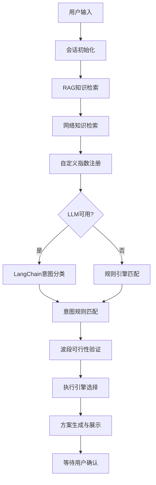
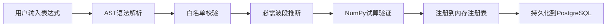

意图识别与规划模块是植被分析智能体的**核心决策引擎**，负责将用户的自然语言描述转化为可执行的分析方案。该模块采用**混合智能架构**，将确定性规则引擎与LangChain大语言模型相结合，在保证可靠性的同时提供灵活的意图理解能力。

## 架构概览

意图识别与规划系统遵循**分层决策**模式，从用户输入到最终方案生成，经过多个处理阶段：



Sources: [agent.py](backend/app/services/agent.py#L78-L236)

## 意图规则引擎

系统预定义了**五种核心分析意图**，每种意图对应特定的植被指数组合和分析场景：

| 意图标识 | 分析主题 | 关键词示例 | 推荐指数 | 适用场景 |
|---------|---------|-----------|---------|---------|
| `growth` | 作物长势空间差异分析 | 长势、健康、覆盖、生物量 | NDVI、EVI、GNDVI | 综合比较植被覆盖、高生物量响应和叶绿素差异 |
| `sparse` | 稀疏植被与裸土背景分析 | 稀疏、苗期、裸土、荒漠 | SAVI、OSAVI、MSAVI、BSI | 使用土壤调节指数降低裸土背景干扰 |
| `chlorophyll` | 叶绿素与氮素状态分析 | 叶绿素、氮、营养、红边 | GNDVI、NDRE、GCI、RECI | 利用绿色和红边波段提高对叶绿素变化的敏感性 |
| `water_stress` | 植被水分胁迫辅助分析 | 干旱、水分、缺水、胁迫 | NDVI、NDMI、MSI | 结合植被活力和短波红外水分响应识别潜在胁迫 |
| `change` | 多时相植被变化监测 | 变化、两期、前后、退化 | NDVI、EVI、NBR | 对两期同源、同尺度数据进行指数差值和变化分类 |

每条规则包含**关键词匹配**、**推荐指数列表**、**分析描述**和**风险警告**，形成完整的意图理解上下文。

Sources: [agent.py](backend/app/services/agent.py#L34-L75)

## LangChain意图分类

当配置了LLM服务时，系统会调用LangChain进行**语义级意图分类**。该过程遵循以下设计原则：

1. **安全约束**：LLM只能返回预定义意图标识，禁止任意输出
2. **降级策略**：LLM调用失败时自动回退到规则引擎
3. **上下文增强**：将RAG检索结果作为上下文提供给LLM

```python
# LLM意图分类的核心逻辑
schema = {"allowed": [rule.intent for rule in RULES]}
system_prompt = (
    "你是遥感植被指数智能体，只返回JSON。字段intent只能取："
    + ",".join(schema["allowed"])
    + "。可选字段reason用一句中文说明依据。"
)
```

系统支持**OpenAI兼容**和**Anthropic**两种LLM提供商，通过请求级别的配置实现灵活切换。

Sources: [agent.py](backend/app/services/agent.py#L300-L345)

## RAG知识检索

意图识别过程集成了**三重知识检索**机制，确保分析建议的准确性和全面性：

### 1. 内置指数库检索
基于**轻量级关键词匹配**，从内置指数注册表中召回相关指数知识。检索过程考虑指数名称、公式、描述、必需波段、分类标签等多个维度。

### 2. 外部文档检索
支持用户上传**外部指数说明文档**，这些文档会被持久化到PostgreSQL数据库，并在后续分析中作为RAG知识源参与检索。

### 3. 网络知识检索
默认使用**DuckDuckGo公开搜索**获取指数适用场景的补充资料。网络检索失败时不会阻断本地RAG和规则引擎流程。

Sources: [agent_tools.py](backend/app/services/agent_tools.py#L39-L120)

## 自定义指数注册

系统支持**运行期动态注册**自定义植被指数，扩展分析能力。自定义指数注册遵循严格的安全校验流程：



**安全边界**：
- 表达式必须至少引用一个波段
- 只允许使用预定义的数学函数（abs、sqrt、minimum、maximum、safe_divide）
- 试算验证确保表达式返回有限数组
- 持久化存储支持PostgreSQL或内存降级模式

Sources: [agent_tools.py](backend/app/services/agent_tools.py#L123-L183)

## 执行引擎规划

意图识别完成后，系统会根据**数据规模**和**硬件能力**选择最优执行引擎：

| 引擎 | 适用场景 | 选择条件 |
|------|---------|---------|
| **NumPy** | 小型任务、同步执行 | 像素数 < 200万 或 同步模式 |
| **JobLib** | 中大型任务 | 像素数 200万-2000万 且无CUDA |
| **PyTorch** | 大型多指数任务 | 像素数 ≥ 2000万 或 指数数 ≥ 4 且有CUDA |

规划器会估算**内存占用**，帮助用户了解资源需求。

Sources: [planner](backend/app/services/planner.py#L28-L61)

## 方案生成与确认

意图识别与规划的最终输出是**结构化分析方案**，包含以下关键信息：

```typescript
interface AgentPlan {
  id: string                    // 方案唯一标识
  intent: string                // 识别的分析意图
  title: string                 // 方案标题
  summary: string               // 方案描述
  recommendations: Recommendation[]  // 指数推荐列表
  selectedIndices: string[]     // 可执行指数列表
  engine: string                // 推荐执行引擎
  engineReason: string          // 引擎选择原因
  estimatedMemoryMb: number     // 估算内存占用
  warnings: string[]            // 风险警告
  trace: TraceStep[]            // 执行过程轨迹
  knowledgeHits: KnowledgeHit[] // RAG检索结果
  webHits: KnowledgeHit[]       // 网络检索结果
  llmStatus: string             // LLM状态
  requiresConfirmation: boolean // 需要确认标志
  canExecute: boolean           // 可执行标志
}
```

方案生成后进入**等待确认**状态，用户可以调整指数选择、执行引擎等参数，确认后才会提交异步计算任务。

Sources: [agent.py](backend/app/services/agent.py#L184-L236)

## 会话管理

意图识别与规划过程通过**会话系统**维护完整的对话历史。会话支持两种存储模式：

- **PostgreSQL持久化**：生产环境推荐，支持跨会话历史查询
- **内存存储**：开发演示环境，重启后丢失

会话事件记录包括：
- 用户问题与上下文参数
- 方案生成结果与推理过程
- 任务执行状态与统计解读

Sources: [agent_session_store.py](backend/app/services/agent_session_store.py#L1-L147)

## 前端集成

意图识别与规划通过**AgentDrawer组件**提供用户交互界面，主要功能包括：

1. **对话输入区**：自然语言描述分析需求
2. **配置管理**：LLM配置、网络检索开关、自定义指数开关
3. **方案展示**：运行过程时间线、检索来源、LLM状态
4. **执行控制**：指数选择、引擎调整、确认执行
5. **结果解读**：统计信息解读与农学建议

前端通过`usePlatformApi` composable与后端API交互，实现完整的意图识别与规划流程。

Sources: [AgentDrawer.vue](frontend/src/components/AgentDrawer.vue#L1-L257)

## API接口

意图识别与规划提供以下REST API端点：

| 端点 | 方法 | 功能 |
|------|------|------|
| `/api/agent/plan` | POST | 生成分析方案 |
| `/api/agent/chat` | POST | 对话式方案生成 |
| `/api/agent/plans/{plan_id}/confirm` | POST | 确认并执行方案 |
| `/api/agent/interpret-results` | POST | 结果解读与建议 |
| `/api/agent/knowledge` | POST | 导入外部知识文档 |
| `/api/indices/custom` | POST | 注册自定义指数 |

所有接口遵循**OGC兼容**设计，支持同步和异步执行模式。

Sources: [routes.py](backend/app/api/routes.py#L198-L291)

## 测试验证

意图识别与规划模块包含完整的测试用例，验证以下关键场景：

1. **意图识别准确性**：长势分析、叶绿素分析、水分胁迫等场景
2. **波段约束验证**：缺少必需波段时正确阻止执行
3. **确认机制**：方案必须经过确认才能提交执行
4. **RAG集成**：导入知识文档后能正确参与检索
5. **自定义指数**：运行期注册、校验、持久化流程
6. **会话连续性**：统计解读能正确追加到会话历史

测试结果表明系统在各种边界条件下都能保持**确定性行为**和**安全降级**。

Sources: [test_agent.py](backend/tests/test_agent.py#L1-L128)

## 设计原则

意图识别与规划模块遵循以下核心设计原则：

1. **确定性优先**：规则引擎作为可靠后备，LLM仅作增强
2. **安全边界**：禁止LLM直接执行代码或提交任务
3. **透明可追溯**：每个操作都有trace记录
4. **渐进增强**：从内存到PostgreSQL，从规则到LLM，逐级提升能力
5. **用户确认**：关键操作必须经过人工确认

这些原则确保系统在**演示环境**和**生产环境**中都能稳定运行，同时为未来的功能扩展提供清晰的架构边界。