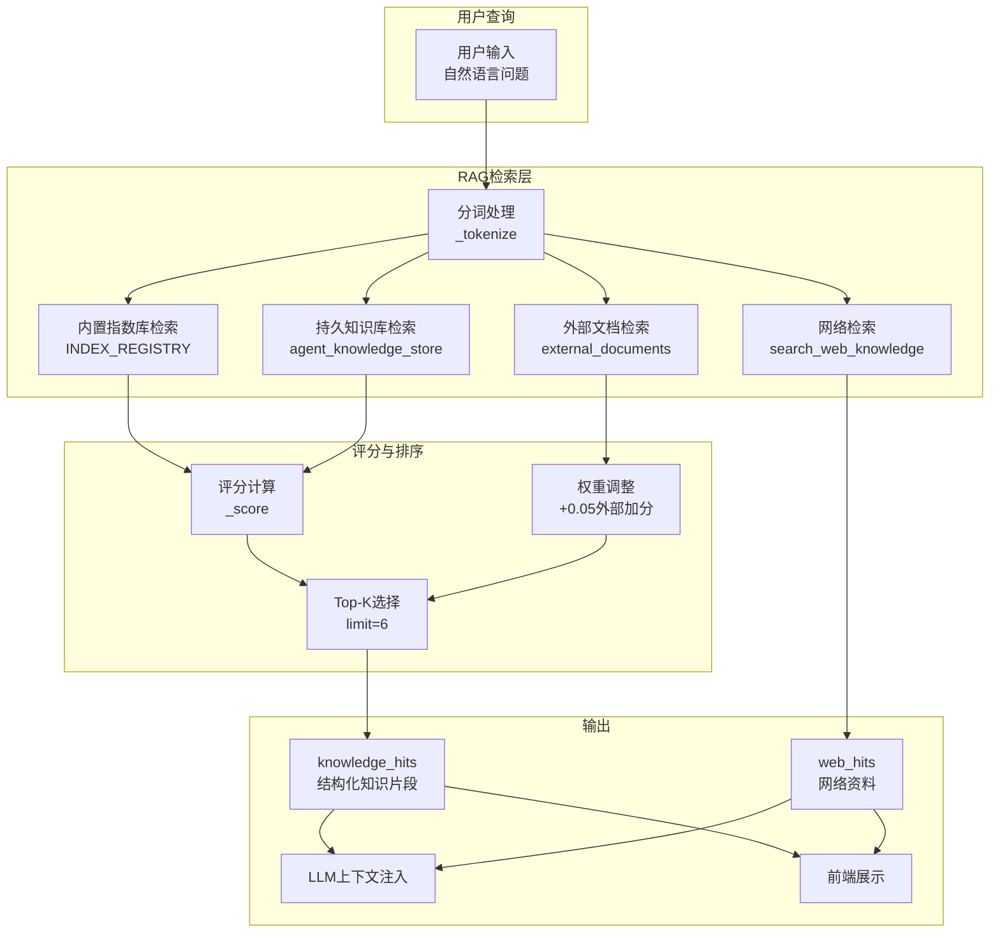
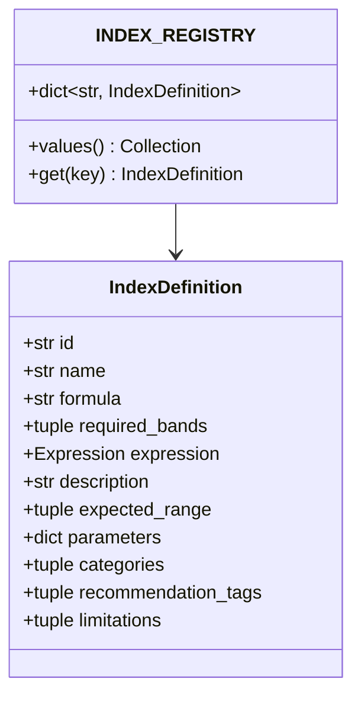
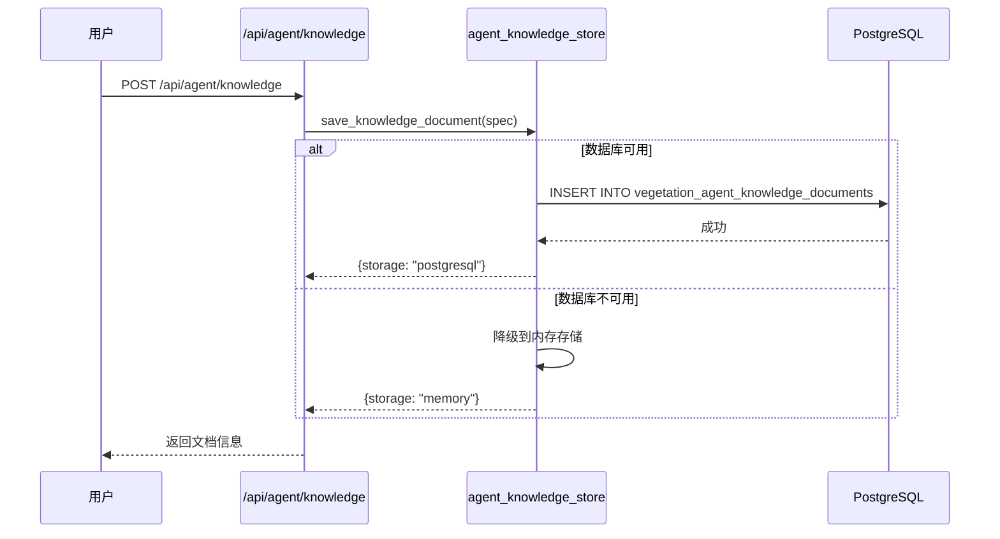
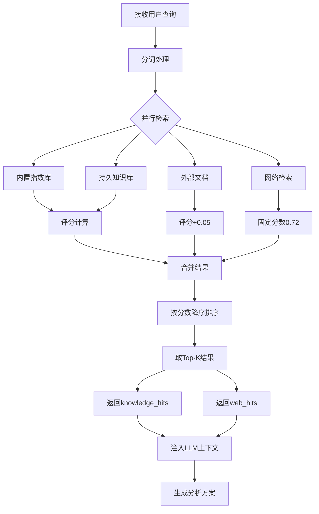
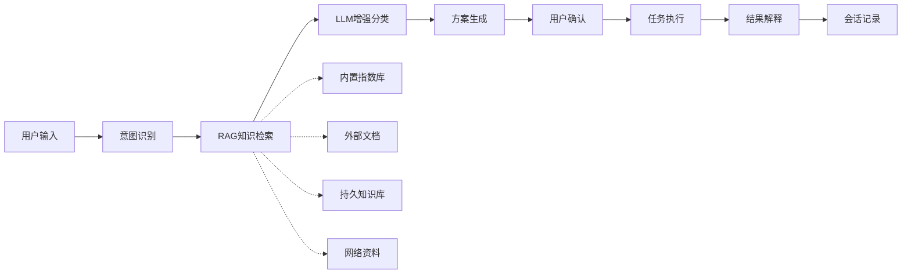

本页面详细阐述植被指数智能分析平台中RAG（检索增强生成）知识检索系统的架构设计、实现机制和集成方式。RAG系统是智能体工作流的核心组件，负责从多个知识源中检索与用户查询相关的植被指数知识，为意图识别、方案推荐和结果解释提供上下文支持。

## 系统架构概览

RAG知识检索系统采用**多源分层检索架构**，整合了三个层次的知识来源，确保检索结果的全面性和准确性。该系统不是简单的向量检索，而是结合了规则匹配、关键词权重和持久化存储的混合检索方案。



**Sources: [agent.py](backend/app/services/agent.py#L114-L122), [agent_tools.py](backend/app/services/agent_tools.py#L39-L87)**

## 核心检索机制

RAG系统的检索过程遵循**确定性规则优先、多源融合**的原则。检索算法基于关键词匹配而非向量相似度，确保了结果的可解释性和确定性。

### 分词策略

系统采用**中英文混合分词策略**，针对植被分析领域优化了中文术语识别：

```python
def _tokenize(value: str) -> set[str]:
    words = set(re.findall(r"[a-zA-Z0-9_]+", value.lower()))
    chinese_terms = {
        term
        for term in (
            "长势", "健康", "叶绿素", "水分", "干旱", "裸土", "稀疏",
            "变化", "火灾", "红边", "黄化", "氮素", "设施农业", "无人机",
            "rgb", "病虫害", "灌溉",
        )
        if term in value.lower()
    }
    return words | chinese_terms
```

**分词策略对比**

| 策略类型 | 实现方式 | 优点 | 缺点 |
|---------|---------|------|------|
| 英文分词 | 正则表达式 `[a-zA-Z0-9_]+` | 处理专业术语（如NDVI、EVI） | 无法处理中文复合词 |
| 中文术语 | 预定义术语集合 | 精确匹配领域关键词 | 需要手动维护术语库 |
| 混合策略 | 集合合并 `\|` | 兼顾中英文查询 | 术语库需要持续更新 |

**Sources: [agent_tools.py](backend/app/services/agent_tools.py#L270-L293)**

### 评分算法

评分函数基于**关键词覆盖率**，计算查询词在文档内容中的匹配比例：

```python
def _score(terms: set[str], content: str) -> float:
    if not terms:
        return 0.0
    lowered = content.lower()
    matches = sum(1 for term in terms if term in lowered)
    return matches / max(len(terms), 1)
```

**评分机制特点**

1. **归一化处理**：分数范围在0-1之间，便于跨文档比较
2. **无词频权重**：每个匹配词权重相等，避免高频词主导
3. **大小写不敏感**：统一转换为小写进行比较
4. **中文精确匹配**：中文术语需要完全匹配才计分

**Sources: [agent_tools.py](backend/app/services/agent_tools.py#L296-L301)**

## 多源知识检索

RAG系统从三个独立的知识源并行检索，确保覆盖内置知识、用户自定义知识和外部知识。

### 1. 内置指数库检索

内置指数注册表包含30个预定义的植被指数，每个指数包含完整的元数据：



**内置指数检索字段**

| 字段 | 检索权重 | 说明 |
|-----|---------|------|
| name | 高 | 指数中文名称 |
| formula | 高 | 数学公式 |
| description | 中 | 功能描述 |
| required_bands | 低 | 所需波段 |
| categories | 中 | 分类标签 |
| recommendation_tags | 高 | 推荐场景 |
| limitations | 低 | 使用限制 |

**Sources: [agent_tools.py](backend/app/services/agent_tools.py#L47-L68), [indices.py](backend/app/core/indices.py#L76-L100)**

### 2. 外部文档检索

外部文档通过API接口导入，支持用户上传自定义知识：

```python
for position, document in enumerate(external_documents or []):
    title = document.get("title") or f"外部资料 {position + 1}"
    content = document.get("content", "")
    score = _score(terms, f"{title} {content}") + 0.05  # 外部文档加分
    if content and score > 0:
        hits.append(
            KnowledgeHit(title=title, content=content[:500], source="external", score=score)
        )
```

**外部文档特性**

- **加分机制**：外部文档获得+0.05的分数加成，优先展示用户提供的知识
- **内容截断**：单个文档内容截断至500字符，避免过长内容影响排序
- **来源标识**：统一标记为"external"，便于前端区分展示

**Sources: [agent_tools.py](backend/app/services/agent_tools.py#L69-L76)**

### 3. 持久知识库检索

持久知识库支持PostgreSQL存储，提供跨会话的知识持久化：



**持久知识库表结构**

```sql
CREATE TABLE IF NOT EXISTS vegetation_agent_knowledge_documents (
    id UUID PRIMARY KEY,
    title TEXT NOT NULL,
    content TEXT NOT NULL,
    source TEXT NOT NULL DEFAULT 'user-upload',
    session_id UUID,
    created_at TIMESTAMPTZ NOT NULL DEFAULT now()
)
```

**存储模式对比**

| 存储模式 | 配置条件 | 优点 | 缺点 |
|---------|---------|------|------|
| PostgreSQL | `VIP_DATABASE_URL` 已配置 | 持久化、跨会话、支持复杂查询 | 依赖外部数据库服务 |
| 内存存储 | 数据库不可用时自动降级 | 零依赖、启动即用 | 重启丢失、仅当前进程可用 |

**Sources: [agent_knowledge_store.py](backend/app/services/agent_knowledge_store.py#L15-L24), [agent_knowledge_store.py](backend/app/services/agent_knowledge_store.py#L83-L107)**

### 4. 网络检索

网络检索作为补充来源，使用DuckDuckGo搜索植被指数应用场景：

```python
async def search_web_knowledge(query: str, limit: int = 4) -> list[dict[str, Any]]:
    params = {"q": f"{query} vegetation index remote sensing use case", "kl": "wt-wt"}
    # 使用httpx异步请求DuckDuckGo HTML接口
    # 解析搜索结果中的标题、摘要和URL
```

**网络检索特点**

- **查询增强**：自动添加"vegetation index remote sensing use case"后缀
- **结果限制**：默认返回4条结果，避免信息过载
- **容错处理**：网络请求失败时返回空列表，不影响主流程
- **分数固定**：所有网络结果统一分数0.72，便于与其他来源排序

**Sources: [agent_tools.py](backend/app/services/agent_tools.py#L90-L120)**

## 检索流程详解

完整的RAG检索流程在智能体方案生成时触发，包含以下关键步骤：



**检索流程在智能体中的位置**

```python
# agent.py中的create_plan方法
knowledge_hits = search_index_knowledge(message, external_documents)
trace.append({
    "id": "rag",
    "title": "RAG检索指数知识",
    "status": "done",
    "detail": f"已召回 {len(knowledge_hits)} 条内置/外部指数知识。",
})

web_hits: list[dict[str, Any]] = []
if enable_web_search:
    web_hits = await search_web_knowledge(message)
    # ... 添加网络检索trace

# 将RAG结果注入LLM上下文
llm_result = await self._classify_with_llm(message, llm_config, knowledge_hits + web_hits)
```

**Sources: [agent.py](backend/app/services/agent.py#L114-L153)**

## API接口设计

RAG知识检索系统提供以下API接口，支持知识导入和系统状态查询：

### 知识导入接口

**POST /api/agent/knowledge**

导入外部知识文档到持久知识库。

**请求参数**

| 字段 | 类型 | 必需 | 说明 |
|-----|------|-----|------|
| title | string | 是 | 文档标题（最长200字符） |
| content | string | 是 | 文档内容（最长12000字符） |
| source | string | 否 | 来源标识（默认"user-upload"） |
| sessionId | string | 否 | 关联会话ID |

**响应示例**

```json
{
  "id": "550e8400-e29b-41d4-a716-446655440000",
  "title": "植被指数适用场景说明",
  "content": "NDVI适用于...",
  "source": "agent-upload",
  "sessionId": null,
  "storage": "postgresql"
}
```

**Sources: [routes.py](backend/app/api/routes.py#L276-L282), [schemas.py](backend/app/api/schemas.py#L57-L63)**

### 系统能力查询

**GET /api/system/capabilities**

返回系统配置信息，包括知识库存储模式。

**响应字段**

```json
{
  "agentKnowledgeStorage": "postgresql",
  "agentMode": "langchain+rag+web-search+rules",
  // ... 其他字段
}
```

**Sources: [routes.py](backend/app/api/routes.py#L353-L368)**

## 前端集成

前端通过`AgentDrawer.vue`组件提供知识导入界面和RAG结果展示。

### 知识导入界面

前端提供两种知识导入方式：

1. **文本粘贴**：直接在文本框中输入知识内容
2. **文件上传**：支持`.txt`、`.md`、`.csv`格式的文件导入

```typescript
// 前端知识导入逻辑
async function importKnowledge() {
  if (!knowledgeDraft.content.trim()) {
    errorMessage.value = '请先输入或上传指数说明文档内容'
    return
  }
  const document = await api.importAgentKnowledge(
    knowledgeDraft.title,
    knowledgeDraft.content,
    knowledgeDraft.source,
    store.activePlan?.sessionId,
  )
  knowledgeMessage.value = `已导入 ${document.title}，存储模式 ${document.storage}，下次生成方案会进入RAG。`
}
```

**Sources: [AgentDrawer.vue](frontend/src/components/AgentDrawer.vue#L115-L136)**

### RAG结果展示

RAG检索结果在智能体方案中以结构化方式展示：

```vue
<template>
  <div v-if="visibleSources.length" class="knowledge-sources">
    <h4>参考知识来源</h4>
    <div v-for="hit in visibleSources" :key="hit.title" class="knowledge-hit">
      <span class="source-badge">{{ hit.source }}</span>
      <strong>{{ hit.title }}</strong>
      <p>{{ hit.content }}</p>
      <span class="score">相关度: {{ hit.score.toFixed(3) }}</span>
    </div>
  </div>
</template>
```

**RAG结果数据结构**

| 字段 | 类型 | 说明 |
|-----|------|------|
| title | string | 知识片段标题 |
| content | string | 知识内容（截断至500字符） |
| source | string | 来源标识（index-registry/external/knowledge-base:*） |
| score | number | 相关度分数（0-1） |

**Sources: [AgentDrawer.vue](frontend/src/components/AgentDrawer.vue#L54-L57), [platform.ts](frontend/src/types/platform.ts#L49-L54)**

## 安全边界

RAG知识检索系统遵循严格的安全设计原则：

### 知识导入安全

1. **内容限制**：单个文档最大12000字符，防止资源耗尽
2. **存储隔离**：知识文档仅作为RAG内容，不触发命令执行或文件写入
3. **来源追踪**：每个文档记录来源标识，便于审计和追溯

### 检索安全

1. **确定性优先**：RAG检索基于规则匹配，不依赖LLM的不确定性
2. **结果截断**：知识内容截断至500字符，防止注入攻击
3. **分数透明**：所有分数计算可解释，便于调试和验证

**Sources: [agent_knowledge_store.py](backend/app/services/agent_knowledge_store.py#L45-L55), [.evidence/active/20260623-1104-agent执行单与知识库导入.md](.evidence/active/20260623-1104-agent执行单与知识库导入.md#L36-L39)**

## 与其他智能体系统的关系

RAG知识检索系统是智能体工作流的核心组件，与其他模块紧密协作：

**智能体工作流中的RAG位置**



**相关文档**

- [智能体架构](17-zhi-neng-ti-jia-gou)：智能体整体设计原则和安全边界
- [意图识别与规划](18-yi-tu-shi-bie-yu-gui-hua)：规则引擎和LLM增强的意图分类
- [自定义指数管理](20-zi-ding-yi-zhi-shu-guan-li)：运行期指数注册和持久化
- [PostgreSQL持久化](30-postgresqlchi-jiu-hua)：数据库配置和表结构设计

**Sources: [agent.py](backend/app/services/agent.py#L78-L236), [SKILL.md](skills/vegetation-agent-designer/SKILL.md#L12-L18)**

## 配置与部署

### 环境变量配置

| 变量名 | 默认值 | 说明 |
|-------|-------|------|
| `VIP_DATABASE_URL` | None | PostgreSQL连接字符串，配置后启用持久知识库 |
| `VIP_OPENAI_BASE_URL` | None | OpenAI兼容API基础URL |
| `VIP_OPENAI_API_KEY` | None | API密钥 |
| `VIP_OPENAI_MODEL` | gpt-4.1-mini | 默认模型 |

**Sources: [settings.py](backend/app/settings.py#L8-L31)**

### 存储模式选择

系统根据`VIP_DATABASE_URL`配置自动选择存储模式：

1. **配置了数据库URL**：使用PostgreSQL持久存储
2. **未配置或连接失败**：自动降级到内存存储
3. **前端可见性**：通过`/api/system/capabilities`接口查询当前存储模式

**Sources: [agent_knowledge_store.py](backend/app/services/agent_knowledge_store.py#L27-L28), [routes.py](backend/app/api/routes.py#L364)**

## 测试验证

RAG知识检索系统包含完整的测试用例，确保功能正确性和边界情况处理：

**关键测试场景**

1. **知识导入后进入RAG**：验证导入的知识文档能被后续查询检索到
2. **多源检索融合**：验证内置、外部、持久知识库的正确合并
3. **中文术语匹配**：验证中文关键词的精确匹配
4. **存储模式降级**：验证数据库不可用时的内存降级

```python
# 测试示例：验证导入的知识进入RAG
def test_agent_rag_uses_imported_knowledge_document() -> None:
    save_knowledge_document({
        "title": "根腐病水分胁迫判读",
        "content": "根腐病排查时需要联合NDMI水分指数和NDVI长势指数",
        "source": "pytest-knowledge",
    })
    plan = asyncio.run(
        vegetation_agent.create_plan(
            "根腐病和灌溉异常应该看什么指数",
            ["blue", "green", "red", "nir", "swir1"],
            enable_web_search=False,
        )
    )
    assert any(hit["source"].startswith("knowledge-base") for hit in plan["knowledgeHits"])
```

**Sources: [test_agent.py](backend/tests/test_agent.py#L89-L104)**

## 性能考量

### 检索性能

- **内存占用**：内置指数库常驻内存，外部文档按需加载
- **数据库查询**：持久知识库查询限制返回数量（默认80条）
- **网络超时**：网络检索设置8秒超时，避免阻塞主流程

### 扩展性设计

1. **知识库分区**：可通过`session_id`实现会话级知识隔离
2. **评分算法优化**：未来可引入TF-IDF或BM25权重
3. **向量检索预留**：当前架构支持未来集成向量数据库

**Sources: [agent_knowledge_store.py](backend/app/services/agent_knowledge_store.py#L83-L87), [agent_tools.py](backend/app/services/agent_tools.py#L94-L98)**

## 故障排查

### 常见问题

| 问题 | 可能原因 | 解决方案 |
|-----|---------|---------|
| 知识导入失败 | 数据库连接失败 | 检查`VIP_DATABASE_URL`配置 |
| RAG结果为空 | 查询词不匹配 | 检查术语库是否包含相关关键词 |
| 存储模式显示memory | 数据库未配置 | 配置PostgreSQL连接字符串 |
| 网络检索无结果 | 网络连接问题 | 检查网络代理设置 |

### 调试信息

系统通过trace机制提供详细的检索过程信息：

```json
{
  "id": "rag",
  "title": "RAG检索指数知识",
  "status": "done",
  "detail": "已召回 3 条内置/外部指数知识。"
}
```

**Sources: [agent.py](backend/app/services/agent.py#L115-L122)**