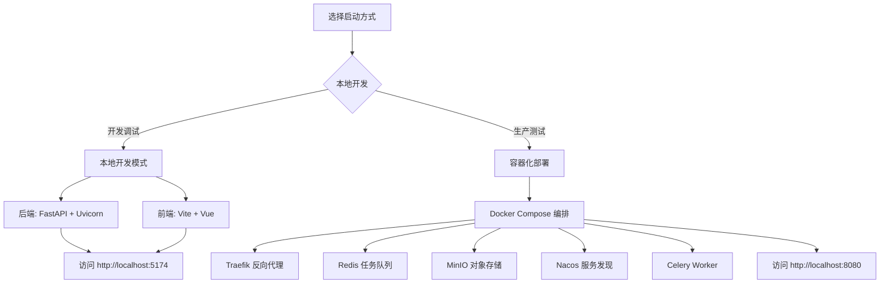
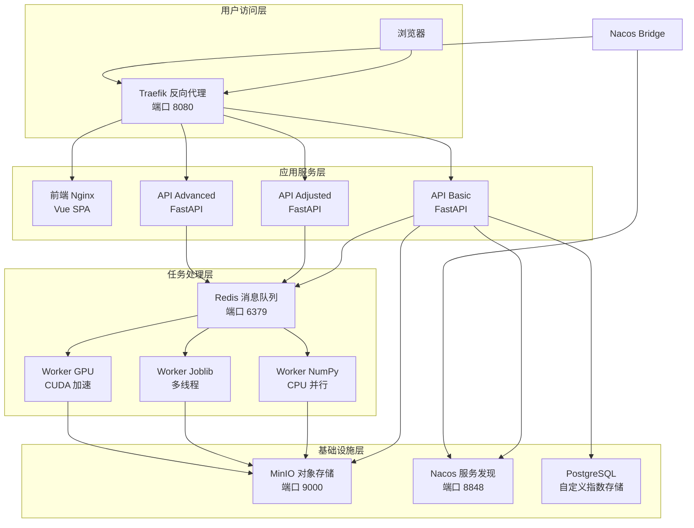
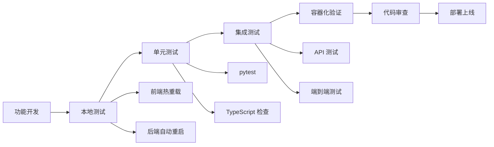

本页面旨在帮助开发者在 5 分钟内搭建开发环境，启动植被指数智能分析平台的核心服务，并验证系统功能。无论选择本地开发模式还是容器化部署，均可快速体验平台的核心能力：**30 种植被指数计算**、**智能体交互**、**任务管理**和**地图可视化**。

## 前置条件

在开始之前，请确保您的开发环境满足以下基本要求：

| 类别 | 最低要求 | 推荐配置 |
|------|----------|----------|
| **操作系统** | Windows 10/11, macOS 12+, Linux (Ubuntu 20.04+) | Windows 11, macOS 14+, Ubuntu 22.04 LTS |
| **Python** | 3.11 | 3.11 (Miniconda 环境) |
| **Node.js** | 18.0 | 20 LTS |
| **Docker** | Docker Desktop 4.0+ (容器化部署) | Docker Desktop 4.25+ with Compose V2 |
| **GPU** (可选) | NVIDIA GPU with CUDA 12.8+ | RTX 4060 Laptop 或更高 |
| **内存** | 8 GB | 16 GB+ |
| **存储** | 10 GB 可用空间 | 20 GB+ SSD |

Sources: [README.md](README.md#L15-L30)

## 快速启动概览

平台提供两种启动方式，可根据您的需求选择：



### 本地开发 vs 容器化部署

| 特性 | 本地开发模式 | 容器化部署 |
|------|--------------|------------|
| **适用场景** | 开发调试、功能测试 | 生产环境测试、集成测试 |
| **依赖管理** | 手动管理 Python/Node 环境 | Docker 镜像自动管理 |
| **服务数量** | 2 个 (后端 + 前端) | 9+ 个 (完整微服务架构) |
| **GPU 支持** | 需手动配置 CUDA | 自动检测 NVIDIA GPU |
| **数据持久化** | 本地 data/ 目录 | Docker 卷 |
| **启动复杂度** | 简单 | 中等 (需 Docker 环境) |
| **调试便利性** | 高 | 中等 |

Sources: [README.md](README.md#L32-L50), [compose.yml](compose.yml#L1-L50)

## 方案一：本地开发模式

本地开发模式适用于快速功能开发和调试，只需启动后端和前端两个服务。

### 1. 克隆项目并进入目录

```powershell
git clone <repository-url> vegetation-intelligence-platform
cd vegetation-intelligence-platform
```

### 2. 后端环境配置

平台使用 Miniconda 管理 Python 环境，确保环境一致性：

```powershell
# 进入后端目录
cd backend

# 创建 conda 环境 (首次运行)
D:\miniconda\Scripts\conda.exe create -n giskeshe python=3.11 -y

# 安装项目依赖 (开发模式)
D:\miniconda\Scripts\conda.exe run -n giskeshe python -m pip install -e ".[dev]"

# 安装 PyTorch CUDA (可选，GPU 加速)
D:\miniconda\Scripts\conda.exe run -n giskeshe python -m pip install torch torchvision torchaudio --index-url https://download.pytorch.org/whl/cu128
```

Sources: [README.md](README.md#L35-L45), [pyproject.toml](backend/pyproject.toml#L1-L20)

### 3. 配置环境变量

复制并编辑环境变量文件：

```powershell
# 在项目根目录
copy .env.example .env
```

编辑 `.env` 文件，配置以下关键参数：

```ini
# 核心配置
VIP_CELERY_ALWAYS_EAGER=true          # 本地开发模式，任务同步执行
VIP_REDIS_URL=redis://localhost:6379/0 # Redis 连接 (容器化部署时使用)

# 可选：MinIO 对象存储
VIP_MINIO_ENABLED=false               # 本地开发可禁用

# 可选：OpenAI API (智能体功能)
VIP_OPENAI_BASE_URL=
VIP_OPENAI_API_KEY=
VIP_OPENAI_MODEL=gpt-4.1-mini
```

Sources: [.env.example](.env.example#L1-L16), [settings.py](backend/app/settings.py#L1-L33)

### 4. 启动后端服务

```powershell
# 在 backend 目录下
D:\miniconda\envs\giskeshe\python.exe -m uvicorn app.main:app --host 127.0.0.1 --port 8011 --reload
```

**参数说明**：
- `--host 127.0.0.1`: 仅本地访问
- `--port 8011`: 后端 API 端口
- `--reload`: 代码修改后自动重启

启动成功后，终端将显示：
```
INFO:     Uvicorn running on http://127.0.0.1:8011 (Press CTRL+C to quit)
INFO:     Started reloader process [xxxxx]
INFO:     Started server process [xxxxx]
INFO:     Waiting for application startup.
INFO:     Application startup complete.
```

Sources: [README.md](README.md#L47-L50), [main.py](backend/app/main.py#L1-L55)

### 5. 前端环境配置

打开新的终端窗口：

```powershell
# 进入前端目录
cd frontend

# 安装依赖
npm install

# 启动开发服务器
npm run dev -- --host 127.0.0.1 --port 5174
```

**前端特性**：
- 自动代理 API 请求到后端 (http://127.0.0.1:8011)
- 热模块替换 (HMR)
- TypeScript 类型检查

Sources: [package.json](frontend/package.json#L1-L28), [vite.config.ts](frontend/vite.config.ts#L1-L25)

### 6. 访问应用

在浏览器中打开：**http://127.0.0.1:5174**

您将看到植被指数智能分析平台的主界面，包含：
- **地图工作台**：支持 GeoTIFF 文件选择、拖拽导入
- **智能体面板**：自然语言交互、指数推荐
- **任务面板**：实时任务进度、结果查看
- **指数目录**：30 种内置植被指数

Sources: [README.md](README.md#L52-L55), [App.vue](frontend/src/App.vue#L1-L50)

## 方案二：容器化部署

容器化部署适用于生产环境测试和集成测试，提供完整的微服务架构。

### 1. 环境准备

确保已安装以下工具：
- **Docker Desktop**: 4.0 或更高版本
- **Docker Compose**: V2 (随 Docker Desktop 安装)
- **NVIDIA Container Toolkit** (可选，GPU 支持)

### 2. 一键启动

```powershell
# 在项目根目录
docker compose -f compose.yml up --build
```

**首次启动**将下载所有镜像并构建服务，耗时约 5-10 分钟。

### 3. 服务访问地址

启动完成后，可通过以下地址访问各项服务：

| 服务 | 地址 | 说明 |
|------|------|------|
| **平台入口** | http://localhost:8080 | 主应用界面 |
| **Traefik 面板** | http://localhost:8081 | 反向代理管理 |
| **MinIO 控制台** | http://localhost:9001 | 对象存储管理 |
| **Nacos 控制台** | http://localhost:8848/nacos | 服务发现与配置 |
| **后端 API** | http://localhost:8080/api | REST API 端点 |
| **任务管理** | http://localhost:8080/jobs | 任务状态查询 |

Sources: [README.md](README.md#L57-L65), [compose.yml](compose.yml#L1-L192)

### 4. GPU 支持配置

如果您的系统有 NVIDIA GPU，可启用 GPU 加速：

```powershell
# 检查 NVIDIA 驱动和 CUDA 版本
nvidia-smi

# 启动时包含 GPU Worker
docker compose -f compose.yml up --build
```

**无 GPU 环境**：注释 `compose.yml` 中的 `worker-gpu` 服务，系统仍可通过 NumPy 和 Joblib 正常工作。

Sources: [README.md](README.md#L67-L70), [compose.yml](compose.yml#L120-L150)

### 5. 容器架构说明



Sources: [compose.yml](compose.yml#L1-L100)

## 验证安装

### 1. 后端健康检查

```powershell
# 本地开发模式
curl http://127.0.0.1:8011/health

# 容器化部署
curl http://localhost:8080/api/health
```

预期响应：
```json
{
  "status": "healthy",
  "service": "植被指数智能分析平台"
}
```

### 2. API 功能验证

```powershell
# 获取支持的植被指数列表
curl http://localhost:8080/api/indices

# 获取系统能力
curl http://localhost:8080/api/system/capabilities
```

### 3. 前端功能验证

1. **界面加载**：访问 http://localhost:5174 (本地) 或 http://localhost:8080 (容器)
2. **主题切换**：点击右上角主题按钮，切换日间/夜间模式
3. **面板操作**：展开/折叠智能体、任务、指数面板
4. **文件导入**：拖拽 GeoTIFF 文件到地图区域

Sources: [README.md](README.md#L72-L80), [routes.py](backend/app/api/routes.py#L1-L50)

## 项目结构概览

```
vegetation-intelligence-platform/
├── backend/                 # 后端服务
│   ├── app/                 # 应用代码
│   │   ├── api/             # REST API 路由
│   │   ├── core/            # 核心业务逻辑
│   │   │   └── indices.py   # 植被指数注册表
│   │   ├── engines/         # 计算引擎实现
│   │   ├── services/        # 业务服务层
│   │   │   ├── agent.py     # 智能体服务
│   │   │   ├── jobs.py      # 任务管理
│   │   │   └── planner.py   # 引擎选择器
│   │   └── main.py          # FastAPI 入口
│   ├── tests/               # 单元测试
│   ├── pyproject.toml       # Python 依赖配置
│   └── Dockerfile           # 后端镜像
├── frontend/                # 前端应用
│   ├── src/                 # 源代码
│   │   ├── components/      # Vue 组件
│   │   ├── composables/     # 组合式函数
│   │   ├── stores/          # Pinia 状态管理
│   │   └── types/           # TypeScript 类型
│   ├── package.json         # Node.js 依赖
│   └── vite.config.ts       # Vite 构建配置
├── data/                    # 数据目录
│   ├── inputs/              # 输入文件
│   └── outputs/             # 输出结果
├── infra/                   # 基础设施配置
│   ├── pygeoapi/            # OGC API 配置
│   └── traefik/             # 反向代理配置
├── compose.yml              # Docker Compose 编排
├── .env.example             # 环境变量示例
└── README.md                # 项目文档
```

Sources: [get_dir_structure](backend/app#L1-L50), [get_dir_structure](frontend/src#L1-L50)

## 常见问题排查

### 1. 后端启动失败

**问题**：`ModuleNotFoundError: No module named 'app'`

**解决方案**：
```powershell
# 确保在 backend 目录下
cd backend
# 以开发模式安装
pip install -e ".[dev]"
```

### 2. 前端无法连接后端

**问题**：控制台显示 `Network Error`

**解决方案**：
1. 检查后端是否运行在 http://127.0.0.1:8011
2. 检查防火墙设置
3. 验证 API 代理配置：`frontend/vite.config.ts`

### 3. GPU 不可用

**问题**：`CUDA is not available`

**解决方案**：
1. 检查 NVIDIA 驱动：`nvidia-smi`
2. 验证 PyTorch CUDA 版本：`python -c "import torch; print(torch.cuda.is_available())"`
3. 系统会自动回退到 CPU 引擎

### 4. 容器启动缓慢

**问题**：Docker Compose 启动超时

**解决方案**：
1. 检查 Docker 资源分配 (内存 ≥ 4GB)
2. 使用国内镜像源加速下载
3. 分步启动：`docker compose up redis minio nacos` 后再启动其他服务

Sources: [README.md](README.md#L82-L100), [settings.py](backend/app/settings.py#L1-L33)

## 下一步

成功启动平台后，建议按以下顺序深入学习：

1. **了解系统架构**：[系统架构](9-xi-tong-jia-gou) - 理解整体设计和组件关系
2. **探索核心功能**：[植被指数计算](6-zhi-bei-zhi-shu-ji-suan) - 学习 30 种指数的使用
3. **体验智能体交互**：[智能体交互](7-zhi-neng-ti-jiao-hu) - 自然语言驱动的分析
4. **深入后端开发**：[后端架构](10-hou-duan-jia-gou) - 服务层和引擎设计
5. **前端组件开发**：[前端架构](11-qian-duan-jia-gou) - Vue 3 组件和状态管理
6. **部署与运维**：[容器化部署](5-rong-qi-hua-bu-shi) - 生产环境配置

## 开发工作流建议



**推荐开发流程**：
1. 使用本地开发模式进行快速迭代
2. 编写单元测试确保代码质量
3. 定期使用容器化部署验证集成
4. 利用智能体功能进行探索性测试

Sources: [README.md](README.md#L102-L113), [AGENTS.md](AGENTS.md#L1-L50)

---

**快速开始**文档到此结束。您现在应该已经成功启动了植被指数智能分析平台，并了解了基本的项目结构和开发流程。如有任何问题，请参考[故障排查](36-gu-zhang-pai-cha)页面或查阅项目文档。