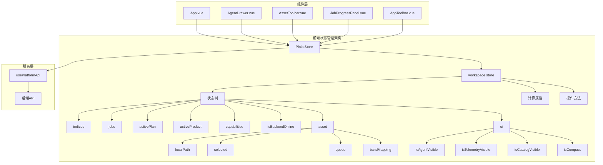
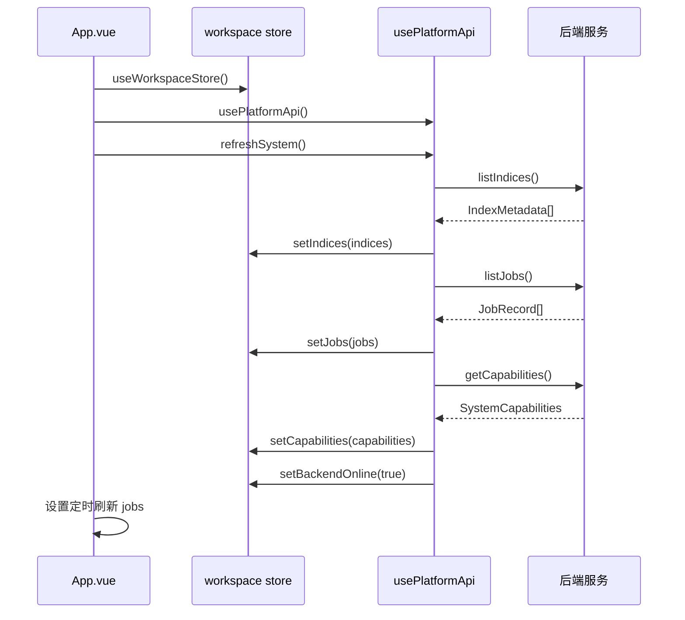
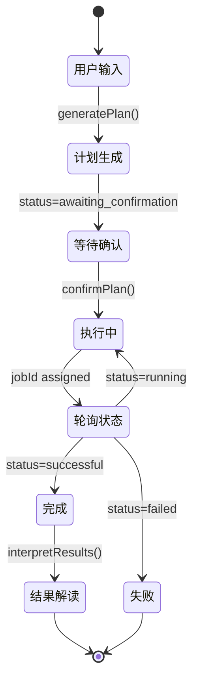
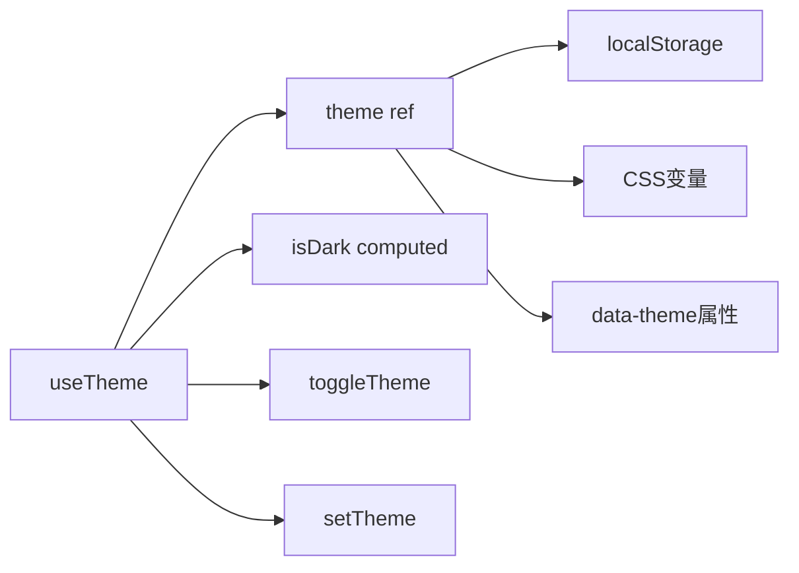

本页面详细介绍植被指数智能分析平台前端的状态管理架构、设计模式和实现细节。平台采用 Vue 3 的 Composition API 结合 Pinia 状态管理库，构建了一个集中式、可预测的状态管理体系，确保应用状态在复杂交互中的可靠性和可维护性。

## 状态管理架构概述

平台采用单店模式（Single Store），将所有应用状态集中在一个 Pinia store 中管理。这种设计简化了状态访问路径，避免了跨组件通信的复杂性，同时利用 Vue 3 的响应式系统确保状态变更能够高效地传播到所有依赖组件。



**状态管理核心原则**：
- **单一数据源**：所有应用状态集中存储在 `workspace` store 中
- **响应式更新**：利用 Vue 3 的 `shallowRef` 和 `reactive` 确保状态变更自动触发视图更新
- **类型安全**：完整的 TypeScript 类型定义，确保状态操作的类型安全
- **计算属性驱动**：通过派生状态（计算属性）简化复杂逻辑

Sources: [frontend/src/stores/workspace.ts](frontend/src/stores/workspace.ts#L1-L120)

## 核心状态存储：workspace store

`workspace` store 是应用状态的核心容器，采用 Pinia 的 Composition API 风格定义。它包含应用的所有共享状态、计算属性和操作方法。

### 状态结构定义

状态存储由多个响应式引用组成，分为几个逻辑分组：

**基础状态（使用 shallowRef）**：
- `indices`：植被指数元数据列表
- `jobs`：任务记录列表
- `activePlan`：当前活跃的智能体计划
- `activeProduct`：当前选中的计算产品
- `capabilities`：系统能力配置
- `isBackendOnline`：后端服务在线状态

**复合状态（使用 reactive）**：
- `asset`：资产相关状态，包括本地路径、选中资产、队列和波段映射
- `ui`：用户界面状态，控制面板可见性和布局

**计算属性（派生状态）**：
- `runningJobs`：正在运行的任务列表
- `completedJobs`：已完成的任务列表

Sources: [frontend/src/stores/workspace.ts](frontend/src/stores/workspace.ts#L12-L47)

### 状态类型定义

所有状态都有完整的 TypeScript 类型定义，确保类型安全和代码可维护性。主要类型定义在 `types/platform.ts` 文件中：

**核心类型结构**：

| 类型名称 | 用途 | 关键字段 |
|---------|------|----------|
| `IndexMetadata` | 植被指数元数据 | `id`, `name`, `formula`, `requiredBands` |
| `JobRecord` | 任务记录 | `id`, `status`, `progress`, `result` |
| `AgentPlan` | 智能体计划 | `id`, `status`, `recommendations`, `trace` |
| `Product` | 计算产品 | `index`, `name`, `statistics` |
| `SystemCapabilities` | 系统能力 | `cuda`, `engines`, `asyncJobs` |
| `UploadedAsset` | 上传资产 | `objectKey`, `localPath`, `metadata` |

**状态枚举值**：
- 任务状态：`accepted` → `running` → `successful`/`failed`
- 智能体计划状态：`awaiting_confirmation` → `confirmed`
- 面板可见性：布尔值控制

Sources: [frontend/src/types/platform.ts](frontend/src/types/platform.ts#L1-L195)

## 状态操作模式

### 状态更新方法

store 提供了一系列类型安全的更新方法，遵循不可变更新模式：

**基础状态更新**：
```typescript
// 更新指数列表
function setIndices(value: IndexMetadata[]) {
  indices.value = value
}

// 更新任务列表
function setJobs(value: JobRecord[]) {
  jobs.value = value
}

// 更新智能体计划
function setActivePlan(value: AgentPlan | null) {
  activePlan.value = value
}
```

**复合状态操作**：
```typescript
// 添加上传资产到队列
function addUploadedAssets(value: UploadedAsset[]) {
  for (const item of value) {
    const existingIndex = asset.queue.findIndex((assetItem) => assetItem.localPath === item.localPath)
    if (existingIndex >= 0) {
      asset.queue[existingIndex] = item  // 更新现有项
    } else {
      asset.queue.push(item)  // 添加新项
    }
  }
  if (value[0]) {
    asset.selected = value[0]
    asset.localPath = value[0].localPath
  }
}

// 切换面板可见性
function togglePanel(panel: 'agent' | 'telemetry' | 'catalog') {
  if (panel === 'agent') ui.isAgentVisible = !ui.isAgentVisible
  if (panel === 'telemetry') ui.isTelemetryVisible = !ui.isTelemetryVisible
  if (panel === 'catalog') ui.isCatalogVisible = !ui.isCatalogVisible
}
```

Sources: [frontend/src/stores/workspace.ts](frontend/src/stores/workspace.ts#L48-L119)

## 状态流与组件交互

### 状态初始化与更新流程

应用启动时的状态初始化遵循以下模式：



**关键交互模式**：
1. **初始化加载**：应用启动时并行加载基础数据
2. **定时轮询**：每 1.5 秒刷新任务状态
3. **响应式更新**：状态变更自动触发组件重渲染
4. **错误处理**：网络异常时更新在线状态

Sources: [frontend/src/App.vue](frontend/src/App.vue#L25-L48)

### 组件状态访问模式

组件通过以下模式访问和操作状态：

**状态订阅**：
```typescript
// 在组件中访问 store
const store = useWorkspaceStore()

// 访问基础状态
const indices = store.indices
const jobs = store.jobs

// 访问计算属性
const runningJobs = store.runningJobs
const completedJobs = store.completedJobs

// 访问复合状态
const asset = store.asset
const ui = store.ui
```

**状态更新**：
```typescript
// 通过方法更新状态
store.setIndices(newIndices)
store.setJobs(newJobs)
store.setActivePlan(plan)

// 直接更新复合状态
store.asset.localPath = newPath
store.selectAsset(asset)

// 切换UI状态
store.togglePanel('agent')
```

Sources: [frontend/src/components/AgentDrawer.vue](frontend/src/components/AgentDrawer.vue#L12-L14)

## 智能体状态管理

智能体（Agent）状态管理是平台最复杂的状态管理场景，涉及多阶段交互、异步操作和状态同步。

### 智能体计划生命周期

智能体计划从生成到执行遵循明确的状态转换：



**状态转换关键点**：
1. **计划生成**：创建 `AgentPlan` 实例，状态为 `awaiting_confirmation`
2. **用户确认**：调用 `confirmPlan()`，状态变为 `confirmed`，生成 `jobId`
3. **任务执行**：后端异步执行，前端轮询状态更新
4. **结果处理**：成功执行后触发结果解读，更新对话历史

Sources: [frontend/src/components/AgentDrawer.vue](frontend/src/components/AgentDrawer.vue#L148-L256)

### 智能体状态同步

智能体状态涉及多个数据源的同步：

**状态同步机制**：
1. **计划状态同步**：`store.setActivePlan(plan)` 更新全局计划状态
2. **对话历史同步**：`syncConversation(events)` 确保对话事件一致性
3. **任务状态同步**：轮询更新 `store.jobs` 列表
4. **产品状态同步**：成功任务更新 `store.activeProduct`

**状态更新示例**：
```typescript
// 任务状态轮询
watch(observedJobId, (jobId) => {
  const timer = window.setInterval(async () => {
    const job = await api.getJob(jobId)
    // 合并任务状态
    const merged = [job, ...store.jobs.filter((item) => item.id !== job.id)]
    store.setJobs(merged)
    
    // 任务完成时更新产品状态
    if (job.status === 'successful') {
      const result = await api.getResults(jobId)
      store.setJobs([{ ...job, result }, ...merged.filter((item) => item.id !== job.id)])
      if (result.products[0]) store.setActiveProduct(result.products[0])
    }
  }, 1500)
})
```

Sources: [frontend/src/components/AgentDrawer.vue](frontend/src/components/AgentDrawer.vue#L191-L234)

## 主题状态管理

主题状态采用独立的组合式函数管理，支持深色/浅色模式切换和本地持久化。

### 主题状态架构



**主题状态特性**：
- **本地持久化**：通过 `localStorage` 保存用户偏好
- **系统偏好检测**：自动检测系统颜色方案偏好
- **CSS变量更新**：实时更新 CSS 变量实现主题切换
- **只读访问**：通过 `readonly` 包装确保状态不可直接修改

**实现细节**：
```typescript
const STORAGE_KEY = 'canopy-lab-theme'
const storedTheme = window.localStorage.getItem(STORAGE_KEY)
const initialTheme = storedTheme ?? (window.matchMedia('(prefers-color-scheme: light)').matches ? 'light' : 'dark')

const theme = shallowRef<ThemeMode>(initialTheme)

function applyTheme(value: ThemeMode) {
  theme.value = value
  document.documentElement.dataset.theme = value
  document.documentElement.style.colorScheme = value
  window.localStorage.setItem(STORAGE_KEY, value)
}
```

Sources: [frontend/src/composables/useTheme.ts](frontend/src/composables/useTheme.ts#L1-L40)

## API 状态集成

状态管理与后端 API 的集成通过 `usePlatformApi` 组合式函数实现，确保状态更新的事务性和一致性。

### API 调用与状态更新流程

**典型 API 调用模式**：
1. **调用 API**：发起异步请求
2. **处理响应**：解析响应数据
3. **更新状态**：调用 store 方法更新状态
4. **错误处理**：捕获异常并更新错误状态

**示例：上传资产流程**：
```typescript
async function uploadAsset(file: File): Promise<UploadedAsset> {
  const formData = new FormData()
  formData.append('file', file)
  return uploadForm<UploadedAsset>('/api/assets/upload', formData)
}

// 在组件中使用
const api = usePlatformApi()
const store = useWorkspaceStore()

async function uploadFiles(files: FileList) {
  const uploaded: UploadedAsset[] = []
  for (const file of files) {
    uploaded.push(await api.uploadAsset(file))
  }
  store.addUploadedAssets(uploaded)
}
```

**API 集成最佳实践**：
- **批量操作**：使用 `Promise.all` 并行执行独立 API 调用
- **错误隔离**：单个 API 调用失败不影响其他操作
- **状态回滚**：操作失败时恢复状态到操作前
- **加载状态**：维护加载指示器状态

Sources: [frontend/src/composables/usePlatformApi.ts](frontend/src/composables/usePlatformApi.ts#L42-L199)

## 状态管理性能优化

### 响应式优化策略

平台采用多种优化策略确保状态管理的性能：

**1. 浅层引用（shallowRef）**：
对于大型数据结构（如 `indices`、`jobs` 列表），使用 `shallowRef` 避免深度响应式追踪，减少内存占用和性能开销。

**2. 计算属性缓存**：
使用 `computed` 缓存派生状态，避免重复计算：
```typescript
const runningJobs = computed(() =>
  jobs.value.filter((job) => ['accepted', 'running'].includes(job.status)),
)

const completedJobs = computed(() =>
  jobs.value.filter((job) => job.status === 'successful'),
)
```

**3. 批量状态更新**：
合并多个状态更新操作，减少重渲染次数：
```typescript
async function refreshSystem() {
  const [indices, jobs, capabilities] = await Promise.all([
    api.listIndices(),
    api.listJobs(),
    api.getCapabilities(),
  ])
  
  // 批量更新状态
  store.setIndices(indices)
  store.setJobs(jobs)
  store.setCapabilities(capabilities)
  store.setBackendOnline(true)
}
```

**4. 轮询优化**：
使用合理的轮询间隔（1.5 秒），避免过于频繁的状态更新。

Sources: [frontend/src/App.vue](frontend/src/App.vue#L25-L48), [frontend/src/stores/workspace.ts](frontend/src/stores/workspace.ts#L41-L47)

## 状态管理最佳实践

### 状态设计原则

1. **最小化状态**：只存储必要的共享状态，避免冗余
2. **单一职责**：每个状态字段只负责一个逻辑概念
3. **不可变更新**：通过方法更新状态，确保可预测性
4. **类型安全**：完整定义所有状态的类型
5. **派生状态**：使用计算属性派生复杂状态

### 状态使用规范

**组件状态访问**：
- 通过 `useWorkspaceStore()` 访问全局状态
- 避免直接修改 store 状态，使用提供的方法
- 使用计算属性简化复杂状态逻辑

**状态更新规范**：
- 所有状态更新通过 store 方法进行
- 批量更新时考虑事务性
- 异步操作时维护加载状态
- 错误处理时更新错误状态

**性能优化规范**：
- 大型数据结构使用 `shallowRef`
- 缓存计算属性结果
- 避免在模板中直接访问深层嵌套状态
- 合理使用轮询间隔

### 调试与开发支持

**状态监控**：
- 使用 Vue Devtools 监控 Pinia store 状态
- 监控状态变更的性能影响
- 记录状态更新日志

**开发建议**：
- 新功能开发前规划状态结构
- 使用 TypeScript 确保类型安全
- 编写状态操作的单元测试
- 定期审查状态结构，移除未使用状态