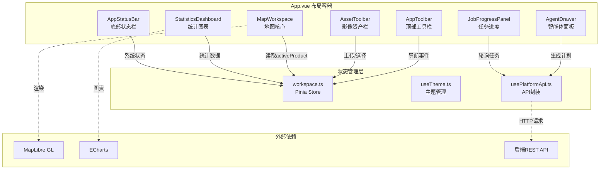
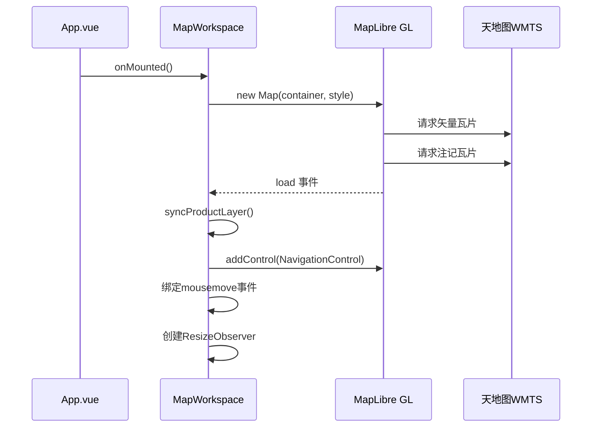
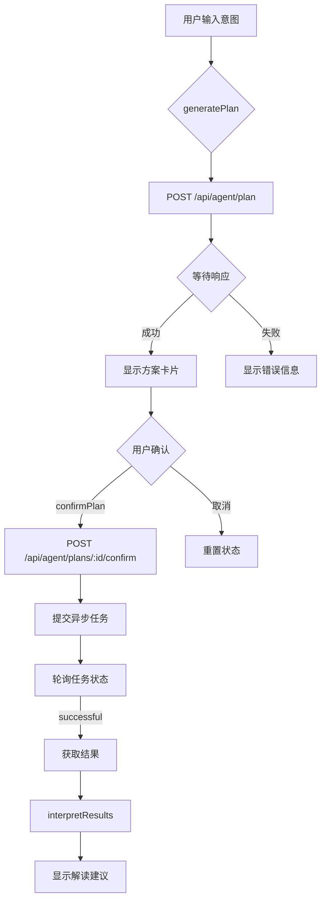
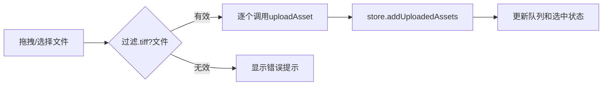

地图工作台是植被指数智能分析平台的核心用户界面，集成了**地图可视化**、**智能体交互**、**任务管理**和**统计分析**四大功能模块。它采用响应式网格布局，通过 MapLibre GL 渲染遥感影像结果，配合 Pinia 状态管理系统实现组件间高效协作。该工作台支持日间/夜间双主题切换，适配从移动端到桌面宽屏的多种设备尺寸。

## 架构概览

地图工作台采用**分层组件架构**，由 App.vue 作为顶层容器协调各子组件。核心设计模式是**单向数据流 + 响应式状态管理**，通过 Pinia store 集中管理业务状态，composables 封装可复用逻辑。



该架构的核心优势在于**关注点分离**：MapWorkspace 专注于地图渲染，AgentDrawer 负责智能交互逻辑，JobProgressPanel 处理任务生命周期，而状态同步由 Pinia store 统一协调。

Sources: [App.vue](frontend/src/App.vue#L1-L147), [workspace.ts](frontend/src/stores/workspace.ts#L1-L119)

## 核心组件：MapWorkspace

MapWorkspace 是地图工作台的视觉核心，封装了 **MapLibre GL** 地图引擎，提供天地图底图加载、遥感结果叠加和交互控制功能。该组件采用**单文件组件**模式，将模板、逻辑和样式内聚。

### 初始化流程

组件挂载时执行以下初始化序列：



地图初始化代码位于 `onMounted` 钩子，配置了中国区域默认视角（center: [105, 35], zoom: 3.2）和天地图双图层（矢量底图 + 注记层）。

Sources: [MapWorkspace.vue](frontend/src/components/MapWorkspace.vue#L70-L111)

### 产品图层同步

当 `activeProduct` 发生变化时，组件通过 `syncProductLayer` 函数动态叠加遥感结果图层：

| 步骤 | 操作 | 说明 |
|------|------|------|
| 1 | 清除旧图层 | 移除已有的 `vegetation-result` 图层和数据源 |
| 2 | 构建预览URL | 将本地路径转换为 `/artifacts/` 代理路径 |
| 3 | 添加图像源 | 使用 `type: 'image'` 配置，根据 bounds 计算四角坐标 |
| 4 | 添加栅格图层 | 设置 `raster-opacity` 支持透明度控制 |
| 5 | 自动定位 | 调用 `fitBounds` 动画聚焦到结果区域 |

该函数通过 `watch` 响应式监听 `props.product` 变化，确保产品切换时地图自动更新。

Sources: [MapWorkspace.vue](frontend/src/components/MapWorkspace.vue#L28-L68)

### 交互控制

MapWorkspace 提供三个 HUD 元素增强用户体验：

- **顶部状态栏**：显示数据源标识（TIANDITU GEOSPATIAL CANVAS）和当前产品名称
- **坐标显示**：实时跟踪鼠标位置，格式为经纬度（5位小数精度）
- **透明度滑块**：通过 `v-model:opacity` 双向绑定，控制结果图层透明度（0-100%）

这些元素使用 `backdrop-filter: blur(16px)` 实现毛玻璃效果，与地图内容形成视觉层次。

Sources: [MapWorkspace.vue](frontend/src/components/MapWorkspace.vue#L114-L137)

## 状态管理：workspace store

workspace store 是整个前端应用的**状态中枢**，采用 Pinia 的 Composition API 模式定义。它管理五个核心状态域：

| 状态域 | 字段 | 类型 | 用途 |
|--------|------|------|------|
| 指数元数据 | `indices` | `IndexMetadata[]` | 可用植被指数列表 |
| 任务记录 | `jobs` | `JobRecord[]` | 计算任务生命周期 |
| 智能体计划 | `activePlan` | `AgentPlan \| null` | 当前生成的分析方案 |
| 活跃产品 | `activeProduct` | `Product \| null` | 地图显示的结果产品 |
| 系统能力 | `capabilities` | `SystemCapabilities \| null` | 后端服务状态 |
| 资产管理 | `asset` | `reactive({...})` | 上传影像队列和波段映射 |
| UI状态 | `ui` | `reactive({...})` | 面板可见性控制 |

### 计算属性派生

store 定义了两个派生状态用于任务过滤：

```typescript
const runningJobs = computed(() =>
  jobs.value.filter((job) => ['accepted', 'running'].includes(job.status)),
)
const completedJobs = computed(() =>
  jobs.value.filter((job) => job.status === 'successful'),
)
```

这些计算属性被 AppStatusBar 和 JobProgressPanel 消费，实现任务状态的实时显示。

Sources: [workspace.ts](frontend/src/stores/workspace.ts#L41-L46)

### 资产队列管理

`asset` 状态域采用 `reactive` 包装，支持拖拽上传和批量处理：

- **availableBands**：预定义7个逻辑波段（blue, green, red, red_edge, nir, swir1, swir2）
- **bandMapping**：波段名称到源波段序号的映射表，默认 1-7 顺序映射
- **queue**：已上传影像的 FIFO 队列，支持选择和批量提交

`addUploadedAssets` 方法实现了去重逻辑：当 `localPath` 相同时更新而非重复添加。

Sources: [workspace.ts](frontend/src/stores/workspace.ts#L19-L33), [workspace.ts](frontend/src/stores/workspace.ts#L72-L85)

## 智能体交互：AgentDrawer

AgentDrawer 是智能体系统的前端入口，实现了**意图识别 → 方案生成 → 任务执行 → 结果解读**的完整工作流。该组件与后端 `/api/agent/*` 端点深度集成。

### 交互流程



该流程体现了**人机协作**设计理念：智能体生成方案后必须等待人工确认才能执行，避免误操作。

Sources: [AgentDrawer.vue](frontend/src/components/AgentDrawer.vue#L148-L189)

### 配置面板

AgentDrawer 提供可折叠的配置区域，支持：

| 配置项 | 类型 | 说明 |
|--------|------|------|
| LLM配置 | `AgentLLMConfig` | 支持 OpenAI 兼容和 Anthropic 两种 provider |
| 网络搜索 | `boolean` | 启用/禁用 Web 搜索增强 RAG |
| 自定义指数 | `AgentCustomIndexDraft` | 运行期新增植被指数公式 |

LLM 配置采用**延迟初始化**模式：仅当 `baseUrl` 和 `token` 均非空时才传递给后端。

Sources: [AgentDrawer.vue](frontend/src/components/AgentDrawer.vue#L26-L38), [AgentDrawer.vue](frontend/src/components/AgentDrawer.vue#L79-L82)

### 知识库导入

组件支持实时导入领域知识文档，增强 RAG 检索质量：

```typescript
async function importKnowledge() {
  const document = await api.importAgentKnowledge(
    knowledgeDraft.title,
    knowledgeDraft.content,
    knowledgeDraft.source,
    store.activePlan?.sessionId,
  )
  // 更新提示信息
}
```

知识文档支持三种来源：手动输入、文件上传（自动解析标题）和会话关联（通过 sessionId）。

Sources: [AgentDrawer.vue](frontend/src/components/AgentDrawer.vue#L115-L136)

## 影像资产管理：AssetToolbar

AssetToolbar 提供 GeoTIFF 影像的导入、队列管理和批量处理功能。该组件采用**拖拽优先**的交互设计。

### 上传流程



上传过程中使用 `isUploading` 状态禁用按钮，防止重复提交。文件过滤通过正则 `/\.tiff?$/i` 实现，同时支持 `.tif` 和 `.tiff` 扩展名。

Sources: [AssetToolbar.vue](frontend/src/components/AssetToolbar.vue#L41-L61)

### 波段映射

组件显示当前波段映射状态（如 "5 / 7 已映射"），帮助用户确认影像波段与逻辑波段的对应关系。映射表存储在 `store.asset.bandMapping`，可在智能体配置中调整。

### 批量处理

"批量处理"按钮根据 `activePlan.selectedIndices` 确定计算指数（默认为 `['ndvi']`），遍历队列中所有影像提交异步任务。任务提交后，JobProgressPanel 将自动轮询更新状态。

Sources: [AssetToolbar.vue](frontend/src/components/AssetToolbar.vue#L74-L96)

## 任务监控与统计

### JobProgressPanel

该组件实时显示计算任务队列，支持状态筛选和结果查看：

| 任务状态 | 显示标签 | 可用操作 |
|----------|----------|----------|
| accepted | 排队 | 取消 |
| running | 运行 | 取消 |
| successful | 完成 | 查看结果 |
| failed | 失败 | - |
| dismissed | 取消 | - |

任务结果查看通过 `emit('selectResult', job)` 触发，App.vue 监听后调用 `api.getResults` 获取产品数据并更新 `activeProduct`。

Sources: [JobProgressPanel.vue](frontend/src/components/JobProgressPanel.vue#L13-L23), [App.vue](frontend/src/App.vue#L50-L54)

### StatisticsDashboard

统计面板使用 ECharts 渲染指数值分布直方图，显示三个关键指标：

- **平均值**：指数有效像元均值
- **标准差**：数据离散程度
- **有效像元**：排除 nodata 的像素数量

图表颜色跟随主题切换，通过 `MutationObserver` 监听 `data-theme` 属性变化自动重绘。

Sources: [StatisticsDashboard.vue](frontend/src/components/StatisticsDashboard.vue#L28-L82)

## API 集成层：usePlatformApi

usePlatformApi 是前端与后端通信的**唯一出口**，封装了所有 REST API 调用。该 composable 返回纯函数，不持有状态。

### 核心 API 端点

| 函数 | HTTP方法 | 端点 | 用途 |
|------|----------|------|------|
| `uploadAsset` | POST | `/api/assets/upload` | 上传 GeoTIFF 影像 |
| `listIndices` | GET | `/api/indices` | 获取指数元数据列表 |
| `createPlan` | POST | `/api/agent/plan` | 生成智能分析方案 |
| `confirmPlan` | POST | `/api/agent/plans/:id/confirm` | 确认并执行方案 |
| `executeAssetBatch` | POST | `/processes/batch/execution` | 提交批量计算任务 |
| `listJobs` | GET | `/jobs` | 查询任务列表 |
| `getResults` | GET | `/jobs/:id/results` | 获取任务结果产品 |
| `interpretResults` | POST | `/api/agent/interpret-results` | 请求结果解读 |
| `getCapabilities` | GET | `/api/system/capabilities` | 查询系统能力 |

所有请求均通过 `requestJson` 和 `uploadForm` 两个内部函数处理，统一错误格式化为 `{ detail: string }`。

Sources: [usePlatformApi.ts](frontend/src/composables/usePlatformApi.ts#L42-L198)

### 异步任务模式

`executeAssetBatch` 采用 OGC API - Processes 的异步执行模式：

```typescript
headers: { Prefer: 'respond-async' }
```

请求立即返回 `{ jobID, status, location }`，前端通过轮询 `/jobs` 获取进度更新。轮询间隔为 1.5 秒（App.vue L68）。

Sources: [usePlatformApi.ts](frontend/src/composables/usePlatformApi.ts#L50-L73), [App.vue](frontend/src/App.vue#L66-L69)

## 响应式布局策略

地图工作台采用**CSS Grid + clamp()** 实现流式响应式布局，无需媒体查询断点即可适配多种屏幕尺寸。

### 主布局结构

App.vue 的 `.workspace-shell` 定义了六行网格布局：

```css
grid-template-rows: 
  auto                                    /* 标题区 */
  auto                                    /* 资产工具栏 */
  minmax(clamp(430px, calc(100dvh - 360px), 920px), auto) /* 地图核心区 */
  auto                                    /* 任务/统计面板 */
  auto                                    /* 指数目录 */
  auto                                    /* 页脚 */
```

核心地图区域使用 `clamp()` 函数设定最小 430px、最大 920px 的高度约束，中间值随视口高度动态调整。

Sources: [App.vue](frontend/src/App.vue#L163-L173)

### 面板折叠控制

三个功能面板（智能体、任务监控、指数目录）通过 `Transition` 组件实现平滑显隐：

```vue
<Transition name="panel">
  <AgentDrawer v-if="store.ui.isAgentVisible" />
</Transition>
```

当智能体面板隐藏时，地图区域通过 `agent-collapsed` 类名自动扩展到全宽。

Sources: [App.vue](frontend/src/App.vue#L102-L131)

### 移动端适配

MapWorkspace 在 `max-width: 1100px` 断点下调整布局：

- 地图高度约束为 `clamp(420px, 62dvh, 720px)`
- 隐藏顶部状态栏中的英文标识
- 坐标显示和透明度控件改为全宽布局

AppStatusBar 在 `max-width: 900px` 隐藏计算引擎和当前结果信息，在 `max-width: 560px` 进一步精简显示。

Sources: [MapWorkspace.vue](frontend/src/components/MapWorkspace.vue#L266-L293), [AppStatusBar.vue](frontend/src/components/AppStatusBar.vue#L127-L139)

## 主题系统

主题管理通过 `useTheme` composable 实现，支持日间（light）和夜间（dark）两种模式。主题状态持久化到 `localStorage`，并在页面加载时恢复。

### 应用机制

```typescript
function applyTheme(value: ThemeMode) {
  theme.value = value
  document.documentElement.dataset.theme = value  // CSS选择器钩子
  document.documentElement.style.colorScheme = value  // 浏览器原生主题
  window.localStorage.setItem(STORAGE_KEY, value)  // 持久化
}
```

组件通过 CSS 变量（如 `var(--surface-0)`, `var(--text-1)`）消费主题值，无需直接读取 JavaScript 状态。

Sources: [useTheme.ts](frontend/src/composables/useTheme.ts#L17-L22)

## 开发指南

### 添加新的地图图层

1. 在 `MapWorkspace.vue` 的 `syncProductLayer` 函数中添加数据源和图层定义
2. 使用 `instance.addSource()` 配置数据源类型（image/raster/vector）
3. 使用 `instance.addLayer()` 创建图层并设置 paint 属性
4. 通过 `watch` 响应数据变化自动同步

### 扩展智能体功能

1. 在 `types/platform.ts` 中定义新的 TypeScript 接口
2. 在 `usePlatformApi.ts` 中添加对应的 API 调用函数
3. 在 `AgentDrawer.vue` 中添加 UI 交互逻辑
4. 在 `workspace.ts` 中添加必要的状态字段

### 性能优化建议

- MapLibre GL 已通过 `defineAsyncComponent` 异步加载，不阻塞首屏渲染
- ECharts 采用按需引入模式，仅加载 BarChart、GridComponent、TooltipComponent
- 地图使用 `ResizeObserver` 响应容器变化，避免频繁的 `map.resize()` 调用
- Pinia store 使用 `shallowRef` 包装大型数组，减少深层响应式开销

Sources: [App.vue](frontend/src/App.vue#L14-L17), [StatisticsDashboard.vue](frontend/src/components/StatisticsDashboard.vue#L10-L16)

## 相关页面

- [前端架构](11-qian-duan-jia-gou) - 整体前端技术栈和设计理念
- [状态管理](21-zhuang-tai-guan-li) - Pinia store 设计模式详解
- [主题与响应式设计](23-zhu-ti-yu-xiang-ying-she-ji) - CSS 变量和布局策略
- [组件库](24-zu-jian-ku) - 通用 UI 组件集合
- [智能体交互](7-zhi-neng-ti-jiao-hu) - 智能体功能使用教程