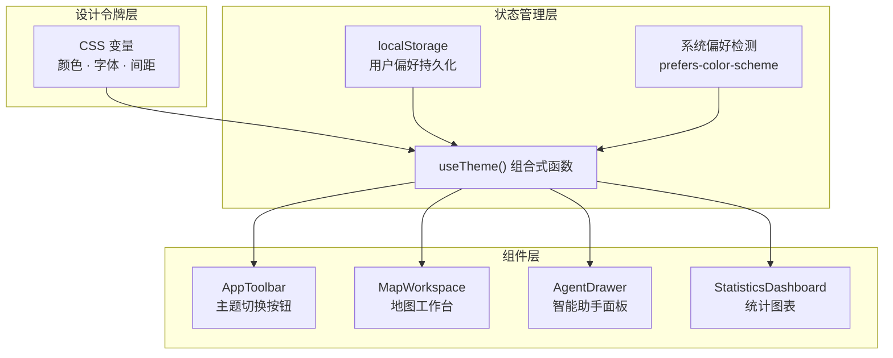

本页详细解析植被指数智能分析平台的前端主题系统与响应式设计架构。系统采用 CSS 变量驱动的主题切换机制，结合流式布局与断点策略，确保从桌面大屏到移动端的无缝适配体验。

## 架构概览

主题与响应式设计系统采用分层架构，将视觉表现与业务逻辑解耦。核心由三个层次组成：**CSS 变量层**定义设计令牌，**Vue 组合式函数层**管理主题状态，**组件层**消费这些变量实现视觉一致性。



## 主题系统实现

### CSS 变量设计令牌

主题系统基于 CSS 自定义属性（变量）构建，所有视觉属性均通过 `:root` 选择器定义。这种设计确保主题切换时只需修改变量值，无需改动组件样式。

变量体系包含七个主要类别：**字体栈**（`--font-display`、`--font-body`、`--font-mono`）、**主题色**（`--accent`、`--success`、`--danger`、`--warning`）、**表面色**（`--surface-0` 到 `--surface-3`）、**文字色**（`--text-0` 到 `--text-3`）、**边框色**（`--border`、`--border-strong`）、**阴影色**（`--shadow-soft`）以及**网格线色**（`--grid-line`）。

暗色主题作为默认主题在 `:root` 选择器中定义，亮色主题则通过 `:root[data-theme='light']` 选择器覆盖。这种选择器特异性确保主题切换时的平滑过渡。

Sources: [main.css](frontend/src/assets/main.css#L3-L58)

### 主题切换机制

主题切换由 `useTheme()` 组合式函数管理，该函数实现三个核心功能：**主题状态管理**、**系统偏好检测**和**持久化存储**。

初始化时，系统首先检查 `localStorage` 中是否保存了用户偏好（键名 `canopy-lab-theme`）。若无保存值，则检测系统级主题偏好（`prefers-color-scheme: light`），最终回退到暗色主题。这种三级降级策略确保新用户获得符合系统偏好的体验。

主题应用时，`applyTheme()` 函数同时设置 `document.documentElement.dataset.theme` 和 `document.documentElement.style.colorScheme`。前者用于 CSS 选择器匹配，后者通知浏览器原生元素（如滚动条、表单控件）适配当前主题。

Sources: [useTheme.ts](frontend/src/composables/useTheme.ts#L6-L22)

### 组件级主题消费

组件通过 CSS 变量消费主题值，而非硬编码颜色。以 `StatisticsDashboard` 组件为例，其 ECharts 图表在渲染时读取 CSS 变量值：

```typescript
const styles = getComputedStyle(document.documentElement)
const textColor = styles.getPropertyValue('--text-3').trim()
const accentColor = styles.getPropertyValue('--accent').trim()
```

更关键的是，该组件使用 `MutationObserver` 监听 `data-theme` 属性变化，实现主题切换时的实时图表重绘：

```typescript
themeObserver = new MutationObserver(renderChart)
themeObserver.observe(document.documentElement, {
  attributes: true,
  attributeFilter: ['data-theme'],
})
```

这种模式确保第三方库（如 ECharts）与系统主题保持同步，无需用户手动刷新。

Sources: [StatisticsDashboard.vue](frontend/src/components/StatisticsDashboard.vue#L36-L42)

## 响应式设计系统

### 流式布局策略

系统采用现代 CSS 布局技术，结合 `clamp()` 函数实现流式设计。以主工作区为例，其网格布局使用视口相对单位：

```css
.workspace-shell {
  grid-template-rows: auto auto minmax(clamp(430px, calc(100dvh - 360px), 920px), auto) auto auto auto;
  gap: clamp(8px, 0.8vw, 14px);
  padding: clamp(10px, 1.1vw, 22px);
}
```

`clamp()` 函数确保尺寸在最小值与最大值之间平滑过渡，避免极端视口下的布局崩溃。主内容区高度被限制在 430px 到 920px 之间，确保地图工作台既不会过小无法操作，也不会过大挤压其他面板。

Sources: [App.vue](frontend/src/App.vue#L163-L173)

### 断点策略与媒体查询

系统定义了五个主要断点，覆盖从大屏桌面到移动端的完整范围：

| 断点宽度 | 目标设备 | 主要调整 |
|---------|---------|---------|
| `min-width: 1800px` | 大屏显示器 | 增加内边距，调整智能助手面板比例 |
| `max-width: 1260px` | 中等屏幕 | 标题区域改为单列，描述文本全宽 |
| `max-width: 1100px` | 平板/小屏笔记本 | 整体布局转为纵向，地图与助手面板垂直堆叠 |
| `max-width: 760px` | 大屏手机 | 减少内边距，页脚改为纵向排列 |
| `max-width: 720px` | 手机 | 隐藏次要导航项和状态指示器 |
| `max-width: 420px` | 小屏手机 | 限制品牌名称宽度，缩小主题切换按钮 |

每个断点都针对特定组件进行优化。例如，在 1100px 断点处，地图工作台高度从固定值改为响应式计算：

```css
@media (max-width: 1100px) {
  .map-shell {
    height: clamp(420px, 62dvh, 720px);
    min-height: 420px;
  }
}
```

Sources: [App.vue](frontend/src/App.vue#L257-L307), [MapWorkspace.vue](frontend/src/components/MapWorkspace.vue#L266-L293)

### 组件级响应式适配

各组件独立管理其响应式行为，避免全局样式冲突。以 `AppToolbar` 组件为例，在 1160px 断点处隐藏主导航，在 720px 断点处进一步隐藏次要按钮：

```css
@media (max-width: 1160px) {
  .primary-tools {
    display: none;
  }
}

@media (max-width: 720px) {
  .brand-copy small,
  .view-tools > button:nth-child(-n + 3),
  .tool-divider,
  .api-indicator {
    display: none;
  }
}
```

这种渐进式隐藏策略确保核心功能（主题切换、刷新）始终可见，次要功能在空间不足时优雅降级。

Sources: [AppToolbar.vue](frontend/src/components/AppToolbar.vue#L236-L271)

## 字体系统

系统采用三字体栈策略，通过 CSS 变量统一管理：

- **展示字体**（`--font-display`）：`'Noto Serif SC', Georgia, serif` — 用于标题和强调文本
- **正文字体**（`--font-body`）：`'Noto Sans SC', sans-serif` — 用于正文和界面元素
- **等宽字体**（`--font-mono`）：`'IBM Plex Mono', monospace` — 用于代码、数据和状态标签

字体通过 Google Fonts CDN 加载，确保跨平台一致性。字号采用 `clamp()` 函数实现流式缩放，例如标题字号：

```css
.workspace-heading h1 {
  font: 400 clamp(28px, 3vw, 58px) / 1 var(--font-display);
}
```

Sources: [main.css](frontend/src/assets/main.css#L1-L6), [App.vue](frontend/src/App.vue#L190-L195)

## 颜色系统详解

### 主题色语义

颜色变量遵循语义化命名，每个变量在不同主题下映射到不同色值：

| 语义 | 暗色主题值 | 亮色主题值 | 用途 |
|-----|-----------|-----------|------|
| `--accent` | `#9ee81f` | `#5f8f13` | 主题强调色，用于链接、选中状态 |
| `--accent-strong` | `#bcff42` | `#3f7100` | 强调色高亮变体 |
| `--success` | `#9ee81f` | `#4f8110` | 成功状态指示 |
| `--danger` | `#ff8372` | `#b74333` | 错误和警告状态 |
| `--warning` | `#d99b4c` | `#9a620e` | 警告状态 |

### 表面色层级

表面色定义背景层级，从 `--surface-0`（最深）到 `--surface-3`（最浅）。暗色主题中，`--surface-0` 为 `#070c09`，`--surface-3` 为 `#19291f`；亮色主题中则反转，`--surface-0` 为 `#f6f7f2`，`--surface-3` 为 `#e3e8da`。

这种层级设计支持视觉深度和信息层次，确保重要元素在视觉上突出。

Sources: [main.css](frontend/src/assets/main.css#L3-L58)

## 无障碍与动画控制

系统内置无障碍支持，通过 `@media (prefers-reduced-motion: reduce)` 媒体查询检测用户偏好。当用户系统设置减少动画时，所有过渡和动画持续时间被强制设为极短值：

```css
@media (prefers-reduced-motion: reduce) {
  *,
  *::before,
  *::after {
    scroll-behavior: auto !important;
    transition-duration: 0.01ms !important;
    animation-duration: 0.01ms !important;
    animation-iteration-count: 1 !important;
  }
}
```

此外，所有交互元素均提供 `:focus-visible` 样式，使用主题强调色确保键盘导航的可见性。

Sources: [main.css](frontend/src/assets/main.css#L132-L141)

## 扩展指南

### 添加新主题

扩展主题系统需三个步骤：首先在 `ThemeMode` 类型中添加新模式，其次在 `main.css` 中定义对应选择器，最后更新 `AppToolbar` 中的主题切换按钮逻辑。

```typescript
// useTheme.ts
export type ThemeMode = 'light' | 'dark' | 'high-contrast'
```

```css
/* main.css */
:root[data-theme='high-contrast'] {
  --accent: #ffff00;
  --surface-0: #000000;
  --text-0: #ffffff;
  /* ... */
}
```

### 自定义断点

添加新断点时，建议遵循现有模式：在组件作用域内定义媒体查询，避免全局污染。断点值应基于内容而非设备，确保布局在任意宽度下都合理。

```css
/* 示例：添加超宽屏断点 */
@media (min-width: 2400px) {
  .workspace-shell {
    max-width: 2200px;
    margin-inline: auto;
  }
}
```

## 相关页面

- [前端架构](11-qian-duan-jia-gou) — 整体前端设计原则与技术选型
- [组件库](24-zu-jian-ku) — 组件设计规范与使用指南
- [地图工作台](22-di-tu-gong-zuo-tai) — 地图组件的详细实现
- [状态管理](21-zhuang-tai-guan-li) — Pinia Store 的设计与使用