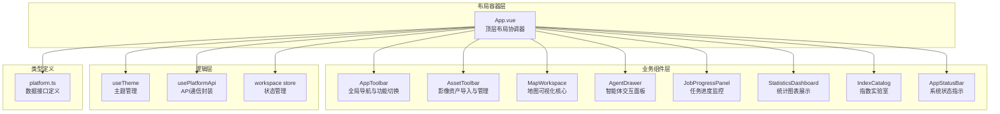
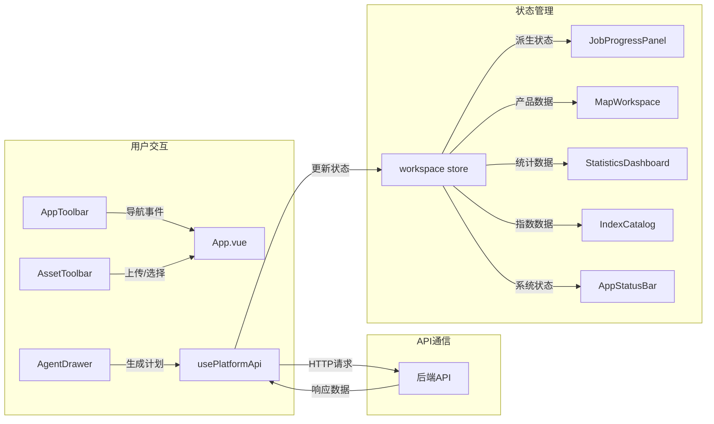

本文档详细解析植被指数智能分析平台的前端组件库架构，涵盖组件设计原则、分类体系、核心组件实现、通信模式、主题集成以及响应式设计策略。组件库采用 Vue 3 Composition API 构建，通过自定义组件实现专业遥感数据处理平台的用户界面。

## 组件架构概览

组件库采用**分层架构设计**，将 UI 组件划分为三个功能层次：**布局容器层**、**业务组件层**和**基础组件层**。这种设计确保组件职责单一、可复用性强，同时支持复杂业务逻辑的组合。



组件架构遵循**单向数据流**原则：父组件通过 props 向子组件传递数据，子组件通过 events 向父组件报告状态变化。跨组件状态共享通过 Pinia store 实现，避免 props 逐层传递的复杂性。

Sources: [App.vue](frontend/src/App.vue#L1-L309), [workspace.ts](frontend/src/stores/workspace.ts#L1-L120)

## 组件分类与职责

根据功能域和复用性，组件库中的组件可分为以下三类：

| 分类 | 组件 | 职责 | 复用性 |
|------|------|------|--------|
| **布局组件** | AppToolbar, AppStatusBar | 提供全局导航和系统状态显示，占据固定布局位置 | 高 |
| **业务组件** | MapWorkspace, AgentDrawer, JobProgressPanel, StatisticsDashboard, IndexCatalog, AssetToolbar | 实现核心业务功能，每个组件对应特定功能域 | 中 |
| **基础组件** | 无独立基础组件 | 使用原生 HTML 元素 + CSS 变量实现基础 UI | 高 |

**设计决策说明**：项目选择不引入第三方 UI 组件库（如 Element Plus、Ant Design Vue），而是基于原生 HTML 元素和 CSS 变量构建自定义组件。这种选择基于三个考虑：1）专业遥感平台需要定制化视觉风格；2）避免第三方库的包体积开销；3）完全控制主题系统和响应式行为。

Sources: [package.json](frontend/package.json#L1-L28), [main.css](frontend/src/assets/main.css#L1-L142)

## 核心组件详解

### AppToolbar - 全局导航工具栏

AppToolbar 是应用的顶部导航栏，提供品牌标识、主功能导航、视图控制和主题切换功能。组件采用**水平布局**，左侧显示品牌信息，中间为主导航按钮，右侧为功能切换和设置。

**主要特性**：
- **品牌标识**：显示 "CANOPY LAB" 品牌名称和 "VEGETATION INTELLIGENCE" 副标题
- **主导航**：提供 "地图工作台"、"任务监控"、"指数实验室" 三个主要功能入口
- **视图控制**：AI 助手、状态面板、指数目录的显示/隐藏切换
- **系统功能**：刷新服务状态、主题切换、API 状态指示

**交互设计**：所有按钮提供悬停状态反馈，当前活跃功能通过边框高亮显示。API 状态指示器使用颜色编码：绿色表示在线，红色表示离线。

Sources: [AppToolbar.vue](frontend/src/components/AppToolbar.vue#L1-L273)

### MapWorkspace - 地图可视化核心

MapWorkspace 是平台的核心可视化组件，基于 **MapLibre GL** 实现专业地图渲染能力。组件管理地图实例生命周期，提供天地图底图、遥感结果叠加和交互控制。

**主要特性**：
- **地图引擎**：集成 MapLibre GL 5.6，支持矢量瓦片渲染和自定义图层
- **底图数据**：使用天地图 WMTS 服务，包含矢量底图和注记图层
- **结果叠加**：支持将计算结果作为图像图层叠加到地图上
- **交互控制**：实时坐标显示、透明度调整、自动定位

**技术实现**：
```typescript
// 地图初始化配置
const instance = new maplibregl.Map({
  container: mapContainer.value,
  center: [105, 35],  // 中国区域默认视角
  zoom: 3.2,
  style: {
    version: 8,
    sources: {
      tiandituVec: { type: 'raster', tiles: [TIANDITU_VEC_TILE] },
      tiandituCva: { type: 'raster', tiles: [TIANDITU_CVA_TILE] },
    },
    layers: [
      { id: 'tianditu-vec', type: 'raster', source: 'tiandituVec' },
      { id: 'tianditu-cva', type: 'raster', source: 'tiandituCva' },
    ],
  },
})
```

**产品图层同步**：当 `activeProduct` 变化时，组件通过 `syncProductLayer` 函数动态更新地图图层，支持透明度控制和自动定位。

Sources: [MapWorkspace.vue](frontend/src/components/MapWorkspace.vue#L1-L301)

### AgentDrawer - 智能体交互面板

AgentDrawer 是智能体系统的核心交互组件，提供完整的对话式分析体验。组件维护多个状态域，支持从需求描述到结果解读的全流程交互。

**主要特性**：
- **对话管理**：支持多轮对话，记录用户问题、方案生成、任务执行、结果解读
- **LLM 配置**：可配置 OpenAI 兼容 API 或 Anthropic 服务
- **自定义指数**：支持运行时新增自定义植被指数
- **知识库导入**：支持文档上传和知识库管理

**交互流程**：
1. **需求描述**：用户输入分析需求（如 "我想看这片农田哪些区域长势不好"）
2. **方案生成**：调用 `/api/agent/plan` 端点生成分析方案
3. **人工确认**：用户审查推荐指数、执行引擎、分块大小等参数
4. **执行监控**：提交任务后轮询状态，实时显示进度
5. **结果解读**：任务完成后生成统计分析和优化建议

**状态管理**：组件使用 `reactive` 管理多个状态对象，包括 LLM 配置、自定义指数草案、执行参数等。所有状态变更通过 API 调用同步到后端。

Sources: [AgentDrawer.vue](frontend/src/components/AgentDrawer.vue#L1-L1345)

### JobProgressPanel - 任务进度监控

JobProgressPanel 提供计算任务的实时监控功能，显示任务队列、进度条和操作按钮。

**主要特性**：
- **任务队列**：显示最多 8 个最近任务，支持状态筛选
- **进度可视化**：使用进度条显示任务完成百分比
- **状态指示**：使用颜色编码标识任务状态（排队、运行、完成、失败、取消）
- **操作支持**：查看结果、取消任务等操作

**状态映射**：
```typescript
function statusLabel(status: string) {
  return {
    accepted: '排队',
    running: '运行',
    successful: '完成',
    failed: '失败',
    dismissed: '取消',
  }[status] ?? status
}
```

**数据流**：组件接收 `jobs` 数组作为 props，通过 emit 向父组件报告操作事件。任务数据由 App.vue 通过轮询机制每 1500ms 更新一次。

Sources: [JobProgressPanel.vue](frontend/src/components/JobProgressPanel.vue#L1-L208)

### StatisticsDashboard - 统计图表展示

StatisticsDashboard 使用 **ECharts** 库展示计算结果的统计信息，包括直方图、均值、标准差等指标。

**主要特性**：
- **直方图可视化**：显示像素值分布，支持主题自适应
- **统计指标**：显示平均值、标准差、有效像元数
- **主题同步**：监听 `data-theme` 属性变化，实时重绘图表
- **响应式布局**：自动适应容器尺寸变化

**技术实现**：
```typescript
// 主题同步机制
themeObserver = new MutationObserver(renderChart)
themeObserver.observe(document.documentElement, {
  attributes: true,
  attributeFilter: ['data-theme'],
})

// 读取 CSS 变量值
const styles = getComputedStyle(document.documentElement)
const textColor = styles.getPropertyValue('--text-3').trim()
const accentColor = styles.getPropertyValue('--accent').trim()
```

**图表配置**：使用线性渐变填充直方图，从 `--accent-strong` 到 `--accent`，提供视觉层次感。

Sources: [StatisticsDashboard.vue](frontend/src/components/StatisticsDashboard.vue#L1-L185)

### IndexCatalog - 指数实验室

IndexCatalog 提供植被指数的浏览、搜索和筛选功能，是指数注册表的前端展示。

**主要特性**：
- **分类浏览**：支持按类别筛选指数
- **关键词搜索**：支持指数名称、ID、描述的模糊搜索
- **卡片展示**：每个指数以卡片形式展示 ID、名称、公式、描述、所需波段
- **响应式网格**：使用 CSS Grid 实现自适应布局

**数据过滤**：
```typescript
const visibleIndices = computed(() => {
  const keyword = query.value.trim().toLowerCase()
  return props.indices.filter((item) => {
    const categoryMatches = activeCategory.value === 'all' || 
      item.categories.includes(activeCategory.value)
    const keywordMatches = !keyword || 
      `${item.id} ${item.name} ${item.description}`.toLowerCase().includes(keyword)
    return categoryMatches && keywordMatches
  })
})
```

**视觉设计**：卡片使用渐变背景和悬停动画，突出显示指数的核心信息。所需波段以标签形式展示，便于用户快速识别。

Sources: [IndexCatalog.vue](frontend/src/components/IndexCatalog.vue#L1-L201)

### AssetToolbar - 影像资产管理

AssetToolbar 提供影像资产的导入、管理和批量处理功能，支持拖拽上传和队列管理。

**主要特性**：
- **拖拽上传**：支持拖拽 GeoTIFF 文件到指定区域
- **文件选择**：通过文件选择器导入影像
- **队列管理**：显示已导入影像列表，支持选择和切换
- **批量处理**：支持批量提交计算任务
- **波段映射**：显示逻辑波段到源波段的映射关系

**交互设计**：
- 拖拽状态提供视觉反馈（边框高亮和阴影）
- 上传过程中显示进度提示
- 批量处理按钮显示当前选择的指数

**元数据展示**：显示缩略图金字塔层级预估，帮助用户了解影像处理复杂度。

Sources: [AssetToolbar.vue](frontend/src/components/AssetToolbar.vue#L1-L366)

### AppStatusBar - 系统状态指示

AppStatusBar 是应用底部的状态栏，显示系统运行状态、计算引擎、指数库、任务队列等信息。

**主要特性**：
- **服务状态**：显示后端 API 在线/离线状态
- **计算引擎**：显示可用计算引擎（numpy/joblib/torch）和 CUDA 状态
- **指数库**：显示指数总数、自定义指数数量、存储模式
- **任务队列**：显示运行中和已完成任务数量
- **当前结果**：显示当前地图显示的产品名称和坐标系
- **实时时钟**：显示当前日期和时间

**响应式隐藏**：在小屏幕设备上，次要信息会逐步隐藏，确保核心状态始终可见。

Sources: [AppStatusBar.vue](frontend/src/components/AppStatusBar.vue#L1-L141)

## 组件通信模式

组件间通信采用 **props-down, events-up** 模式，结合 Pinia store 实现跨组件状态共享。

### Props 传递模式

父组件通过 props 向子组件传递数据，子组件通过 `defineProps` 声明接收的数据类型：

```typescript
// MapWorkspace 组件接收产品数据
const props = defineProps<{
  product: Product | null
}>()

// AppToolbar 组件接收多个状态参数
defineProps<{
  theme: ThemeMode
  isBackendOnline: boolean
  isAgentVisible: boolean
  isTelemetryVisible: boolean
  isCatalogVisible: boolean
}>()
```

### Events 通信模式

子组件通过 `defineEmits` 声明事件，向父组件报告状态变化：

```typescript
// AppToolbar 组件声明事件
const emit = defineEmits<{
  toggleTheme: []
  refresh: []
  togglePanel: [panel: 'agent' | 'telemetry' | 'catalog']
  navigate: [target: string]
}>()

// JobProgressPanel 组件声明事件
const emit = defineEmits<{
  selectResult: [job: JobRecord]
  cancelJob: [job: JobRecord]
}>()
```

### Store 状态共享

全局状态通过 Pinia store 集中管理，组件通过 `useWorkspaceStore()` 访问共享状态：

```typescript
// App.vue 中管理全局状态
const store = useWorkspaceStore()
const api = usePlatformApi()

// 状态更新
store.setIndices(indices)
store.setJobs(jobs)
store.setActiveProduct(result.products[0] ?? null)
```

**数据流图**：


Sources: [App.vue](frontend/src/App.vue#L15-L35), [workspace.ts](frontend/src/stores/workspace.ts#L1-L120)

## 主题与样式集成

组件库完全集成到主题系统中，通过 CSS 变量实现视觉一致性。

### CSS 变量消费

组件样式使用 CSS 变量而非硬编码颜色，确保主题切换时的平滑过渡：

```css
/* 组件样式示例 */
.toolbar {
  background: color-mix(in srgb, var(--surface-0) 88%, transparent);
  border-bottom: 1px solid var(--border-strong);
  color: var(--text-1);
}

.map-shell {
  border: 1px solid var(--border-strong);
  background: var(--surface-2);
}

.catalog {
  border: 1px solid var(--border-strong);
  background: var(--surface-1);
}
```

### 主题同步机制

对于需要读取 CSS 变量值的组件（如 ECharts 图表），使用 `MutationObserver` 监听主题变化：

```typescript
// StatisticsDashboard 组件的主题同步
themeObserver = new MutationObserver(renderChart)
themeObserver.observe(document.documentElement, {
  attributes: true,
  attributeFilter: ['data-theme'],
})
```

### 语义化颜色使用

组件遵循语义化颜色变量，确保视觉一致性：

| 语义 | CSS 变量 | 用途 |
|------|----------|------|
| 强调色 | `--accent` | 链接、选中状态、活跃指示器 |
| 成功状态 | `--success` | 在线状态、完成任务 |
| 危险状态 | `--danger` | 离线状态、失败任务 |
| 警告状态 | `--warning` | 运行中任务、排队任务 |
| 表面层级 | `--surface-0` 到 `--surface-3` | 背景层次，从深到浅 |
| 文字层级 | `--text-0` 到 `--text-3` | 文字重要性，从高到低 |

Sources: [main.css](frontend/src/assets/main.css#L3-L58), [StatisticsDashboard.vue](frontend/src/components/StatisticsDashboard.vue#L36-L42)

## 响应式设计策略

组件库采用**移动优先**的响应式设计策略，确保从大屏桌面到移动端的无缝适配。

### 流式布局技术

组件使用现代 CSS 布局技术，结合 `clamp()` 函数实现流式设计：

```css
/* App.vue 主布局 */
.workspace-shell {
  grid-template-rows: auto auto minmax(clamp(430px, calc(100dvh - 360px), 920px), auto) auto auto auto;
  gap: clamp(8px, 0.8vw, 14px);
  padding: clamp(10px, 1.1vw, 22px);
}

/* 地图工作台高度 */
.map-shell {
  height: clamp(420px, 62dvh, 720px);
  min-height: 420px;
}
```

### 断点策略

组件库定义了五个主要断点，覆盖完整设备范围：

| 断点宽度 | 目标设备 | 主要调整 |
|---------|---------|---------|
| `min-width: 1800px` | 大屏显示器 | 增加内边距，调整面板比例 |
| `max-width: 1260px` | 中等屏幕 | 标题区域改为单列 |
| `max-width: 1100px` | 平板/小屏笔记本 | 布局转为纵向堆叠 |
| `max-width: 760px` | 大屏手机 | 减少内边距，调整排列 |
| `max-width: 720px` | 手机 | 隐藏次要导航项 |
| `max-width: 420px` | 小屏手机 | 限制元素宽度，优化触摸目标 |

### 渐进式隐藏

组件采用渐进式隐藏策略，在空间不足时优雅降级：

```css
/* AppToolbar 响应式隐藏 */
@media (max-width: 1160px) {
  .primary-tools { display: none; }
}

@media (max-width: 720px) {
  .brand-copy small,
  .view-tools > button:nth-child(-n + 3),
  .tool-divider,
  .api-indicator { display: none; }
}
```

### 无障碍支持

组件库内置无障碍支持，包括：
- `:focus-visible` 样式确保键盘导航可见性
- `@media (prefers-reduced-motion: reduce)` 媒体查询检测动画偏好
- 语义化 HTML 元素和 ARIA 属性

Sources: [App.vue](frontend/src/App.vue#L257-L307), [MapWorkspace.vue](frontend/src/components/MapWorkspace.vue#L266-L293)

## 组件开发最佳实践

### 组件结构规范

每个组件遵循 Vue 3 单文件组件规范，包含三个部分：
1. `<script setup lang="ts">`：Composition API 逻辑
2. `<template>`：HTML 模板
3. `<style scoped>`：作用域样式

### 命名约定

- **组件文件名**：PascalCase（如 `MapWorkspace.vue`）
- **Props 命名**：camelCase（如 `isBackendOnline`）
- **Events 命名**：camelCase（如 `toggleTheme`）
- **CSS 类名**：kebab-case（如 `map-shell`）

### 性能优化

- **异步组件**：`MapWorkspace` 和 `StatisticsDashboard` 使用 `defineAsyncComponent` 实现代码分割
- **浅层响应式**：使用 `shallowRef` 避免深层对象的深度监听
- **计算属性**：派生状态使用 `computed` 缓存，避免重复计算
- **ResizeObserver**：监听容器尺寸变化，优化地图和图表渲染

### 状态管理原则

- **单一数据源**：所有全局状态通过 Pinia store 管理
- **单向数据流**：状态变更通过 action 执行，确保可追溯性
- **最小化状态**：只存储必要数据，派生状态使用 computed

## 扩展与定制

### 添加新组件

1. 在 `frontend/src/components/` 目录创建 `.vue` 文件
2. 遵循现有组件的结构和命名规范
3. 通过 `defineProps` 和 `defineEmits` 定义清晰接口
4. 使用 CSS 变量确保主题一致性
5. 添加响应式断点优化移动端体验

### 自定义主题

1. 在 `main.css` 中添加新的主题选择器
2. 在 `useTheme.ts` 的 `ThemeMode` 类型中添加新模式
3. 更新 `AppToolbar` 中的主题切换按钮逻辑
4. 测试所有组件在新主题下的视觉表现

### 扩展断点

1. 在组件作用域内添加新的媒体查询
2. 确保断点基于内容而非设备
3. 测试布局在断点边界的过渡效果
4. 考虑打印样式和高对比度模式

## 相关页面

- [前端架构](11-qian-duan-jia-gou) — 整体前端设计原则与技术选型
- [状态管理](21-zhuang-tai-guan-li) — Pinia Store 的设计与使用
- [地图工作台](22-di-tu-gong-zuo-tai) — 地图组件的详细实现
- [主题与响应式设计](23-zhu-ti-yu-xiang-ying-shi-she-ji) — 主题系统与响应式策略