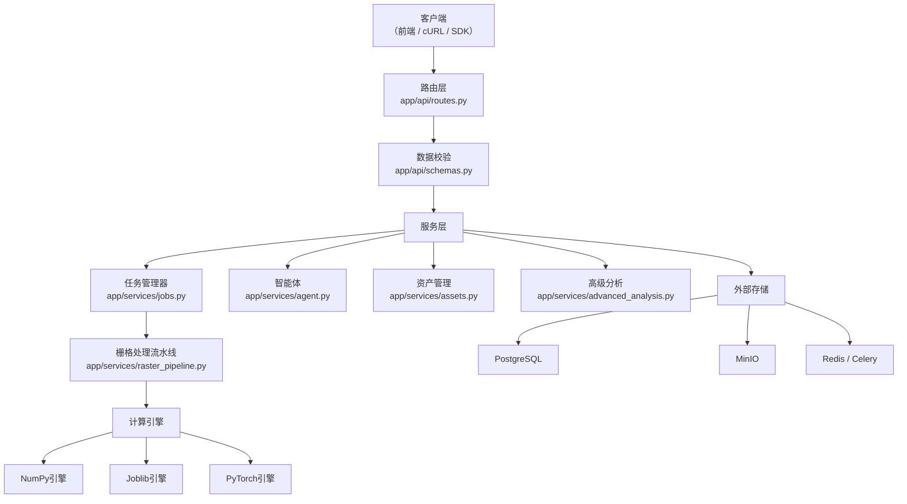
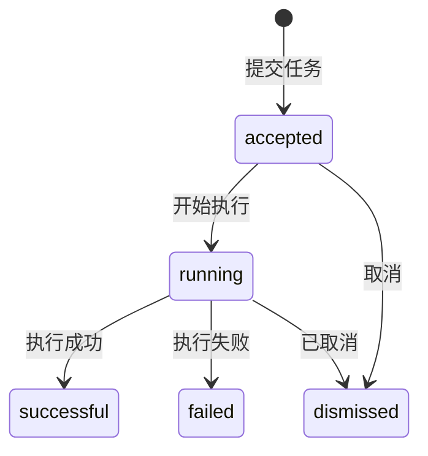
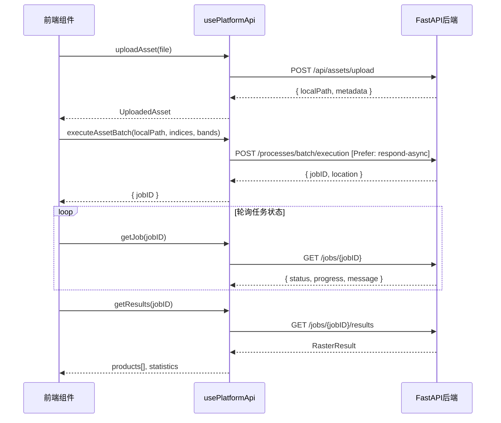

植被指数智能分析平台提供了一套统一的RESTful API，涵盖**植被指数检索与计算**、**OGC API - Processes兼容任务接口**、**智能体交互**、**资产管理和高级分析**五大功能域。所有接口基于FastAPI构建，自动生成OpenAPI文档（Swagger UI位于`/docs`），支持JSON请求/响应格式，并采用Pydantic模型进行严格数据校验。

Sources: [main.py](backend/app/main.py#L1-L55), [routes.py](backend/app/api/routes.py#L1-L50)

## 架构总览

平台API遵循**分层架构**模式：路由层（routes）负责HTTP协议适配与参数校验，服务层（services）封装业务逻辑与外部系统交互，核心层（core）管理指数定义与计算引擎。下图展示了API请求在各层间的流转路径。



## API端点全景

平台共暴露约30个REST端点，按功能域划分为以下六大类。

### 端点总览表

| 功能域 | 端点 | 方法 | 说明 |
|--------|------|------|------|
| **系统与健康** | `/health` | GET | 服务健康检查 |
| | `/api/system/capabilities` | GET | 查询系统能力（CUDA、引擎、存储模式等） |
| | `/api/system/taskbook-coverage` | GET | 任务书覆盖情况报告 |
| **植被指数** | `/api/indices` | GET | 列出所有指数（支持按category/band筛选） |
| | `/api/indices/{index_id}` | GET | 获取单个指数元数据 |
| | `/api/indices/custom` | POST | 注册自定义指数 |
| **OGC Processes** | `/processes` | GET | OGC兼容进程列表 |
| | `/processes/{process_id}` | GET | 进程描述（含inputs/outputs schema） |
| | `/processes/{process_id}/execution` | POST | 执行进程（同步/异步） |
| **任务管理** | `/jobs` | GET | 列出所有任务 |
| | `/jobs/{job_id}` | GET | 查询任务状态与进度 |
| | `/jobs/{job_id}/results` | GET | 获取任务结果 |
| | `/jobs/{job_id}` | DELETE | 取消任务 |
| **资产管理** | `/api/assets/inspect` | POST | 检查本地GeoTIFF元数据 |
| | `/api/assets/upload` | POST | 上传GeoTIFF文件 |
| | `/api/assets/upload-url` | POST | 获取MinIO预签名上传URL |
| **智能体** | `/api/agent/plan` | POST | 创建分析方案（含RAG检索与意图识别） |
| | `/api/agent/chat` | POST | 聊天式方案推荐 |
| | `/api/agent/plans/{plan_id}/confirm` | POST | 确认方案并提交任务 |
| | `/api/agent/interpret-results` | POST | 对计算结果进行智能解读 |
| | `/api/agent/sessions/{session_id}/events` | GET | 获取会话历史事件 |
| | `/api/agent/knowledge` | POST | 导入外部知识文档 |
| **分析与配方** | `/api/formulas/validate` | POST | 校验自定义公式安全性 |
| | `/api/analysis/change` | POST | 两期变化检测 |
| | `/api/analysis/zonal-statistics` | POST | GeoJSON区域统计 |
| | `/api/recipes` | GET | 列出分析配方 |
| | `/api/recipes` | POST | 创建分析配方 |
| **基准测试** | `/api/benchmarks/engines` | GET | 引擎阈值参考 |

Sources: [routes.py](backend/app/api/routes.py#L54-L531)

## 植被指数API

### 列出指数 `GET /api/indices`

返回平台内置及运行期注册的全部植被指数。支持通过查询参数进行条件筛选。

**查询参数**：
| 参数 | 类型 | 必填 | 说明 |
|------|------|------|------|
| `category` | string | 否 | 按分类过滤（如`vegetation`、`chlorophyll`、`soil-adjusted`） |
| `band` | string | 否 | 按必需波段过滤（如`red_edge`、`swir1`） |

**响应示例**：
```json
{
  "total": 30,
  "items": [
    {
      "id": "ndvi",
      "name": "归一化植被指数",
      "formula": "(NIR-Red)/(NIR+Red)",
      "requiredBands": ["nir", "red"],
      "description": "通用植被覆盖度和长势指标。",
      "expectedRange": [-1, 1],
      "parameters": {},
      "categories": ["vegetation", "biomass"],
      "recommendationTags": ["植被覆盖", "长势评估", "变化监测"],
      "limitations": ["云、阴影和积雪会影响结果", "使用前需确认波段映射与反射率尺度", "高覆盖度区域容易饱和"]
    }
  ]
}
```

Sources: [routes.py](backend/app/api/routes.py#L54-L64), [indices.py](backend/app/core/indices.py#L50-L62)

### 指数详情 `GET /api/indices/{index_id}`

根据指数ID返回单个指数的完整元数据。若ID不存在返回404。

Sources: [routes.py](backend/app/api/routes.py#L67-L72)

### 注册自定义指数 `POST /api/indices/custom`

运行期注册一个自定义植被指数。系统会对表达式进行AST白名单校验（仅允许`abs`、`sqrt`、`minimum`、`maximum`函数和基本算术运算符），并在多个波段数组上执行试探计算以验证正确性。注册后的指数可直接用于OGC执行请求或智能体推荐。

**请求体**（`AgentCustomIndexRequest`）：
| 字段 | 类型 | 必填 | 说明 |
|------|------|------|------|
| `id` | string | 是 | 指数唯一标识（2-40字符） |
| `name` | string | 是 | 指数名称 |
| `expression` | string | 是 | 数学表达式，使用波段名称作为变量 |
| `description` | string | 否 | 描述 |
| `expectedRange` | [number, number] | 否 | 预期值域 |
| `categories` | string[] | 否 | 分类标签 |
| `recommendationTags` | string[] | 否 | 推荐标签 |
| `limitations` | string[] | 否 | 使用限制说明 |

Sources: [routes.py](backend/app/api/routes.py#L285-L290), [schemas.py](backend/app/api/schemas.py#L66-L80), [agent_tools.py](backend/app/services/agent_tools.py#L123-L139)

## OGC API - Processes 兼容接口

平台实现了[OGC API - Processes](https://docs.ogc.org/is/18-062r2/18-062r2.html)标准的核心子集，提供与标准兼容的进程描述和执行接口。这使得平台可以直接被pygeoapi或其他OGC客户端集成。

Sources: [routes.py](backend/app/api/routes.py#L75-L107)

### 进程列表 `GET /processes`

返回所有可用的计算进程，每个进程对应一个植被指数。响应结构符合OGC Processes规范。

```json
{
  "processes": [
    {
      "id": "ndvi",
      "title": "归一化植被指数",
      "description": "通用植被覆盖度和长势指标。",
      "version": "1.0.0",
      "jobControlOptions": ["sync-execute", "async-execute", "dismiss"]
    }
  ]
}
```

Sources: [routes.py](backend/app/api/routes.py#L75-L88)

### 执行进程 `POST /processes/{process_id}/execution`

**这是平台的核心计算入口**。支持两种执行模式：

- **同步执行**：默认模式，直接返回计算结果。适用于小型影像或快速验证。
- **异步执行**：通过设置请求头 `Prefer: respond-async` 触发，返回任务ID，客户端需轮询`/jobs/{job_id}`获取进度和结果。

特殊process_id `batch` 支持**单次请求计算多个指数**，共享同一数据源的波段读取开销。

**请求体**（`ExecutionRequest`）：
| 字段 | 类型 | 必填 | 默认值 | 说明 |
|------|------|------|--------|------|
| `source` | object | 是 | - | 数据源引用（`objectKey`或`localPath`至少一个） |
| `indices` | string[] | 是 | - | 要计算的指数ID列表（1-30个） |
| `bands` | object | 是 | - | 波段名称到波段序号的映射，如`{"blue": 1, "green": 2, "red": 3, "nir": 4}` |
| `engine` | string | 否 | `"auto"` | 计算引擎：`auto`/`numpy`/`joblib`/`torch` |
| `blockSize` | number | 否 | `1024` | 分块大小（128-2048） |
| `priority` | number | 否 | `3` | 优先级1-5（1=紧急, 5=批处理） |
| `statistics` | boolean | 否 | `true` | 是否计算统计信息 |
| `preview` | boolean | 否 | `true` | 是否生成预览图 |
| `parameters` | object | 否 | `{}` | 指数参数覆盖，如`{"savi": {"L": 0.25}}` |

**引擎自动选择策略**：
| 条件 | 选择 | 理由 |
|------|------|------|
| 同步模式或像素 < 200万 | NumPy | 小型任务降低调度开销 |
| CUDA可用 且 (像素 ≥ 2000万 或 指数 ≥ 4) | PyTorch | GPU加速大型计算 |
| 其他情况 | Joblib | CPU线程并行 |

**异步响应示例**（`Prefer: respond-async`）：
```json
{
  "jobID": "a1b2c3d4...",
  "status": "accepted",
  "location": "/jobs/a1b2c3d4..."
}
```

**同步响应示例**：
```json
{
  "status": "successful",
  "outputs": {
    "actualEngine": "numpy",
    "durationSeconds": 2.35,
    "fallbackReasons": [],
    "products": [
      {
        "index": "ndvi",
        "name": "归一化植被指数",
        "path": "data/outputs/abc123/ndvi.tif",
        "previewPath": "data/outputs/abc123/ndvi_preview.png",
        "bounds": [120.5, 30.2, 120.8, 30.5],
        "crs": "EPSG:4326",
        "statistics": {
          "validPixels": 1048576,
          "minimum": -0.23,
          "maximum": 0.89,
          "mean": 0.42,
          "median": 0.44,
          "standardDeviation": 0.18,
          "histogram": { "counts": [12, 45, ...], "edges": [-0.23, -0.195, ...] }
        }
      }
    ]
  }
}
```

Sources: [routes.py](backend/app/api/routes.py#L110-L139), [schemas.py](backend/app/api/schemas.py#L23-L34), [planner.py](backend/app/services/planner.py#L28-L62)

## 任务管理API

异步执行的任务通过OGC Jobs API进行管理，提供完整的生命周期操作。

### 任务列表 `GET /jobs`

返回所有任务记录，按创建时间倒序排列。每条记录包含id、status、progress、message和时间戳。

### 任务详情 `GET /jobs/{job_id}`

**任务状态流转**：



### 获取结果 `GET /jobs/{job_id}/results`

仅当任务状态为`successful`时可用，返回格式与同步执行一致。若任务尚未完成，返回409冲突。

### 取消任务 `DELETE /jobs/{job_id}`

异步取消正在执行的任务。在Celery部署模式下，会调用`celery.control.revoke`终止Worker中的任务。

Sources: [routes.py](backend/app/api/routes.py#L142-L171), [jobs.py](backend/app/services/jobs.py#L37-L155)

## 智能体API

智能体系统是平台的高级功能，集成了**规则引擎**、**RAG知识检索**和**LLM意图分类**，能够理解用户的自然语言分析需求并生成可执行的分析方案。

### 创建分析方案 `POST /api/agent/plan`

**请求体**（`AgentPlanRequest`）：
| 字段 | 类型 | 必填 | 说明 |
|------|------|------|------|
| `message` | string | 是 | 用户自然语言描述（2-2000字符） |
| `availableBands` | string[] | 否 | 当前影像可用波段列表 |
| `rasterWidth` | number | 否 | 影像宽度（像素） |
| `rasterHeight` | number | 否 | 影像高度（像素） |
| `llm` | object | 否 | LLM配置（provider/baseUrl/token/model/temperature） |
| `enableWebSearch` | boolean | 否 | 是否启用网络检索（默认true） |
| `externalDocuments` | object[] | 否 | 外部知识文档列表 |
| `customIndex` | object | 否 | 随方案注册的自定义指数 |
| `sessionId` | string | 否 | 会话ID（复用已有会话） |

**智能体执行流程**：
1. **接收问题** → 记录用户输入、可用波段和影像规模
2. **RAG检索指数知识** → 从内置指数库、用户上传知识和持久化文档中召回相关条目
3. **网络检索** → 通过DuckDuckGo补充适用场景信息
4. **LLM意图分类** → 若配置了LLM，使用大语言模型进行意图识别
5. **规则匹配** → 将意图映射到预定义的分析规则（长势/稀疏/叶绿素/水分/变化）
6. **生成方案** → 包含指数推荐、引擎选择、执行参数和风险提示

**响应结构**（`AgentPlan`）：包含`id`、`status`（始终为`awaiting_confirmation`）、`title`、`summary`、`recommendations`（含可执行性判断）、`selectedIndices`、`engine`、`engineReason`、`warnings`、`trace`（执行轨迹）、`knowledgeHits`等字段。`requiresConfirmation`始终为`true`，确保方案必须经用户确认后才会提交计算。

Sources: [routes.py](backend/app/api/routes.py#L198-L210), [schemas.py](backend/app/api/schemas.py#L83-L97), [agent.py](backend/app/services/agent.py#L78-L200)

### 确认方案 `POST /api/agent/plans/{plan_id}/confirm`

用户审核方案后，提交确认请求以触发实际计算。系统会校验所选指数是否在方案推荐的可执行指数范围内，拒绝包含不可执行指数的请求。

**请求体**（`ConfirmPlanRequest`）：与`ExecutionRequest`类似，包含`source`、`bands`、`indices`（可选，默认使用方案推荐）、`engine`、`blockSize`、`priority`。

确认成功后，方案状态更新为`confirmed`，同时提交异步任务。

Sources: [routes.py](backend/app/api/routes.py#L222-L258)

### 结果解读 `POST /api/agent/interpret-results`

将计算产品的统计信息交给智能体进行语义解读，返回结构化的洞察、严重性评级和下一步行动建议。

Sources: [routes.py](backend/app/api/routes.py#L261-L268), [schemas.py](backend/app/api/schemas.py#L141-L147)

### 知识导入 `POST /api/agent/knowledge`

将外部知识文档导入平台知识库。文档会被持久化到PostgreSQL（若已配置），并参与后续所有方案的RAG检索。支持按会话隔离。

Sources: [routes.py](backend/app/api/routes.py#L276-L282), [agent_knowledge_store.py](backend/app/services/agent_knowledge_store.py#L45-L80)

## 资产管理API

### 上传GeoTIFF `POST /api/assets/upload`

通过multipart/form-data上传GeoTIFF文件（`.tif`/`.tiff`）。服务端将文件保存到受控输入目录，自动读取元数据（尺寸、波段数、CRS、分辨率等）并返回。

**响应示例**：
```json
{
  "objectKey": "inputs/a1b2c3d4.tif",
  "localPath": "/absolute/path/data/inputs/a1b2c3d4.tif",
  "filename": "original.tif",
  "size": 10485760,
  "metadata": {
    "width": 5000,
    "height": 5000,
    "count": 4,
    "dtypes": ["uint16", "uint16", "uint16", "uint16"],
    "crs": "EPSG:4326",
    "bounds": [120.5, 30.2, 120.8, 30.5],
    "resolution": [0.0001, 0.0001],
    "nodata": null,
    "descriptions": ["Blue", "Green", "Red", "NIR"]
  }
}
```

Sources: [routes.py](backend/app/api/routes.py#L183-L188), [assets.py](backend/app/services/assets.py#L79-L98)

### 检查影像元数据 `POST /api/assets/inspect`

检查指定路径的本地GeoTIFF文件元数据，无需上传。路径需为服务端可访问的本地路径。

Sources: [routes.py](backend/app/api/routes.py#L174-L179), [assets.py](backend/app/services/assets.py#L13-L31)

### 获取上传URL `POST /api/assets/upload-url`

为MinIO对象存储生成预签名PUT URL，支持客户端直接上传到对象存储（需配置`VIP_MINIO_ENABLED=true`）。

Sources: [routes.py](backend/app/api/routes.py#L190-L195), [assets.py](backend/app/services/assets.py#L59-L75)

## 高级分析API

### 变化检测 `POST /api/analysis/change`

对两期同源同尺度的指数结果影像进行变化检测，输出差值图和变化分类图。返回各类别像素计数。

**请求体**（`ChangeDetectionRequest`）：`beforePath`、`afterPath`、`outputPath`、`decreaseThreshold`（默认-0.2）、`increaseThreshold`（默认0.2）。

Sources: [routes.py](backend/app/api/routes.py#L319-L330), [advanced_analysis.py](backend/app/services/advanced_analysis.py#L93-L139)

### 区域统计 `POST /api/analysis/zonal-statistics`

在GeoJSON定义的地块上计算栅格统计量（有效像素数、均值、中位数、标准差）。

**请求体**（`ZonalStatisticsRequest`）：`rasterPath`（栅格路径）、`geojson`（至少含一个Feature的GeoJSON对象）。

Sources: [routes.py](backend/app/api/routes.py#L333-L338), [advanced_analysis.py](backend/app/services/advanced_analysis.py#L142-L164)

### 公式校验 `POST /api/formulas/validate`

对自定义公式进行安全AST白名单校验。返回校验结果、归一化表达式和所需的波段列表。

Sources: [routes.py](backend/app/api/routes.py#L311-L316), [advanced_analysis.py](backend/app/services/advanced_analysis.py#L62-L72)

## 错误处理规范

所有API端点统一使用HTTP状态码和JSON错误体进行错误响应：

| 状态码 | 场景 | 说明 |
|--------|------|------|
| **404** | 资源不存在 | 指数ID未找到、任务ID不存在 |
| **409** | 状态冲突 | 获取未完成任务的结果 |
| **422** | 参数校验失败 | 文件不存在、波段号超出范围、表达式不合法、方案校验不通过 |
| **503** | 外部服务不可用 | MinIO连接失败 |

**错误响应格式**：
```json
{
  "detail": "人类可读的错误描述信息"
}
```

Sources: [routes.py](backend/app/api/routes.py#L71-L72), [routes.py](backend/app/api/routes.py#L123-L127), [routes.py](backend/app/api/routes.py#L162)

## 认证与跨域

当前API**不启用认证**，开发模式下对所有来源开放CORS（`allow_origins=["*"]`）。生产环境建议通过Traefik网关层添加JWT认证或API Key验证。

Prometheus指标暴露在 `/metrics` 端点，静态制品通过 `/artifacts` 提供文件访问。

Sources: [main.py](backend/app/main.py#L36-L49)

## 前端集成示例

前端通过`usePlatformApi`组合式函数封装所有API调用，典型调用模式如下：



Sources: [usePlatformApi.ts](frontend/src/composables/usePlatformApi.ts#L42-L198), [platform.ts](frontend/src/types/platform.ts#L1-L195)

## 配置项

API行为受以下环境变量控制（均以`VIP_`为前缀）：

| 变量 | 默认值 | 说明 |
|------|--------|------|
| `VIP_CELERY_ALWAYS_EAGER` | `true` | 为true时使用线程池代替Celery |
| `VIP_REDIS_URL` | `redis://localhost:6379/0` | Redis连接（Celery消息代理） |
| `VIP_DATABASE_URL` | - | PostgreSQL连接串（启用指数/会话/知识持久化） |
| `VIP_MINIO_ENABLED` | `false` | 是否启用MinIO对象存储 |
| `VIP_MINIO_ENDPOINT` | `localhost:9000` | MinIO地址 |
| `VIP_OPENAI_BASE_URL` | - | LLM API基础URL |
| `VIP_OPENAI_MODEL` | `gpt-4.1-mini` | 默认LLM模型 |

Sources: [settings.py](backend/app/settings.py#L8-L31), [.env.example](.env.example#L1-L16)

## 下一步阅读

- 需要了解OGC兼容接口的详细规范和pygeoapi集成？请参阅 [OGC兼容接口](26-ogcjian-rong-jie-kou) 和 [pygeoapi插件](27-pygeoapicha-jian)
- 想深入理解任务调度系统的内部机制？请参阅 [任务调度系统](16-ren-wu-diao-du-xi-tong)
- 对智能体架构感兴趣？请参阅 [智能体架构](17-zhi-neng-ti-jia-gou)
- 想了解前端如何消费这些API？请参阅 [地图工作台](22-di-tu-gong-zuo-tai) 和 [状态管理](21-zhuang-tai-guan-li)
- 需要自定义公式或高级分析的使用指南？请参阅 [自定义指数管理](20-zi-ding-yi-zhi-shu-guan-li)