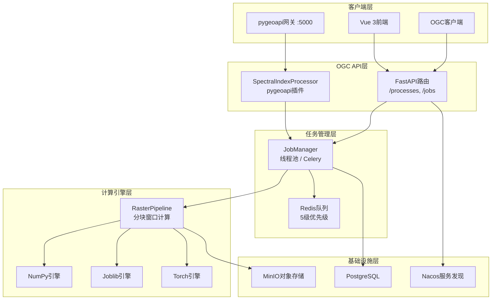
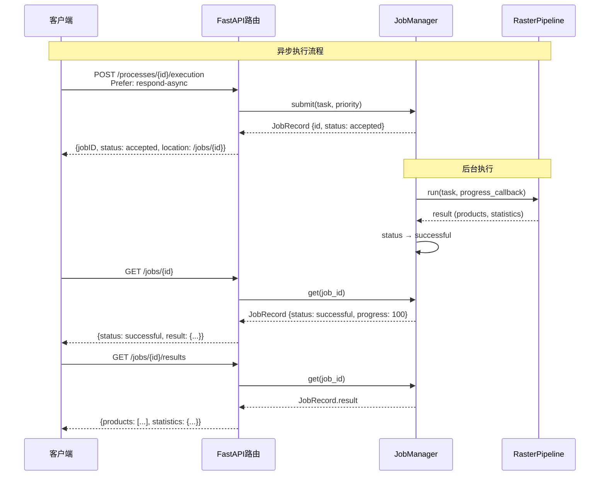
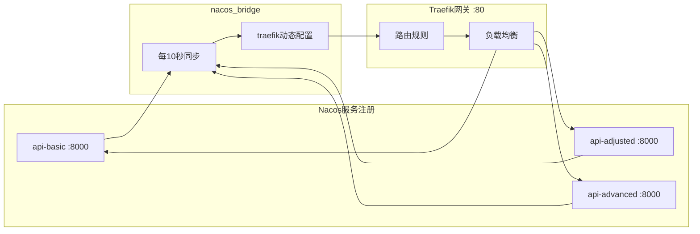

本文档介绍植被指数智能分析平台中**OGC API - Processes**兼容接口的架构设计、端点规范与集成方式。平台通过双通道实现OGC标准兼容：FastAPI原生路由直接暴露RESTful端点，同时提供pygeoapi插件供标准化地理空间服务网格接入。两种通道共享同一套`RasterPipeline`计算引擎，确保计算结果一致性。

## 架构概览

平台的OGC兼容层采用**双入口、单引擎**架构。FastAPI路由层直接实现OGC API - Processes规范的核心端点，同时通过pygeoapi插件模式提供标准化元数据与服务发现能力。两种通道均委托给`RasterPipeline`执行实际的分块栅格计算，任务管理则由`JobManager`统一调度。



*图例：OGC兼容接口的分层架构，FastAPI与pygeoapi两条路径汇聚于统一的任务管理与计算引擎层。*

Sources: [routes.py](backend/app/api/routes.py#L1-L10), [pygeoapi_processor.py](backend/app/pygeoapi_processor.py#L1-L10), [config.yml](infra/pygeoapi/config.yml#L1-L44)

## 端点规范

平台实现的OGC API - Processes端点遵循`/processes`和`/jobs`两个资源路径规范。每个注册的植被指数对应一个OGC进程，共30个内置进程和动态注册的自定义指数进程。

| 端点 | HTTP方法 | 功能描述 | 响应格式 |
|------|---------|---------|---------|
| `/processes` | GET | 列出所有可用的植被指数进程 | `{processes: [...]}` |
| `/processes/{id}` | GET | 描述特定进程的输入输出规范 | 进程元数据对象 |
| `/processes/{id}/execution` | POST | 提交进程执行请求 | 同步结果或异步任务ID |
| `/processes/batch/execution` | POST | 批量执行多个指数（特殊进程） | 同步结果或异步任务ID |
| `/jobs` | GET | 列出所有计算任务 | `{jobs: [...]}` |
| `/jobs/{id}` | GET | 查询任务状态与进度 | 任务记录对象 |
| `/jobs/{id}/results` | GET | 获取已完成任务的输出结果 | 栅格产品元数据 |
| `/jobs/{id}` | DELETE | 取消排队或运行中的任务 | 取消确认 |

**进程目录端点**返回的每个进程条目包含`id`、`title`、`description`、`version`和`jobControlOptions`字段。其中`jobControlOptions`声明了进程支持的执行模式：`sync-execute`（同步执行）、`async-execute`（异步执行）和`dismiss`（可取消）。

Sources: [routes.py](backend/app/api/routes.py#L37-L88)

## 同步与异步执行

OGC API - Processes规范允许客户端通过`Prefer`请求头选择执行模式。平台实现了完整的同步/异步双模式支持，执行模式的选择取决于请求头中的`respond-async`关键字。

**同步执行**是默认模式——客户端发送POST请求后阻塞等待，服务端在当前请求上下文中完成栅格计算并直接返回结果。此模式适合小规模影像（像素数低于200万）或需要即时反馈的交互场景。同步模式下`JobManager.execute_sync`方法直接调用`RasterPipeline.run`，不经过任务队列。

**异步执行**需要客户端在请求头中添加`Prefer: respond-async`。服务端接收请求后立即返回一个包含`jobID`、`status`和`location`的响应，实际计算在后台线程池或Celery Worker中完成。客户端通过轮询`/jobs/{id}`端点跟踪进度，任务完成后通过`/jobs/{id}/results`获取结果。



*图例：异步执行的完整生命周期，客户端通过轮询机制跟踪任务进度。*

Sources: [routes.py](backend/app/api/routes.py#L69-L88), [jobs.py](backend/app/services/jobs.py#L47-L68)

## 任务管理与优先级队列

任务管理由`JobManager`类统一负责，根据运行环境自动选择执行后端。开发模式（`celery_always_eager=True`）使用`ThreadPoolExecutor`实现并发，部署模式通过Celery将任务分发到专用Worker进程。

Celery配置了**五级优先队列**，映射关系如下表所示：

| 优先级数值 | 队列名称 | Worker类型 | 并发数 | 适用场景 |
|-----------|---------|-----------|--------|---------|
| 1 | urgent | joblib | 2 | 紧急分析任务 |
| 2 | high | joblib | 2 | 高优先级计算 |
| 3 | normal | numpy, joblib | 1 + 2 | 常规计算（默认） |
| 4 | low | numpy | 1 | 低优先级批量处理 |
| 5 | batch | numpy | 1 | 大规模批量作业 |

任务生命周期包含六个状态：`accepted`（已接受）、`running`（运行中）、`successful`（成功）、`failed`（失败）、`dismissed`（已取消）和`cancelled`（正在取消）。客户端可通过`DELETE /jobs/{id}`端点取消尚未完成的任务。

Sources: [jobs.py](backend/app/services/jobs.py#L1-L155), [celery_app.py](backend/app/celery_app.py#L1-L30), [worker_tasks.py](backend/app/worker_tasks.py#L1-L22)

## pygeoapi插件集成

除FastAPI原生路由外，平台通过pygeoapi插件模式提供标准化OGC服务入口。pygeoapi作为独立服务运行在5000端口，通过`SpectralIndexProcessor`处理器桥接到平台的计算引擎。

插件的核心设计是**单类多进程**模式——一个`SpectralIndexProcessor`类动态处理所有已注册的植被指数，无需为每个指数编写独立处理器。pygeoapi配置文件中仅声明一个`spectral-index`资源，处理器通过`index`输入参数在运行时确定具体计算哪种指数。

pygeoapi配置文件定义了服务元数据（标题、描述、关键词、许可证）和处理器绑定关系：

```yaml
resources:
  spectral-index:
    type: process
    processor:
      name: app.pygeoapi_processor.SpectralIndexProcessor
```

处理器的`execute`方法接收`source`（GeoTIFF路径）、`index`（指数标识符）和`bands`（波段映射）三个输入参数，通过`RasterPipeline`执行计算并返回JSON格式结果。输出目录按UUID自动隔离，避免并发任务间的文件冲突。

Sources: [pygeoapi_processor.py](backend/app/pygeoapi_processor.py#L1-L78), [config.yml](infra/pygeoapi/config.yml#L38-L44)

## 批量处理

平台提供特殊的`batch`虚拟进程，允许在单次请求中计算多个植被指数。批量处理共享一次IO操作——所有指数在同一窗口遍历过程中计算完成，显著减少磁盘读取次数。

`POST /processes/batch/execution`端点接受`indices`数组参数（最多30个指数），后端将请求转换为包含多个指数的`RasterTask`。`RasterPipeline`在每个窗口内调用引擎的批量计算方法，一次性产出所有指数的栅格结果。

Sources: [routes.py](backend/app/api/routes.py#L69-L88), [raster_pipeline.py](backend/app/services/raster_pipeline.py#L108-L195)

## 请求与响应模式

OGC执行端点的请求体遵循`ExecutionRequest`模式，包含数据源、指数列表、波段映射和执行选项：

| 字段 | 类型 | 必填 | 说明 |
|------|------|------|------|
| `source` | Object | 是 | 数据源引用（`objectKey`或`localPath`至少一个） |
| `indices` | String[] | 是 | 要计算的指数标识符列表（1-30个） |
| `bands` | Object | 是 | 逻辑波段到影像波段号的映射 |
| `engine` | String | 否 | 计算引擎选择：`auto`、`numpy`、`joblib`、`torch` |
| `blockSize` | Integer | 否 | 分块大小（128-2048，默认1024） |
| `priority` | Integer | 否 | 任务优先级（1-5，默认3） |
| `statistics` | Boolean | 否 | 是否计算统计信息（默认true） |
| `preview` | Boolean | 否 | 是否生成预览图（默认true） |

成功执行的响应包含`products`数组，每个产品元素携带指数标识、文件路径、空间范围、坐标参考系和统计摘要（有效像素数、最小值、最大值、均值、中位数、标准差、直方图）。

Sources: [schemas.py](backend/app/api/schemas.py#L25-L42), [routes.py](backend/app/api/routes.py#L69-L88)

## 前端集成

Vue 3前端通过`usePlatformApi`组合式函数与OGC端点交互。`executeAssetBatch`方法封装了异步批量执行的完整流程——发送带`Prefer: respond-async`头的POST请求，获取`jobID`后启动轮询循环。`JobProgressPanel`组件实时展示任务进度条、状态标签和操作按钮（查看结果、取消任务）。

前端默认通过Traefik网关访问API端点，路由规则将`/api`、`/processes`、`/jobs`路径前缀转发到后端服务。部署模式下Nacos服务发现自动同步健康实例到Traefik动态配置，实现负载均衡。

Sources: [usePlatformApi.ts](frontend/src/composables/usePlatformApi.ts#L54-L79), [JobProgressPanel.vue](frontend/src/components/JobProgressPanel.vue#L1-L100), [workspace.ts](frontend/src/stores/workspace.ts#L1-L120)

## 服务发现与网关

平台通过Nacos + Traefik组合实现OGC服务的动态发现与负载均衡。`nacos_bridge`组件每10秒从Nacos拉取健康实例列表，生成Traefik File Provider配置。三个API服务实例（`basic`、`adjusted`、`advanced`）通过路径前缀区分，Traefik的`stripPrefix`中间件在转发前移除前缀。



*图例：Nacos服务发现驱动Traefik网关的动态路由配置更新。*

Sources: [nacos_bridge.py](backend/app/nacos_bridge.py#L1-L82), [compose.yml](compose.yml#L71-L95)

## 下一步阅读

- [pygeoapi插件](pygeoapicha-jian) — 深入了解pygeoapi处理器的扩展机制与自定义配置
- [REST API](rest-api) — 查看平台专有的扩展API端点（智能体、自定义指数、分析功能）
- [任务调度系统](ren-wu-diao-du-xi-tong) — 理解Celery Worker的部署拓扑与优先级队列策略
- [系统架构](xi-tong-jia-gou) — 全局视角审视OGC兼容层在整体系统中的位置