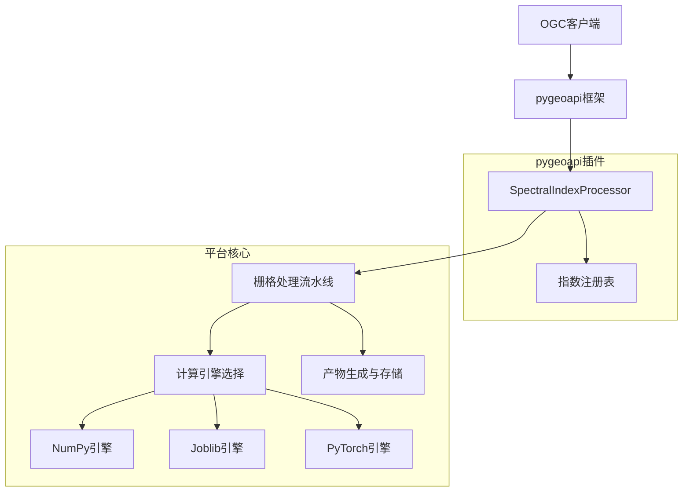

本文档详细介绍了植被指数智能分析平台中的pygeoapi插件实现，该插件遵循OGC API Processes标准，为30种植被指数提供动态处理服务。插件通过 `SpectralIndexProcessor` 类实现，将平台的栅格处理流水线与pygeoapi框架无缝集成，支持同步和异步执行模式。

## 插件架构概述

pygeoapi插件采用单类动态处理架构，通过一个统一的处理器类 `SpectralIndexProcessor` 处理所有注册的植被指数。这种设计避免了为每个指数创建单独处理器的复杂性，同时保持了OGC标准的兼容性。



插件架构的核心思想是**单一入口点**：`SpectralIndexProcessor` 接收OGC标准格式的请求，验证指数标识符，然后委托给平台的 `RasterPipeline` 进行实际计算。这种解耦设计使得插件可以独立于pygeoapi框架进行测试和维护。

Sources: [pygeoapi_processor.py](backend/app/pygeoapi_processor.py#L1-L78), [config.yml](infra/pygeoapi/config.yml#L1-L44)

## SpectralIndexProcessor 实现

`SpectralIndexProcessor` 类继承自 `pygeoapi.process.base.BaseProcessor`，实现了OGC API Processes标准所需的核心接口。处理器定义在 `backend/app/pygeoapi_processor.py` 文件中。

### 处理器元数据定义

处理器通过 `PROCESS_METADATA` 字典定义其元数据，包括版本、标识符、标题、描述和输入输出规范：

```python
PROCESS_METADATA = {
    "version": "1.0.0",
    "id": "spectral-index",
    "title": {"en": "Spectral index", "zh": "植被指数动态处理器"},
    "description": {"en": "Windowed vegetation index calculation"},
    "jobControlOptions": ["sync-execute", "async-execute"],
    "keywords": ["vegetation", "raster", "remote-sensing"],
    "inputs": {
        "source": {
            "title": "GeoTIFF path",
            "schema": {"type": "string"},
            "minOccurs": 1,
            "maxOccurs": 1,
        },
        "index": {
            "title": "Index identifier",
            "schema": {"type": "string"},
            "minOccurs": 1,
            "maxOccurs": 1,
        },
        "bands": {
            "title": "Logical band mapping",
            "schema": {"type": "object"},
            "minOccurs": 1,
            "maxOccurs": 1,
        },
    },
    "outputs": {
        "result": {
            "title": "Processing result",
            "schema": {"type": "object", "contentMediaType": "application/json"},
        }
    },
}
```

元数据定义遵循OGC标准规范，支持中英文双语标题，明确指定了输入参数的类型和约束。

Sources: [pygeoapi_processor.py](backend/app/pygeoapi_processor.py#L15-L48)

### 处理器执行逻辑

`execute` 方法是处理器的核心，负责接收OGC格式的请求数据，验证参数，并调用平台的栅格处理流水线：

```python
def execute(self, data: dict[str, Any]) -> tuple[str, dict[str, Any]]:
    try:
        index_id = str(data["index"]).lower()
        get_index(index_id)
        source = Path(str(data["source"])).resolve()
        output_dir = settings.data_dir / "outputs" / f"pygeoapi-{uuid.uuid4().hex}"
        result = RasterPipeline().run(
            RasterTask(
                source_path=str(source),
                output_dir=str(output_dir),
                indices=[index_id],
                bands={key: int(value) for key, value in data["bands"].items()},
                engine=str(data.get("engine", "auto")),
            )
        )
        return "application/json", result
    except Exception as error:
        raise ProcessorExecuteError(str(error)) from error
```

执行流程包含以下关键步骤：

1. **指数验证**：通过 `get_index()` 验证请求的指数标识符是否有效
2. **路径解析**：将源文件路径解析为绝对路径，确保文件存在性
3. **输出目录生成**：为每次执行创建唯一的输出目录，避免冲突
4. **任务构建**：构建 `RasterTask` 对象，包含所有必要的处理参数
5. **流水线执行**：调用 `RasterPipeline().run()` 执行实际计算
6. **结果返回**：返回JSON格式的处理结果，符合OGC标准

错误处理机制捕获所有异常，并将其转换为 `ProcessorExecuteError`，确保pygeoapi框架能够正确处理错误响应。

Sources: [pygeoapi_processor.py](backend/app/pygeoapi_processor.py#L57-L74)

## pygeoapi 配置与注册

pygeoapi插件通过配置文件注册到pygeoapi框架中，配置文件位于 `infra/pygeoapi/config.yml`。

### 服务器配置

```yaml
server:
  bind:
    host: 0.0.0.0
    port: 5000
  url: http://localhost:5000
  mimetype: application/json
  encoding: utf-8
  language: zh-CN
  pretty_print: true
  limits:
    default_items: 10
    max_items: 100
  map:
    url: https://tile.openstreetmap.org/{z}/{x}/{y}.png
    attribution: OpenStreetMap contributors
```

服务器配置指定了绑定地址、端口、语言设置和限制参数，确保pygeoapi服务能够正确运行。

Sources: [config.yml](infra/pygeoapi/config.yml#L1-L15)

### 元数据配置

```yaml
metadata:
  identification:
    title: 植被指数OGC API服务
    description: 30种植被指数动态处理服务
    keywords: [vegetation, raster, OGC API Processes]
    keywords_type: theme
    terms_of_service: https://example.org/terms
    url: https://example.org
  license:
    name: MIT
    url: https://opensource.org/license/mit
  provider:
    name: Canopy Lab
    url: https://example.org
  contact:
    name: Internship Developer
    email: developer@example.org
    role: developer
```

元数据配置提供了服务的描述信息，包括标题、描述、关键词、许可证和联系人信息，这些信息将通过OGC API的 `/api` 端点暴露给客户端。

Sources: [config.yml](infra/pygeoapi/config.yml#L20-L37)

### 资源注册

```yaml
resources:
  spectral-index:
    type: process
    processor:
      name: app.pygeoapi_processor.SpectralIndexProcessor
```

资源注册部分将 `SpectralIndexProcessor` 注册为pygeoapi的进程处理器。处理器通过Python模块路径 `app.pygeoapi_processor.SpectralIndexProcessor` 进行引用，pygeoapi框架会动态加载该类并注册为可用的处理进程。

Sources: [config.yml](infra/pygeoapi/config.yml#L39-L44)

## 与平台核心的集成

pygeoapi插件与平台核心系统紧密集成，共享相同的指数注册表、栅格处理流水线和计算引擎。

### 指数注册表集成

插件通过 `get_index()` 函数访问平台的指数注册表，确保所有30个预定义指数都可以通过OGC接口访问：

```python
from app.core.indices import get_index, INDEX_REGISTRY

# 验证指数存在
index_id = str(data["index"]).lower()
get_index(index_id)  # 如果指数不存在，抛出ValueError
```

指数注册表定义在 `backend/app/core/indices.py` 中，包含30种植被指数的完整定义，包括公式、所需波段、参数和元数据。

Sources: [indices.py](backend/app/core/indices.py#L1-L100), [pygeoapi_processor.py](backend/app/pygeoapi_processor.py#L11)

### 栅格处理流水线集成

插件委托给 `RasterPipeline` 进行实际的栅格计算，该流水线实现了窗口化处理、统计计算和预览生成：

```python
from app.services.raster_pipeline import RasterPipeline, RasterTask

result = RasterPipeline().run(
    RasterTask(
        source_path=str(source),
        output_dir=str(output_dir),
        indices=[index_id],
        bands={key: int(value) for key, value in data["bands"].items()},
        engine=str(data.get("engine", "auto")),
    )
)
```

`RasterPipeline` 采用分块处理策略，支持多种计算引擎，并提供进度回调和取消机制。

Sources: [raster_pipeline.py](backend/app/services/raster_pipeline.py#L100-L200), [pygeoapi_processor.py](backend/app/pygeoapi_processor.py#L63-L71)

### 计算引擎选择

插件支持三种计算引擎，通过 `engine` 参数指定：

| 引擎 | 适用场景 | 特点 |
|------|----------|------|
| **numpy** | 小到中等数据集 | 稳定可靠，无外部依赖 |
| **joblib** | 中等数据集，CPU并行 | 多核并行处理，适合批处理 |
| **torch** | 大型数据集，GPU加速 | CUDA支持，适合大规模计算 |

引擎选择逻辑在 `ExecutionPlanner` 中实现，根据数据规模和硬件能力自动选择最优引擎。

Sources: [planner.py](backend/app/services/planner.py#L1-L62), [raster_pipeline.py](backend/app/services/raster_pipeline.py#L200-L250)

## OGC API Processes 端点

pygeoapi插件暴露了标准的OGC API Processes端点，客户端可以通过这些端点发现和执行处理进程。

### 进程发现端点

**GET /processes**：列出所有可用的处理进程

```json
{
  "processes": [
    {
      "id": "ndvi",
      "title": "归一化植被指数",
      "description": "通用植被覆盖度和长势指标。",
      "version": "1.0.0",
      "jobControlOptions": ["sync-execute", "async-execute", "dismiss"]
    },
    // ... 其他29个指数
  ]
}
```

**GET /processes/{process_id}**：获取特定进程的详细描述

```json
{
  "id": "ndvi",
  "name": "归一化植被指数",
  "formula": "(NIR-Red)/(NIR+Red)",
  "requiredBands": ["nir", "red"],
  "description": "通用植被覆盖度和长势指标。",
  "expectedRange": [-1, 1],
  "parameters": {},
  "categories": ["vegetation", "biomass"],
  "recommendationTags": ["植被覆盖", "长势评估", "变化监测"],
  "limitations": ["云、阴影和积雪会影响结果", "使用前需确认波段映射与反射率尺度", "高覆盖度区域容易饱和"],
  "version": "1.0.0",
  "jobControlOptions": ["sync-execute", "async-execute", "dismiss"],
  "inputs": {
    "source": {"schema": {"type": "object"}},
    "bands": {"schema": {"type": "object"}},
    "engine": {"schema": {"enum": ["auto", "numpy", "joblib", "torch"]}}
  },
  "outputs": {"result": {"schema": {"type": "object"}}}
}
```

这些端点由平台的FastAPI应用实现，确保与pygeoapi插件保持一致的接口定义。

Sources: [routes.py](backend/app/api/routes.py#L70-L100)

### 进程执行端点

**POST /processes/{process_id}/execution**：执行指定进程

请求示例：
```json
{
  "source": {"localPath": "/path/to/input.tif"},
  "indices": ["ndvi"],
  "bands": {"nir": 4, "red": 3},
  "engine": "auto",
  "blockSize": 1024,
  "priority": 3,
  "statistics": true,
  "preview": true
}
```

响应示例（同步执行）：
```json
{
  "status": "successful",
  "outputs": {
    "actualEngine": "numpy",
    "products": [
      {
        "index": "ndvi",
        "name": "归一化植被指数",
        "path": "/data/outputs/sample_ndvi.tif",
        "previewPath": "/data/outputs/sample_ndvi.png",
        "objectKey": "outputs/pygeoapi-xxx/sample_ndvi.tif",
        "previewObjectKey": "outputs/pygeoapi-xxx/sample_ndvi.png",
        "bounds": [116.0, 39.0, 117.0, 40.0],
        "crs": "EPSG:4326",
        "statistics": {
          "validPixels": 1000000,
          "minimum": -0.5,
          "maximum": 0.9,
          "mean": 0.35,
          "median": 0.32,
          "standardDeviation": 0.15,
          "histogram": {"counts": [...], "edges": [...]}
        }
      }
    ]
  }
}
```

执行端点支持同步和异步模式，通过 `Prefer: respond-async` 请求头控制执行模式。

Sources: [routes.py](backend/app/api/routes.py#L100-L140), [test_api.py](backend/tests/test_api.py#L100-L150)

## 任务管理与异步执行

pygeoapi插件支持异步执行模式，与平台的任务管理系统集成。

### 异步执行流程

当客户端发送 `Prefer: respond-async` 请求头时，插件将任务提交到任务队列，立即返回任务ID：

```python
if prefer and "respond-async" in prefer.lower():
    record = job_manager.submit(task, request.priority)
    return {
        "jobID": record.id,
        "status": record.status,
        "location": f"/jobs/{record.id}",
    }
```

任务管理器 `JobManager` 支持两种运行模式：

1. **开发模式**：使用线程池执行任务，适用于单机开发环境
2. **部署模式**：使用Celery + Redis队列，支持分布式任务处理

Sources: [jobs.py](backend/app/services/jobs.py#L1-L80), [routes.py](backend/app/api/routes.py#L130-L140)

### 任务状态查询

客户端可以通过标准OGC任务端点查询任务状态和结果：

**GET /jobs**：列出所有任务
```json
{
  "jobs": [
    {
      "id": "abc123",
      "status": "successful",
      "progress": 100.0,
      "message": "处理完成",
      "createdAt": "2026-06-24T10:30:00Z",
      "updatedAt": "2026-06-24T10:30:05Z"
    }
  ]
}
```

**GET /jobs/{job_id}**：获取特定任务状态
```json
{
  "id": "abc123",
  "status": "successful",
  "progress": 100.0,
  "message": "处理完成",
  "createdAt": "2026-06-24T10:30:00Z",
  "updatedAt": "2026-06-24T10:30:05Z"
}
```

**GET /jobs/{job_id}/results**：获取任务结果
```json
{
  "actualEngine": "numpy",
  "products": [
    {
      "index": "ndvi",
      "name": "归一化植被指数",
      "path": "/data/outputs/sample_ndvi.tif",
      // ... 其他产物信息
    }
  ]
}
```

Sources: [routes.py](backend/app/api/routes.py#L150-L180), [test_api.py](backend/tests/test_api.py#L170-L200)

## 部署与配置

pygeoapi插件支持多种部署方式，包括开发环境和生产环境。

### 开发环境部署

在开发环境中，pygeoapi服务与FastAPI应用一起运行：

```powershell
# 启动后端服务
cd backend
D:\miniconda\envs\giskeshe\python.exe -m uvicorn app.main:app --host 127.0.0.1 --port 8011 --reload
```

开发模式下，pygeoapi插件通过FastAPI的路由系统提供OGC接口，无需单独启动pygeoapi服务。

Sources: [AGENTS.md](AGENTS.md#L20-L25)

### 容器化部署

生产环境使用Docker Compose进行容器化部署，pygeoapi配置通过卷挂载到容器中：

```yaml
# compose.yml 中的配置卷挂载
volumes:
  - ./infra/pygeoapi/config.yml:/etc/pygeoapi/config.yml:ro
```

容器化部署提供了完整的OGC兼容服务，包括：

- pygeoapi服务（端口5000）
- FastAPI应用（端口8000）
- Traefik反向代理（端口80/8080）
- Redis任务队列
- MinIO对象存储
- PostgreSQL数据库

Sources: [compose.yml](compose.yml#L1-L192), [config.yml](infra/pygeoapi/config.yml#L1-L44)

### 环境变量配置

插件依赖以下环境变量进行配置：

| 变量 | 说明 | 默认值 |
|------|------|--------|
| `VIP_DATA_DIR` | 数据目录路径 | `data` |
| `VIP_REDIS_URL` | Redis连接URL | `redis://localhost:6379/0` |
| `VIP_CELERY_ALWAYS_EAGER` | 是否同步执行任务 | `true` |
| `VIP_DATABASE_URL` | PostgreSQL连接URL | `None` |
| `VIP_MINIO_ENDPOINT` | MinIO服务端点 | `localhost:9000` |
| `VIP_MINIO_ACCESS_KEY` | MinIO访问密钥 | `vegetation` |
| `VIP_MINIO_SECRET_KEY` | MinIO秘密密钥 | `vegetation-secret` |
| `VIP_MINIO_ENABLED` | 是否启用MinIO | `false` |

这些环境变量通过 `pydantic-settings` 进行管理，支持 `.env` 文件配置。

Sources: [settings.py](backend/app/settings.py#L1-L33), [.env.example](.env.example)

## 测试与验证

pygeoapi插件包含完整的测试套件，确保OGC兼容性和功能正确性。

### 单元测试

```python
def test_ogc_process_catalog_contains_30_processes() -> None:
    response = client.get("/processes")
    assert response.status_code == 200
    assert len(response.json()["processes"]) == 30

def test_sync_process_executes_real_windowed_raster(sample_raster: Path) -> None:
    response = client.post(
        "/processes/ndvi/execution",
        json=execution_payload(sample_raster),
    )
    assert response.status_code == 200
    payload = response.json()
    assert payload["status"] == "successful"
    assert payload["outputs"]["actualEngine"] == "numpy"
    assert payload["outputs"]["products"][0]["index"] == "ndvi"
    assert Path(payload["outputs"]["products"][0]["path"]).is_file()
```

测试覆盖了以下方面：

1. **进程发现**：验证所有30个指数都正确注册
2. **同步执行**：验证单个指数的同步处理
3. **批量处理**：验证多个指数的批处理
4. **异步执行**：验证任务提交和状态查询
5. **错误处理**：验证无效参数和缺失文件的错误响应
6. **任务取消**：验证异步任务的取消功能

Sources: [test_api.py](backend/tests/test_api.py#L15-L30), [test_api.py](backend/tests/test_api.py#L100-L170)

### 集成测试

集成测试验证插件与平台核心系统的完整集成：

```python
def test_capabilities_match_task_book_requirements() -> None:
    response = client.get("/api/system/capabilities")
    assert response.status_code == 200
    payload = response.json()
    assert payload["indexCount"] == 30
    assert payload["totalIndexCount"] >= 30
    assert payload["customIndexStorage"] in {"memory", "postgresql"}
    assert payload["engines"] == ["numpy", "joblib", "torch"]
    assert payload["asyncJobs"] is True
    assert payload["objectStorage"] == "minio"
```

这些测试确保pygeoapi插件与平台的其他组件（如任务管理、存储系统）正确集成。

Sources: [test_api.py](backend/tests/test_api.py#L200-L221)

## 扩展与自定义

pygeoapi插件设计为可扩展的，支持自定义指数和参数。

### 自定义指数支持

插件通过平台的指数注册表机制支持动态添加自定义指数：

1. **运行时注册**：通过智能体工具动态注册自定义指数
2. **持久化存储**：自定义指数可以存储到PostgreSQL数据库
3. **OGC接口暴露**：新注册的指数自动通过OGC接口可用

自定义指数定义示例：
```python
custom_index = {
    "id": "custom_ndvi",
    "name": "自定义NDVI",
    "expression": "(nir - red) / (nir + red + 0.1)",
    "description": "带偏移的NDVI变体",
    "expectedRange": [-1, 1],
    "requiredBands": ["nir", "red"],
    "parameters": {"offset": 0.1}
}
```

Sources: [custom_index_store.py](backend/app/services/custom_index_store.py#L1-L111), [agent_tools.py](backend/app/services/agent_tools.py#L1-L80)

### 参数扩展

插件支持通过 `parameters` 字段传递额外的计算参数：

```json
{
  "source": {"localPath": "/path/to/input.tif"},
  "index": "savi",
  "bands": {"nir": 4, "red": 3},
  "parameters": {"L": 0.5},
  "engine": "auto"
}
```

参数在指数定义中声明，并在计算时传递给表达式函数。

Sources: [indices.py](backend/app/core/indices.py#L100-L150), [raster_pipeline.py](backend/app/services/raster_pipeline.py#L100-L150)

## 故障排查

### 常见问题

1. **指数未找到错误**
   - 症状：`ProcessorExecuteError: 未知植被指数: xxx`
   - 原因：请求的指数标识符未在注册表中定义
   - 解决：检查指数标识符拼写，或通过 `/processes` 端点查看可用指数

2. **波段映射错误**
   - 症状：`ValueError: 缺少逻辑波段映射: nir, red`
   - 原因：请求的 `bands` 参数缺少必需波段
   - 解决：根据指数定义提供完整的波段映射

3. **文件路径错误**
   - 症状：`FileNotFoundError: [Errno 2] No such file or directory`
   - 原因：指定的源文件路径不存在
   - 解决：验证文件路径，确保文件可访问

4. **引擎选择失败**
   - 症状：`ValueError: 波段号超出影像范围`
   - 原因：指定的波段号超出影像实际波段数
   - 解决：检查影像波段数，调整 `bands` 参数

### 调试技巧

1. **启用详细日志**：在pygeoapi配置中设置 `logging.level: DEBUG`
2. **检查指数定义**：通过 `/api/indices` 端点查看指数元数据
3. **验证文件信息**：使用 `/api/assets/inspect` 端点检查影像信息
4. **测试引擎兼容性**：使用 `/api/benchmarks/engines` 端点获取引擎阈值建议

Sources: [test_api.py](backend/tests/test_api.py#L150-L200), [routes.py](backend/app/api/routes.py#L100-L140)

## 最佳实践

### 性能优化

1. **批量处理**：对于多个指数，使用 `/processes/batch/execution` 端点减少IO开销
2. **引擎选择**：根据数据规模选择合适引擎，避免小任务使用GPU引擎
3. **块大小调整**：根据内存限制调整 `blockSize` 参数，默认1024像素
4. **预览生成**：仅在需要时启用 `preview` 参数，减少处理时间

### 安全考虑

1. **路径验证**：插件对源文件路径进行绝对路径解析，防止路径遍历攻击
2. **参数验证**：所有输入参数都经过类型和范围验证
3. **错误处理**：异常信息经过清理，避免敏感信息泄露
4. **资源限制**：pygeoapi配置中设置了请求限制，防止资源滥用

### 监控与维护

1. **任务监控**：通过 `/jobs` 端点监控任务状态和进度
2. **性能指标**：通过 `/metrics` 端点收集Prometheus指标
3. **日志聚合**：配置日志收集系统，集中管理pygeoapi日志
4. **定期维护**：清理过期的任务结果和临时文件

## 下一步阅读

要深入了解pygeoapi插件的相关主题，建议按照以下顺序阅读：

1. **[OGC兼容接口](26-ogcjian-rong-jie-kou)**：了解OGC API标准的完整实现
2. **[REST API](25-rest-api)**：查看平台的完整REST API文档
3. **[计算引擎](14-ji-suan-yin-qing)**：深入了解NumPy、Joblib和PyTorch引擎的实现
4. **[栅格处理流水线](15-zha-ge-chu-li-liu-shui-xian)**：了解窗口化处理和统计计算
5. **[指数注册表](13-zhi-shu-zhu-ce-biao)**：查看30种植被指数的完整定义
6. **[任务调度系统](16-ren-wu-diao-du-xi-tong)**：了解异步任务管理
7. **[容器化部署](5-rong-qi-hua-bu-shu)**：查看生产环境部署配置