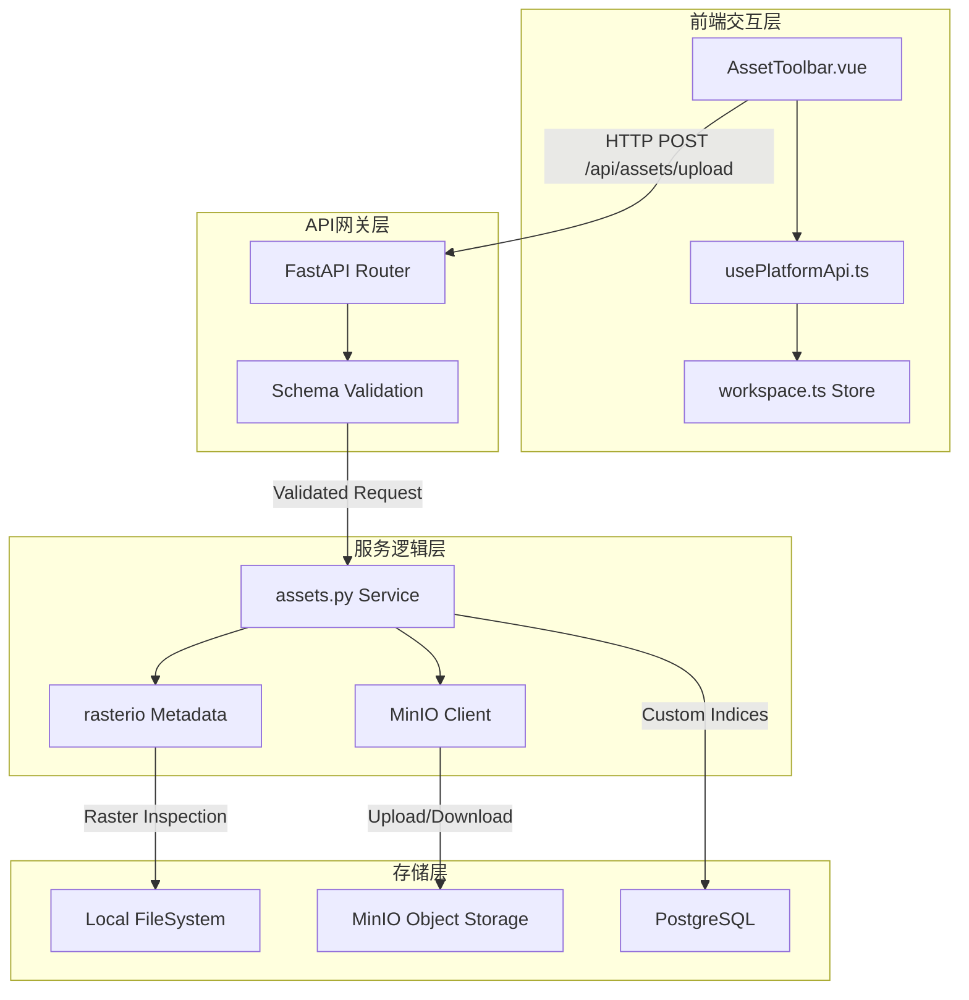
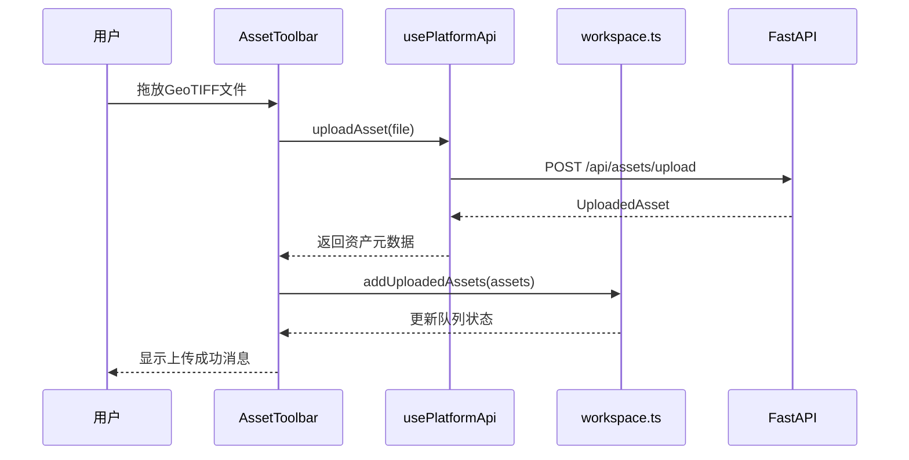
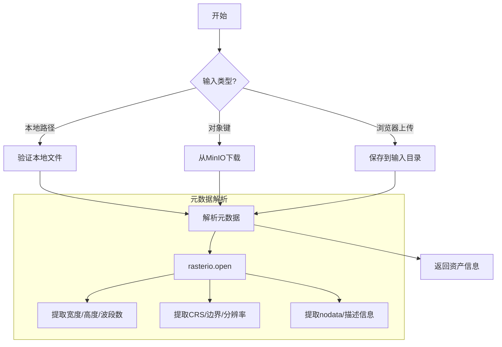
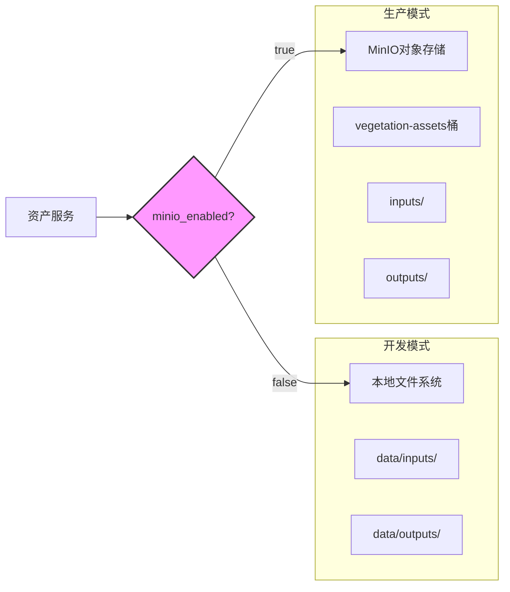

资产管理系统是植被指数智能分析平台的数据入口与管理中心，负责GeoTIFF影像的上传、元数据解析、队列管理以及批量处理任务的提交。该系统采用**双模存储架构**，支持开发环境的本地文件系统与生产环境的MinIO对象存储，确保数据流的灵活性与可扩展性。

## 系统架构概览

资产管理系统由四个核心层组成：前端交互层、API网关层、服务逻辑层和存储层。每一层都有明确的职责边界，通过标准化的数据格式进行交互。



**架构设计原则**：资产管理系统遵循**单一职责原则**，每个组件专注于特定功能。前端组件负责用户交互与状态管理，API网关处理请求验证与路由，服务逻辑层封装业务规则，存储层提供数据持久化。

Sources: [assets.py](backend/app/services/assets.py#L1-L116), [AssetToolbar.vue](frontend/src/components/AssetToolbar.vue#L1-L366), [routes.py](backend/app/api/routes.py#L174-L196)

## 核心组件分析

### 前端资产工具栏

资产工具栏是用户与系统交互的主要界面，提供拖放上传、文件选择、批量队列管理和任务提交功能。该组件采用响应式设计，支持多种屏幕尺寸。

**关键特性**：
- **拖放上传**：支持直接拖拽GeoTIFF文件到界面
- **批量队列**：管理多个待处理影像，支持队列选择
- **波段映射**：可视化逻辑波段与源波段的对应关系
- **金字塔预览**：预估缩略图金字塔层级，优化预览性能



Sources: [AssetToolbar.vue](frontend/src/components/AssetToolbar.vue#L1-L366), [usePlatformApi.ts](frontend/src/composables/usePlatformApi.ts#L44-L48)

### 后端资产服务

后端资产服务是系统的核心逻辑层，负责影像文件的存储、元数据解析和与外部存储系统的集成。该服务提供三个主要功能：资产检查、资产解析和资产上传。

**核心函数**：
- **`inspect_raster(path)`**：使用rasterio库解析GeoTIFF元数据
- **`resolve_source(object_key, local_path)`**：解析资产引用，支持本地路径和MinIO对象键
- **`save_uploaded_asset(file)`**：保存上传的GeoTIFF文件到受控目录



Sources: [assets.py](backend/app/services/assets.py#L13-L98)

### API端点设计

资产管理系统提供三个RESTful API端点，遵循OGC API设计规范，确保接口的一致性和可预测性。

| 端点 | 方法 | 功能 | 请求格式 | 响应格式 |
|------|------|------|----------|----------|
| `/api/assets/inspect` | POST | 检查本地影像元数据 | `{"path": "string"}` | 影像元数据对象 |
| `/api/assets/upload` | POST | 上传GeoTIFF文件 | `multipart/form-data` | 资产信息对象 |
| `/api/assets/upload-url` | POST | 获取MinIO预签名上传URL | `object_key` 查询参数 | `{"objectKey", "uploadUrl"}` |

**API设计特点**：
- **统一错误处理**：所有端点使用标准HTTP状态码和错误格式
- **输入验证**：使用Pydantic模型进行严格的输入验证
- **异步支持**：上传端点支持异步文件处理

Sources: [routes.py](backend/app/api/routes.py#L174-L196), [schemas.py](backend/app/api/schemas.py#L37-L39)

## 存储策略与数据流

### 双模存储架构

资产管理系统采用**双模存储架构**，根据部署环境自动选择存储后端。这种设计确保开发环境的便捷性与生产环境的可扩展性。



**存储配置**：
- **开发模式**：`VIP_MINIO_ENABLED=false`，文件存储在`data/`目录
- **生产模式**：`VIP_MINIO_ENABLED=true`，文件存储在MinIO桶中
- **混合模式**：上传到MinIO，但本地保留副本用于快速处理

Sources: [settings.py](backend/app/settings.py#L14-L20), [compose.yml](compose.yml#L6-L9)

### 数据流分析

资产管理系统处理三种主要数据流：上传流、解析流和批量处理流。

```mermaid
flowchart TB
    subgraph "上传流"
        A1[用户选择文件] --> A2[前端FormData]
        A2 --> A3[POST /api/assets/upload]
        A3 --> A4[保存到data/inputs/]
        A4 --> A5[inspect_raster]
        A5 --> A6[返回元数据]
    end
    
    subgraph "解析流"
        B1[POST /api/assets/inspect] --> B2[验证路径存在]
        B2 --> B3[rasterio.open]
        B3 --> B4[提取元数据]
        B4 --> B5[返回元数据对象]
    end
    
    subgraph "批量处理流"
        C1[选择队列中的资产] --> C2[选择指数列表]
        C2 --> C3[配置波段映射]
        C3 --> C4[POST /processes/batch/execution]
        C4 --> C5[异步任务提交]
        C5 --> C6[返回jobID]
    end
```



**数据流特点**：
- **流式上传**：支持大文件分块上传，减少内存占用
- **元数据缓存**：解析结果可缓存，避免重复解析
- **异步处理**：批量任务使用Celery异步执行，不阻塞用户界面

Sources: [assets.py](backend/app/services/assets.py#L79-L98), [usePlatformApi.ts](frontend/src/composables/usePlatformApi.ts#L50-L73)

## 前端状态管理

资产状态通过Pinia store进行集中管理，确保状态的一致性和可预测性。

**状态结构**：
```typescript
asset: {
  localPath: string,      // 当前选中资产的本地路径
  selected: UploadedAsset | null,  // 当前选中的资产对象
  queue: UploadedAsset[], // 资产队列
  availableBands: string[], // 可用波段列表
  bandMapping: Record<string, number> // 波段映射配置
}
```

**关键操作**：
- **`addUploadedAssets(assets)`**：添加资产到队列，自动选择第一个资产
- **`selectAsset(asset)`**：从队列中选择特定资产
- **波段映射**：支持7个逻辑波段（blue, green, red, red_edge, nir, swir1, swir2）

Sources: [workspace.ts](frontend/src/stores/workspace.ts#L19-L33), [platform.ts](frontend/src/types/platform.ts#L15-L21)

## 测试与验证

资产管理系统具有完整的测试覆盖，包括单元测试、集成测试和端到端验证。

**测试策略**：
- **单元测试**：验证单个函数的正确性
- **集成测试**：验证组件间的交互
- **API测试**：验证端点的行为和错误处理
- **Playwright测试**：验证用户界面的交互

**关键测试用例**：
1. **上传测试**：验证GeoTIFF文件上传和元数据提取
2. **批量处理测试**：验证多个指数的批量任务提交
3. **错误处理测试**：验证无效文件和缺失文件的错误处理
4. **性能测试**：验证大文件的上传和处理性能

Sources: [test_api.py](backend/tests/test_api.py#L129-L142), [test_api.py](backend/tests/test_api.py#L157-L165)

## 扩展性与集成点

资产管理系统设计为可扩展的架构，支持多种集成场景。

**扩展点**：
- **存储后端**：可扩展支持其他对象存储（如AWS S3、阿里云OSS）
- **文件格式**：可扩展支持其他栅格格式（如HDF5、NetCDF）
- **元数据提取**：可扩展支持更多元数据字段
- **批量处理**：可扩展支持更复杂的批处理工作流

**集成接口**：
- **智能体系统**：资产元数据可用于智能体推荐
- **任务调度系统**：资产上传可触发自动处理任务
- **OGC API**：资产可通过OGC Processes接口进行处理

Sources: [assets.py](backend/app/services/assets.py#L100-L116), [routes.py](backend/app/api/routes.py#L174-L196)

## 最佳实践与使用指南

### 开发环境配置

1. **启用本地存储**：设置`VIP_MINIO_ENABLED=false`
2. **配置数据目录**：确保`data/inputs/`和`data/outputs/`目录存在
3. **测试上传功能**：使用提供的测试GeoTIFF文件

### 生产环境配置

1. **启用MinIO**：设置`VIP_MINIO_ENABLED=true`
2. **配置MinIO连接**：设置端点、访问密钥和桶名称
3. **配置存储桶**：创建`vegetation-assets`桶并设置适当权限

### 性能优化建议

1. **分块上传**：对于大文件，使用流式上传减少内存占用
2. **元数据缓存**：缓存已解析的元数据，避免重复解析
3. **异步处理**：使用批量处理接口，避免阻塞用户界面
4. **监控存储使用**：定期清理临时文件和过期资产