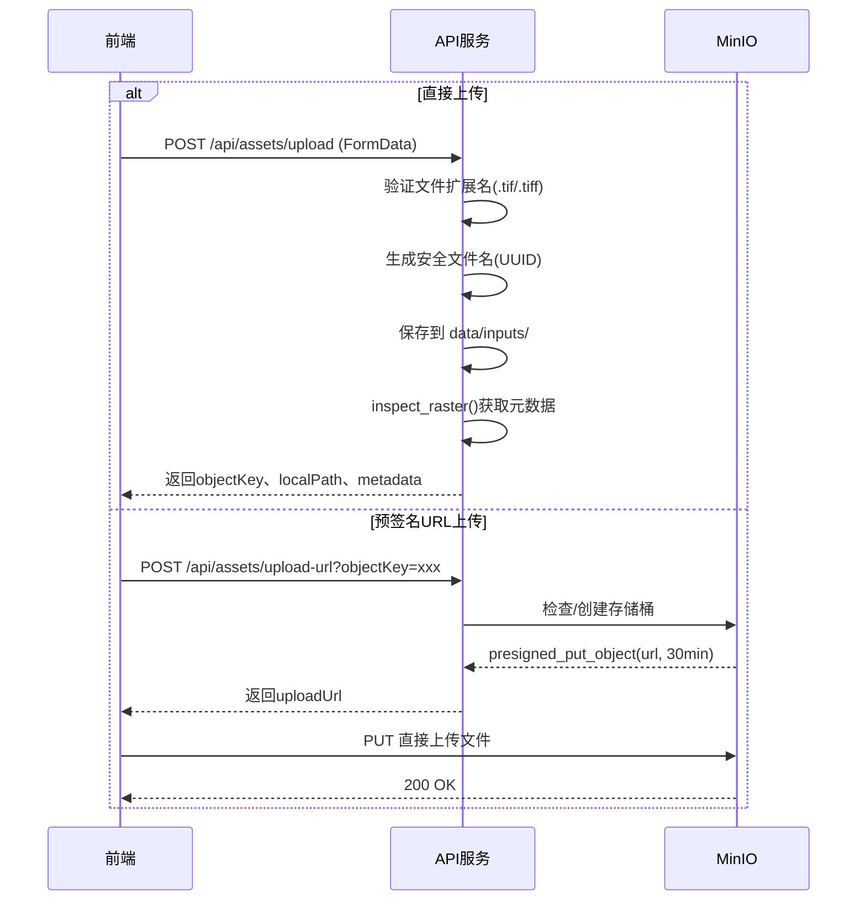
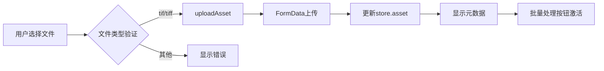

MinIO是植被指数智能分析平台的对象存储层，负责管理遥感影像资产的上传、存储和访问。系统采用**可选启用**的设计模式，在开发环境中可跳过MinIO依赖，在生产环境中则通过MinIO实现分布式存储与资产持久化。

## 架构定位与职责

MinIO在平台中承担**资产管理层**的核心职责，与计算引擎、任务调度系统形成数据流三角关系。前端上传的GeoTIFF影像和后端计算生成的植被指数结果均通过MinIO进行统一管理，确保资产的可追溯性和跨节点共享能力。

```mermaid
graph TB
    subgraph "前端层"
        A[AssetToolbar.vue] -->|FormData上传| B[/api/assets/upload]
        A -->|预签名URL| C[/api/assets/upload-url]
    end
    
    subgraph "API层"
        B --> D[save_uploaded_asset]
        C --> E[create_upload_url]
        F[/processes/{id}/execution] --> G[resolve_source]
    end
    
    subgraph "资产服务层"
        D -->|保存本地| H[data/inputs/]
        E -->|生成URL| I[MinIO]
        G -->|按需下载| I
        H -->|部署模式| I
    end
    
    subgraph "计算流水线"
        J[RasterPipeline] -->|读取| H
        J -->|上传结果| K[upload_artifact]
        K -->|outputs/{jobId}/| I
    end
    
    subgraph "MinIO存储"
        I --> L[vegetation-assets桶]
        L --> M[inputs/ 原始影像]
        L --> N[outputs/ 计算结果]
    end
```

Sources: [assets.py](backend/app/services/assets.py#L1-L116), [routes.py](backend/app/api/routes.py#L1-L100)

## 配置参数详解

MinIO的配置通过环境变量注入，遵循平台统一的`VIP_`前缀命名规范。所有配置项均在`Settings`类中定义，支持`.env`文件和系统环境变量两种配置方式。

| 配置项 | 环境变量 | 默认值 | 说明 |
|--------|----------|--------|------|
| 端点地址 | `VIP_MINIO_ENDPOINT` | `localhost:9000` | MinIO服务地址，容器内为`minio:9000` |
| 访问密钥 | `VIP_MINIO_ACCESS_KEY` | `vegetation` | MinIO Access Key |
| 密钥 | `VIP_MINIO_SECRET_KEY` | `vegetation-secret` | MinIO Secret Key |
| HTTPS | `VIP_MINIO_SECURE` | `false` | 是否启用TLS加密 |
| 存储桶 | `VIP_MINIO_BUCKET` | `vegetation-assets` | 默认存储桶名称 |
| 启用状态 | `VIP_MINIO_ENABLED` | `false` | 是否启用MinIO集成 |

**开发环境与生产环境的配置差异**：开发模式下`VIP_MINIO_ENABLED`默认为`false`，资产仅保存在本地文件系统；生产环境需显式设置为`true`以启用分布式存储。

Sources: [settings.py](backend/app/settings.py#L15-L21), [.env.example](.env.example#L5-L7)

## 核心操作流程

### 资产上传流程

系统提供两种上传机制：**直接上传**和**预签名URL上传**。直接上传适用于小文件，由后端代理存储；预签名URL适用于大文件，前端可直连MinIO上传，减轻后端压力。



**关键实现细节**：`save_uploaded_asset`函数采用流式写入（每次1MB），避免大文件导致内存溢出。文件名使用UUID4十六进制格式，确保唯一性且无路径遍历风险。

Sources: [assets.py](backend/app/services/assets.py#L75-L90), [routes.py](backend/app/api/routes.py#L130-L145)

### 资产解析与下载

当用户通过`objectKey`引用资产时，`resolve_source`函数负责从MinIO下载到本地临时目录。此函数实现了**本地优先**的解析策略：若提供`localPath`则直接使用本地文件，否则从MinIO下载。

```python
def resolve_source(object_key: str | None, local_path: str | None) -> Path:
    if local_path:
        path = Path(local_path).resolve()
        if not path.is_file():
            raise FileNotFoundError(f"本地资产不存在: {path}")
        return path
    if not object_key:
        raise ValueError("缺少资产引用")
    target = (settings.data_dir / "inputs" / Path(object_key).name).resolve()
    # ... 从MinIO下载逻辑
```

**下载目标路径**：所有从MinIO下载的资产统一保存到`data/inputs/`目录，使用原始对象键的文件名部分，保持文件名一致性。

Sources: [assets.py](backend/app/services/assets.py#L32-L55)

### 计算结果上传

植被指数计算完成后，`upload_artifact`函数负责将结果文件上传至MinIO。此函数实现了**条件上传**模式：仅当`VIP_MINIO_ENABLED=true`时执行上传，开发模式下返回`None`，保留本地文件。

```mermaid
graph LR
    A[RasterPipeline.run] --> B[计算完成]
    B --> C{VIP_MINIO_ENABLED?}
    C -->|true| D[upload_artifact]
    C -->|false| E[返回None]
    D --> F[client.fput_object]
    F --> G[outputs/{jobId}/{filename}]
    D --> H[返回objectKey]
```

**存储路径规范**：
- 输入影像：`inputs/{uuid}.tif`
- 输出结果：`outputs/{jobId}/{source_stem}_{index_id}.tif`
- 预览图：`outputs/{jobId}/{source_stem}_{index_id}.png`

Sources: [assets.py](backend/app/services/assets.py#L98-L116), [raster_pipeline.py](backend/app/services/raster_pipeline.py#L215-L230)

## API端点汇总

| 端点 | 方法 | 功能 | 请求参数 | 响应字段 |
|------|------|------|----------|----------|
| `/api/assets/upload` | POST | 直接上传GeoTIFF | `file`: FormData | `objectKey`, `localPath`, `filename`, `size`, `metadata` |
| `/api/assets/upload-url` | POST | 获取预签名URL | `objectKey`: Query | `objectKey`, `uploadUrl` |
| `/api/assets/inspect` | POST | 检查本地影像元数据 | `path`: Body | `width`, `height`, `count`, `dtypes`, `crs`, `bounds` |

**上传端点验证规则**：仅接受`.tif`和`.tiff`扩展名的文件，其他格式返回422错误。

Sources: [routes.py](backend/app/api/routes.py#L125-L150)

## 存储桶结构设计

MinIO存储桶`vegetation-assets`采用扁平化目录结构，通过对象键前缀实现逻辑分组：

```
vegetation-assets/
├── inputs/                          # 用户上传的原始影像
│   ├── 5e195cadf83e430580e17b5e1cc1af45.tif
│   ├── 829bcebdc9fa4366a5bb6fad17c730fd.tif
│   └── ...
└── outputs/                         # 计算结果与预览
    ├── 1eaba5cead9e4c8fadbee474f543bc97/
    │   ├── sample_ndvi.tif
    │   └── sample_ndvi.png
    ├── 21291b0384d04ac4a43844c870afe17c/
    │   ├── sample_evi.tif
    │   └── sample_evi.png
    └── ...
```

**设计优势**：
1. **扁平化**：避免深层嵌套，MinIO性能更优
2. **UUID命名**：防止文件名冲突和路径遍历攻击
3. **作业隔离**：每个计算任务的结果独立存储，便于清理和追溯

Sources: [raster_pipeline.py](backend/app/services/raster_pipeline.py#L200-L230)

## 部署架构

容器化部署中，MinIO作为独立服务运行，通过Docker Compose编排。API服务和Worker服务通过环境变量配置MinIO连接参数，实现配置统一管理。

```mermaid
graph TB
    subgraph "Docker Compose"
        A[api-basic] -->|VIP_MINIO_*| B[MinIO]
        C[api-adjusted] -->|VIP_MINIO_*| B
        D[api-advanced] -->|VIP_MINIO_*| B
        E[worker-numpy] -->|VIP_MINIO_*| B
        F[worker-joblib] -->|VIP_MINIO_*| B
        G[worker-gpu] -->|VIP_MINIO_*| B
    end
    
    subgraph "MinIO服务"
        B --> H[9000: API端口]
        B --> I[9001: 控制台端口]
        B --> J[minio-data卷]
    end
    
    subgraph "健康检查"
        B -->|curl| K[/minio/health/live]
    end
```

**健康检查机制**：MinIO服务配置了健康检查，每10秒检测一次，失败重试10次后标记为不健康。API服务依赖MinIO健康状态启动，确保连接可用。

**卷持久化**：`minio-data`卷挂载到容器的`/data`目录，确保数据持久化。生产环境应使用外部存储或云存储后端。

Sources: [compose.yml](compose.yml#L100-L120)

## 安全与访问控制

### 凭证管理

系统使用Access Key/Secret Key认证模式，凭证通过环境变量注入。开发环境使用默认凭证（`vegetation`/`vegetation-secret`），生产环境必须通过`.env`文件或密钥管理系统配置强凭证。

**安全建议**：
1. 生产环境禁用MinIO控制台端口（9001）的外部访问
2. 使用HTTPS（`VIP_MINIO_SECURE=true`）加密传输
3. 定期轮换Access Key和Secret Key
4. 配置存储桶策略，限制公共访问

### 预签名URL安全

`create_upload_url`函数生成的预签名URL有效期为30分钟，超时自动失效。此机制避免了长期暴露上传接口的安全风险，同时支持前端直传，减轻后端负载。

Sources: [assets.py](backend/app/services/assets.py#L58-L73)

## 前端集成

前端通过`AssetToolbar.vue`组件提供影像上传功能，支持拖拽上传和批量处理。组件调用`usePlatformApi`中的`uploadAsset`方法，该方法使用FormData格式上传文件。



**批量处理流程**：
1. 用户导入多个GeoTIFF文件
2. 系统依次上传并保存到本地目录
3. 用户配置波段映射和指数选择
4. 提交批量任务，系统为每个影像创建独立计算任务

Sources: [AssetToolbar.vue](frontend/src/components/AssetToolbar.vue#L50-L100), [usePlatformApi.ts](frontend/src/composables/usePlatformApi.ts#L30-L40)

## 开发模式与生产模式切换

系统通过`VIP_MINIO_ENABLED`环境变量实现两种运行模式的无缝切换：

| 特性 | 开发模式（enabled=false） | 生产模式（enabled=true） |
|------|---------------------------|--------------------------|
| 资产存储 | 本地文件系统 | MinIO对象存储 |
| 结果上传 | 跳过，返回None | 上传至MinIO |
| 跨节点共享 | 不支持 | 支持 |
| 资产持久化 | 依赖本地卷 | 分布式存储 |
| 依赖要求 | 无需MinIO服务 | 需要MinIO服务运行 |

**切换指南**：从开发模式切换到生产模式时，需确保：
1. MinIO服务已启动并健康
2. 存储桶已创建（系统自动创建）
3. 环境变量配置正确
4. 已有资产需手动迁移或重新上传

Sources: [assets.py](backend/app/services/assets.py#L98-L105), [settings.py](backend/app/settings.py#L20)

## 故障排查

| 错误场景 | 可能原因 | 解决方案 |
|----------|----------|----------|
| `无法从MinIO取得对象` | MinIO服务不可用或凭证错误 | 检查MinIO服务状态和环境变量配置 |
| `MinIO不可用` | 服务未启动或网络不通 | 验证`minio:9000`连通性 |
| `仅支持GeoTIFF文件` | 上传文件扩展名不是.tif/.tiff | 转换文件格式或修改文件名 |
| 存储桶不存在 | 首次运行或存储桶被删除 | 系统会自动创建，无需手动干预 |
| 预签名URL过期 | 超过30分钟有效期 | 重新请求预签名URL |

**调试技巧**：使用MinIO控制台（端口9001）可直观查看存储桶内容、对象元数据和访问日志。开发环境可通过`MINIO_ROOT_USER`和`MINIO_ROOT_PASSWORD`环境变量自定义控制台凭证。

Sources: [assets.py](backend/app/services/assets.py#L40-L55), [compose.yml](compose.yml#L105-L115)

## 下一步

完成MinIO对象存储的学习后，建议继续探索以下相关主题：

- [PostgreSQL持久化](30-postgresqlchi-jiu-hua) - 了解自定义植被指数和智能体会话的持久化方案
- [资产管理系统](28-zi-chan-guan-li-xi-tong) - 深入理解资产的全生命周期管理
- [任务调度系统](16-ren-wu-diao-du-xi-tong) - 学习异步任务如何触发资产上传
- [容器化部署](5-rong-qi-hua-bu-shu) - 了解完整的Docker Compose部署架构