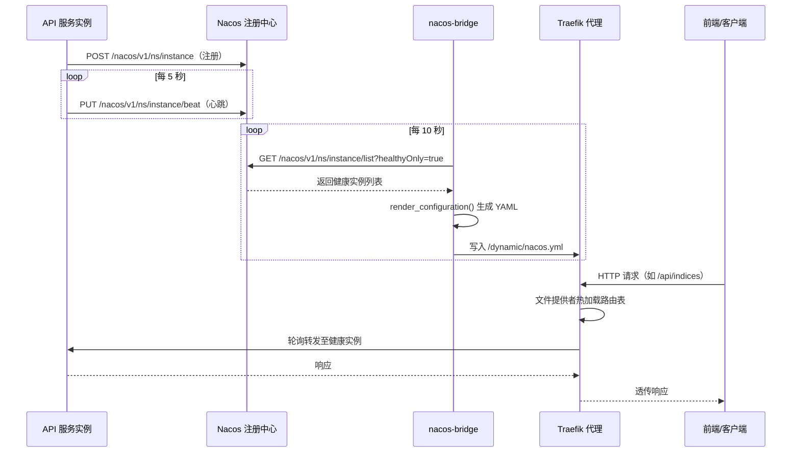
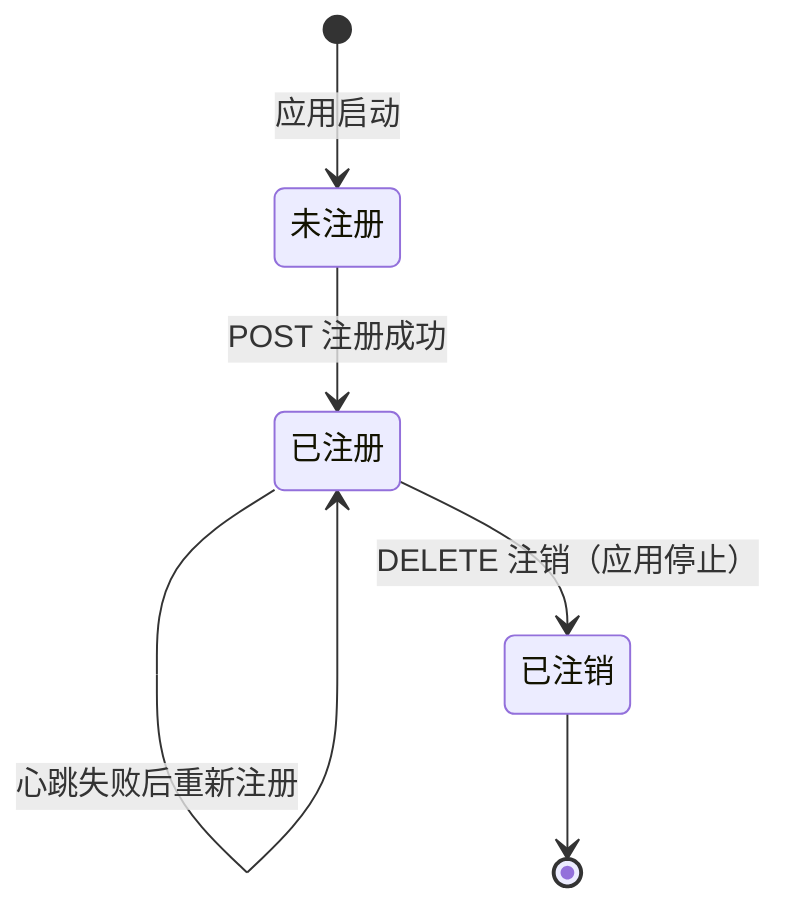
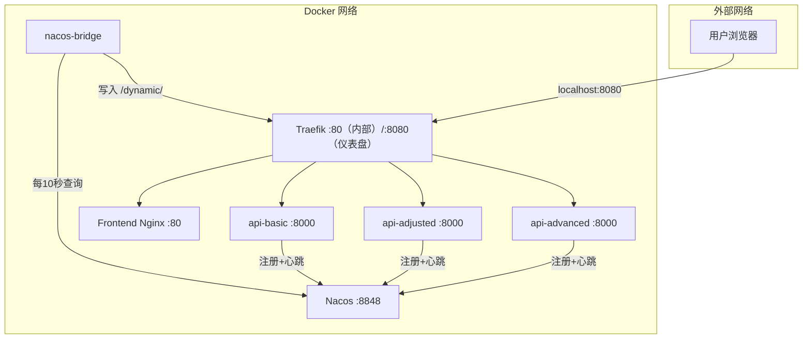
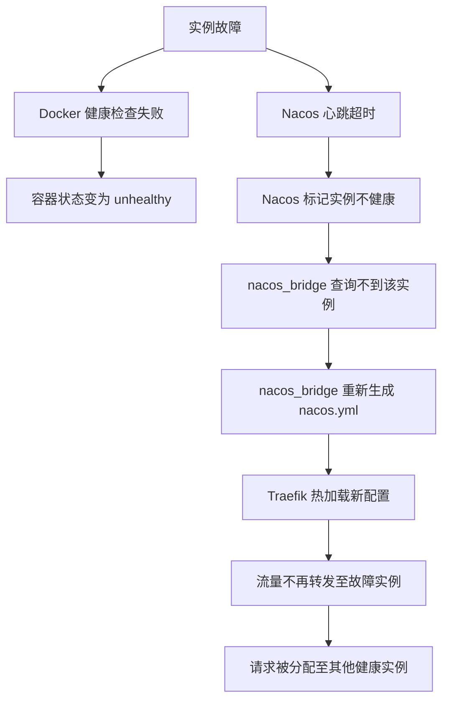

本文档详述植被指数智能分析平台的服务发现与负载均衡架构。平台采用 **Nacos + nacos-bridge + Traefik** 三层联动方案：Nacos 负责服务实例注册与健康探测，nacos-bridge 桥接器定时将 Nacos 实例列表转换为 Traefik 文件配置，Traefik 作为统一入口反向代理并将请求负载均衡分发至后端多个 API 实例。该架构实现了**服务实例的自动发现、健康感知路由与水平弹性扩展**。

Sources: [compose.yml](compose.yml#L1-L192), [nacos_bridge.py](backend/app/nacos_bridge.py#L1-L82), [nacos.py](backend/app/services/nacos.py#L1-L87)

## 架构总览

平台的服务发现与负载均衡体系由四个核心组件协作完成：

| 组件 | 角色 | 运行方式 | 关键配置 |
|------|------|----------|----------|
| **Nacos** | 服务注册中心 | Docker 单机模式 | `nacos/nacos-server:v2.4.3`，无需认证 |
| **API 服务实例** | 服务提供者 | `nacos.py` 心跳线程 | 每 5 秒发送心跳，主动注册/注销 |
| **nacos-bridge** | 配置转换器 | 独立容器，每 10 秒同步 | 读 Nacos 实例列表 → 写 Traefik 动态配置 |
| **Traefik** | 反向代理/负载均衡 | Docker，文件提供者模式 | 监视 `/dynamic` 目录，热加载路由配置 |

以下 Mermaid 序列图展示了完整的请求路由与服务发现数据流：



Sources: [compose.yml](compose.yml#L90-L116), [nacos_bridge.py](backend/app/nacos_bridge.py#L1-L82), [nacos.py](backend/app/services/nacos.py#L1-L87)

## 服务发现机制

### Nacos 注册流程

每个 API 服务实例在 FastAPI 应用的 `lifespan` 生命周期中完成向 Nacos 的注册与注销。核心实现位于 `NacosRegistration` 类。

**启动阶段**：当 FastAPI 应用启动时，`nacos_registration.start()` 被调用。该方法首先向 Nacos 发送 `POST /nacos/v1/ns/instance` 注册请求，随后创建一个后台异步任务持续发送心跳。

**心跳维持**：后台任务每 5 秒向 Nacos 发送 `PUT /nacos/v1/ns/instance/beat` 心跳请求。心跳报文中包含实例的 IP、端口和服务名。如果心跳发送失败，会自动触发重新注册。

**优雅退出**：当 FastAPI 应用停止时，`nacos_registration.stop()` 先取消心跳任务，再向 Nacos 发送 `DELETE /nacos/v1/ns/instance` 注销请求，确保实例不会在注册中心残留。



Sources: [nacos.py](backend/app/services/nacos.py#L17-L43), [main.py](backend/app/main.py#L21-L33)

### 实例参数解析

注册时的实例 IP 通过 `socket.gethostbyname(settings.service_host)` 解析。`service_host` 对应 Docker Compose 中的服务名称（如 `api-basic`），在容器网络中会被解析为容器内部 IP。如果 DNS 解析失败，则直接使用 `service_host` 字符串作为回退。

每个 API 服务实例通过环境变量区分身份：

| 环境变量 | 说明 | 示例值 |
|----------|------|--------|
| `VIP_SERVICE_NAME` | 注册到 Nacos 的服务名 | `vegetation-basic` |
| `VIP_SERVICE_HOST` | 容器主机名 | `api-basic` |
| `VIP_SERVICE_PORT` | 服务监听端口 | `8000`（默认值） |
| `VIP_NACOS_URL` | Nacos 地址 | `http://nacos:8848` |

当 `VIP_NACOS_URL` 未设置时，注册逻辑会被跳过，服务可独立运行（适用于本地开发场景）。

Sources: [nacos.py](backend/app/services/nacos.py#L65-L87), [settings.py](backend/app/settings.py#L24-L29), [compose.yml](compose.yml#L37-L60)

## 负载均衡机制

### Traefik 路由体系

Traefik 在本平台中采用**双提供者模式**，同时使用 Docker 标签和文件配置两种方式管理路由：

**Docker 提供者**：用于静态路由定义。`frontend` 和 `api-basic` 两个服务通过 Docker 标签声明了固定的路由规则——`frontend` 匹配 `PathPrefix(/)`（优先级 1），`api-basic` 匹配 `/api`、`/jobs`、`/processes`、`/artifacts`、`/metrics` 路径（优先级 100）。

**文件提供者**：用于动态服务发现路由。`nacos-bridge` 生成的 `/dynamic/nacos.yml` 为 `basic`、`adjusted`、`advanced` 三个服务分别配置了路由规则，并通过 `stripPrefix` 中间件剥离服务前缀。

```mermaid
flowchart LR
    Client[客户端请求] --> Traefik[Traefik :80]
    
    subgraph 静态路由（Docker标签）
        Traefik -->|PathPrefix /| Frontend[前端 Nginx :80]
        Traefik -->|PathPrefix /api 等| APIBasic[api-basic :8000]
    end
    
    subgraph 动态路由（文件提供者 nacos.yml）
        Traefik -->|PathPrefix /api/basic| Basic[vegetation-basic 实例组]
        Traefik -->|PathPrefix /api/adjusted| Adjusted[vegetation-adjusted 实例组]
        Traefik -->|PathPrefix /api/advanced| Advanced[vegetation-advanced 实例组]
    end
```

Sources: [traefik.yml](infra/traefik/traefik.yml#L1-L19), [compose.yml](compose.yml#L29-L60), [nacos_bridge.py](backend/app/nacos_bridge.py#L44-L82)

### nacos-bridge 配置生成

`nacos-bridge` 是整个服务发现体系的关键枢纽。它是一个独立运行的 Python 容器，每 10 秒执行一次同步循环：

**实例收集**：遍历三个服务名（`vegetation-basic`、`vegetation-adjusted`、`vegetation-advanced`），分别向 Nacos 查询健康实例列表。查询条件为 `healthyOnly=true`，只返回健康且启用的实例。

**配置渲染**：将查询结果转换为 Traefik 文件提供者格式的 YAML 配置。每个服务对应一个路由规则和一个负载均衡服务定义。当 Nacos 中没有可用实例时，使用回退地址 `http://api-{router_name}:8000`（即 Docker Compose 中的默认容器地址）。

**原子写入**：生成的配置先写入临时文件（`.tmp` 后缀），再通过 `Path.replace()` 原子替换目标文件，避免 Traefik 读取到不完整的中间状态。

生成的动态配置结构如下：

```yaml
http:
  routers:
    basic:
      rule: "PathPrefix(`/api/basic`)"
      service: basic
      middlewares:
        - strip-service-prefix
    adjusted:
      rule: "PathPrefix(`/api/adjusted`)"
      service: adjusted
      middlewares:
        - strip-service-prefix
    advanced:
      rule: "PathPrefix(`/api/advanced`)"
      service: advanced
      middlewares:
        - strip-service-prefix
  middlewares:
    strip-service-prefix:
      stripPrefix:
        prefixes:
          - /api/basic
          - /api/adjusted
          - /api/advanced
  services:
    basic:
      loadBalancer:
        servers:
          - url: "http://172.18.0.5:8000"
          # 更多实例...
```

Sources: [nacos_bridge.py](backend/app/nacos_bridge.py#L22-L82)

### 前端请求代理

前端 Nginx 将以 `/api`、`/jobs`、`/processes`、`/artifacts`、`/metrics` 开头的请求代理至 `traefik:80`，由 Traefik 根据路由规则决定转发目标。前端自身的路由（`/`）也通过 Traefik 分发，优先级最低（1），确保 API 路由优先匹配。

| 请求路径 | Traefik 路由 | 目标服务 | 优先级 |
|----------|-------------|----------|--------|
| `/api/indices` 等 | Docker 标签 | api-basic | 100 |
| `/api/basic/*` | nacos.yml | vegetation-basic 实例组 | 默认 |
| `/api/adjusted/*` | nacos.yml | vegetation-adjusted 实例组 | 默认 |
| `/api/advanced/*` | nacos.yml | vegetation-advanced 实例组 | 默认 |
| `/*`（静态资源） | Docker 标签 | frontend Nginx | 1 |

Sources: [nginx.conf](frontend/nginx.conf#L1-L17), [compose.yml](compose.yml#L29-L46)

## 网络与端口规划



宿主机端口映射：

| 宿主机端口 | 容器 | 用途 |
|-----------|------|------|
| `8080` | Traefik :80 | HTTP 流量入口 |
| `8081` | Traefik :8080 | Traefik 仪表盘（调试用） |
| `8848` | Nacos :8848 | Nacos 控制台 |
| `9848` | Nacos :9848 | Nacos gRPC 通信 |
| `9000` | MinIO :9000 | 对象存储 API |
| `9001` | MinIO :9001 | MinIO 控制台 |

Sources: [compose.yml](compose.yml#L22-L28), [compose.yml](compose.yml#L130-L175)

## 健康检查与容错

### 多层健康检查

平台实现了从容器到应用的多层健康检查机制：

**容器层**：每个 API 服务实例配置了 Docker 健康检查，通过 Python urllib 访问 `http://localhost:8000/health` 端点。检测间隔 15 秒，超时 5 秒，连续 5 次失败标记为不健康。

**服务发现层**：Nacos 维护实例的健康状态。`nacos_bridge` 在查询时设置 `healthyOnly=true`，确保只有通过心跳的实例会被写入 Traefik 路由配置。

**代理层**：Traefik 的文件提供者配置了 `watch: true`，可以实时感知 `nacos.yml` 的变化并热加载，无需重启。

### 故障容错

当某个 API 实例出现故障时，容错链路如下：



**回退机制**：当所有实例都不可用时，`nacos_bridge` 会回退到 Docker Compose 服务名（如 `http://api-basic:8000`），确保至少有一个可达的后端地址。

**优雅退出**：服务实例在停止前会主动向 Nacos 注销，避免在路由表中残留不可达的实例。

Sources: [compose.yml](compose.yml#L30-L35), [nacos_bridge.py](backend/app/nacos_bridge.py#L70-L76), [nacos.py](backend/app/services/nacos.py#L33-L43)

## 配置参考

### 静态配置（traefik.yml）

```yaml
api:
  dashboard: true          # 启用仪表盘（调试）
  insecure: true           # 仪表盘无需认证

entryPoints:
  web:
    address: ":80"         # HTTP 入口

providers:
  docker:
    exposedByDefault: false  # 容器默认不暴露，需显式设置标签
  file:
    directory: /dynamic      # 动态配置目录
    watch: true              # 文件变化时热加载

accessLog: {}
log:
  level: INFO
```

Sources: [traefik.yml](infra/traefik/traefik.yml#L1-L19)

### 环境变量

| 变量 | 说明 | 默认值 | 设置位置 |
|------|------|--------|----------|
| `VIP_NACOS_URL` | Nacos 服务器地址 | `http://nacos:8848` | compose.yml |
| `VIP_SERVICE_NAME` | Nacos 注册服务名 | `vegetation-basic` | compose.yml |
| `VIP_SERVICE_HOST` | 容器主机名 | `api-basic` | compose.yml |
| `VIP_SERVICE_PORT` | 服务端口 | `8000` | settings.py |
| `TRAEFIK_DYNAMIC_PATH` | 动态配置写入路径 | `/dynamic/nacos.yml` | compose.yml |

Sources: [settings.py](backend/app/settings.py#L24-L29), [compose.yml](compose.yml#L118-L125)

## 水平扩展指南

### 增加 API 实例

通过 `docker compose up --scale` 命令即可实现水平扩展。由于 nacos_bridge 会自动从 Nacos 获取所有健康实例，新实例注册后会自动出现在 Traefik 的负载均衡列表中：

```bash
# 扩展 api-basic 到 3 个实例
docker compose up -d --scale api-basic=3
```

> **注意**：Docker Compose 的 `scale` 不会影响已声明 `labels` 的服务标签路由，但 nacos-bridge 会发现新增实例并通过动态配置实现负载均衡。

### Worker 扩展

平台已预置三种 Worker 类型以匹配不同计算需求：

| Worker | 队列 | 并发数 | 适用场景 |
|--------|------|--------|----------|
| `worker-numpy` | normal, low, batch | 1 | 通用 NumPy 计算 |
| `worker-joblib` | urgent, high, normal | 2 | 高优先级并行计算 |
| `worker-gpu` | 全部 | 1 | GPU 加速计算 |

Sources: [compose.yml](compose.yml#L63-L116)

## 监控与调试

### Traefik 仪表盘

Traefik 仪表盘可通过 `http://localhost:8081` 访问（已设置 `insecure: true`，无需认证）。仪表盘提供以下可观测信息：

- **路由列表**：查看所有生效的路由规则及其优先级
- **服务状态**：查看每个服务的后端实例列表和健康状态
- **中间件**：查看 `strip-service-prefix` 等中间件配置
- **入口点**：查看 `web` 入口点的连接统计

### Nacos 控制台

Nacos 控制台可通过 `http://localhost:8848/nacos` 访问。在"服务管理"页面可以看到：

- 已注册的服务列表及其实例数
- 每个实例的健康状态、IP、端口
- 元数据信息

Sources: [traefik.yml](infra/traefik/traefik.yml#L2-L4), [compose.yml](compose.yml#L22-L28), [compose.yml](compose.yml#L130-L138)

## 下一步

- 了解平台的完整部署流程，请参阅 [容器化部署](5-rong-qi-hua-bu-shu)
- 了解后端服务的内部架构，请参阅 [后端架构](10-hou-duan-jia-gou)
- 了解任务调度与 Worker 协作机制，请参阅 [任务调度系统](16-ren-wu-diao-du-xi-tong)
- 了解性能测试方法，请参阅 [性能基准测试](32-xing-neng-ji-zhun-ce-shi)
- 遇到服务发现相关问题，请参阅 [故障排查](36-gu-zhang-pai-cha)