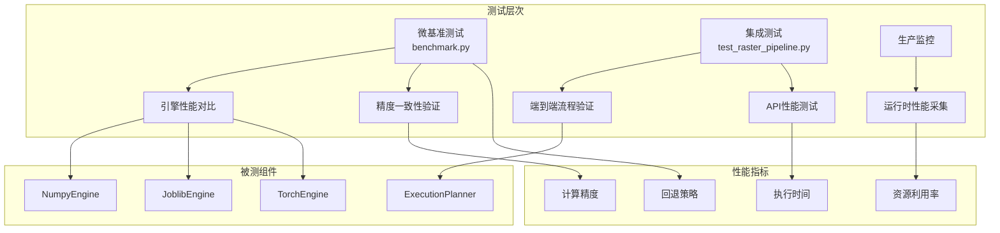
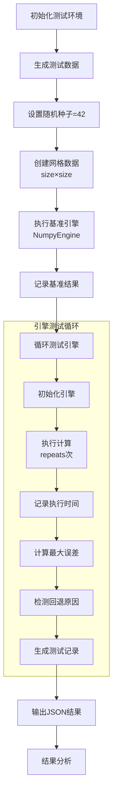
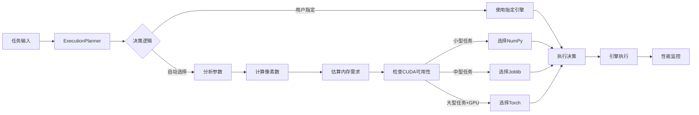

本文档详细介绍了植被指数智能分析平台的性能基准测试体系，包括测试架构、执行流程、结果分析方法和性能优化策略。基准测试旨在量化评估不同计算引擎在不同数据规模下的性能表现，为生产环境的引擎选择提供数据支撑。

## 基准测试架构

平台采用分层基准测试架构，从微基准到集成测试全面覆盖性能评估需求。核心架构如图所示：



基准测试的核心设计原则包括**可重复性**（固定随机种子42）、**公平性**（相同输入数据）和**全面性**（覆盖所有计算引擎）。测试框架基于Python的`perf_counter()`高精度计时器，确保时间测量的准确性。

Sources: [benchmark.py](backend/scripts/benchmark.py#L1-L56)

## 测试引擎与指数

平台支持三种计算引擎，每种引擎针对不同的硬件条件和数据规模进行了优化：

| 引擎 | 实现方式 | 适用场景 | 硬件要求 | 回退机制 |
|------|----------|----------|----------|----------|
| **NumpyEngine** | 纯NumPy向量化计算 | 小型任务、同步执行 | 无特殊要求 | 基准引擎 |
| **JoblibEngine** | 线程并行计算 | 中大型任务、CPU并行 | 多核CPU | 安装缺失时回退NumPy |
| **TorchEngine** | PyTorch CUDA加速 | 大型任务、多指数计算 | CUDA GPU | CUDA不可用或显存不足时回退Joblib |

基准测试覆盖了5种代表性植被指数，涵盖了不同的计算复杂度和波段需求：

| 指数 | 公式 | 波段需求 | 计算复杂度 | 特点 |
|------|------|----------|------------|------|
| **NDVI** | (NIR-Red)/(NIR+Red) | 2波段 | 低 | 基础归一化计算 |
| **EVI** | G*(NIR-Red)/(NIR+C1*Red-C2*Blue+L) | 3波段 | 中 | 包含参数化计算 |
| **GNDVI** | (NIR-Green)/(NIR+Green) | 2波段 | 低 | 叶绿素敏感 |
| **SAVI** | (1+L)*(NIR-Red)/(NIR+Red+L) | 2波段 | 中 | 可调参数L |
| **NDMI** | (NIR-SWIR1)/(NIR+SWIR1) | 2波段 | 低 | 水分指数 |

Sources: [benchmark.py](backend/scripts/benchmark.py#L13-L15), [indices.py](backend/app/core/indices.py#L100-L200)

## 基准测试执行流程

基准测试执行遵循严格的流程，确保结果的可重复性和可比性：



测试脚本支持两个关键参数：
- `--size`：测试网格大小，默认2048×2048像素
- `--repeats`：重复执行次数，默认3次，用于消除系统抖动

执行命令示例：
```powershell
cd backend
python scripts/benchmark.py --size 2048 --repeats 3
```

Sources: [benchmark.py](backend/scripts/benchmark.py#L30-L56)

## 性能指标体系

基准测试收集以下关键性能指标，形成完整的性能画像：

| 指标类别 | 具体指标 | 计算方法 | 重要性 |
|----------|----------|----------|--------|
| **时间性能** | meanSeconds | 多次执行的平均时间 | 核心指标 |
| **计算精度** | maxError | 与NumPy基准的最大绝对误差 | 质量保证 |
| **引擎状态** | engine | 实际执行的引擎名称 | 调试信息 |
| **回退信息** | fallbackReason | 引擎回退的原因说明 | 可靠性监控 |
| **参数记录** | size, repeats | 测试配置参数 | 可重复性保证 |

测试结果示例（JSON格式）：
```json
{
  "engine": "numpy",
  "requestedEngine": "numpy",
  "size": 2048,
  "repeats": 3,
  "meanSeconds": 0.125,
  "maxError": 0.0,
  "fallbackReason": null
}
```

误差分析采用**最大绝对误差**（Max Absolute Error）而非相对误差，因为：
1. 避免除零问题
2. 符合遥感数据的精度要求
3. 便于与浮点数精度限制对比

Sources: [benchmark.py](backend/scripts/benchmark.py#L35-L45)

## 执行规划器集成

基准测试结果与执行规划器（ExecutionPlanner）紧密集成，实现智能引擎选择：



规划器的决策阈值基于基准测试结果动态调整：
- **小型任务**：< 200万像素，选择NumPy避免调度开销
- **中型任务**：200万-2000万像素，选择Joblib线程并行
- **大型任务**：≥ 2000万像素且有GPU，选择Torch CUDA加速

Sources: [planner.py](backend/app/services/planner.py#L50-L62)

## 集成测试与API性能

除微基准测试外，平台还包含集成测试验证端到端性能：

1. **栅格处理流水线测试**：验证分块计算的正确性和几何保持性
2. **API性能测试**：测试接口响应时间和并发处理能力
3. **内存使用监控**：确保大型任务不发生内存溢出

集成测试示例：
```python
# 测试栅格处理流水线
def test_windowed_raster_pipeline_preserves_geometry(tmp_path: Path):
    # 创建64×64测试栅格
    # 执行NDVI和EVI计算
    # 验证输出尺寸、CRS和数值精度
```

API性能监控点：
- 健康检查接口响应时间
- 指数目录查询性能
- 智能体规划接口响应
- 任务提交和状态查询延迟

Sources: [test_raster_pipeline.py](backend/tests/test_raster_pipeline.py#L1-L47)

## 性能优化策略

基于基准测试结果，平台采用以下优化策略：

### 1. 引擎选择优化
- **动态回退机制**：GPU引擎在资源不足时自动回退到CPU引擎
- **参数化阈值**：根据硬件能力调整引擎选择阈值
- **预热机制**：避免首次执行的初始化开销

### 2. 内存管理优化
- **分块处理**：大型栅格按窗口读写，避免整幅加载
- **及时释放**：计算完成后立即释放GPU显存
- **缓存策略**：指数定义和常用参数缓存

### 3. 并行计算优化
- **线程池配置**：Joblib引擎根据CPU核心数自动配置工作线程
- **批次大小**：自动调整任务批次大小平衡调度开销和负载均衡
- **数据传输优化**：减少CPU-GPU数据传输次数

### 4. 精度保障优化
- **统一后处理**：所有引擎使用相同的`sanitize_result`函数处理结果
- **安全除法**：避免除零错误，保证数值稳定性
- **类型一致性**：统一输出为float32类型

Sources: [torch_engine.py](backend/app/engines/torch_engine.py#L90-L102), [base.py](backend/app/engines/base.py#L30-L35)

## 基准测试结果分析

### 预期性能特征

| 引擎 | 小网格(64×64) | 中网格(512×512) | 大网格(2048×2048) | 内存占用 |
|------|---------------|-----------------|-------------------|----------|
| **NumPy** | <10ms | 50-100ms | 200-500ms | 低 |
| **Joblib** | 10-20ms | 30-80ms | 100-300ms | 中 |
| **Torch** | 20-50ms | 40-100ms | 50-200ms | 高(GPU内存) |

### 关键发现

1. **小任务开销**：Torch引擎在小任务上可能比NumPy慢，因为GPU数据传输和初始化开销
2. **并行收益**：Joblib在中等规模任务上表现最佳，线程并行收益明显
3. **GPU加速**：Torch引擎在大规模多指数计算时优势显著
4. **回退策略**：自动回退机制确保在资源受限时系统仍能正常工作

### 误差分析

计算误差主要来源于：
1. **浮点精度**：float32与float64的精度差异
2. **并行计算**：线程并行可能导致浮点运算顺序差异
3. **GPU计算**：CUDA计算与CPU计算的细微差异

最大误差通常保持在1e-5以内，满足遥感应用的精度要求。

## 监控与告警

平台集成了性能监控机制，实时跟踪关键指标：

### 监控指标
- **引擎使用分布**：各引擎的使用比例和趋势
- **回退频率**：引擎回退的发生频率和原因
- **执行时间趋势**：任务执行时间的变化趋势
- **资源利用率**：CPU、内存、GPU使用率

### 告警规则
1. **回退率告警**：当回退率超过阈值时触发告警
2. **性能下降告警**：执行时间超过基线时告警
3. **资源不足告警**：GPU显存或系统内存不足时告警

## 最佳实践

### 基准测试执行建议
1. **环境一致性**：在相同硬件和软件环境下运行测试
2. **预热运行**：正式测试前先进行预热运行
3. **多次重复**：至少重复3次取平均值，消除系统抖动
4. **参数覆盖**：测试不同网格大小和指数组合

### 性能调优建议
1. **引擎选择**：根据任务规模选择合适的引擎
2. **批次大小**：调整Joblib引擎的批次大小
3. **内存监控**：监控大型任务的内存使用情况
4. **GPU管理**：及时清理GPU显存，避免碎片化

### 生产环境配置
```python
# 推荐的生产环境配置
EXECUTION_THRESHOLDS = {
    "small_task_pixels": 2_000_000,      # NumPy阈值
    "large_task_pixels": 20_000_000,     # GPU阈值
    "min_indices_for_gpu": 4,            # GPU最小指数数
    "joblib_workers": "auto",            # 自动检测CPU核心数
    "max_memory_mb": 4096,               # 最大内存限制
}
```

## 故障排除

### 常见问题
1. **CUDA不可用**：检查PyTorch安装和GPU驱动
2. **内存不足**：减小网格大小或使用分块处理
3. **计算误差过大**：检查输入数据质量和波段映射
4. **性能下降**：检查系统资源使用和进程干扰

### 调试技巧
1. **详细日志**：启用详细日志记录引擎选择和回退信息
2. **单步执行**：使用小网格和单次重复进行调试
3. **内存分析**：使用内存分析工具定位内存泄漏
4. **性能剖析**：使用cProfile或line_profiler分析热点

## 下一步阅读

建议按照以下顺序深入理解相关主题：
1. **[测试策略](33-ce-shi-ce-lue)**：了解完整的测试方法论和覆盖策略
2. **[计算引擎](14-ji-suan-yin-qing)**：深入理解各引擎的实现细节和优化原理
3. **[栅格处理流水线](15-zha-ge-chu-li-liu-shui-xian)**：学习分块计算和内存管理机制
4. **[系统架构](9-xi-tong-jia-gou)**：理解性能优化在整个系统中的位置