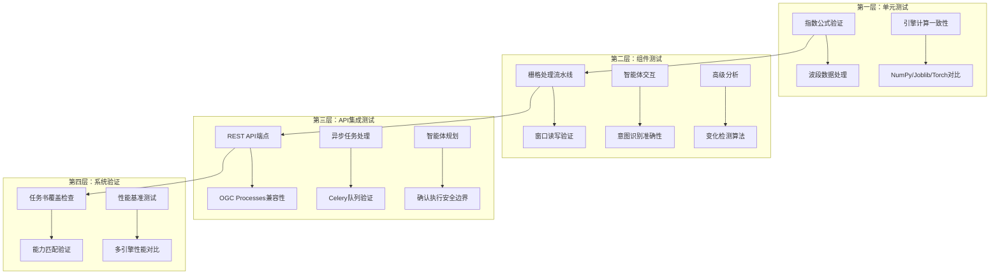

本文档详细阐述植被指数智能分析平台的测试策略体系，涵盖后端功能测试、智能体安全验证、多引擎一致性保障、性能基准测试以及前端质量保证机制。平台采用分层测试方法，确保算法正确性、API兼容性和系统可靠性。

## 测试框架与基础设施

平台采用 **pytest** 作为后端测试框架，配合 **pytest-asyncio** 处理异步测试场景。测试配置集中在 `backend/pyproject.toml` 文件中，指定 Python 路径和测试目录。

测试基础设施的核心是共享 fixtures，特别是 `conftest.py` 中定义的 `sample_raster` fixture。该 fixture 生成包含 Blue、Green、Red、NIR 四波段的测试 GeoTIFF 文件，尺寸为 96×64 像素，数据类型为 float32，坐标系为 EPSG:4326，nodata 值为 -9999。这个标准化的测试数据源被多个测试模块复用，确保了测试环境的一致性。

Sources: [pyproject.toml](backend/pyproject.toml#L39-L42), [conftest.py](backend/tests/conftest.py#L9-L28)

## 测试层次结构

平台采用四层测试结构，从单元测试到系统集成测试逐层递进：

Sources: [test_indices.py](backend/tests/test_indices.py), [test_raster_pipeline.py](backend/tests/test_raster_pipeline.py), [test_api.py](backend/tests/test_api.py), [benchmark.py](backend/scripts/benchmark.py)

## 指数计算测试

指数计算测试是平台测试的核心，确保30种植被指数的数学正确性和引擎间一致性。测试模块 `test_indices.py` 验证以下关键方面：

**注册表完整性**：检查 `INDEX_REGISTRY` 包含恰好30个指数定义，并验证核心指数（ndvi、osavi、gndvi、evi、ndre、ndmi）的存在性。

**公式准确性**：以 NDVI 为例，测试手动计算 `(nir - red) / (nir + red)` 的结果与引擎计算结果的数值精度，使用 `np.testing.assert_allclose` 确保相对误差小于 1e-6。

**多引擎一致性**：通过比较 NumpyEngine、JoblibEngine 和 TorchEngine 的计算结果，确保不同计算后端产生数值一致的结果。测试中使用随机生成的波段数据，避免测试数据特殊性导致的通过假象。

Sources: [test_indices.py](backend/tests/test_indices.py#L19-L27), [test_indices.py](backend/tests/test_indices.py#L38-L43)

## 智能体安全测试

智能体测试模块 `test_agent.py` 重点验证平台的核心安全原则：**用户确认前绝不自动执行**。测试覆盖以下关键场景：

**意图识别准确性**：验证智能体能正确识别用户意图（如"长势分析"对应 growth 意图），并推荐适当的指数组合（ndvi、evi、gndvi）。

**波段依赖检查**：当用户可用波段不完整时，智能体应排除需要缺失波段的指数，并在推荐中明确标注 `missingBands` 信息。

**确认机制强制**：所有规划结果必须设置 `requiresConfirmation: true` 和 `status: "awaiting_confirmation"`，且不应包含 `jobId`（表示尚未提交任务）。

**知识检索集成**：测试智能体能正确使用导入的知识文档，并在 `knowledgeHits` 中体现来源。

Sources: [test_agent.py](backend/tests/test_agent.py#L10-L24), [test_agent.py](backend/tests/test_agent.py#L27-L35)

## 栅格处理流水线测试

栅格处理流水线测试验证 GeoTIFF 文件的窗口读写和元数据保持能力。测试使用 `RasterPipeline` 和 `RasterTask` 类处理测试数据，验证以下关键属性：

**几何保持**：输出文件的尺寸（64×64）、坐标系（EPSG:4326）必须与输入一致。

**数据类型保持**：输出波段数据类型必须为 float32，确保数值精度。

**引擎选择验证**：测试验证系统能正确选择指定的计算引擎（numpy），并在 `actualEngine` 字段中反映实际使用的引擎。

**数值精度**：使用 `np.testing.assert_allclose` 验证计算结果与预期值（0.4）的绝对误差小于 1e-5。

Sources: [test_raster_pipeline.py](backend/tests/test_raster_pipeline.py#L28-L46)

## API 集成测试

API 测试模块 `test_api.py` 采用 FastAPI 的 `TestClient` 进行端到端测试，覆盖所有主要接口和业务流程：

**健康检查与索引目录**：验证 `/health` 端点返回健康状态，`/api/indices` 端点返回30个指数定义。

**OGC 兼容性**：验证 `/processes` 端点返回30个处理过程，符合 OGC API - Processes 规范。

**智能体安全边界**：测试 `/api/agent/plan` 端点返回的规划方案必须包含确认机制（`requiresConfirmation: true`），且默认不启用网络搜索（`enableWebSearch: false`）。

**异步任务处理**：通过添加 `Prefer: respond-async` 请求头，测试异步执行流程，验证任务创建、状态轮询和结果获取的完整生命周期。

**错误处理**：验证系统对无效输入（缺失文件、错误波段号）的拒绝能力，并返回有意义的错误信息（如"波段号超出影像范围"）。

Sources: [test_api.py](backend/tests/test_api.py#L10-L18), [test_api.py](backend/tests/test_api.py#L27-L42), [test_api.py](backend/tests/test_api.py#L167-L186)

## 高级分析测试

高级分析测试模块 `test_advanced_analysis.py` 验证平台的高级功能：

**自定义公式验证**：测试表达式解析器能正确识别波段引用（如 `nir`、`red`）和数学运算符（如 `(nir-red)/(nir+red)`），并拒绝不安全的属性访问（如 `nir.__class__`）。

**变化检测与区域统计**：测试完整的业务流程：创建前后两期影像 → 执行变化检测 → 计算区域统计。验证输出文件存在、变化类别统计正确、区域统计中的有效像素计数与预期一致。

Sources: [test_advanced_analysis.py](backend/tests/test_advanced_analysis.py#L15-L25), [test_advanced_analysis.py](backend/tests/test_advanced_analysis.py#L28-L30)

## 性能基准测试

平台提供专门的基准测试脚本 `benchmark.py`，用于评估不同计算引擎在不同数据规模下的性能表现：

**测试参数**：支持命令行参数指定数据尺寸（默认2048×2048）和重复次数（默认3次）。

**引擎对比**：在相同数据集上运行 NumpyEngine、JoblibEngine 和 TorchEngine，测量平均执行时间。

**精度验证**：以 NumpyEngine 结果为基准，计算其他引擎的最大绝对误差，确保计算一致性。

**回退原因记录**：当 PyTorch 引擎因 CUDA 不可用而回退到 CPU 时，记录回退原因。

**使用方式**：通过 `python scripts/benchmark.py --size 2048 --repeats 3` 命令运行，结果以 JSON 格式输出，便于后续分析和记录。

Sources: [benchmark.py](backend/scripts/benchmark.py#L17-L47)

## 任务书覆盖验证

平台包含专门的端点 `/api/system/taskbook-coverage` 和 `/api/system/capabilities`，用于验证系统实现与实习任务书要求的一致性：

**能力匹配检查**：验证系统索引数量（≥30）、计算引擎列表（numpy/joblib/torch）、异步任务支持、对象存储类型（minio）等是否符合任务书要求。

**覆盖完整性**：检查任务书中的所有要求项是否都已实现，确保 `missing` 计数为0，`covered` 计数≥25。

这种设计体现了平台对需求追踪的重视，确保了开发过程的可审计性。

Sources: [test_api.py](backend/tests/test_api.py#L203-L220)

## 代码质量保障

平台采用 **Ruff** 作为代码质量工具，配置在 `pyproject.toml` 中：

**检查规则**：启用 E（pycodestyle 错误）、F（Pyflakes）、I（isort 导入排序）、UP（pyupgrade）、B（flake8-bugbear）等规则集。

**行长度限制**：设置为100字符，平衡代码可读性和屏幕空间利用。

**目标版本**：针对 Python 3.11，使用现代语法特性。

**运行方式**：通过 `ruff check .` 命令检查整个项目，确保代码风格一致性和潜在错误检测。

Sources: [pyproject.toml](backend/pyproject.toml#L46-L52)

## 前端质量保证

前端采用构建验证和手动测试相结合的策略：

**构建验证**：通过 `npm run build` 命令执行 TypeScript 类型检查和 Vite 构建，确保代码无类型错误和构建问题。

**手动测试重点**：
- 响应式布局在不同屏幕尺寸下的表现
- 日间/夜间主题切换功能
- 智能体交互流程的用户体验
- 地图工作台的交互响应

**浏览器兼容性**：重点关注现代浏览器（Chrome、Firefox、Edge）的最新稳定版本。

**缺失组件**：当前前端缺少自动化测试框架（如 Vitest）和端到端测试（如 Playwright），这是未来需要补充的方面。

Sources: [README.md](README.md#L88-L99), [AGENTS.md](AGENTS.md#L42-L43)

## 测试执行与持续集成

**本地开发流程**：
1. 代码修改后运行 `ruff check .` 检查代码风格
2. 运行 `pytest` 执行后端功能测试
3. 运行 `npm run build` 验证前端构建
4. 手动测试关键用户流程

**测试覆盖重点**：
- 植被指数计算的数学正确性
- 多引擎计算结果的一致性
- 智能体安全边界的强制执行
- OGC API 兼容性
- 异步任务生命周期管理
- 错误处理和用户反馈

**性能监控**：
- 定期运行基准测试（建议在代码优化前后各运行一次）
- 记录不同硬件环境下的性能数据
- 监控 PyTorch 引擎的 GPU/CPU 回退情况

Sources: [AGENTS.md](AGENTS.md#L28-L35)

## 测试策略优势与局限

**优势**：
1. **算法正确性保障**：严格的数值精度测试确保计算结果的科学可靠性
2. **安全边界明确**：智能体测试强制确认机制，防止意外执行
3. **需求可追溯**：任务书覆盖检查确保所有需求都被实现
4. **多引擎一致性**：确保不同计算后端产生相同结果，提高系统鲁棒性

**局限与改进方向**：
1. **前端自动化缺失**：缺少组件测试和端到端测试，建议引入 Vitest 和 Playwright
2. **集成测试不足**：缺少与真实 Redis、MinIO 等外部服务的集成测试
3. **性能测试有限**：基准测试仅覆盖公式计算，缺少完整业务流程的性能测试
4. **错误场景覆盖**：需要更多边界条件和异常场景的测试用例

## 总结

植被指数智能分析平台的测试策略体现了"算法正确性优先、安全边界明确、需求可追溯"的设计原则。通过四层测试结构，平台确保了从数学公式到用户交互的每个环节都经过严格验证。虽然前端自动化测试存在不足，但后端测试体系的完备性为平台的可靠运行提供了坚实基础。

在 [性能基准测试](32-xing-neng-ji-zhun-ce-shi) 中可以查看具体的基准测试结果和执行指南，而 [编码规范](34-bian-ma-gui-fan) 提供了代码风格和质量要求的详细说明。