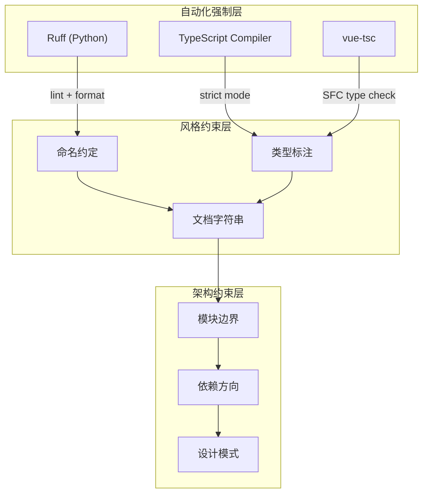
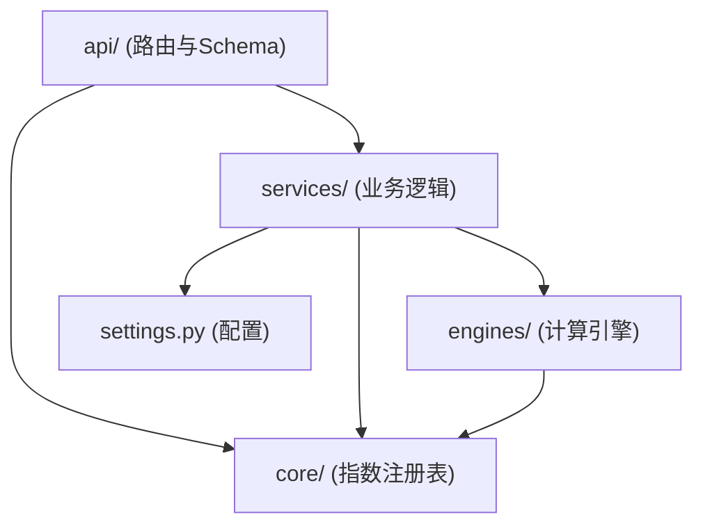
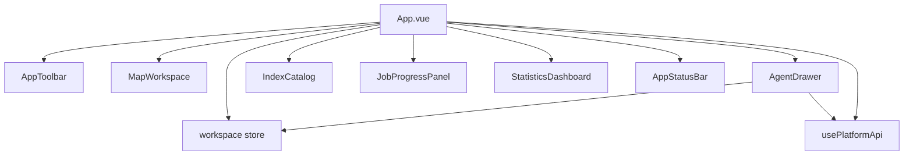

本文档详细阐述了植被指数智能分析平台项目中统一采用的编码规范、风格约定与最佳实践。遵循这些规范有助于保持代码库的一致性、可读性和可维护性，降低团队协作中的认知负担。

## 规范体系总览

项目的编码规范采用**分层治理**策略，通过自动化工具链强制执行核心规则，辅以文档化的约定覆盖工具无法检测的设计层面。规范体系分为三层：**格式层**（空格、换行、引号）、**逻辑层**（命名、类型、错误处理）和**架构层**（模块边界、依赖方向、数据流）。



## Python 后端规范

### 工具链配置

后端使用 **Ruff** 作为统一的代码检查与格式化工具，替代传统的 Flake8 + isort + Black 组合。配置位于 [backend/pyproject.toml](backend/pyproject.toml#L46-L51)：

| 配置项 | 值 | 说明 |
|--------|-----|------|
| `line-length` | 100 | 单行最大字符数 |
| `target-version` | `py311` | 最低 Python 版本 |
| `select` | `E, F, I, UP, B` | 启用的规则集 |

**规则集含义**：

| 规则前缀 | 来源 | 覆盖范围 |
|----------|------|----------|
| `E` | pycodestyle | PEP 8 格式错误 |
| `F` | Pyflakes | 未使用导入、未定义变量等逻辑错误 |
| `I` | isort | import 语句排序 |
| `UP` | pyupgrade | 现代 Python 语法升级 |
| `B` | flake8-bugbear | 常见陷阱与设计缺陷 |

Sources: [backend/pyproject.toml](backend/pyproject.toml#L46-L51)

### 类型标注策略

项目要求**所有公开函数签名**必须包含完整的类型标注。这不仅服务于 IDE 补全，更是 Ruff 和 mypy 进行静态分析的基础。

```python
# 正确：完整的参数与返回值标注
def compute(
    self,
    definitions: list[IndexDefinition],
    bands: dict[str, np.ndarray],
    parameters: dict[str, dict[str, float]] | None = None,
) -> EngineResult:
    ...

# 错误：缺少返回值标注
def compute(self, definitions, bands, parameters=None):
    ...
```

**类型标注约定**：

- 使用 `from __future__ import annotations` 启用延迟求值，允许使用 `X | Y` 联合语法（见 [backend/app/core/indices.py](backend/app/core/indices.py#L7)）
- 容器类型使用小写形式：`list[...]`、`dict[...]`、`tuple[...]`
- 可选类型使用 `X | None` 而非 `Optional[X]`
- 使用 `typing.Protocol` 定义结构化接口（见 [backend/app/engines/base.py](backend/app/engines/base.py#L20-L28)）

Sources: [backend/app/engines/base.py](backend/app/engines/base.py#L1-L28), [backend/app/core/indices.py](backend/app/core/indices.py#L7-L14)

### 命名约定

Python 后端遵循 PEP 8 命名规范，并结合项目特定的语义约定：

| 元素 | 风格 | 示例 |
|------|------|------|
| 模块文件 | snake_case | `raster_pipeline.py` |
| 类名 | PascalCase | `IndexDefinition`, `JobRecord` |
| 函数/方法 | snake_case | `safe_divide`, `public_metadata` |
| 变量 | snake_case | `normalized_bands`, `merged_parameters` |
| 常量 | UPPER_SNAKE_CASE | `INDEX_DEFINITIONS`, `COMMON_LIMITATIONS` |
| 私有成员 | 前导下划线 | `_ratio`, `_run`, `_lock` |
| 类型别名 | PascalCase | `Array`, `Expression`, `EngineName` |

**语义化命名规则**：

- 布尔变量/属性使用 `is_`、`has_`、`can_`、`enable_` 前缀
- 回调类型使用 `Callback` 后缀：`ProgressCallback`, `CancelCallback`
- 工厂函数使用动词前缀：`_ratio()`, `_normalized()`

Sources: [backend/app/core/indices.py](backend/app/core/indices.py#L13-L14), [backend/app/services/raster_pipeline.py](backend/app/services/raster_pipeline.py#L23-L24)

### Dataclass 使用规范

项目广泛使用 `dataclass` 替代传统的类定义，以减少样板代码并提升可读性。关键约定：

```python
@dataclass(frozen=True, slots=True)
class IndexDefinition:
    id: str
    name: str
    formula: str
    required_bands: tuple[str, ...]
    expression: Expression
    description: str
    expected_range: tuple[float, float] | None = None
    parameters: dict[str, float] = field(default_factory=dict)
```

**参数选择指南**：

| 参数 | 用途 | 适用场景 |
|------|------|----------|
| `slots=True` | 使用 `__slots__` 减少内存占用 | 所有数据类默认启用 |
| `frozen=True` | 实例不可变，支持哈希 | 值对象、配置、注册表条目 |
| `field(default_factory=...)` | 可变默认值的安全初始化 | dict、list 类型的字段 |

Sources: [backend/app/core/indices.py](backend/app/core/indices.py#L23-L36), [backend/app/services/jobs.py](backend/app/services/jobs.py#L19-L34)

### 文档字符串规范

每个模块文件必须以**模块级文档字符串**开头，用一句话概括该模块的职责边界。函数和类的文档字符串采用**单行摘要**风格，仅在行为不明显时添加详细说明：

```python
"""植被指数注册表。

公式函数只依赖传入的数组后端 ``xp``，因此同一份定义可以由 NumPy 或
PyTorch 执行。所有除法统一经过 ``safe_divide``，避免无穷值污染结果。
"""
```

**文档字符串层次**：

| 层次 | 内容 | 示例 |
|------|------|------|
| 模块级 | 职责边界、核心概念 | "计算引擎公共协议。" |
| 类级 | 实例语义、生命周期 | （通常由字段名自解释） |
| 函数级 | 行为摘要、副作用说明 | "在 NumPy/PyTorch 间保持一致的安全除法语义。" |

Sources: [backend/app/engines/base.py](backend/app/engines/base.py#L1), [backend/app/core/indices.py](backend/app/core/indices.py#L1-L5)

### 导入组织

导入语句按以下顺序排列（由 Ruff `I` 规则强制执行）：

```python
from __future__ import annotations          # 1. 未来特性

import hashlib                               # 2. 标准库
import json
from collections.abc import Callable
from dataclasses import dataclass, field
from pathlib import Path
from typing import Any

import numpy as np                           # 3. 第三方库

from app.core.indices import get_index       # 4. 项目内部
from app.engines.base import EngineResult
from app.settings import settings
```

**关键约定**：

- 使用绝对导入（`from app.xxx import yyy`），不使用相对导入
- 同一模块内的多个导入可合并为一行：`from dataclasses import asdict, dataclass, field`
- 循环导入通过延迟导入（函数内 `import`）解决，需添加 `noqa` 注释说明原因

Sources: [backend/app/services/jobs.py](backend/app/services/jobs.py#L1-L16), [backend/app/api/routes.py](backend/app/api/routes.py#L1-L48)

### 错误处理规范

项目采用**结构化异常传播**模式：底层函数抛出具体异常，路由层捕获并转换为 HTTP 响应。

```python
# 路由层：捕获并转换
@index_router.get("/api/indices/{index_id}")
def index_detail(index_id: str) -> dict[str, Any]:
    try:
        return get_index(index_id).public_metadata()
    except ValueError as error:
        raise HTTPException(status_code=404, detail=str(error)) from error

# 业务层：抛出语义化异常
def get_index(index_id: str) -> IndexDefinition:
    if index_id not in INDEX_REGISTRY:
        raise ValueError(f"未知植被指数: {index_id}")
    return INDEX_REGISTRY[index_id]
```

**异常处理约定**：

| 场景 | 处理方式 |
|------|----------|
| 资源不存在 | `ValueError` → HTTP 404 |
| 参数校验失败 | `ValueError` → HTTP 422 |
| 文件/IO 错误 | `FileNotFoundError`/`OSError` → HTTP 422 |
| 外部服务不可用 | 通用 `Exception` → HTTP 503，附带 `noqa: BLE001` 注释 |
| 任务取消 | 设置 `cancelled` 标志，不抛出异常 |

Sources: [backend/app/api/routes.py](backend/app/api/routes.py#L67-L72), [backend/app/api/routes.py](backend/app/api/routes.py#L190-L195)

### API Schema 设计

使用 **Pydantic v2** 定义请求/响应模型，关键约定位于 [backend/app/api/schemas.py](backend/app/api/schemas.py)：

```python
class ExecutionRequest(BaseModel):
    source: SourceReference
    indices: list[str] = Field(min_length=1, max_length=30)
    bands: dict[str, int]
    engine: Literal["auto", "numpy", "joblib", "torch"] = "auto"
    block_size: int = Field(default=1024, alias="blockSize", ge=128, le=2048)

    model_config = {"populate_by_name": True}
```

**Schema 约定**：

| 约定 | 说明 |
|------|------|
| `alias` | Python 字段名使用 snake_case，JSON 使用 camelCase |
| `populate_by_name = True` | 允许同时接受原始名和别名 |
| `Field(min_length=..., max_length=...)` | 字符串长度约束 |
| `Field(ge=..., le=...)` | 数值范围约束 |
| `Literal[...]` | 枚举类型使用 Literal 而非 Enum |

Sources: [backend/app/api/schemas.py](backend/app/api/schemas.py#L23-L35)

## TypeScript 前端规范

### 工具链配置

前端使用 **TypeScript 严格模式**，配置位于 [frontend/tsconfig.app.json](frontend/tsconfig.app.json)：

| 配置项 | 值 | 说明 |
|--------|-----|------|
| `strict` | `true` | 启用所有严格类型检查 |
| `noUnusedLocals` | `true` | 禁止未使用的局部变量 |
| `noUnusedParameters` | `true` | 禁止未使用的函数参数 |
| `lib` | `ES2021, DOM, DOM.Iterable` | 目标运行时 API |

**路径别名**：`@/*` 映射到 `./src/*`，避免深层相对路径。

Sources: [frontend/tsconfig.app.json](frontend/tsconfig.app.json#L1-L16)

### Vue 单文件组件结构

所有 Vue 组件采用 **Composition API + `<script setup>`** 语法，结构顺序为：

```vue
<script setup lang="ts">
// 1. 导入
import { computed, shallowRef } from 'vue'
import { useWorkspaceStore } from '@/stores/workspace'
import type { Product } from '@/types/platform'

// 2. Props 与 Emits
const props = defineProps<{ product: Product | null }>()
const emit = defineEmits<{ select: [id: string] }>()

// 3. Composables
const store = useWorkspaceStore()

// 4. 响应式状态
const isLoading = shallowRef(false)

// 5. 计算属性
const displayLabel = computed(() => props.product?.name ?? '未选择')

// 6. 方法
async function handleClick() { ... }

// 7. 生命周期
onMounted(() => { ... })
</script>

<template>
  <!-- 模板 -->
</template>

<style scoped>
/* 样式 */
</style>
```

**关键约定**：

- `<script lang="ts">` 始终启用 TypeScript
- 使用 `defineProps<T>()` 泛型语法而非运行时声明
- 使用 `defineModel<T>()` 实现双向绑定
- 使用 `useTemplateRef<T>()` 获取 DOM 引用

Sources: [frontend/src/App.vue](frontend/src/App.vue#L1-L72), [frontend/src/components/MapWorkspace.vue](frontend/src/components/MapWorkspace.vue#L1-L14)

### 响应式 API 选择

项目对 Vue 响应式 API 的使用有明确的场景划分：

| API | 适用场景 | 示例 |
|-----|----------|------|
| `shallowRef` | 原始值、大型对象引用、不需要深度响应 | `const map = shallowRef<Map \| null>(null)` |
| `ref` | 需要深度响应的小型对象 | （项目中较少使用） |
| `reactive` | 表单数据、配置对象 | `const llmConfig = reactive<AgentLLMConfig>({...})` |
| `computed` | 派生状态 | `const runningJobs = computed(() => ...)` |

**选择原则**：

- 默认使用 `shallowRef`，仅在需要深度响应时降级为 `ref`/`reactive`
- `reactive` 对象使用显式泛型标注以获得类型推导
- 避免对大型数组使用 `ref`（会导致深度遍历）

Sources: [frontend/src/stores/workspace.ts](frontend/src/stores/workspace.ts#L13-L39), [frontend/src/components/AgentDrawer.vue](frontend/src/components/AgentDrawer.vue#L14-L49)

### 命名约定

| 元素 | 风格 | 示例 |
|------|------|------|
| 组件文件 | PascalCase | `AgentDrawer.vue`, `MapWorkspace.vue` |
| Composable 文件 | `use` 前缀 + camelCase | `usePlatformApi.ts`, `useTheme.ts` |
| Store 文件 | camelCase | `workspace.ts` |
| 类型文件 | camelCase | `platform.ts` |
| 接口/类型 | PascalCase | `AgentPlan`, `JobRecord` |
| 变量/函数 | camelCase | `activePlan`, `refreshSystem()` |
| 常量 | UPPER_SNAKE_CASE | `TIANDITU_TOKEN` |
| CSS 类名 | kebab-case | `.workspace-shell`, `.primary-grid` |

**组件命名规则**：

- 组件使用多词组合避免与 HTML 元素冲突：`AppToolbar` 而非 `Toolbar`
- 基础/通用组件使用 `App` 前缀：`AppStatusBar`, `AppToolbar`
- 业务组件直接描述功能：`AgentDrawer`, `IndexCatalog`

Sources: [frontend/src/components/](frontend/src/components/), [frontend/src/composables/](frontend/src/composables/)

### Composable 设计模式

Composables 是项目中复用有状态逻辑的核心模式，遵循以下约定：

```typescript
export function usePlatformApi() {
  // 私有辅助函数
  async function requestJson<T>(url: string, init?: RequestInit): Promise<T> {
    const response = await fetch(url, { ...init, headers: { 'Content-Type': 'application/json', ...init?.headers } })
    if (!response.ok) {
      const payload = await response.json().catch(() => ({ detail: response.statusText }))
      throw new Error(payload.detail ?? '请求失败')
    }
    return response.json() as Promise<T>
  }

  // 公开方法
  async function listIndices(): Promise<IndexMetadata[]> { ... }
  async function createPlan(...): Promise<AgentPlan> { ... }

  return {
    listIndices,
    createPlan,
    // ...
  }
}
```

**设计原则**：

- 使用函数声明（非箭头函数）以便提升
- 私有函数不导出，仅通过返回对象暴露公开 API
- 异步函数统一使用 `async/await`，不返回原始 Promise
- 错误在 composable 内部转换为 `Error` 实例

Sources: [frontend/src/composables/usePlatformApi.ts](frontend/src/composables/usePlatformApi.ts#L15-L40)

### 类型定义规范

所有跨组件共享的类型集中定义在 [frontend/src/types/platform.ts](frontend/src/types/platform.ts)：

```typescript
export interface AgentPlan {
  id: string
  sessionId: string
  status: 'awaiting_confirmation' | 'confirmed'
  recommendations: AgentRecommendation[]
  // ...
}
```

**类型定义约定**：

| 约定 | 说明 |
|------|------|
| 使用 `interface` | 优先使用 `interface` 定义对象形状 |
| 使用 `type` | 仅在需要联合类型或工具类型时使用 |
| 字段命名 | 使用 camelCase，与 JSON API 保持一致 |
| 可选字段 | 使用 `?` 标注：`customIndex?: IndexMetadata \| null` |
| 字面量联合 | 状态、引擎等使用字面量联合：`'running' \| 'successful' \| 'failed'` |

Sources: [frontend/src/types/platform.ts](frontend/src/types/platform.ts#L89-L116)

### Pinia Store 规范

项目使用 **Pinia** 进行状态管理，采用 **Composition API 风格**（`defineStore` + setup 函数）：

```typescript
export const useWorkspaceStore = defineStore('workspace', () => {
  // 状态
  const indices = shallowRef<IndexMetadata[]>([])
  const jobs = shallowRef<JobRecord[]>([])
  const asset = reactive({ localPath: '', selected: null as UploadedAsset | null, ... })

  // 计算属性
  const runningJobs = computed(() => jobs.value.filter((job) => ['accepted', 'running'].includes(job.status)))

  // 方法
  function setIndices(value: IndexMetadata[]) { indices.value = value }

  return { indices, jobs, runningJobs, setIndices, ... }
})
```

**Store 约定**：

- Store ID 使用 kebab-case：`'workspace'`
- 状态使用 `shallowRef`，仅对表单数据使用 `reactive`
- 方法使用 `set` 前缀命名 setter：`setIndices`, `setJobs`
- 返回对象按**状态 → 计算属性 → 方法**顺序组织

Sources: [frontend/src/stores/workspace.ts](frontend/src/stores/workspace.ts#L1-L119)

## 测试规范

### 后端测试

使用 **pytest** 框架，测试文件位于 [backend/tests/](backend/tests/)：

```python
def test_ndvi_matches_manual_formula() -> None:
    result = NumpyEngine().compute([get_index("ndvi")], BANDS).arrays["ndvi"]
    expected = (BANDS["nir"] - BANDS["red"]) / (BANDS["nir"] + BANDS["red"])
    np.testing.assert_allclose(result, expected, rtol=1e-6)
```

**测试命名约定**：

| 模式 | 示例 |
|------|------|
| 验证注册表完整性 | `test_registry_contains_exactly_30_indices` |
| 验证公式正确性 | `test_ndvi_matches_manual_formula` |
| 验证输出属性 | `test_all_indices_produce_finite_float32_arrays` |
| 验证引擎一致性 | `test_joblib_matches_numpy` |
| 验证降级策略 | `test_torch_engine_falls_back_or_matches` |

**测试覆盖范围**：

- 公式数组的数值正确性
- 窗口化栅格处理
- NumPy/Joblib/Torch 引擎一致性
- CUDA 降级策略
- 同步/异步任务执行
- 无效波段输入
- 文件上传与资产解析
- 智能体安全边界

Sources: [backend/tests/test_indices.py](backend/tests/test_indices.py#L1-L51)

### 前端构建验证

前端变更必须通过以下检查：

```powershell
cd frontend
npm run build      # TypeScript 编译 + Vite 构建
npm run typecheck  # 独立类型检查
```

Sources: [AGENTS.md](AGENTS.md#L27-L35)

## Git 与提交规范

### 提交消息格式

采用 **Conventional Commits** 规范：

```
<type>(<scope>): <description>

[optional body]
```

| 类型 | 用途 | 示例 |
|------|------|------|
| `feat` | 新功能 | `feat(agent): add RAG knowledge import` |
| `fix` | 修复 | `fix(pipeline): handle nodata in preview` |
| `refactor` | 重构 | `refactor(engines): extract protocol` |
| `docs` | 文档 | `docs: add coding standards` |
| `test` | 测试 | `test(indices): cover edge cases` |
| `chore` | 构建/工具 | `chore: update ruff config` |

Sources: [AGENTS.md](AGENTS.md#L45-L47)

### 敏感信息管理

| 类型 | 存储方式 |
|------|----------|
| 天地图 Token | 环境变量或前端常量（公开服务） |
| MinIO 凭证 | `.env` 文件 |
| LLM API Key | `.env` 文件 |
| 大型 GeoTIFF | 不提交，存储于 `data/` 目录 |

**配置模板**：以 [.env.example](.env.example) 为基准，列出所有可配置项。

Sources: [AGENTS.md](AGENTS.md#L49-L51), [.gitignore](.gitignore#L1-L21)

## 架构约束

### 模块依赖方向



**核心约束**：

- `core/indices.py` 中的公式函数**不得直接依赖** Rasterio、Celery、pygeoapi 或 MinIO
- `engines/` 仅依赖 `core/` 和 `numpy`，不依赖 `services/`
- `api/` 层负责异常捕获与 HTTP 转换，不包含业务逻辑
- `services/` 层组合 `core/` 和 `engines/` 的能力

Sources: [AGENTS.md](AGENTS.md#L37-L39)

### 前端组件层次



**组件职责划分**：

- **App.vue**：全局布局、数据初始化、事件编排
- **业务组件**：单一职责，通过 props 接收数据，通过 emit 上报事件
- **Composables**：封装 API 调用、主题切换等跨组件逻辑
- **Store**：集中管理共享状态，组件不直接修改其他组件的状态

Sources: [frontend/src/App.vue](frontend/src/App.vue#L1-L147)

## 代码审查清单

提交代码前，请对照以下清单进行自查：

| 类别 | 检查项 |
|------|--------|
| **格式** | Ruff 检查通过（`ruff check .`） |
| **类型** | 所有公开函数有完整类型标注 |
| **测试** | 新增/变更功能有对应测试 |
| **文档** | 模块有文档字符串，复杂逻辑有注释 |
| **命名** | 遵循项目的命名约定 |
| **导入** | 无循环导入，无未使用的导入 |
| **错误** | 异常被正确捕获和转换 |
| **安全** | 无硬编码的凭证或 Token |
| **构建** | 后端 pytest 通过，前端 build 通过 |