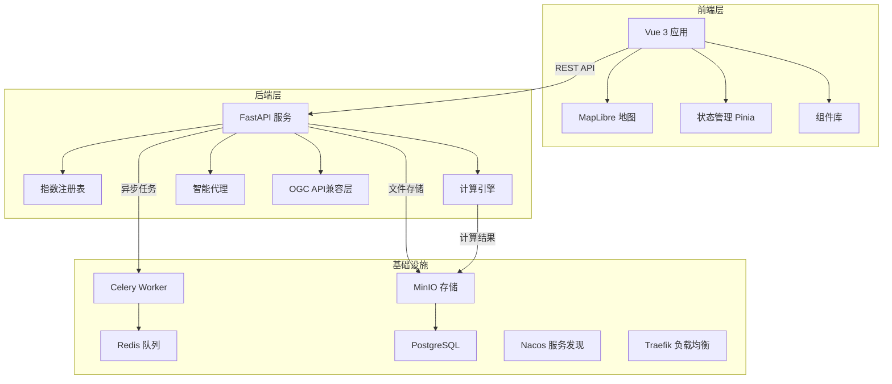
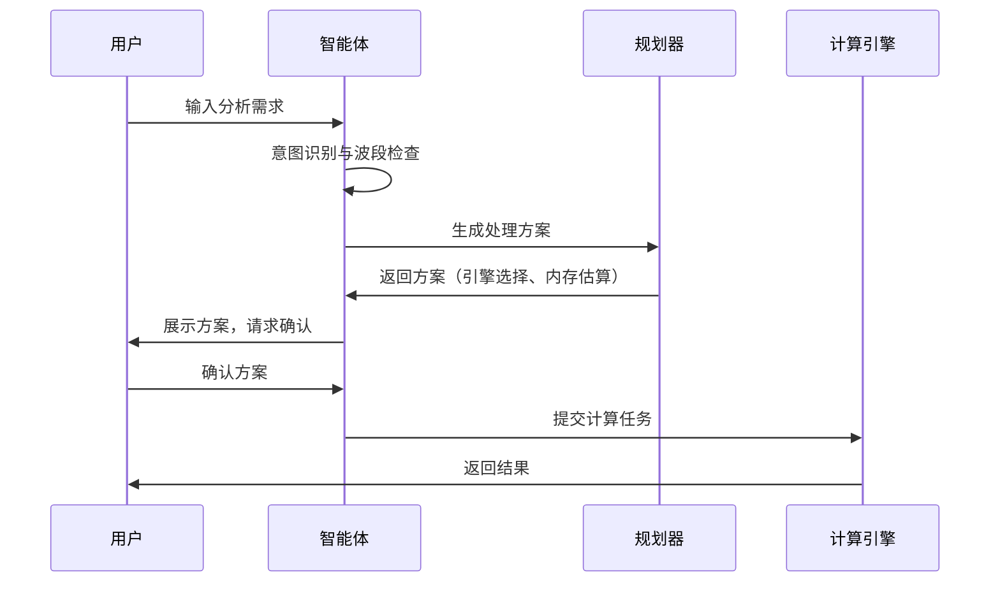

欢迎为植被指数智能分析平台做出贡献。本指南旨在帮助新开发者快速理解项目架构、开发规范和协作流程，确保代码质量和项目一致性。我们采用系统化的方法，强调架构清晰度和精确的实现细节。

## 项目架构概览

本项目是一个前后端分离的遥感分析平台，核心是植被指数计算引擎和智能分析代理。后端采用Python/FastAPI，前端使用Vue 3/TypeScript，通过REST API通信，基础设施由Docker Compose编排。



**Sources**: [README.md](README.md#L1-L113), [AGENTS.md](AGENTS.md#L1-L56)

## 开发环境配置

### 后端环境

后端使用Python 3.11+，依赖Miniconda环境管理。所有开发命令都在`backend/`目录下执行。

```powershell
# 启动后端开发服务器
cd backend
D:\miniconda\envs\giskeshe\python.exe -m uvicorn app.main:app --host 127.0.0.1 --port 8011 --reload

# 代码质量检查
D:\miniconda\envs\giskeshe\python.exe -m ruff check .
D:\miniconda\envs\giskeshe\python.exe -m pytest -q
```

**关键依赖**：
- FastAPI 0.115+：Web框架
- Rasterio 1.4+：栅格数据处理
- Celery 5.4+：异步任务队列
- PyTorch 2.6+（可选）：GPU加速

**Sources**: [AGENTS.md](AGENTS.md#L12-L35), [backend/pyproject.toml](backend/pyproject.toml#L1-L52)

### 前端环境

前端使用Vue 3 + TypeScript，需要Node.js环境。

```powershell
# 启动前端开发服务器
cd frontend
npm install
npm run dev -- --host 127.0.0.1 --port 5174

# 生产构建和类型检查
npm run build
npm run typecheck
```

**技术栈**：
- Vue 3.5+：Composition API + `<script setup lang="ts">`
- TypeScript 5.8+：严格类型检查
- MapLibre GL 5.6+：地图渲染
- ECharts 5.6+：数据可视化

**Sources**: [frontend/package.json](frontend/package.json#L1-L28), [frontend/tsconfig.app.json](frontend/tsconfig.app.json#L1-L17)

### 容器化部署

完整的开发环境可以通过Docker Compose一键启动：

```powershell
# 启动所有服务
docker compose -f compose.yml up --build

# 服务访问地址
# 平台入口：http://localhost:8080
# Traefik面板：http://localhost:8081
# MinIO控制台：http://localhost:9001
# Nacos：http://localhost:8848/nacos
```

**注意**：如果没有NVIDIA GPU，可以注释`worker-gpu`服务，系统会回退到CPU计算引擎。

**Sources**: [README.md](README.md#L52-L65), [compose.yml](compose.yml)

## 编码规范与标准

### Python后端规范

后端代码遵循严格的类型安全和性能优化原则：

| 规范项 | 要求 | 示例 |
|--------|------|------|
| **类型提示** | 所有函数必须有完整的类型注解 | `def compute(self, bands: dict[str, np.ndarray]) -> EngineResult:` |
| **行宽限制** | 100字符，Ruff自动格式化 | `[tool.ruff] line-length = 100` |
| **导入顺序** | 绝对导入，标准库优先 | `from __future__ import annotations` |
| **数据类** | 使用`frozen=True, slots=True`优化 | `@dataclass(frozen=True, slots=True)` |
| **模块职责** | 单一职责，公式代码不依赖外部服务 | 公式函数只依赖传入的数组后端`xp` |

**代码示例**：
```python
# 正确：使用类型提示和frozen dataclass
@dataclass(frozen=True, slots=True)
class IndexDefinition:
    id: str
    name: str
    formula: str
    required_bands: tuple[str, ...]
    expression: Expression
    # ...

# 错误：缺少类型注解
class IndexDefinition:
    def __init__(self, id, name, formula):
        self.id = id
        # ...
```

**Sources**: [backend/app/core/indices.py](backend/app/core/indices.py#L1-L63), [backend/pyproject.toml](backend/pyproject.toml#L46-L52)

### 前端Vue/TypeScript规范

前端采用Vue 3 Composition API，强调组件复用和类型安全：

| 规范项 | 要求 | 示例 |
|--------|------|------|
| **组件结构** | `<script setup lang="ts">` + 模板 + 样式 | 所有`.vue`文件必须遵循 |
| **组件命名** | PascalCase，语义化名称 | `MapWorkspace.vue`, `AgentDrawer.vue` |
| **状态管理** | 使用Pinia stores | `useWorkspaceStore()` |
| **组合式函数** | 提取可复用逻辑到`composables/` | `useTheme.ts`, `usePlatformApi.ts` |
| **类型定义** | 所有props和emits必须有类型定义 | `defineProps<{ product: Product \| null }>()` |

**Vue组件结构模板**：
```vue
<script setup lang="ts">
// 1. 导入
import { ref, computed } from 'vue'
import type { Product } from '@/types/platform'

// 2. Props和Emits定义
const props = defineProps<{
  product: Product | null
}>()

// 3. 响应式状态
const map = ref<Map | null>(null)

// 4. 计算属性
const previewUrl = computed(() => { /* ... */ })

// 5. 生命周期和侦听器
onMounted(() => { /* ... */ })
</script>

<template>
  <!-- 模板内容 -->
</template>

<style scoped>
/* 样式 */
</style>
```

**Sources**: [frontend/src/components/MapWorkspace.vue](frontend/src/components/MapWorkspace.vue#L1-L137), [frontend/tsconfig.app.json](frontend/tsconfig.app.json#L1-L17)

### 架构设计原则

项目遵循以下核心设计原则，贡献时必须遵守：

1.  **引擎无关性**：指数公式函数不直接依赖NumPy、PyTorch或Rasterio，而是通过`xp`参数实现多后端兼容。
2.  **安全边界**：智能代理不生成任意代码，不直接操作文件系统，所有计算都需要用户确认。
3.  **渐进增强**：CUDA不可用时自动回退到CPU，确保功能完整性。
4.  **配置外部化**：所有敏感信息（API密钥、数据库凭证）通过环境变量配置，不提交到代码库。

**Sources**: [AGENTS.md](AGENTS.md#L1-L56), [backend/app/core/indices.py](backend/app/core/indices.py#L1-L63)

## 测试策略与质量保证

### 后端测试框架

后端使用pytest进行单元测试和集成测试，测试文件位于`backend/tests/`。

```powershell
# 运行所有测试
cd backend
D:\miniconda\envs\giskeshe\python.exe -m pytest -q

# 运行特定测试模块
D:\miniconda\envs\giskeshe\python.exe -m pytest tests/test_indices.py -v
```

**测试覆盖率要求**：
- 公式计算：必须覆盖所有30种指数
- 引擎一致性：NumPy、Joblib、PyTorch引擎结果必须一致（容差1e-5）
- 错误处理：必须测试缺少波段、无效参数等异常情况
- 性能基准：大型影像处理不能出现内存溢出

**测试示例**：
```python
def test_ndvi_matches_manual_formula() -> None:
    """验证NDVI公式计算正确性"""
    result = NumpyEngine().compute([get_index("ndvi")], BANDS).arrays["ndvi"]
    expected = (BANDS["nir"] - BANDS["red"]) / (BANDS["nir"] + BANDS["red"])
    np.testing.assert_allclose(result, expected, rtol=1e-6)

def test_joblib_matches_numpy() -> None:
    """验证多引擎一致性"""
    definitions = [get_index("ndvi"), get_index("evi"), get_index("msavi")]
    expected = NumpyEngine().compute(definitions, BANDS).arrays
    actual = JoblibEngine(workers=2).compute(definitions, BANDS).arrays
    for index_id in expected:
        np.testing.assert_allclose(actual[index_id], expected[index_id], rtol=1e-6)
```

**Sources**: [backend/tests/test_indices.py](backend/tests/test_indices.py#L1-L51), [backend/pyproject.toml](backend/pyproject.toml#L39-L41)

### 前端质量检查

前端使用TypeScript严格模式和构建验证：

```powershell
# 类型检查
npm run typecheck

# 生产构建（包含类型检查和优化）
npm run build

# 浏览器手动测试要点：
# 1. 响应式布局：调整窗口大小测试移动端适配
# 2. 主题切换：日间/夜间主题切换功能
# 3. 面板交互：智能体、任务、指数面板的显示/隐藏
# 4. 地图功能：缩放、平移、结果叠加
```

**质量标准**：
- TypeScript严格模式：`strict: true`，不允许未使用变量
- 构建零错误：`npm run build`必须成功
- 响应式设计：支持从320px到4K的各种屏幕尺寸
- 主题一致性：所有组件必须支持日间/夜间主题

**Sources**: [frontend/package.json](frontend/package.json#L6-L11), [frontend/tsconfig.app.json](frontend/tsconfig.app.json#L1-L17)

## 提交与协作流程

### Git提交规范

项目采用Conventional Commits规范，确保提交历史清晰可追溯：

```
<type>(<scope>): <description>

[optional body]

[optional footer(s)]
```

**提交类型**：
- `feat`: 新功能
- `fix`: 修复bug
- `docs`: 文档更新
- `style`: 代码格式（不影响功能）
- `refactor`: 代码重构
- `test`: 测试相关
- `chore`: 构建过程或辅助工具的变动

**示例**：
```bash
# 正确
git commit -m "feat(engine): add PyTorch CUDA fallback logic"
git commit -m "fix(agent): handle missing bands gracefully"
git commit -m "docs(readme): update deployment instructions"

# 错误
git commit -m "更新代码"
git commit -m "fix bug"
```

### 拉取请求流程

1.  **分支策略**：从`main`分支创建功能分支，命名如`feat/new-index`或`fix/agent-error`。
2.  **代码审查**：至少需要一名维护者审查通过。
3.  **测试要求**：所有新功能必须包含测试，bug修复必须包含回归测试。
4.  **文档更新**：API变更必须更新相关文档。
5.  **UI变更**：必须提供截图或录屏演示。

**PR描述模板**：
```markdown
## 变更概述
简要描述本次变更的目的和内容。

## 任务书关联
关联的具体任务书要求（如适用）。

## 测试结果
- [ ] 后端测试通过
- [ ] 前端构建成功
- [ ] 浏览器手动测试通过

## 影响范围
- API变更：无/有（描述）
- 数据库变更：无/有（描述）
- 配置变更：无/有（描述）

## 截图/录屏
UI变更时提供。
```

**Sources**: [AGENTS.md](AGENTS.md#L46-L48)

## 安全与配置管理

### 敏感信息处理

绝对不能提交以下信息到代码库：

1.  **API密钥**：天地图Token、MinIO凭证、LLM API密钥
2.  **大型数据文件**：GeoTIFF影像文件（>10MB）
3.  **环境配置**：包含真实凭证的`.env`文件

**正确的做法**：
```python
# 使用环境变量
import os
TIANDITU_TOKEN = os.getenv("TIANDITU_TOKEN", "default_token")
MINIO_ACCESS_KEY = os.getenv("MINIO_ACCESS_KEY")

# 使用.env.example作为模板
# .env.example包含所有必需变量，但值为空
```

### 配置文件管理

配置文件结构：
```
.env.example          # 环境变量模板（必须提交）
.gitignore           # 排除敏感文件和大型数据
backend/settings.py  # 使用pydantic-settings管理配置
```

**配置示例**：
```python
# backend/settings.py
from pydantic_settings import BaseSettings

class Settings(BaseSettings):
    tianditu_token: str = ""
    minio_access_key: str = ""
    minio_secret_key: str = ""
    
    class Config:
        env_file = ".env"
```

**Sources**: [AGENTS.md](AGENTS.md#L49-L51), [backend/app/settings.py](backend/app/settings.py)

### 数据资产保护

-  **输入数据**：原始GeoTIFF文件存储在`data/inputs/`，通过`.gitignore`排除
-  **输出结果**：计算结果存储在`data/outputs/`，每个任务有唯一ID目录
-  **技能文件**：智能体技能定义存储在`skills/`目录

**文件结构规范**：
```
data/
├── inputs/          # 原始输入文件（.gitignore排除）
├── outputs/         # 计算结果（按任务ID组织）
│   ├── {uuid1}/
│   │   ├── index_result.tif
│   │   └── preview.png
│   └── {uuid2}/
└── skills/          # 智能体技能定义
    ├── ecosystem-primer/
    └── vegetation-agent-designer/
```

## 智能体开发指南

### 智能体架构

智能体系统遵循安全第一的设计原则：



### 技能开发规范

智能体技能定义在`skills/`目录，每个技能包含：

1.  **SKILL.md**：技能描述和配置
2.  **知识库**：相关文档和参考资料
3.  **工具定义**：技能可用的工具函数

**技能开发示例**：
```markdown
# skills/vegetation-agent-designer/SKILL.md

## 描述
植被指数分析方案设计技能

## 知识库
- 植被指数计算原理
- 遥感数据预处理
- 分析方案最佳实践

## 工具
- search_index_knowledge: 搜索指数知识库
- build_process_steps: 构建处理步骤
- interpret_products: 解释分析结果
```

**Sources**: [skills/ecosystem-primer/SKILL.md](skills/ecosystem-primer/SKILL.md), [skills/vegetation-agent-designer/SKILL.md](skills/vegetation-agent-designer/SKILL.md)

### 安全边界

智能体必须严格遵守以下安全边界：

1.  **不生成代码**：智能体只生成结构化方案，不生成可执行代码
2.  **不直接操作文件**：所有文件操作通过安全的工具函数
3.  **用户确认**：所有计算任务必须经过用户确认
4.  **波段验证**：必须验证用户提供的波段与指数要求匹配

**Sources**: [AGENTS.md](AGENTS.md#L1-L56), [backend/app/services/agent.py](backend/app/services/agent.py#L1-L200)

## 性能优化指南

### 计算引擎选择

平台提供三种计算引擎，根据场景选择：

| 引擎 | 适用场景 | 优势 | 限制 |
|------|----------|------|------|
| **NumPy** | 通用计算，小规模数据 | 无需GPU，兼容性好 | 大型数据内存占用高 |
| **Joblib** | 多核CPU并行处理 | 自动并行，任务级优化 | 仅支持CPU |
| **PyTorch** | GPU加速，大规模计算 | CUDA加速，自动微分 | 需要NVIDIA GPU |

**引擎选择逻辑**：
```python
# 后端自动选择逻辑
if has_cuda and estimated_memory_mb < gpu_memory:
    engine = "torch"
elif estimated_memory_mb > 8000:  # 8GB
    engine = "joblib"
else:
    engine = "numpy"
```

### 内存管理

-  **窗口读写**：使用Rasterio的窗口读写，避免整幅影像加载到内存
-  **数据类型**：统一使用`float32`，减少内存占用
-  **垃圾回收**：及时释放大型数组引用

**内存优化示例**：
```python
# 正确：窗口读取
with rasterio.open("large.tif") as src:
    for window in src.block_windows():
        data = src.read(window=window)
        # 处理窗口数据

# 错误：整幅读取
with rasterio.open("large.tif") as src:
    data = src.read()  # 可能导致内存溢出
```

## 调试与故障排除

### 常见问题解决

| 问题 | 可能原因 | 解决方案 |
|------|----------|----------|
| CUDA不可用 | 驱动版本不匹配 | 检查NVIDIA驱动和CUDA版本 |
| 内存溢出 | 影像过大 | 使用窗口读写或减小块大小 |
| 前端构建失败 | 类型错误 | 运行`npm run typecheck`检查 |
| API连接失败 | 服务未启动 | 检查后端服务状态 |
| 智能体无响应 | LLM配置错误 | 检查API密钥和网络连接 |

### 日志与监控

-  **后端日志**：Uvicorn访问日志和错误日志
-  **Celery监控**：Flower监控面板（端口5555）
-  **系统状态**：底部状态栏显示API、CUDA、队列状态

**日志配置**：
```python
# backend/app/main.py
import logging
logging.basicConfig(level=logging.INFO)
logger = logging.getLogger(__name__)
```

## 下一步行动

完成本指南后，建议按以下顺序深入学习：

1.  **环境搭建**：按照[环境搭建](3-hou-duan-huan-jing-pei-zhi)和[前端环境配置](4-qian-duan-huan-jing-pei-zhi)配置开发环境
2.  **核心功能理解**：阅读[植被指数计算](6-zhi-bei-zhi-shu-ji-suan)了解计算原理
3.  **架构深入**：研究[系统架构](9-xi-tong-jia-gou)和[后端架构](10-hou-duan-jia-gou)了解设计决策
4.  **测试实践**：运行现有测试并尝试添加新测试
5.  **小功能贡献**：从文档改进或小bug修复开始

**相关文档链接**：
- [编码规范](34-bian-ma-gui-fan)
- [测试策略](33-ce-shi-ce-lue)
- [故障排查](36-gu-zhang-pai-cha)
- [指数注册表](13-zhi-shu-zhu-ce-biao)
- [计算引擎](14-ji-suan-yin-qing)

**Sources**: [README.md](README.md#L1-L113), [AGENTS.md](AGENTS.md#L1-L56), [backend/pyproject.toml](backend/pyproject.toml#L1-L52)