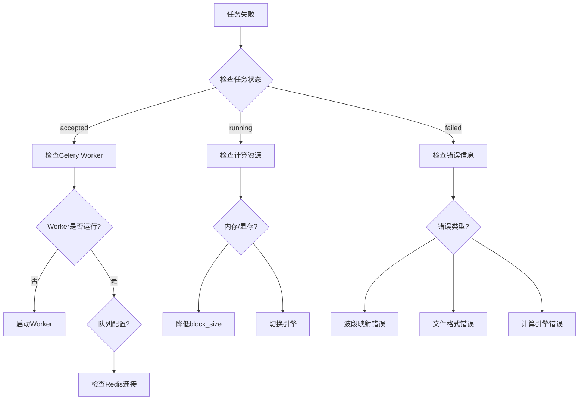
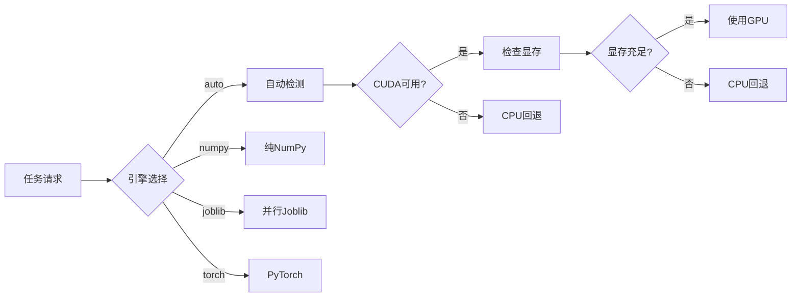

本文档为植被指数智能分析平台提供系统化的故障诊断与解决方案。平台采用多服务架构，包含前端Vue应用、后端FastAPI服务、Celery任务队列、Redis缓存、MinIO对象存储、Nacos服务发现和Traefik负载均衡等组件。故障排查需遵循**由外到内、由表及里**的原则，从基础设施层逐步深入到应用逻辑层。

## 系统健康检查

平台提供多层次的健康检查机制，用于快速定位问题层级。后端服务暴露`/health`端点返回基础健康状态，`/metrics`端点提供Prometheus格式的监控指标。前端状态栏实时显示后端连接状态、计算引擎、指数库容量和任务队列状态。

**快速健康检查流程**：

1. **基础连通性**：访问`http://localhost:8080/health`，预期返回`{"status": "healthy", "service": "植被指数智能分析平台"}`
2. **前端状态**：检查浏览器底部状态栏，确认"服务正常"指示灯为绿色
3. **指标监控**：访问`http://localhost:8080/metrics`查看Prometheus指标

**容器化部署健康检查**：Docker Compose配置中定义了多层健康检查，Redis使用`redis-cli ping`，MinIO检查`/minio/health/live`端点，API服务验证`/health`端点可达性。

Sources: [backend/app/main.py](backend/app/main.py#L52-L55), [frontend/src/components/AppStatusBar.vue](frontend/src/components/AppStatusBar.vue#L29-L63), [compose.yml](compose.yml#L25-L29)

## 常见故障分类与诊断

### 服务连接故障

**症状**：前端状态栏显示"服务离线"，API请求失败，浏览器控制台出现网络错误。

**诊断步骤**：

1. **检查后端进程**：确认FastAPI服务正在运行，监听端口8000（开发模式）或8080（容器模式）
2. **验证端口绑定**：使用`netstat -ano | findstr :8000`检查端口占用
3. **检查防火墙**：确保本地防火墙未阻止相关端口
4. **容器状态**：运行`docker compose ps`检查所有容器状态，特别关注API容器是否健康

**解决方案**：

- **开发模式**：重启后端服务`uvicorn app.main:app --host 127.0.0.1 --port 8000 --reload`
- **容器模式**：运行`docker compose restart api-basic`重启API服务
- **端口冲突**：修改端口或停止占用端口的服务

Sources: [backend/app/main.py](backend/app/main.py#L30-L49), [frontend/src/composables/usePlatformApi.ts](frontend/src/composables/usePlatformApi.ts#L15-L28)

### 任务执行故障

**症状**：任务状态卡在"accepted"或"running"，计算进度不更新，任务最终失败。

**诊断流程图**：



**关键检查点**：

1. **Worker状态**：确认Celery Worker进程正在运行，特别检查队列匹配
2. **Redis连接**：验证Redis服务可达，Celery Broker配置正确
3. **资源限制**：检查内存使用，大型影像计算可能需要调整`block_size`
4. **引擎选择**：CUDA不可用时系统自动回退CPU，但需确认回退成功

**常见错误信息**：

- `缺少逻辑波段映射`：任务请求的波段未在影像中映射
- `波段号超出影像范围`：指定的波段号大于影像实际波段数
- `执行失败`：计算过程中出现异常，需查看详细错误日志

Sources: [backend/app/services/jobs.py](backend/app/services/jobs.py#L83-L108), [backend/app/services/raster_pipeline.py](backend/app/services/raster_pipeline.py#L121-L130), [backend/app/worker_tasks.py](backend/app/worker_tasks.py#L11-L22)

### 智能体交互故障

**症状**：智能体方案生成失败，确认操作无效，结果解读异常。

**诊断要点**：

1. **LLM配置**：检查`VIP_OPENAI_BASE_URL`和`VIP_OPENAI_API_KEY`环境变量是否正确配置
2. **知识库状态**：确认自定义指数和知识文档已正确导入
3. **会话管理**：验证会话ID有效性，检查会话事件日志
4. **规则匹配**：智能体使用规则优先策略，检查用户查询是否匹配预定义规则

**典型问题**：

- **方案不可执行**：检查`executable`标志，确认指数所需波段在影像中可用
- **确认失败**：验证执行单中的指数ID在推荐列表中且可执行
- **解读异常**：确保`products`数组包含有效的统计信息和预览图

Sources: [backend/app/services/agent.py](backend/app/services/agent.py#L34-L75), [backend/app/api/routes.py](backend/app/api/routes.py#L198-L258)

## 基础设施故障排查

### Redis连接问题

**症状**：Celery任务无法提交或执行，服务发现异常。

**诊断命令**：

```bash
# 检查Redis服务状态
redis-cli ping

# 查看Redis日志
docker compose logs redis

# 测试连接
redis-cli -h localhost -p 6379 info server
```

**常见问题**：

1. **连接拒绝**：Redis服务未启动或端口配置错误
2. **认证失败**：检查Redis密码配置（如有）
3. **内存不足**：检查Redis内存使用和淘汰策略

**解决方案**：

- **容器模式**：`docker compose restart redis`
- **本地模式**：确保Redis服务运行在`redis://localhost:6379/0`
- **配置检查**：验证`VIP_REDIS_URL`环境变量

Sources: [backend/app/celery_app.py](backend/app/celery_app.py#L8-L29), [compose.yml](compose.yml#L144-L154)

### MinIO对象存储问题

**症状**：文件上传失败，资产访问异常，预览图生成失败。

**诊断流程**：

1. **服务状态**：访问`http://localhost:9001`检查MinIO控制台
2. **连接配置**：验证`VIP_MINIO_ENDPOINT`、`VIP_MINIO_ACCESS_KEY`、`VIP_MINIO_SECRET_KEY`
3. **存储桶**：确认`vegetation-assets`存储桶存在且权限正确
4. **网络连通**：测试从API服务到MinIO的网络连接

**常见错误**：

- `MinIO不可用`：服务未启动或配置错误
- `访问被拒绝`：认证信息错误或权限不足
- `存储桶不存在`：需要创建存储桶或检查桶名配置

**快速修复**：

```bash
# 检查MinIO状态
curl -f http://localhost:9000/minio/health/live

# 重启MinIO服务
docker compose restart minio

# 检查环境变量
echo $VIP_MINIO_ENABLED
```

Sources: [backend/app/settings.py](backend/app/settings.py#L14-L19), [backend/app/api/routes.py](backend/app/api/routes.py#L190-L195), [compose.yml](compose.yml#L156-L172)

### 服务发现与负载均衡问题

**症状**：API请求路由错误，服务间通信失败，Traefik面板显示服务状态异常。

**诊断步骤**：

1. **Traefik面板**：访问`http://localhost:8848/nacos`检查Nacos服务注册
2. **动态配置**：检查`/dynamic/nacos.yml`文件内容是否正确
3. **服务健康**：确认所有API服务在Nacos中注册为健康状态
4. **路由规则**：验证Traefik路由规则匹配请求路径

**Nacos桥接故障**：

- **同步失败**：检查`nacos_bridge`服务日志
- **实例列表为空**：确认API服务已注册到Nacos
- **配置不更新**：检查文件权限和Traefik文件监视

**手动同步**：

```bash
# 手动触发Nacos同步
docker compose exec nacos-bridge python -m app.nacos_bridge

# 检查Traefik动态配置
cat infra/traefik/dynamic/nacos.yml
```

Sources: [backend/app/nacos_bridge.py](backend/app/nacos_bridge.py#L21-L29), [infra/traefik/traefik.yml](infra/traefik/traefik.yml#L9-L14)

## 计算引擎故障排查

### 引擎选择与回退

**症状**：CUDA加速未生效，计算性能低于预期，引擎回退到CPU。

**引擎选择逻辑**：



**诊断命令**：

```python
# 检查CUDA可用性
import torch
print(f"CUDA available: {torch.cuda.is_available()}")
print(f"Device count: {torch.cuda.device_count()}")

# 检查显存
if torch.cuda.is_available():
    print(f"Memory allocated: {torch.cuda.memory_allocated()}")
    print(f"Memory cached: {torch.cuda.memory_reserved()}")
```

**常见问题**：

1. **CUDA不可用**：未安装PyTorch CUDA版本或驱动不兼容
2. **显存不足**：降低`block_size`或使用CPU引擎
3. **引擎回退**：系统自动回退到CPU，但需确认回退成功

**基准测试**：

```bash
# 运行引擎基准测试
cd backend
python scripts/benchmark.py --size 2048 --repeats 3
```

Sources: [backend/app/services/raster_pipeline.py](backend/app/services/raster_pipeline.py#L132-L140), [backend/app/services/planner.py](backend/app/services/planner.py), [backend/scripts/benchmark.py](backend/scripts/benchmark.py#L17-L47)

### 内存与性能问题

**症状**：计算过程中内存溢出，系统响应缓慢，任务超时。

**优化策略**：

1. **分块大小调整**：降低`block_size`减少内存占用，推荐值256-1024
2. **引擎选择**：大型影像优先使用Joblib并行计算
3. **并发控制**：调整Celery Worker并发数，避免资源竞争
4. **预览生成**：禁用预览图生成减少内存使用

**监控指标**：

- **内存使用**：通过`/metrics`端点监控
- **任务队列**：检查待处理任务数量
- **计算时间**：记录任务执行时间，识别性能瓶颈

**容器资源限制**：

```yaml
# compose.yml中的资源配置
services:
  worker-numpy:
    deploy:
      resources:
        limits:
          memory: 4G
          cpus: '2.0'
```

Sources: [backend/app/services/raster_pipeline.py](backend/app/services/raster_pipeline.py#L142-L150), [compose.yml](compose.yml#L83-L107)

## 自定义指数故障排查

### 指数注册失败

**症状**：自定义指数无法注册，公式验证失败，计算时指数不可用。

**验证流程**：

1. **语法检查**：确保表达式符合Python语法
2. **安全验证**：只允许使用`abs`、`sqrt`、`minimum`、`maximum`函数
3. **波段匹配**：确认使用的波段在`available_bands`中
4. **表达式复杂度**：避免过于复杂的表达式

**允许的表达式结构**：

- 基本算术运算：`+`、`-`、`*`、`/`、`**`
- 一元运算符：`-`（取负）、`+`（取正）
- 安全函数：`abs()`、`sqrt()`、`minimum()`、`maximum()`
- 波段变量：`blue`、`green`、`red`、`nir`等

**禁止的结构**：

- 属性访问、下标访问
- Lambda函数、字典、列表
- 比较运算、布尔运算

**验证API**：

```bash
# 验证自定义公式
curl -X POST http://localhost:8000/api/formulas/validate \
  -H "Content-Type: application/json" \
  -d '{"expression": "(nir - red) / (nir + red)", "bands": ["nir", "red"]}'
```

Sources: [backend/app/services/advanced_analysis.py](backend/app/services/advanced_analysis.py#L23-L59), [backend/app/api/routes.py](backend/app/api/routes.py#L285-L290)

### 持久化存储问题

**症状**：自定义指数重启后丢失，数据库连接失败，存储读写异常。

**存储后端**：

1. **内存存储**：默认模式，重启后丢失
2. **PostgreSQL**：可选持久化存储，需配置`VIP_DATABASE_URL`
3. **MinIO**：对象存储，用于大型资产

**诊断步骤**：

- **检查配置**：验证`VIP_DATABASE_URL`格式正确
- **数据库连接**：测试PostgreSQL连接和权限
- **表结构**：确认相关表已创建
- **迁移状态**：检查数据库迁移是否完成

**快速检查**：

```bash
# 检查数据库连接
psql -h localhost -U postgres -d vegetation_intelligence -c "SELECT 1;"

# 查看自定义指数表
psql -c "SELECT * FROM custom_indices;"
```

Sources: [backend/app/settings.py](backend/app/settings.py#L13), [backend/app/services/custom_index_store.py](backend/app/services/custom_index_store.py)

## 前端故障排查

### 界面显示异常

**症状**：页面布局错乱，地图不显示，主题切换失败。

**常见问题**：

1. **浏览器兼容性**：推荐使用Chrome、Firefox最新版本
2. **缓存问题**：清除浏览器缓存和本地存储
3. **JavaScript错误**：检查浏览器控制台错误信息
4. **API响应**：验证后端API返回正确数据格式

**响应式设计问题**：

- **面板折叠**：检查工具面板展开/折叠状态
- **地图重绘**：窗口大小变化时地图可能需要重绘
- **统计图表**：确保ECharts容器尺寸正确

**主题切换**：

- **本地存储**：主题偏好保存在`localStorage`
- **CSS变量**：检查CSS变量是否正确应用
- **系统主题**：支持跟随系统主题设置

**调试工具**：

```javascript
// 检查主题状态
console.log(localStorage.getItem('theme'))

// 查看API响应
fetch('/api/indices').then(r => r.json()).then(console.log)
```

Sources: [frontend/src/composables/useTheme.ts](frontend/src/composables/useTheme.ts), [frontend/src/App.vue](frontend/src/App.vue)

### 智能体面板问题

**症状**：智能体无响应，方案生成失败，确认按钮无效。

**诊断要点**：

1. **API连接**：检查`/api/agent/plan`端点可达性
2. **会话状态**：验证会话ID有效性
3. **LLM配置**：确认LLM服务配置正确
4. **知识库**：检查自定义知识是否导入成功

**常见错误**：

- **网络超时**：LLM服务响应缓慢或不可达
- **422错误**：请求参数验证失败
- **方案不可执行**：检查指数所需波段可用性

**手动测试**：

```bash
# 测试智能体计划生成
curl -X POST http://localhost:8000/api/agent/plan \
  -H "Content-Type: application/json" \
  -d '{"message": "分析农田长势", "availableBands": ["blue", "green", "red", "nir"]}'
```

Sources: [frontend/src/components/AgentDrawer.vue](frontend/src/components/AgentDrawer.vue), [backend/app/api/routes.py](backend/app/api/routes.py#L198-L210)

## 日志与监控

### 日志收集策略

**日志层级**：

1. **应用日志**：FastAPI和Celery Worker日志
2. **容器日志**：Docker容器标准输出
3. **系统日志**：操作系统和驱动日志
4. **访问日志**：Traefik和Nginx访问日志

**日志查看命令**：

```bash
# 查看所有服务日志
docker compose logs

# 查看特定服务日志
docker compose logs api-basic
docker compose logs worker-numpy

# 实时跟踪日志
docker compose logs -f api-basic

# 查看最近100行日志
docker compose logs --tail 100 api-basic
```

**日志级别配置**：

- **INFO**：正常操作信息
- **WARNING**：潜在问题警告
- **ERROR**：错误事件
- **DEBUG**：调试信息（开发模式）

### Prometheus监控指标

**关键指标**：

- **请求计数**：`http_requests_total`
- **请求延迟**：`http_request_duration_seconds`
- **任务状态**：`celery_task_*`
- **系统资源**：`process_*`

**指标端点**：`http://localhost:8080/metrics`

**监控配置**：

```yaml
# prometheus.yml示例配置
scrape_configs:
  - job_name: 'vegetation-platform'
    static_configs:
      - targets: ['api-basic:8000']
    metrics_path: '/metrics'
```

Sources: [backend/app/main.py](backend/app/main.py#L44), [compose.yml](compose.yml#L65-L67)

## 性能调优指南

### 后端性能优化

**配置调优**：

1. **Celery Worker并发**：根据CPU核心数调整`--concurrency`
2. **队列优先级**：合理配置五级优先队列
3. **块大小选择**：根据内存大小调整`block_size`
4. **引擎选择**：根据硬件配置选择合适引擎

**资源监控**：

```bash
# 监控CPU和内存使用
docker stats

# 查看Celery Worker状态
docker compose exec worker-numpy celery -A app.celery_app:celery_app status

# 检查队列长度
docker compose exec redis redis-cli llen celery
```

**性能基准**：

```bash
# 运行性能基准测试
cd backend
python scripts/benchmark.py --size 4096 --repeats 5
```

### 前端性能优化

**优化策略**：

1. **懒加载**：组件和路由懒加载
2. **缓存策略**：合理使用浏览器缓存
3. **资源压缩**：启用Gzip压缩
4. **CDN加速**：静态资源使用CDN

**性能监控**：

- **Lighthouse**：使用Chrome Lighthouse进行性能评估
- **Network面板**：检查网络请求和资源加载
- **Performance面板**：分析运行时性能

Sources: [backend/app/services/jobs.py](backend/app/services/jobs.py#L37-L43), [backend/app/celery_app.py](backend/app/celery_app.py#L14-L29)

## 故障恢复流程

### 服务重启流程

**有序重启**：

1. **停止所有服务**：`docker compose down`
2. **清理资源**：`docker system prune`（可选）
3. **启动基础设施**：`docker compose up -d redis minio nacos`
4. **启动应用服务**：`docker compose up -d`
5. **验证健康**：检查各服务健康状态

**数据备份**：

```bash
# 备份Redis数据
docker compose exec redis redis-cli bgsave

# 备份MinIO数据
docker compose exec minio mc mirror /data /backup

# 备份PostgreSQL数据
docker compose exec postgres pg_dump -U postgres vegetation_intelligence > backup.sql
```

### 灾难恢复

**恢复步骤**：

1. **评估损失**：确定数据丢失范围
2. **停止写入**：防止进一步数据损坏
3. **恢复数据**：从最近备份恢复
4. **验证一致性**：检查数据完整性
5. **逐步恢复**：按依赖顺序恢复服务

**备份策略**：

- **每日备份**：关键配置和数据
- **每周备份**：完整系统备份
- **异地备份**：重要数据异地存储

Sources: [compose.yml](compose.yml#L186-L192)

## 预防性维护

### 定期检查清单

**每日检查**：

- [ ] 服务健康状态
- [ ] 任务队列长度
- [ ] 磁盘空间使用
- [ ] 错误日志数量

**每周检查**：

- [ ] 系统资源使用趋势
- [ ] 安全更新状态
- [ ] 备份完整性验证
- [ ] 性能基准测试

**每月检查**：

- [ ] 依赖版本更新
- [ ] 安全漏洞扫描
- [ ] 容量规划评估
- [ ] 灾难恢复演练

### 监控告警配置

**关键告警**：

1. **服务宕机**：服务健康检查失败
2. **高错误率**：错误日志数量激增
3. **资源耗尽**：内存、磁盘、CPU使用率过高
4. **队列积压**：待处理任务数量过多

**告警渠道**：

- **邮件通知**：关键错误立即通知
- **Slack/钉钉**：团队协作渠道
- **短信告警**：紧急情况通知

Sources: [backend/app/main.py](backend/app/main.py#L52-L55), [frontend/src/components/AppStatusBar.vue](frontend/src/components/AppStatusBar.vue#L29-L63)

## 下一步阅读

故障排查完成后，建议参考以下文档深入了解系统：

- [性能基准测试](32-xing-neng-ji-zhun-ce-shi)：了解系统性能评估方法
- [测试策略](33-ce-shi-ce-lue)：掌握自动化测试最佳实践
- [服务发现与负载均衡](31-fu-wu-fa-xian-yu-fu-zai-jun-heng)：深入理解服务架构
- [编码规范](34-bian-ma-gui-fan)：遵循代码质量标准