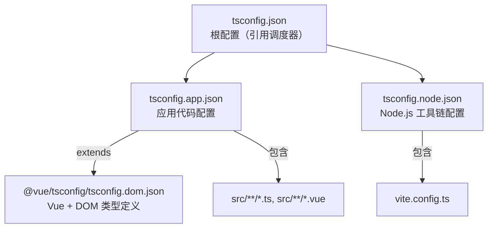
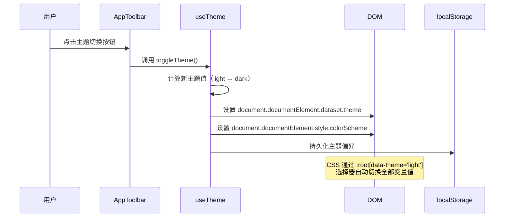

本页介绍 **Canopy Lab** 前端项目的本地开发环境搭建流程，涵盖技术栈概览、依赖安装、开发服务器启动、后端 API 代理、TypeScript 配置以及主题体系。完成配置后，即可在浏览器中访问植被指数智能分析工作台并进行实时开发调试。

Sources: [package.json](frontend/package.json), [vite.config.ts](frontend/vite.config.ts)

## 技术栈概览

前端采用 **Vue 3 + TypeScript + Vite** 的现代单页应用架构，不引入路由层，所有视图通过单一组件树和过渡动画进行面板切换。以下为核心依赖全景：

| 分类 | 技术 | 版本 | 用途 |
|---|---|---|---|
| UI 框架 | Vue 3 (Composition API + `<script setup>`) | ^3.5.17 | 组件化视图、响应式状态 |
| 构建工具 | Vite | ^7.0.0 | 开发服务器热更新、生产构建 |
| 类型检查 | TypeScript + vue-tsc | ~5.8.3 / ^2.2.10 | 编译期类型安全 |
| 状态管理 | Pinia | ^3.0.3 | 全局工作区状态（指数列表、任务队列、UI 面板） |
| 地图引擎 | MapLibre GL JS | ^5.6.1 | 遥感影像底图（天地图 WMTS）与栅格结果叠加 |
| 数据图表 | ECharts | ^5.6.0 | 统计仪表盘（直方图、统计摘要） |
| 类型扩展 | @vue/tsconfig / @vitejs/plugin-vue | ^0.7.0 / ^6.0.0 | Vue SFC 类型推断、Vite 插件支持 |

前端**未使用 Vue Router**，所有面板（地图工作台、智能体抽屉、任务遥测、指数目录）通过 Pinia store 中的 `ui` 状态和 Vue `<Transition>` 组件实现显示切换。

Sources: [package.json](frontend/package.json#L1-L28), [main.ts](frontend/src/main.ts#L1-L7), [App.vue](frontend/src/App.vue#L1-L50)

## 前置条件

在开始之前，请确认本地已安装以下工具：

| 工具 | 最低版本 | 推荐版本 | 说明 |
|---|---|---|---|
| **Node.js** | 20 LTS | 22 LTS | Dockerfile 基础镜像为 `node:22-alpine`，推荐保持一致 |
| **npm** | 10.x | 随 Node.js 附带 | 锁定文件为 `package-lock.json`，使用 npm 可确保一致性 |
| **Git** | 2.x | 最新 | 用于克隆仓库源码 |

可通过以下命令验证安装：

```bash
node --version    # 期望 v22.x.x
npm --version     # 期望 10.x.x
```

> **提示**：项目根目录的 `compose.yml` 将后端 API 服务暴露在 `8011` 端口（通过 Traefik 路由）。若仅开发前端，可跳过容器部署，仅需确保后端 API 已在本地运行或可远程访问。

Sources: [Dockerfile](frontend/Dockerfile#L1-L3), [compose.yml](compose.yml#L20-L30)

## 项目目录结构

```
frontend/
├── index.html              # SPA 入口 HTML，挂载 #app 容器
├── package.json            # 依赖声明与脚本命令
├── package-lock.json       # 依赖版本锁定文件
├── vite.config.ts          # Vite 构建配置与开发代理
├── tsconfig.json           # TypeScript 根配置（引用子项目）
├── tsconfig.app.json       # 应用代码 TypeScript 配置
├── tsconfig.node.json      # Node.js 工具链 TypeScript 配置
├── Dockerfile              # 生产镜像（多阶段构建）
├── nginx.conf              # 生产环境 Nginx 代理配置
├── dist/                   # 构建产物（git 忽略）
├── node_modules/           # 依赖包（git 忽略）
└── src/
    ├── main.ts             # 应用入口：Vue + Pinia 挂载
    ├── App.vue             # 根组件：面板编排与轮询逻辑
    ├── assets/
    │   └── main.css        # 全局样式 + CSS 自定义属性主题系统
    ├── components/
    │   ├── MapWorkspace.vue        # 地图工作台（MapLibre GL）
    │   ├── AgentDrawer.vue         # 智能体交互面板
    │   ├── AppToolbar.vue          # 顶部工具栏
    │   ├── AppStatusBar.vue        # 底部状态栏
    │   ├── AssetToolbar.vue        # 影像资产上传工具栏
    │   ├── IndexCatalog.vue        # 植被指数目录浏览
    │   ├── JobProgressPanel.vue    # 异步任务进度面板
    │   └── StatisticsDashboard.vue # 统计仪表盘（ECharts）
    ├── composables/
    │   ├── usePlatformApi.ts       # RESTful API 封装
    │   └── useTheme.ts             # 暗色/亮色主题切换
    ├── stores/
    │   └── workspace.ts            # Pinia 全局状态仓库
    └── types/
        └── platform.ts            # 全局 TypeScript 接口定义
```

Sources: [目录结构](frontend/)

## 安装依赖

进入 `frontend` 目录并安装所有依赖：

```bash
cd frontend
npm install
```

`npm install` 会根据 `package-lock.json` 锁定版本精确安装所有依赖。安装完成后，`node_modules` 目录将包含 Vue 3 运行时、Vite 工具链、MapLibre GL、ECharts 等全部包。

> **注意**：项目使用 `"type": "module"` 声明 ES 模块模式，Vite 配置和 TypeScript 源码均采用 ESM 语法。

Sources: [package.json](frontend/package.json#L4)

## 开发服务器启动

启动 Vite 开发服务器：

```bash
npm run dev
```

执行后，Vite 将在 **`http://localhost:5173`** 启动一个支持模块热替换（HMR）的开发服务器。浏览器访问该地址即可看到植被指数智能分析工作台界面。

`package.json` 中定义的全部脚本命令如下：

| 命令 | 作用 | 底层行为 |
|---|---|---|
| `npm run dev` | 启动开发服务器 | `vite` — 端口 5173，启用 HMR |
| `npm run build` | 类型检查 + 生产构建 | `vue-tsc -b && vite build` — 输出到 `dist/` |
| `npm run typecheck` | 仅执行 TypeScript 类型检查 | `vue-tsc -b` — 不产生构建产物 |
| `npm run preview` | 预览生产构建 | `vite preview` — 本地预览 `dist/` 内容 |

Sources: [package.json](frontend/package.json#L7-L12)

## 后端 API 代理配置

前端开发服务器通过 Vite 内置代理将 API 请求转发到后端服务，避免跨域问题。代理配置位于 `vite.config.ts`：

```typescript
const apiTarget = process.env.VITE_API_TARGET ?? 'http://127.0.0.1:8011'

server: {
  port: 5173,
  proxy: {
    '/api': apiTarget,
    '/jobs': apiTarget,
    '/processes': apiTarget,
    '/artifacts': apiTarget,
  },
}
```

以下四类路径被代理到后端：

| 路径前缀 | 功能 |
|---|---|
| `/api` | 平台核心 API（指数列表、智能体规划、资产上传、系统能力查询） |
| `/jobs` | OGC API - Processes 异步任务管理（列出、取消、获取结果） |
| `/processes` | OGC 进程执行入口（批量指数计算触发） |
| `/artifacts` | 构建产物与预览图访问（MinIO 存储代理） |

**通过环境变量切换后端地址**：

```bash
# 默认指向本地后端
npm run dev

# 指向远程后端
set VITE_API_TARGET=http://192.168.1.100:8011
npm run dev
```

> **注意**：`VITE_API_TARGET` 仅在开发服务器阶段生效。生产环境中，Nginx 通过 `nginx.conf` 将 `/api`、`/jobs`、`/processes`、`/artifacts` 反向代理到 Traefik 网关（`http://traefik:80`），路由规则保持一致。

Sources: [vite.config.ts](frontend/vite.config.ts#L1-L25), [nginx.conf](frontend/nginx.conf#L1-L17)

## TypeScript 配置

项目采用 TypeScript 引用模式（Project References），将应用代码和工具链配置分离：



**应用配置 (`tsconfig.app.json`)** 的关键编译选项：

| 选项 | 值 | 作用 |
|---|---|---|
| `strict` | `true` | 启用全部严格类型检查 |
| `noUnusedLocals` | `true` | 禁止未使用的局部变量 |
| `noUnusedParameters` | `true` | 禁止未使用的函数参数 |
| `paths` | `@/* → ./src/*` | 路径别名 `@` 指向 `src` 目录 |
| `lib` | `ES2021, DOM, DOM.Iterable` | 可用的内置类型库 |

`@` 路径别名在 `vite.config.ts` 中同步配置，确保开发服务器和 TypeScript 编译器对 `@/components/...` 等导入路径解析一致：

```typescript
resolve: {
  alias: {
    '@': fileURLToPath(new URL('./src', import.meta.url)),
  },
}
```

Sources: [tsconfig.json](frontend/tsconfig.json#L1-L8), [tsconfig.app.json](frontend/tsconfig.app.json#L1-L17), [tsconfig.node.json](frontend/tsconfig.node.json#L1-L13), [vite.config.ts](frontend/vite.config.ts#L8-L11)

## 主题与全局样式

前端通过 **CSS 自定义属性** 实现完整的暗色/亮色主题切换，无需额外 UI 框架。主题系统的核心机制：



`main.css` 定义了两套完整的色彩体系，涵盖表面色、文本色、强调色、状态色等：

| 变量类别 | 暗色模式示例 (`--surface-0`) | 亮色模式示例 (`--surface-0`) |
|---|---|---|
| 表面色 | `#070c09`（深墨绿） | `#f6f7f2`（米白） |
| 文本色 | `#f2f8ee`（浅绿白） | `#152013`（深墨绿） |
| 强调色 | `#9ee81f`（荧光绿） | `#5f8f13`（草绿） |
| 边框色 | `rgba(167, 202, 106, 0.16)` | `rgba(50, 78, 42, 0.14)` |

字体系统使用三款字体：**Noto Serif SC**（标题展示）、**Noto Sans SC**（正文阅读）、**IBM Plex Mono**（等宽数据）。首次加载时通过 Google Fonts CDN 引入。

> **提示**：主题偏好通过 `localStorage` 中的 `canopy-lab-theme` 键持久化。首次访问时，系统会检测操作系统级的 `prefers-color-scheme` 媒体查询来确定默认主题。

Sources: [useTheme.ts](frontend/src/composables/useTheme.ts#L1-L40), [main.css](frontend/src/assets/main.css#L1-L70)

## 生产构建

执行生产构建命令：

```bash
npm run build
```

该命令依次执行两个阶段：
1. **`vue-tsc -b`** — 使用 TypeScript 项目引用模式执行完整类型检查，确保所有 `.vue` 单文件组件和 `.ts` 模块无类型错误。
2. **`vite build`** — 将 `src/` 下的源码打包为优化后的静态资源，输出到 `dist/` 目录，包含代码分割、Tree Shaking 和资源哈希文件名。

构建产物可直接通过 `npm run preview` 在本地预览，验证生产环境行为。

**生产部署架构**采用多阶段 Docker 构建：

| 阶段 | 基础镜像 | 操作 |
|---|---|---|
| 构建阶段 | `node:22-alpine` | `npm install` → `npm run build` → 输出 `dist/` |
| 运行阶段 | `nginx:1.27-alpine` | 拷贝 `dist/` 到 Nginx 根目录，拷贝 `nginx.conf` |

Nginx 配置中，除了静态文件服务外，还承担 API 反向代理职责——将 `/api`、`/jobs`、`/processes`、`/artifacts` 路径统一转发到 Traefik 网关，由后者按服务发现规则分发到后端实例。

> **注意**：生产构建的 API 代理目标是 `http://traefik:80`（Docker 内部网络），不再依赖 `VITE_API_TARGET` 环境变量。若需修改生产环境后端地址，请编辑 `nginx.conf`。

Sources: [package.json](frontend/package.json#L9), [Dockerfile](frontend/Dockerfile#L1-L13), [nginx.conf](frontend/nginx.conf#L1-L17)

## 常见问题排查

| 问题 | 原因 | 解决方案 |
|---|---|---|
| `npm install` 报网络超时 | npm 注册表访问缓慢 | 使用国内镜像：`npm config set registry https://registry.npmmirror.com` |
| 开发服务器启动后页面白屏 | 后端 API 未启动，控制台大量 502 错误 | 确认后端服务已运行在 `http://127.0.0.1:8011`，或通过 `VITE_API_TARGET` 指向正确地址 |
| 地图瓦片加载失败 | 天地图 Token 过期或无效 | 检查 `MapWorkspace.vue` 中的 `TIANDITU_TOKEN` 常量，替换为有效 Token |
| TypeScript 编译报 `Cannot find module '@/...'` | 路径别名未在 IDE 中识别 | 确保 IDE 加载了 `tsconfig.app.json`（VS Code 自动识别项目引用根 `tsconfig.json`） |
| `vue-tsc -b` 报未使用变量 | `noUnusedLocals` / `noUnusedParameters` 严格检查 | 删除未使用的导入或变量，或临时注释对应选项 |
| `npm run build` 后 `dist/` 为空 | Vite 输出路径被覆盖 | 检查 `vite.config.ts` 中是否自定义了 `build.outDir` |

Sources: [vite.config.ts](frontend/vite.config.ts), [tsconfig.app.json](frontend/tsconfig.app.json#L12-L15), [MapWorkspace.vue](frontend/src/components/MapWorkspace.vue#L20-L26)

## 下一步

完成前端环境配置后，建议按以下顺序继续：

1. **[后端环境配置](3-hou-duan-huan-jing-pei-zhi)** — 配置后端 Python 运行环境，使前端代理的 API 请求能正常响应
2. **[容器化部署](5-rong-qi-hua-bu-shu)** — 使用 Docker Compose 一键启动完整平台（前端 + 后端 + 基础设施）
3. **[前端架构](11-qian-duan-jia-gou)** — 深入了解组件树设计、状态管理模式与数据流
4. **[组件库](24-zu-jian-ku)** — 了解各 Vue 组件的接口契约与使用方式
5. **[主题与响应式设计](23-zhu-ti-yu-xiang-ying-shi-she-ji)** — 深入主题系统与断点适配策略