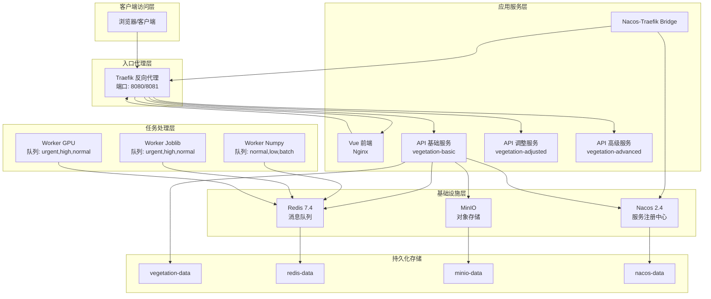
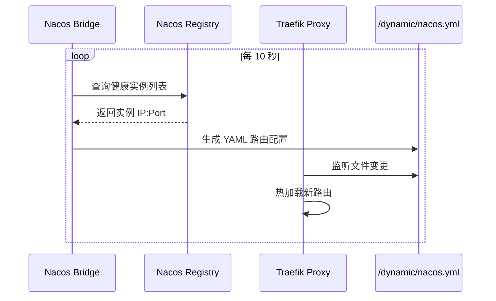

本文档详细介绍植被指数智能分析平台的容器化部署架构，包括 Docker Compose 编排配置、各服务容器镜像构建、网络与负载均衡设计，以及一键启动的操作指南。平台采用微服务架构，通过 Traefik + Nacos 实现动态服务发现与流量路由，支持 CPU/GPU 混合部署模式。

## 架构总览

平台的容器化部署基于 Docker Compose 进行多服务编排，整体架构如下：



Sources: [compose.yml](compose.yml#L1-L192)

## 服务组件清单

平台由以下容器服务组成，每个服务承担特定职责：

| 服务名称 | 镜像/构建方式 | 端口映射 | 核心职责 |
|---------|--------------|---------|---------|
| traefik | traefik:v3.4 | 8080:80, 8081:8080 | 反向代理、负载均衡、动态路由 |
| frontend | 自定义构建 (node→nginx) | - | Vue 前端静态资源服务 |
| api-basic | 自定义构建 (python:3.12-slim) | - | 基础 API 服务、指标路由 |
| api-adjusted | 自定义构建 (python:3.12-slim) | - | 调整型指数计算服务 |
| api-advanced | 自定义构建 (python:3.12-slim) | - | 高级指数计算服务 |
| worker-numpy | 自定义构建 (python:3.12-slim) | - | Numpy 引擎任务处理 |
| worker-joblib | 自定义构建 (python:3.12-slim) | - | Joblib 并行任务处理 |
| worker-gpu | 自定义构建 (pytorch:2.6.0) | - | GPU 加速计算任务 |
| nacos-bridge | 自定义构建 (python:3.12-slim) | - | Nacos 实例同步到 Traefik |
| redis | redis:7.4-alpine | - | Celery 消息队列 |
| minio | minio/minio:2025-04 | 9000, 9001 | 对象存储 |
| nacos | nacos/nacos-server:v2.4.3 | 8848, 9848 | 服务注册与发现 |

Sources: [compose.yml](compose.yml#L36-L182)

## 容器镜像构建

### 后端基础镜像

后端服务基于 `python:3.12-slim` 构建，预装 GDAL 地理空间处理库：

```dockerfile
FROM python:3.12-slim

ENV PYTHONDONTWRITEBYTECODE=1 \
    PYTHONUNBUFFERED=1 \
    PIP_NO_CACHE_DIR=1

RUN apt-get update \
    && apt-get install -y --no-install-recommends libgdal-dev gdal-bin \
    && rm -rf /var/lib/apt/lists/*

WORKDIR /app
COPY pyproject.toml .
COPY app ./app
RUN pip install .

EXPOSE 8000
CMD ["uvicorn", "app.main:app", "--host", "0.0.0.0", "--port", "8000"]
```

**关键说明**：
- 使用 `slim` 变体减小镜像体积
- 安装 `libgdal-dev` 和 `gdal-bin` 支持栅格数据处理
- `PIP_NO_CACHE_DIR=1` 避免缓存层占用空间
- 最终通过 Uvicorn ASGI 服务器运行 FastAPI 应用

Sources: [backend/Dockerfile](backend/Dockerfile#L1-L18)

### 后端 GPU 镜像

GPU 工作节点基于 PyTorch 官方 CUDA 镜像构建，支持 GPU 加速计算：

```dockerfile
FROM pytorch/pytorch:2.6.0-cuda12.4-cudnn9-runtime

ENV PYTHONDONTWRITEBYTECODE=1 \
    PYTHONUNBUFFERED=1 \
    PIP_NO_CACHE_DIR=1

RUN apt-get update \
    && apt-get install -y --no-install-recommends libgdal-dev gdal-bin \
    && rm -rf /var/lib/apt/lists/*

WORKDIR /app
COPY pyproject.toml .
COPY app ./app
RUN pip install ".[gpu]"

CMD ["celery", "-A", "app.celery_app:celery_app", "worker", "-Q", "urgent,high,normal", "--loglevel=INFO", "--concurrency=1", "--hostname=gpu@%h"]
```

**关键说明**：
- 基础镜像包含 CUDA 12.4 + cuDNN 9 运行时
- 通过 `pip install ".[gpu]"` 安装 PyTorch GPU 版本（pyproject.toml 中的可选依赖）
- 直接作为 Celery Worker 运行，处理 `urgent,high,normal` 优先级队列
- 并发度设为 1，避免 GPU 显存溢出

Sources: [backend/Dockerfile.gpu](backend/Dockerfile.gpu#L1-L17), [backend/pyproject.toml](backend/pyproject.toml#L38-L39)

### 前端镜像

前端采用多阶段构建，优化最终镜像体积：

```dockerfile
FROM node:22-alpine AS builder

WORKDIR /app
COPY package.json package-lock.json* ./
RUN npm install
COPY . .
RUN npm run build

FROM nginx:1.27-alpine
COPY nginx.conf /etc/nginx/conf.d/default.conf
COPY --from=builder /app/dist /usr/share/nginx/html
EXPOSE 80
```

**关键说明**：
- 第一阶段：使用 Node.js 22 构建 Vue 应用
- 第二阶段：仅将构建产物复制到 Nginx 镜像
- 最终镜像体积约 30MB，不含 Node.js 运行时

Sources: [frontend/Dockerfile](frontend/Dockerfile#L1-L13)

## 网络与负载均衡

### Traefik 配置

Traefik 作为入口网关，通过 Docker Provider 自动发现容器服务：

```yaml
api:
  dashboard: true
  insecure: true

entryPoints:
  web:
    address: ":80"

providers:
  docker:
    exposedByDefault: false
  file:
    directory: /dynamic
    watch: true
```

**Provider 机制**：
- **Docker Provider**：监听容器 Labels 自动注册路由
- **File Provider**：从 `/dynamic` 目录加载动态配置，由 Nacos Bridge 写入

Sources: [infra/traefik/traefik.yml](infra/traefik/traefik.yml#L1-L19)

### 路由规则

平台通过 Traefik Labels 定义路由规则：

| 服务 | 路由规则 | 优先级 | 说明 |
|------|---------|-------|------|
| frontend | `PathPrefix(/)` | 1 | 默认路由，匹配所有未命中请求 |
| platform-api | `PathPrefix(/api)` 或 `PathPrefix(/jobs)` 或 `PathPrefix(/processes)` 或 `PathPrefix(/artifacts)` 或 `PathPrefix(/metrics)` | 100 | API 路径精确匹配 |

Sources: [compose.yml](compose.yml#L56-L64), [compose.yml](compose.yml#L77-L82)

### Nacos Bridge 动态路由

`nacos-bridge` 服务每 10 秒轮询 Nacos，将健康实例同步为 Traefik 动态配置：



**支持的服务路径前缀**：

| 服务名称 | 路径前缀 | 功能说明 |
|---------|---------|---------|
| vegetation-basic | `/api/basic` | 基础指数计算 |
| vegetation-adjusted | `/api/adjusted` | 调整型指数计算 |
| vegetation-advanced | `/api/advanced` | 高级指数计算 |

Bridge 使用 `stripPrefix` 中间件自动剥离路径前缀，使后端服务无需感知代理层路径。

Sources: [backend/app/nacos_bridge.py](backend/app/nacos_bridge.py#L1-L82)

## 任务队列设计

### Celery Worker 配置

平台部署三种类型的 Celery Worker，针对不同计算场景优化：

| Worker | 并发数 | 队列 | 适用场景 |
|--------|-------|------|---------|
| worker-numpy | 1 | normal, low, batch | 轻量级 NumPy 计算、批量任务 |
| worker-joblib | 2 | urgent, high, normal | 并行计算密集型任务 |
| worker-gpu | 1 | urgent, high, normal | GPU 加速深度学习任务 |

**队列优先级设计**：
- `urgent`：紧急任务，由 GPU Worker 或 Joblib Worker 处理
- `high`：高优先级任务
- `normal`：普通任务，所有 Worker 均可消费
- `low`：低优先级后台任务
- `batch`：批量处理任务

Sources: [compose.yml](compose.yml#L88-L127)

### 环境变量注入

所有 API 服务和 Worker 共享相同的环境变量模板：

```yaml
x-api-environment: &api-environment
  VIP_REDIS_URL: redis://redis:6379/0
  VIP_CELERY_ALWAYS_EAGER: "false"
  VIP_MINIO_ENDPOINT: minio:9000
  VIP_MINIO_ACCESS_KEY: vegetation
  VIP_MINIO_SECRET_KEY: vegetation-secret
  VIP_MINIO_ENABLED: "true"
  VIP_NACOS_URL: http://nacos:8848
```

**变量命名规范**：所有配置项使用 `VIP_` 前缀，通过 Pydantic Settings 自动绑定到 `Settings` 类。

Sources: [compose.yml](compose.yml#L3-L10), [backend/app/settings.py](backend/app/settings.py#L1-L33)

## 存储与持久化

### 命名卷定义

平台使用五个 Docker 命名卷实现数据持久化：

| 卷名称 | 挂载位置 | 存储内容 |
|-------|---------|---------|
| vegetation-data | /app/data | 栅格输入/输出文件 |
| redis-data | /data | Redis AOF 持久化文件 |
| minio-data | /data | 对象存储数据 |
| nacos-data | /home/nacos/data | 服务注册元数据 |
| traefik-dynamic | /dynamic | Traefik 动态路由配置 |

Sources: [compose.yml](compose.yml#L185-L192)

### MinIO 对象存储

MinIO 配置独立端口映射，支持控制台访问：

```yaml
minio:
  image: minio/minio:RELEASE.2025-04-22T22-12-26Z
  command: server /data --console-address ":9001"
  ports:
    - "9000:9000"   # S3 API 端口
    - "9001:9001"   # 管理控制台端口
```

**默认凭据**：
- Access Key: `vegetation`
- Secret Key: `vegetation-secret`

生产环境应通过 `.env` 文件覆盖这些默认值。

Sources: [compose.yml](compose.yml#L148-L163)

## 健康检查机制

平台对关键服务配置了健康检查，确保依赖服务就绪后再启动下游服务：

| 服务 | 检查命令 | 间隔 | 超时 | 重试次数 |
|------|---------|------|------|---------|
| redis | `redis-cli ping` | 5s | 3s | 10 |
| minio | `curl -f http://localhost:9000/minio/health/live` | 10s | 5s | 10 |
| api-basic | Python urllib 请求 `/health` | 15s | 5s | 5 |

**依赖链**：
```
api-basic/api-adjusted/api-advanced
  ├── depends_on: redis (condition: service_healthy)
  ├── depends_on: minio (condition: service_healthy)
  └── depends_on: nacos (condition: service_started)
```

Sources: [compose.yml](compose.yml#L23-L32), [compose.yml](compose.yml#L132-L146)

## 一键部署操作

### 前置要求

- Docker Engine 20.10+
- Docker Compose v2+
- 如需 GPU 支持：NVIDIA Container Toolkit

### 部署步骤

```bash
# 1. 克隆项目仓库
git clone <repository-url>
cd vegetation-intelligence-platform

# 2. 创建环境配置（可选）
cp .env.example .env
# 编辑 .env 文件配置 PostgreSQL、OpenAI 等可选服务

# 3. 构建并启动所有服务
docker compose up -d --build

# 4. 查看服务状态
docker compose ps

# 5. 查看日志（可选）
docker compose logs -f api-basic
```

### 访问地址

| 服务 | 访问地址 | 说明 |
|------|---------|------|
| 前端应用 | http://localhost:8080 | 主要用户界面 |
| Traefik Dashboard | http://localhost:8081 | 路由监控面板 |
| MinIO Console | http://localhost:9001 | 对象存储管理 |
| Nacos Console | http://localhost:8848/nacos | 服务注册中心 |

### 常用命令

```bash
# 停止所有服务
docker compose down

# 停止并删除数据卷（谨慎操作）
docker compose down -v

# 重新构建单个服务
docker compose build api-basic

# 查看资源使用情况
docker compose top

# 进入容器调试
docker compose exec api-basic bash
```

## 可选：GPU 部署模式

如需启用 GPU 加速计算，请确保满足以下条件：

1. 安装 NVIDIA 驱动（版本 >= 525.60）
2. 安装 [NVIDIA Container Toolkit](https://docs.nvidia.com/datacenter/cloud-native/container-toolkit/install-guide.html)
3. 在 `compose.yml` 中确认 `worker-gpu` 服务的 GPU 预留配置：

```yaml
worker-gpu:
  deploy:
    resources:
      reservations:
        devices:
          - driver: nvidia
            count: 1
            capabilities: [gpu]
```

GPU Worker 会自动使用 CUDA 12.4 运行时，通过 PyTorch 加速深度学习相关的植被指数计算。

Sources: [compose.yml](compose.yml#L110-L127)

## 故障排查

| 问题现象 | 可能原因 | 解决方案 |
|---------|---------|---------|
| 服务启动失败 | 端口占用 | 使用 `netstat -ano | findstr :8080` 检查端口 |
| Redis 连接超时 | Redis 未就绪 | 等待健康检查通过，或手动重启 API 服务 |
| MinIO 访问 403 | 凭据不匹配 | 检查 `.env` 中的 Access Key/Secret Key |
| Traefik 路由 404 | Labels 配置错误 | 查看 Traefik Dashboard 确认路由状态 |
| GPU 任务失败 | CUDA 不可用 | 运行 `nvidia-smi` 确认驱动正常 |
| Nacos 注册失败 | Nacos 未启动 | 确认 `nacos` 容器状态正常 |

**日志查看技巧**：
```bash
# 查看特定服务的错误日志
docker compose logs api-basic | grep -i error

# 实时跟踪所有 API 服务日志
docker compose logs -f api-basic api-adjusted api-advanced
```

## 下一步

- [环境搭建](/docs/environment-setup) - 本地开发环境配置
- [系统架构](/docs/architecture) - 深入了解微服务架构设计
- [后端架构](/docs/backend-architecture) - API 服务内部结构
- [任务调度系统](/docs/task-scheduler) - Celery 任务队列详解
- [故障排查](/docs/troubleshooting) - 常见问题解决方案